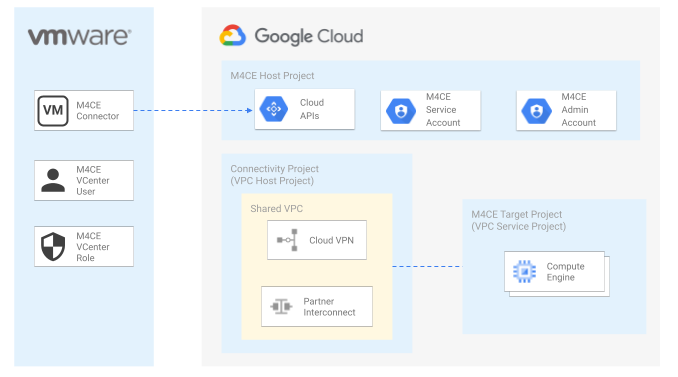

# M4CE(v5) - Host and Target Projects with Shared VPC

This example creates a Migrate for Compute Engine (v5) environment deployed on an host project with multiple [target projects](https://cloud.google.com/migrate/compute-engine/docs/5.0/how-to/enable-services#identifying_your_host_project) and shared VPCs.

The example is designed to implement a M4CE (v5) environment on-top of complex migration landing environment where VMs have to be migrated to multiple target projects. In this example targets are alse service projects for a shared VPC. It also includes the IAM wiring needed to make such scenarios work.

This is the high level diagram:

## Managed resources and services

This sample creates\update several distinct groups of resources:

- projects
  - M4CE host project with [required services](https://cloud.google.com/migrate/compute-engine/docs/5.0/how-to/enable-services#enabling_required_services_on_the_host_project) deployed on a new or existing project. 
  - M4CE target project prerequisites deployed on existing projects. 
- IAM
  - Create a [service account](https://cloud.google.com/migrate/compute-engine/docs/5.0/how-to/migrate-connector#step-3) used at runtime by the M4CE connector for data replication
  - Grant [migration admin roles](https://cloud.google.com/migrate/compute-engine/docs/5.0/how-to/enable-services#using_predefined_roles) to provided user accounts.
  - Grant [migration viewer role](https://cloud.google.com/migrate/compute-engine/docs/5.0/how-to/enable-services#using_predefined_roles) to provided user accounts.
  - Grant [roles on shared VPC](https://cloud.google.com/migrate/compute-engine/docs/5.0/how-to/target-project#configure-permissions) to migration admins

## Variables

| name | description | type | required | default |
|---|---|:---:|:---:|:---:|
| migration_admin_users | List of users authorized to create new M4CE sources and perform all other migration operations, in IAM format. | <code>list&#40;string&#41;</code> | ✓ |  |
| migration_target_projects | List of target projects for m4ce workload migration. | <code>list&#40;string&#41;</code> | ✓ |  |
| sharedvpc_host_projects | Name of the host project that shares a VPC with the selected target projects. | <code>string</code> | ✓ |  |
| migration_viewer_users | List of users authorized to retirve information about M4CE in the Google Cloud Console. Intended for users who are performing migrations, but not setting up the system or adding new migration sources, in IAM format. | <code>list&#40;string&#41;</code> |  | <code>&#91;&#93;</code> |
| project_create | Parameters for the creation of the new project to host the M4CE backend. | <code title="object&#40;&#123;&#10;  billing_account_id&#61; string&#10;  parent&#61; string&#10;&#125;&#41;">object&#40;&#123;&#8230;&#125;&#41;</code> |  | <code>null</code> |
| project_name | Name of an existing project or of the new project assigned as M4CE host project. | <code>string</code> |  | <code>&#34;m4ce-host-project-000&#34;</code>  |

## Outputs

| name | description | sensitive |
|---|---|:---:|
| m4ce_gmanaged_service_account | Google-managed service accounts used by M4CE to operate on target projects. This service account will be created automatically by the migrate connector installation and it might requires additional permissions to be configured manually. ([Configuring permission on target project service account](https://cloud.google.com/migrate/compute-engine/docs/5.0/how-to/target-sa-compute-engine#configuring_the_default_service_account), [Configuring permissions for a shared VPC](https://cloud.google.com/migrate/compute-engine/docs/5.0/how-to/shared-vpc#setting-sa) ) |  |

## Manual Steps
Once this example is deployed the M4CE [m4ce_gmanaged_service_account](https://cloud.google.com/migrate/compute-engine/docs/5.0/how-to/target-sa-compute-engine#configuring_the_default_service_account) has to be configured to grant the access to the shared VPC and allow the deploy of Compute Engine instances as the result of the migration.