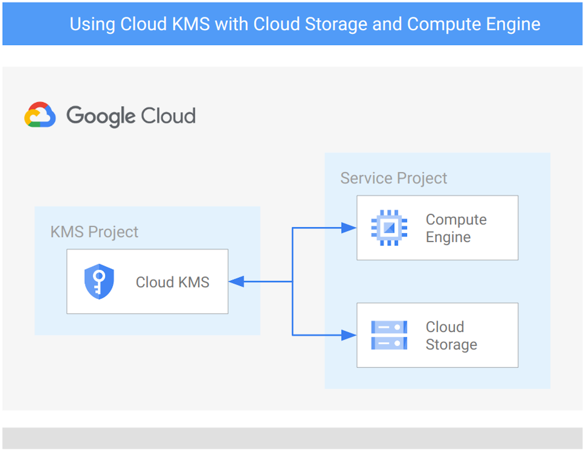

# GCP Data Services examples

The examples in this folder implement **typical data servicies topologies**, or **end-to-end scenarios** that allow testing specific features like Cloud KMS to encrypt your data or VPC-SC to mitigate data exfiltration.

They are meant to be used as minimal but complete starting points to create actual infrastructure, and as playgrounds to experiment with specific Google Cloud features.

## Examples

### Cloud KMS with Cloud Storage and Compute Engine

 This [example](./cloud-kms/) implements a project to host a centralized Cloud KMS instance and a service project that will use Crypto keys to encrypt resources at rest.

The sample highlights roles and permissions needed to implement the architecture described.
 