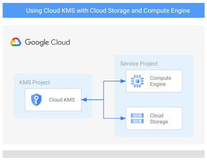

# Cloud KMS with Cloud Storage and Compute Engine

This sample creates a sample [Cloud KMS](https://cloud.google.com/kms?hl=it) configuration to be used with [Cloud Storage](https://cloud.google.com/storage/docs/encryption/using-customer-managed-keys) and [Copute Engine](https://cloud.google.com/compute/docs/disks/customer-managed-encryption).
Cloud KMS is deployed in a separate project to highlight the IAM binding needed and to mock a more real scenario where you usually have a project to manage keys across all your projects in one single place.

The sample has been purposefully kept simple so that it can be used as a basis for different and more complex configuration. This is the high level diagram:

## Managed resources and services

This sample creates several distinct groups of resources:

- projects
  - Cloud KMS project
  - Service Project configured for GCE instances and GCS buckets
- networking
  - VPC network
  - One subnet
  - Firewall rules for [SSH access via IAP](https://cloud.google.com/iap/docs/using-tcp-forwarding) and open communication within the VPC
- IAM
  - One service account for the GGE instance
- KMS
  - One key ring
  - One crypto key (Procection level: softwere) for Cloud Engine
  - One crypto key (Protection level: softwere) for Cloud Storage
- GCE
  - One instance encrypted with a CMEK Cryptokey hosted in Cloud KMS
- GCS
  - One bucket encrypted with a CMEK Cryptokey hosted in Cloud KMS

## Accessing the bastion instance and GKE cluster

The bastion VM has no public address so access is mediated via [IAP](https://cloud.google.com/iap/docs), which is supported transparently in the `gcloud compute ssh` command. Authentication is via OS Login set as a project default.

Cluster access from the bastion can leverage the instance service account's `container.developer` role: the only configuration needed is to fetch cluster credentials via `gcloud container clusters get-credentials` passing the correct cluster name, location and project via command options.

## Destroying

There's a minor glitch that can surface running `terraform destroy`, where the service project attachments to the Shared VPC will not get destroyed even with the relevant API call succeeding. We are investigating the issue, in the meantime just manually remove the attachment in the Cloud console or via the `gcloud beta compute shared-vpc associated-projects remove` command when `terraform destroy` fails, and then relaunch the command.

<!-- BEGIN TFDOC -->
## Variables

| name | description | type | required | default |
|---|---|:---: |:---:|:---:|
| billing_account | Billing account id used as default for new projects. | <code title="">string</code> | ✓ |  |
| projects_parent | The resource name of the parent Folder or Organization. Must be of the form folders/folder_id or organizations/org_id. | <code title="">string</code> | ✓ |  |
| *project_kms_name* | Name for the new KMS Project. | <code title="">string</code> |  | <code title="">my-project-kms-001</code> |
| *project_service_name* | Name for the new Service Project. | <code title="">string</code> |  | <code title="">my-project-service-001</code> |
| *resource_location* | The location where resources will be deployed. | <code title="">string</code> |  | <code title="">europe</code> |
| *resource_region* | The region where resources will be deployed. | <code title="">string</code> |  | <code title="">europe-west1</code> |
| *resource_zone* | The zone where resources will be deployed. | <code title="">string</code> |  | <code title="">europe-west1-b</code> |
| *vpc_ip_cidr_range* | Ip range used in the subnet deployef in the Service Project. | <code title="">string</code> |  | <code title="">10.0.0.0/20</code> |
| *vpc_name* | Name of the VPC created in the Service Project. | <code title="">string</code> |  | <code title="">local</code> |
| *vpc_subnet_name* | Name of the subnet created in the Service Project. | <code title="">string</code> |  | <code title="">subnet</code> |

## Outputs

| name | description | sensitive |
|---|---|:---:|
| buckets_keys | GCS Buckets Cloud KMS crypto keys. |  |
| projects | Project ids. |  |
| vms_keys | GCE VMs Cloud KMS crypto keys. |  |
<!-- END TFDOC -->
