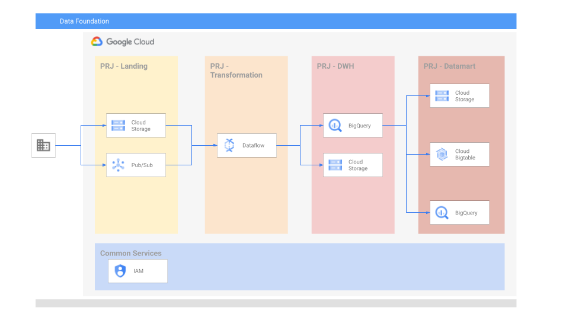

# Data Platform Foundations

## General

The goal of this project is to Build a **robust and flexible** Data Foundation on GCP that provides **opinionated defaults**, while allowing customers to **build and scale** out additional data pipelines **quickly and reliably**.

There are three provisioning workflows to enable an end to end Foundational Data Platform along with Data Pipelines on top of it. This is represented in the diagram below.

## Target architecture

In this example we will create the infrastructure needed for the foundational build and run a demo pipeline.

## Before you begine

Since this example is intended for the data infra engineers we do expect that an initial organization / folder and service account with owner privileges will be pre-created and provided as variables.

This example assumes that the following resources were already created and provided:

- Root node (organization or folder)
- Service account with owner permissions on the root node, used to apply Terraform code

## Building the Platform

Building the platform is composed of 2 foundational, and 2 optional steps:

- [Foundations 1 - project creation](./infra/tf-phase1/README.md)
- [Foundations 2 - assets deployment](./infra/tf-phase2/README.md)
- [Optional - manual pipeline example](./data-pipeline/README.md)
- [Optional - managing multiple environments](./manageing_multiple_environments.md)

## TODO list

| Description | Priority (1:High - 5:Low ) | Status | Remarks |
|-------------|----------|:------:|---------|
| DLP best practices in the pipeline | 2 | Not Started |   |
| KMS support (CMEK) | 2 | Not Started |   |
| VPC-SC | 3 | Not Started |   |
| Add Composer with a static DAG running the example | 3 | Not Started |   |
| Integrate [CI/CD composer data processing workflow framework](https://github.com/jaketf/ci-cd-for-data-processing-workflow) | 3 | Not Started |   |
| Schema changes, how to handle | 4 | Not Started |   |
| Data lineage | 4 | Not Started |   |
| Data quality checks | 4 | Not Started |   |
| Shared-VPC | 5 | Not Started |   |
| Logging & monitoring | TBD | Not Started |   |
| Orcestration for ingestion pipeline (just in the readme) | TBD | Not Started |   |
