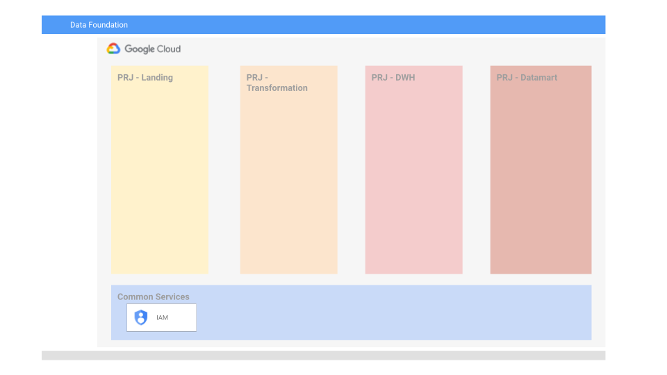

# Data Platform Foundations - Phase 1

## General

This is the first part deploying the Data Platform foundations. In this part we will create the infrastructure needed for the foundational build. This includes projects and service accounts.

Since this example is intended for the data infra engineers we do expect that an initial organization / folder and service account with owner privileges will be pre-created and provided as variables.

This example assume the next items were already created and provided:

- Organization / folder
- Terraform runner Service account with owner permissions on the above organization / folder

This example will create the next projects:

- Common services
- Landing
- Orchestration & Transformation
- DWH
- Datamart

A master service account named projects-editor-sa will be created under common services project and will be granted editor permissions on all the projects in scope.



## Running the example

To create the infrastructure:

- Specify your variables in a `terraform.tvars`

```tfm
billing_account = "BILLING ACCOUNT ID."
parent          = "Parent folder or organization in 'folders/folder_id' or 'organizations/org_id' format."
```

- Place the service account key in the terraform folder
- Go through the following steps to create resources:

```bash
terraform init
terraform apply
```

Once done testing, you can clean up resources by running:

```bash
terraform destroy
```

<!-- BEGIN TFDOC -->
## Requirements

| Name | Version |
|------|---------|
| terraform | >= 0.13 |

## Providers

| Name | Version |
|------|---------|
| random | n/a |

## Inputs

| Name | Description | Type | Default | Required |
|------|-------------|------|---------|:--------:|
| billing\_account | Billing account id. | `string` | n/a | ✓ |
| data\_service\_account\_name | Name for the projects editor service account. | `string` | `"projects-editor-sa"` |  |
| datamart\_project\_name | Project name | `string` | `"datamart"` |  |
| dwh\_project\_name | Project name | `string` | `"dwh"` |  |
| landing\_project\_name | Project name | `string` | `"landing"` |  |
| parent | Parent folder or organization in 'folders/folder\_id' or 'organizations/org\_id' format. | `string` | n/a | ✓ |
| projects\_suffix | Project suffix to make resources unique. If no suffix is provided a random suffix will be created | `string` | `null` |  |
| services\_project\_name | Project name | `string` | `"services"` |  |
| transformation\_project\_name | Project name | `string` | `"transformation"` |  |

## Outputs

| Name | Description |
|------|-------------|
| datamart-project | Datamart project created. |
| dwh-project | DWH project created. |
| landing-project | Landing project created. |
| services-project | Services project created. |
| transformation-project | Transformation project created. |
<!-- END TFDOC -->
