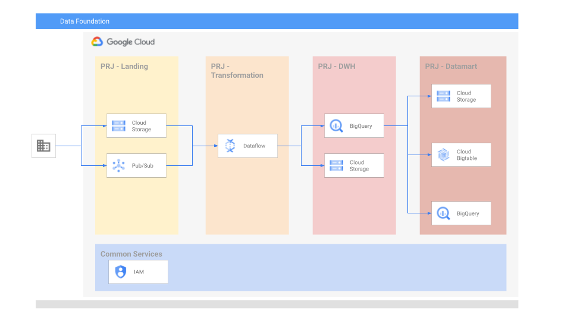

# Data Platform Foundations - Phase 2

## General

Now that we have all the needed project, we will create all the needed assets to store and process the data.



This example will create the next resources per project:

- Common
- Landing
  - [x] GCS
  - [x] Pub/Sub
- Orchestration & Transformation
  - [x] Dataflow
- DWH
  - [x] Bigquery (L0/1/2)
  - [x] GCS
- Datamart
  - [x] Bigquery (views/table)
  - [x] GCS
  - [ ] BigTable

## Running the example

To create the infrastructure:

- Specify your variables in a `terraform.tvars`

```tfm
services_project_id       = "SERVICES-PROJECT_ID"
landing_project_id        = "LANDING-PROJECT_ID"
transformation_project_id = "TRANSFORMATION-PROJECT_ID"
dwh_project_id            = "DWH-PROJECT_ID"
datamart_project_id       = "DATAMART-PROJECT_ID"
```

- Place the data_service_account_name service account (the service account was created in phase 1) key in the terraform folder
- Go through the following steps to create resources:

```bash
terraform init
terraform apply
```

Once done testing, you can clean up resources by running:

```bash
terraform destroy
```

<!-- BEGIN TFDOC -->
## Requirements

| Name | Version |
|------|---------|
| terraform | >= 0.13 |

## Providers

| Name | Version |
|------|---------|
| google | n/a |

## Inputs

| Name | Description | Type | Default | Required |
|------|-------------|------|---------|:--------:|
| datamart\_bq\_datasets | Datamart Bigquery datasets | `map(any)` | <pre>{<br>  "bq_datamart_dataset": {<br>    "id": "bq_datamart_dataset",<br>    "location": "EU"<br>  }<br>}</pre> |  |
| datamart\_project\_id | datamart project ID. | `string` | n/a | ✓ |
| datamart\_service\_account | datamart service accounts list. | `string` | `"sa-datamart"` |  |
| dwh\_bq\_datasets | DWH Bigquery datasets | `map(any)` | <pre>{<br>  "bq_raw_dataset": {<br>    "id": "bq_raw_dataset",<br>    "location": "EU"<br>  }<br>}</pre> |  |
| dwh\_project\_id | dwh project ID. | `string` | n/a | ✓ |
| dwh\_service\_account | dwh service accounts list. | `string` | `"sa-dwh"` |  |
| landing\_buckets | List of landing buckets to create | `map(any)` | <pre>{<br>  "data-schema": {<br>    "location": "EU",<br>    "name": "data-schema"<br>  },<br>  "raw-data": {<br>    "location": "EU",<br>    "name": "raw-data"<br>  }<br>}</pre> |  |
| landing\_project\_id | landing project ID. | `string` | n/a | ✓ |
| landing\_pubsub | List of landing buckets to create | `map(any)` | <pre>{<br>  "landing_1": {<br>    "name": "landing-1",<br>    "subscription_iam": {<br>      "sub1": {<br>        "roles/pubsub.subscriber": []<br>      },<br>      "sub2": {<br>        "roles/pubsub.subscriber": []<br>      }<br>    },<br>    "subscriptions": {<br>      "sub1": {<br>        "labels": {},<br>        "options": {<br>          "ack_deadline_seconds": null,<br>          "expiration_policy_ttl": null,<br>          "message_retention_duration": null,<br>          "retain_acked_messages": true<br>        }<br>      },<br>      "sub2": {<br>        "labels": {},<br>        "options": {<br>          "ack_deadline_seconds": null,<br>          "expiration_policy_ttl": null,<br>          "message_retention_duration": null,<br>          "retain_acked_messages": true<br>        }<br>      }<br>    }<br>  }<br>}</pre> |  |
| landing\_service\_account | landing service accounts list. | `string` | `"sa-landing"` |  |
| services\_project\_id | services project ID. | `string` | n/a | ✓ |
| services\_service\_account | services service accounts list. | `string` | `"sa-services"` |  |
| transformation\_buckets | List of transformation buckets to create | `map(any)` | <pre>{<br>  "temp": {<br>    "location": "EU",<br>    "name": "temp"<br>  },<br>  "templates": {<br>    "location": "EU",<br>    "name": "templates"<br>  }<br>}</pre> |  |
| transformation\_project\_id | Orchestration and Transformation project ID. | `string` | n/a | ✓ |
| transformation\_service\_account | transformation service accounts list. | `string` | `"sa-transformation"` |  |
| transformation\_subnets | List of subnets to create in the transformation Project. | `list(any)` | <pre>[<br>  {<br>    "ip_cidr_range": "10.1.0.0/20",<br>    "name": "transformation-subnet",<br>    "region": "europe-west3",<br>    "secondary_ip_range": {}<br>  }<br>]</pre> |  |
| transformation\_vpc\_name | Name of the VPC created in the transformation Project. | `string` | `"transformation-vpc"` |  |

## Outputs

| Name | Description |
|------|-------------|
| vpc-transformation-output | Transformation VPC details |
<!-- END TFDOC -->
