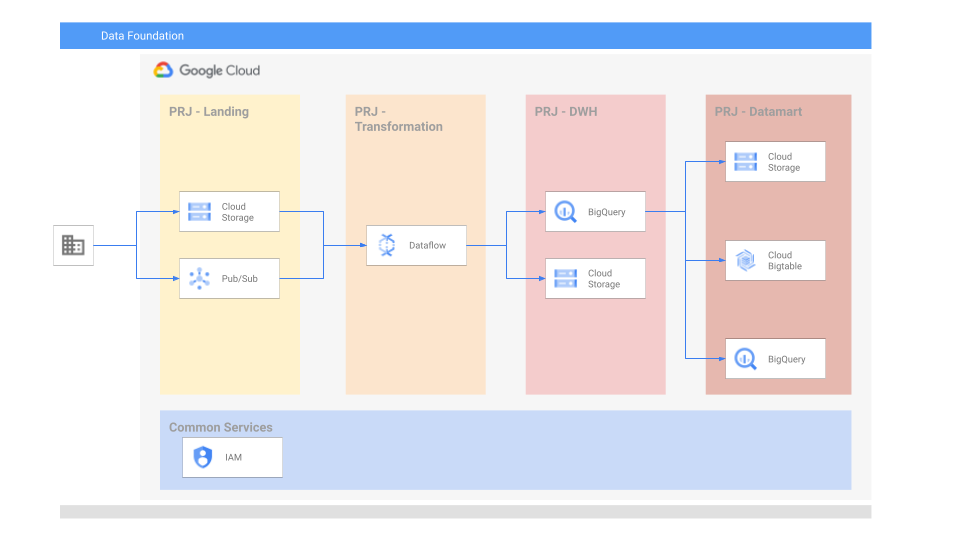

# Data Platform Foundations - Phase 2

## General

Now that we have all the needed project, we will create all the needed assets to store and process the data.



This example will create the next resources per project:

- Common
- Landing
  - [x] GCS
  - [x] Pub/Sub
- Orchestration & Transformation
  - [x] Dataflow
- DWH
  - [x] Bigquery (L0/1/2)
  - [x] GCS
- Datamart
  - [x] Bigquery (views/table)
  - [x] GCS
  - [ ] BigTable

## Running the example

To create the infrastructure:

- Specify your variables in a `terraform.tvars`

```tfm
project_ids = {
  datamart       = "DATAMART-PROJECT_ID"
  dwh            = "DWH-PROJECT_ID"
  landing        = "LANDING-PROJECT_ID"
  services       = "SERVICES-PROJECT_ID"
  transformation = "TRANSFORMATION-PROJECT_ID"
}
```

- Place the data_service_account_name service account (the service account was created in phase 1) key in the terraform folder
- Go through the following steps to create resources:

```bash
terraform init
terraform apply
```

Once done testing, you can clean up resources by running:

```bash
terraform destroy
```

<!-- BEGIN TFDOC -->
## Variables

| Name | Description | Type | Required | Default|
|------|-------------|------|:--------:|:--------:|
| <a name="input_datamart_bq_datasets"></a> [datamart\_bq\_datasets](#Variables\_datamart\_bq\_datasets) | Datamart Bigquery datasets | `object({...})` | | `...` |
| <a name="input_dwh_bq_datasets"></a> [dwh\_bq\_datasets](#Variables\_dwh\_bq\_datasets) | DWH Bigquery datasets | `object({...})` | | `...` |
| <a name="input_landing_buckets"></a> [landing\_buckets](#Variables\_landing\_buckets) | List of landing buckets to create | `object({...})` | | `...` |
| <a name="input_landing_pubsub"></a> [landing\_pubsub](#Variables\_landing\_pubsub) | List of landing pubsub topics and subscriptions to create | `object({...})` | | `...` |
| <a name="input_landing_service_account"></a> [landing\_service\_account](#Variables\_landing\_service\_account) | landing service accounts list. | `string` | | `sa-landing` |
| <a name="input_project_ids"></a> [project\_ids](#Variables\_project\_ids) | Project IDs. | `object({...})` | ✓ | n/a |
| <a name="input_project_service_account"></a> [project\_service\_account](#Variables\_project\_service\_account) | Project service accounts list. | `object({...})` |  | `...` |
| <a name="input_transformation_buckets"></a> [transformation\_buckets](#Variables\_transformation\_buckets) | List of transformation buckets to create | `object({...})` |  | `...` |
| <a name="input_transformation_subnets"></a> [transformation\_subnets](#Variables\_transformation\_subnets) | List of subnets to create in the transformation Project. | `object({...})` | | `...` |
| <a name="input_transformation_vpc_name"></a> [transformation\_vpc\_name](#Variables\_transformation\_vpc\_name) | Name of the VPC created in the transformation Project. | `string` | | `transformation-vpc` |

## Outputs

| Name | Description |
|------|-------------|
| <a name="output_datamart-bigquery-datasets-list"></a> [datamart-bigquery-datasets-list](#output\_datamart-bigquery-datasets-list) | List of bigquery datasets created for the datamart project |
| <a name="output_dwh-bigquery-datasets-list"></a> [dwh-bigquery-datasets-list](#output\_dwh-bigquery-datasets-list) | List of bigquery datasets created for the dwh project |
| <a name="output_landing-bucket-names"></a> [landing-bucket-names](#output\_landing-bucket-names) | List of buckets created for the landing project |
| <a name="output_landing-pubsub-list"></a> [landing-pubsub-list](#output\_landing-pubsub-list) | List of pubsub topics and subscriptions created for the landing project |
| <a name="output_transformation-bucket-names"></a> [transformation-bucket-names](#output\_transformation-bucket-names) | List of buckets created for the transformation project |
| <a name="output_transformation-vpc-info"></a> [transformation-vpc-info](#output\_transformation-vpc-info) | Transformation VPC details |<!-- END TFDOC -->
