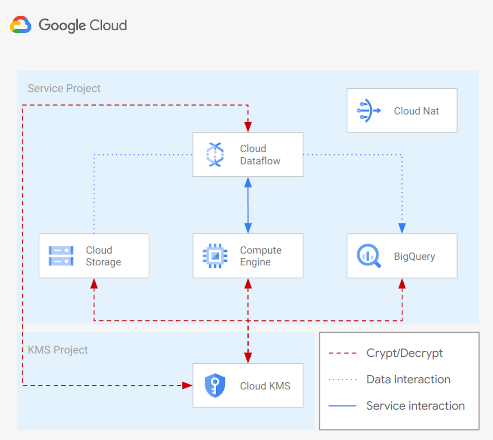

# Cloud Storage to Bigquery with Cloud Dataflow

This example creates the infrastructure needed to run a [Cloud Dataflow](https://cloud.google.com/dataflow) pipeline to import data from [GCS](https://cloud.google.com/storage) to [Bigquery](https://cloud.google.com/bigquery).

The solution will use:
 - internal IPs for GCE and Dataflow instances
 - CMEK encription for GCS bucket, GCE instances, DataFlow instances and BigQuery tables
 - Cloud NAT to let resources comunicate to the Internet, run system updates, and install packages
 
The example is designed to match real-world use cases with a minimum amount of resources. It can be used as a starting point for more complex scenarios.

This is the high level diagram:



## Managed resources and services

This sample creates several distinct groups of resources:

- projects
  - Cloud KMS project
  - Service Project configured for GCE instances, GCS buckets, Dataflow instances and BigQuery tables
- networking
  - VPC network
  - One subnet
  - Firewall rules for [SSH access via IAP](https://cloud.google.com/iap/docs/using-tcp-forwarding) and open communication within the VPC
- IAM
  - One service account for GGE instances
  - One service account for Dataflow instances
  - One service account for Bigquery tables
- KMS
  - One contintent key ring (example: 'Europe')
    - One crypto key (Procection level: softwere) for Cloud Engine
    - One crypto key (Protection level: softwere) for Cloud Storage
  - One regional key ring ('example: 'europe-west1')
    - One crypto key (Protection level: softwere) for Cloud Dataflow
- GCE
  - One instance encrypted with a CMEK Cryptokey hosted in Cloud KMS
- GCS
  - One bucket encrypted with a CMEK Cryptokey hosted in Cloud KMS
- BQ
  - One dataset encrypted with a CMEK Cryptokey hosted in Cloud KMS
  - Two tables encrypted with a CMEK Cryptokey hosted in Cloud KMS

## Test your environment with Cloud Dataflow
You can now connect to the GCE instance with the following command:

```hcl
 gcloud compute ssh vm-example-1
```

You can run now the simple pipeline you can find [here](./script/data_ingestion/). Once you have installed required packages and copied a file into the GCS bucket, you can trigger the pipeline using internal ips with a command simila to:

```hcl
python data_ingestion.py \
--runner=DataflowRunner \
--max_num_workers=10 \
--autoscaling_algorithm=THROUGHPUT_BASED \
--region=### REGION ### \
--staging_location=gs://### TEMP BUCKET NAME ###/ \
--temp_location=gs://### TEMP BUCKET NAME ###/ \
--project=### PROJECT ID ### \
--input=gs://### DATA BUCKET NAME###/### FILE NAME ###.csv \
--output=### DATASET NAME ###.### TABLE NAME ### \
--service_account_email=### SERVICE ACCOUNT EMAIL ### \
--network=### NETWORK NAME ### \
--subnetwork=### SUBNET NAME ### \
--dataflow_kms_key=### CRYPTOKEY ID ### \
--no_use_public_ips
```

for example:

```hcl
python data_ingestion.py \
--runner=DataflowRunner \
--max_num_workers=10 \
--autoscaling_algorithm=THROUGHPUT_BASED \
--region=europe-west1 \
--staging_location=gs://lc-001-eu-df-tmplocation/ \
--temp_location=gs://lc-001-eu-df-tmplocation/ \
--project=lcaggio-demo \
--input=gs://lc-eu-data/person.csv \
--output=bq_dataset.df_import \
--service_account_email=df-test@lcaggio-demo.iam.gserviceaccount.com \
--network=local \
--subnetwork=regions/europe-west1/subnetworks/subnet \
--dataflow_kms_key=projects/lcaggio-demo-kms/locations/europe-west1/keyRings/my-keyring-regional/cryptoKeys/key-df \
--no_use_public_ips
```

You can check data imported into Google BigQuery from the Google Cloud Console UI.

## Test your environment with 'bq' CLI
You can now connect to the GCE instance with the following command:

```hcl
 gcloud compute ssh vm-example-1
```

You can run now a simple 'bq load' command to import data into Bigquery. Below an example command:

```hcl
bq load \
--source_format=CSV \
bq_dataset.bq_import \
gs://my-bucket/person.csv \
schema_bq_import.json
```

You can check data imported into Google BigQuery from the Google Cloud Console UI.

<!-- BEGIN TFDOC -->
## Variables

| name | description | type | required | default |
|---|---|:---: |:---:|:---:|
| billing_account | Billing account id used as default for new projects. | <code title="">string</code> | ✓ |  |
| project_kms_name | Name for the new KMS Project. | <code title="">string</code> | ✓ |  |
| project_service_name | Name for the new Service Project. | <code title="">string</code> | ✓ |  |
| root_node | The resource name of the parent Folder or Organization. Must be of the form folders/folder_id or organizations/org_id. | <code title="">string</code> | ✓ |  |
| *location* | The location where resources will be deployed. | <code title="">string</code> |  | <code title="">europe</code> |
| *region* | The region where resources will be deployed. | <code title="">string</code> |  | <code title="">europe-west1</code> |
| *ssh_source_ranges* | IP CIDR ranges that will be allowed to connect via SSH to the onprem instance. | <code title="list&#40;string&#41;">list(string)</code> |  | <code title="">["0.0.0.0/0"]</code> |
| *vpc_ip_cidr_range* | Ip range used in the subnet deployef in the Service Project. | <code title="">string</code> |  | <code title="">10.0.0.0/20</code> |
| *vpc_name* | Name of the VPC created in the Service Project. | <code title="">string</code> |  | <code title="">local</code> |
| *vpc_subnet_name* | Name of the subnet created in the Service Project. | <code title="">string</code> |  | <code title="">subnet</code> |

## Outputs

| name | description | sensitive |
|---|---|:---:|
| bq_tables | Bigquery Tables. |  |
| buckets | GCS Bucket Cloud KMS crypto keys. |  |
| projects | Project ids. |  |
| vm | GCE VMs. |  |
<!-- END TFDOC -->
