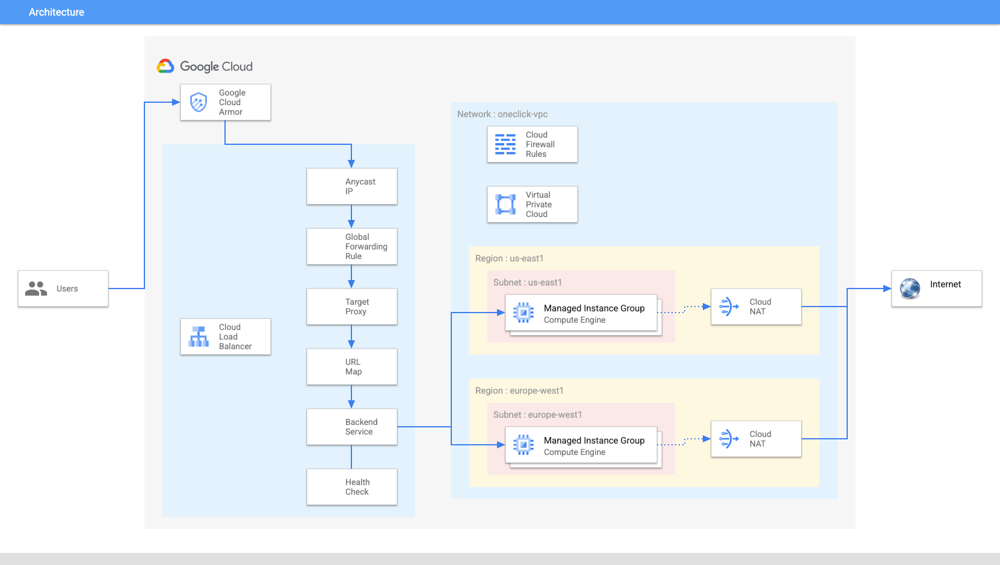

# HTTP Load Balancer with Cloud Armor

Google Cloud HTTP(S) load balancing is implemented at the edge of Google's network in Google's points of presence (POP) around the world. User traffic directed to an HTTP(S) load balancer enters the POP closest to the user and is then load balanced over Google's global network to the closest backend that has sufficient capacity available.

Cloud Armor IP allowlist/denylist enable you to restrict or allow access to your HTTP(S) load balancer at the edge of the Google Cloud, as close as possible to the user and to malicious traffic. This prevents malicious users or traffic from consuming resources or entering your virtual private cloud (VPC) networks.

In this lab, you configure an HTTP Load Balancer with global backends, as shown in the diagram below. Then, you stress test the Load Balancer and denylist the stress test IP with Cloud Armor.

## Running the example

Clone this repository or [open it in cloud shell](https://ssh.cloud.google.com/cloudshell/editor?cloudshell_git_repo=https%3A%2F%2Fgithub.com%2Fterraform-google-modules%2Fcloud-foundation-fabric&cloudshell_print=cloud-shell-readme.txt&cloudshell_working_dir=examples%2Fcloud-operations%2Fglb-and-armor), then go through the following steps to create resources:

* `terraform init`
* `terraform apply -var project_id=my-project-id`

The following outputs will be available once everything is deployed:

* `glb_ip_address`, containing the IPv4 address of the HTTP Load Balancer 
* `vm_siege_external_ip`, containing the external IPv4 address of the siege VM.

Once done testing, you can clean up resources by running `terraform destroy`.

## Testing the example

1. Connect to the siege VM and run the following command 

        siege -c 250 -t150s http://$LB_IP`ß

2. In the Cloud Console, on the Navigation menu, click Network Services > Load balancing.
3. Click Backends.
4. Click http-backend.
5. Navigate to http-lb.
6. Click on the Monitoring tab.
7. Monitor the Frontend Location (Total inbound traffic) between North America and the two backends for 2 to 3 minutes. At first, traffic should just be directed to us-east1-mig but as the RPS increases, traffic is also directed to europe-west1-mig. This demonstrates that by default traffic is forwarded to the closest backend but if the load is very high, traffic can be distributed across the backends.
8. Re-run terraform as follows:

        terraform apply -var project_id=my-project-id -var enforce_security_policy=true

   Like this we have applied a security policy to denylist the IP address of the siege VM

9. From the siege VM run the following command and verify that you get a 403 Forbidden error code back.

        curl http://$LB_IP
<!-- BEGIN TFDOC -->

## Variables

| name | description | type | required | default |
|---|---|:---:|:---:|:---:|
| [project_id](variables.tf#L26) | Identifier of the project. | <code>string</code> | ✓ |  |
| [enforce_security_policy](variables.tf#L31) | Enforce security policy. | <code>bool</code> |  | <code>true</code> |
| [prefix](variables.tf#L37) | Prefix used for created resources. | <code>string</code> |  | <code>null</code> |
| [project_create](variables.tf#L17) | Parameters for the creation of the new project. | <code title="object&#40;&#123;&#10;  billing_account_id &#61; string&#10;  parent             &#61; string&#10;&#125;&#41;">object&#40;&#123;&#8230;&#125;&#41;</code> |  | <code>null</code> |

## Outputs

| name | description | sensitive |
|---|---|:---:|
| [glb_ip_address](outputs.tf#L18) | Load balancer IP address. |  |
| [vm_siege_external_ip](outputs.tf#L23) | Siege VM external IP address. |  |

<!-- END TFDOC -->
