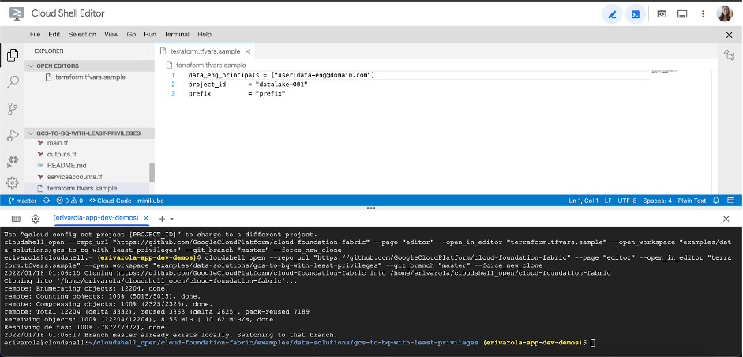

# HTTP Load Balancer with Cloud Armor

## Introduction

Coming up with an amazing app idea is really hard… but what’s even worse is making sure you’re able to deploy it securely on a global scale! Many developers and engineers struggle with making sure their product backends are highly-available and secure at the same time - usually ending up focusing on one of the two. This project aims to change just that.

Using the power of terraform scripts (Infrastructure as a Code deployments), we will be creating a multi-regional infrastructure with horizontally scaling managed instance group backends, HTTP load balancing and Google’s advanced WAF (Web application Firewall) security tool (Cloud Armor) on top.

What does this mean? Instead of a long running architecture planning and deployment sprints, we will have a robust backend infrastructure ready in just a few steps. The architecture in question is general enough to fit in a variety of use-cases, but has the potential to be adapted to any specific workload as well. For example - once deployed, this particular architecture can be adapted to run a mobile app’s backend or be used to host proprietary workloads at scale. Not to get into too much detail, let’s elaborate on this in the next section.

## Use cases

Google Cloud enables workloads of all types to be deployed at any scale using a variety of high-performing resources. But even though there’s many ways to implement any architecture, some workloads are more specific than others and we will be discussing one such very common implementation in this document.

In a world of rapidly scaling products, some workloads require high compute power or specific licenses while making sure the workloads are secured by a managed service and highly available across multiple regions. An architecture consisting of Managed Instance Groups in multiple regions available through an HTTP Load Balancer with Cloud Armor enabled is ideal for such use-cases.

This architecture caters to multiple workloads ranging from the ones requiring compliance with specific data access restrictions to compute-specific proprietary applications with specific licensing and OS requirements. Descriptions of some possible use-cases are as follows:

* __Proprietary OS workloads__: Some applications require specific Operating systems (enterprise grade Linux distributions) with specific licensing requirements with low-level access to the kernel. In such cases, since the applications cannot be containerised and horizontal scaling is required, multi-region Managed Instance Group (MIG) with custom instance images are the ideal implementation.
* __Industry-specific applications__: Your applications may require high compute power alongside a sophisticated layer of networking security. This architecture satisfies both these requirements by promising configurable compute power on the instances backed by various features offered by Cloud Armor such as traffic restriction, DDoS protection etc.
* __Workloads requiring GDPR compliance__: Most applications require restricting data access and usage from outside a certain region (mostly to comply with data residency requirements). This architecture caters to such workloads perfectly because Cloud Armor allows you to lock access to your workloads from various fine-grained identifiers.
* __Medical Queuing systems__: Another great example usage for this  architecture will be applications requiring high compute power, availability and limited memory access requirements such as a medical queuing system.
* __DDoS Protection and WAF__:  Applications and workloads exposed to the internet are constantly under the risk for DDoS attacks. While L3/L4 and protocol based attacks are handled at Google’s edge, L7 attacks can still be immensely effective with botnets. A setup of an external Cloud Load Balancer with Cloud Armor and well crafted WAF rules would be the best way to mitigate such attacks.
* __Geofencing__: If you want to restrict content served on your application due to licensing restrictions (similar to OTT content in the US), Geofencing allows you to create a virtual perimeter to stop the service from being accessed outside the region. The architecture of using a Cloud Load Balancer with Cloud Armor enables you to implement geofencing around your applications and services.

## Architecture

The main components that we would be setting up are (to learn more about these products, click on the hyperlinks):

* [Cloud Armor](https://cloud.google.com/armor) - Google Cloud Armor is the web-application firewall (WAF) and DDoS mitigation service that helps users defend their web apps and services at Google scale at the edge of Google’s network.
* [Cloud Load Balancer](https://cloud.google.com/load-balancing) - When your app usage spikes, it is important to scale, optimize and secure the app. Cloud Load Balancing is a fully distributed solution that balances user traffic to multiple backends to avoid congestion, reduce latency and increase security. Some important features it offers that we use here are:
  * Single global anycast IP and autoscaling - CLB acts as a frontend to all your backend instances across all regions. It provides cross-region load balancing, automatic multi-region failover and scales to support increase in resources.
  * Global Forwarding Rule - To route traffic to different regions, global load balancers use global forwarding rules, which bind the global IP address and a single target proxy.
  * Target Proxy - For external HTTP(S) load balancers, proxies route incoming requests to a URL map. This is essentially how you can handle the connections.
  * URL Map - URL Maps are used to route requests to a backend service based on the rules that you define for the host and path of an incoming URL.
  * Backend Service - A Backend Service defines CLB distributes traffic. The backend service configuration consists of a set of values - protocols to connect to backends, session settings, health checks and timeouts.
  * Health Check - Health check is a method provided to determine if the corresponding backends respond to traffic. Health checks connect to backends on a configurable, periodic basis. Each connection attempt is called a probe. Google Cloud records the success or failure of each probe.
* [Firewall Rules](https://cloud.google.com/vpc/docs/firewalls) - Firewall rules let you allow or deny connections to or from your VM instances based on a configuration you specify.
* [Managed Instance Groups (MIG)](https://cloud.google.com/compute/docs/instance-groups) - Instance group is a collection of VM instances that you can manage as a single entity. MIGs allow you to operate apps and workloads on multiple identical VMs. You can also leverage the various features like autoscaling, autohealing, regional / multi-zone deployments.

## Costs

Pricing Estimates - We have created a sample estimate based on some usage we see from new startups looking to scale. This estimate would give you an idea of how much this deployment would essentially cost per month at this scale and you extend it to the scale you further prefer.

<https://cloud.google.com/products/calculator/#id=3105bbf2-4ee0-4289-978e-9ab6855d37ed>

## Setup

This solution assumes you already have a project created and set up where you wish to host these resources. If not, and you would like for the project to create a new project as well,  please refer to the [github repository](https://github.com/GoogleCloudPlatform/cloud-foundation-fabric/tree/master/examples/data-solutions/gcs-to-bq-with-least-privileges) for instructions.

### Prerequisites

* Have an [organization](https://cloud.google.com/resource-manager/docs/creating-managing-organization) set up in Google cloud.
* Have a [billing account](https://cloud.google.com/billing/docs/how-to/manage-billing-account) set up.
* Have an existing [project](https://cloud.google.com/resource-manager/docs/creating-managing-projects) with [billing enabled](https://cloud.google.com/billing/docs/how-to/modify-project).

### Roles & Permissions

In order to spin up this architecture, you will need to be a user with the “__Project owner__” [IAM](https://cloud.google.com/iam) role on the existing project:

Note: To grant a user a role, take a look at the [Granting and Revoking Access](https://cloud.google.com/iam/docs/granting-changing-revoking-access#grant-single-role) documentation.

### Spinning up the architecture

#### Step 1: Cloning the repository

Click on the button below, sign in if required and when the prompt appears, click on “confirm”.

This will clone the repository to your cloud shell and a screen like this one will appear:

Before you deploy the architecture, make sure you run the following command to move your cloudshell session  into your service project:

        gcloud config set project [SERVICE_PROJECT_ID]

Once you can see your service project id in the yellow parenthesis, you’re ready to start.

Before we deploy the architecture, you will need the following information:

* The __service project ID__.
* A __unique prefix__ that you want all the deployed resources to have (for example: awesomestartup). This must be a string with no spaces or tabs.
* A __list of Groups or Users__ with Service Account Token creator role on Service Accounts in IAM format, eg 'group:group@domain.com'.

#### Step 2: Deploying the resources

1. After cloning the repo, and going through the prerequisites, head back to the cloud shell editor.
2. Make sure you’re in the following directory. if not, you can change your directory to it via the ‘cd’ command:

       cloudshell_open/cloud-foundation-fabric/examples/cloud-operations/glb_and_armor

3. Run the following command to initialize the terraform working directory:

       terraform init

4. Copy the following command into a console and replace __[my-project-id]__ with your project’s ID. Then run the following command to run the terraform script and create all relevant resources for this architecture:

       terraform apply -var project_id=[my-project-id]

The resource creation will take a few minutes… but when it’s complete, you should see an output stating the command completed successfully with a list of the created resources.

__Congratulations__! You have successfully deployed an HTTP Load Balancer with two Managed Instance Group backends and Cloud Armor security.

## Testing your architecture

1. Connect to the siege VM using SSH (from Cloud Console or CLI) and run the following command:

        siege -c 250 -t150s http://$LB_IP

2. In the Cloud Console, on the Navigation menu, click __Network Services > Load balancing__.
3. Click __Backends__, then click __http-backend__ and navigate to __http-lb__
4. Click on the __Monitoring__ tab.
5. Monitor the Frontend Location (Total inbound traffic) between North America and the two backends for 2 to 3 minutes. At first, traffic should just be directed to __us-east1-mig__ but as the RPS increases, traffic is also directed to __europe-west1-mig__. This demonstrates that by default traffic is forwarded to the closest backend but if the load is very high, traffic can be distributed across the backends.
6. Now, to test the IP deny-listing, rerun terraform as follows:

        terraform apply -var project_id=my-project-id -var enforce_security_policy=true

This, applies a security policy to denylist the IP address of the siege VM

7. To test this, from the siege VM run the following command and verify that you get a __403 Forbidden__ error code back.

        curl http://$LB_IP

## Cleaning up your environment

The easiest way to remove all the deployed resources is to run the following command in Cloud Shell:

        terraform destroy

The above command will delete the associated resources so there will be no billable charges made afterwards.

<!-- BEGIN TFDOC -->

## Variables

| name | description | type | required | default |
|---|---|:---:|:---:|:---:|
| [project_id](variables.tf#L26) | Identifier of the project. | <code>string</code> | ✓ |  |
| [enforce_security_policy](variables.tf#L31) | Enforce security policy. | <code>bool</code> |  | <code>true</code> |
| [prefix](variables.tf#L37) | Prefix used for created resources. | <code>string</code> |  | <code>null</code> |
| [project_create](variables.tf#L17) | Parameters for the creation of the new project. | <code title="object&#40;&#123;&#10;  billing_account_id &#61; string&#10;  parent             &#61; string&#10;&#125;&#41;">object&#40;&#123;&#8230;&#125;&#41;</code> |  | <code>null</code> |

## Outputs

| name | description | sensitive |
|---|---|:---:|
| [glb_ip_address](outputs.tf#L18) | Load balancer IP address. |  |
| [vm_siege_external_ip](outputs.tf#L23) | Siege VM external IP address. |  |

<!-- END TFDOC -->
