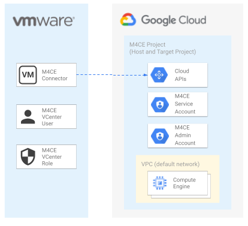
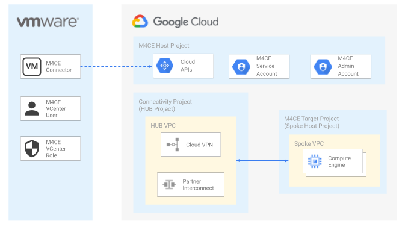

# Migrate for Compute Engine (v5) examples

The examples in this folder implement **Migrate for Compute Engine (v5)** environments for the main migration scenarios like the ones with host and target project, or with shared VPC.

They are meant to be used as minimal but complete starting points to create migration environment **on top of existing cloud foundations**, and as playgrounds to experiment with specific Google Cloud features.

## Examples

### M4CE on a single project

 This [example](./single-project/) implements a simple environment for Migrate for Compute Engine (v5) where both the API backend and the migration target environment are deployed on a single GCP project.

This example represents the easiest sceario to implement a Migrate for Compute Engine (v5) enviroment suitable for small migrations on simple enviroments or for product showcases. 
 

### M4CE with host and target projects

 This [example](./host-target-projects/) implements a Migrate for Compute Engine (v5) host and target projects topology where the API backend and access grants are implemented on the host project while workloads are migrated on a different target project.

This example shows a complex scenario where Migrate for Compute Engine (v5) can be deployed on top of and existing HUB and SPOKE topology and the migration target projects are deployed with platform foundations.
 

### M4CE with Host and Target Projects and Shared VPC

 This [example](./host-target-sharedvpc/) implements a Migrate for Compute Engine (v5) host and target projects topology as described above with the support of shared VPC. 

The example shows how to implement a Migrate for Compute Engine (v5) environment on top of an existing shared VPC topology where the shared VPC service projects are the target projects for the migration. 
 

### ESXi Connector

 This [example](./esxi/) implements a Migrate for Compute Engine (v5) environment on a VMWare ESXi cluster as source for VM migrations.

The example shows how to deploy the Migrate for Compute Engine (v5) connector and implement all the security prerequisites for the migration to GCP.