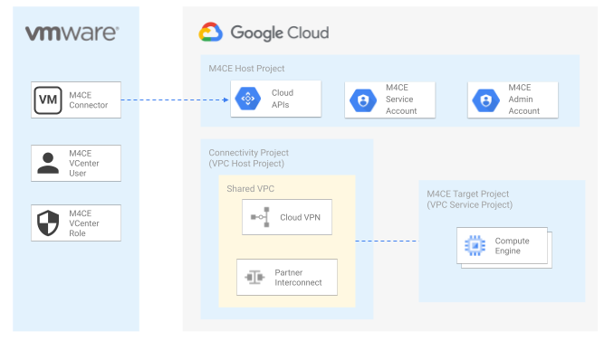

# M4CE(v5) - Host and Target Projects with Shared VPC

This example creates a Migrate for Compute Engine (v5) environment deployed on an host project with multiple [target projects](https://cloud.google.com/migrate/compute-engine/docs/5.0/how-to/enable-services#identifying_your_host_project) and shared VPCs.

The example is designed to implement a M4CE (v5) environment on-top of complex migration landing environment where VMs have to be migrated to multiple target projects. In this example targets are alse service projects for a shared VPC. It also includes the IAM wiring needed to make such scenarios work.

This is the high level diagram:

## Managed resources and services

This sample creates\update several distinct groups of resources:

- projects
  - M4CE host project with [required services](https://cloud.google.com/migrate/compute-engine/docs/5.0/how-to/enable-services#enabling_required_services_on_the_host_project) deployed on a new or existing project. 
  - M4CE target project prerequisites deployed on existing projects. 
- IAM
  - Create a [service account](https://cloud.google.com/migrate/compute-engine/docs/5.0/how-to/migrate-connector#step-3) used at runtime by the M4CE connector for data replication
  - Grant [migration admin roles](https://cloud.google.com/migrate/compute-engine/docs/5.0/how-to/enable-services#using_predefined_roles) to provided user accounts.
  - Grant [migration viewer role](https://cloud.google.com/migrate/compute-engine/docs/5.0/how-to/enable-services#using_predefined_roles) to provided user accounts.
  - Grant [roles on shared VPC](https://cloud.google.com/migrate/compute-engine/docs/5.0/how-to/target-project#configure-permissions) to migration admins
<!-- BEGIN TFDOC -->

## Variables

| name | description | type | required | default |
|---|---|:---:|:---:|:---:|
| [migration_admin_users](variables.tf#L15) | List of users authorized to create a new M4CE sources and perform all other migration operations, in IAM format | <code>list&#40;string&#41;</code> | ✓ |  |
| [migration_target_projects](variables.tf#L20) | List of target projects for m4ce workload migrations | <code>list&#40;string&#41;</code> | ✓ |  |
| [sharedvpc_host_projects](variables.tf#L45) | List of host projects that share a VPC with the selected target projects | <code>list&#40;string&#41;</code> | ✓ |  |
| [migration_viewer_users](variables.tf#L25) | List of users authorized to retrive information about M4CE in the Google Cloud Console, in IAM format | <code>list&#40;string&#41;</code> |  | <code>&#91;&#93;</code> |
| [project_create](variables.tf#L30) | Parameters for the creation of the new project to host the M4CE backend | <code title="object&#40;&#123;&#10;  billing_account_id &#61; string&#10;  parent             &#61; string&#10;&#125;&#41;">object&#40;&#123;&#8230;&#125;&#41;</code> |  | <code>null</code> |
| [project_name](variables.tf#L39) | Name of an existing project or of the new project assigned as M4CE host project | <code>string</code> |  | <code>&#34;m4ce-host-project-000&#34;</code> |

## Outputs

| name | description | sensitive |
|---|---|:---:|
| [m4ce_gmanaged_service_account](outputs.tf#L15) | Google manager service account created automatically. It is used by M4CE to perform activities on target projects |  |

<!-- END TFDOC -->
## Manual Steps
Once this example is deployed the M4CE [m4ce_gmanaged_service_account](https://cloud.google.com/migrate/compute-engine/docs/5.0/how-to/target-sa-compute-engine#configuring_the_default_service_account) has to be configured to grant the access to the shared VPC and allow the deploy of Compute Engine instances as the result of the migration.