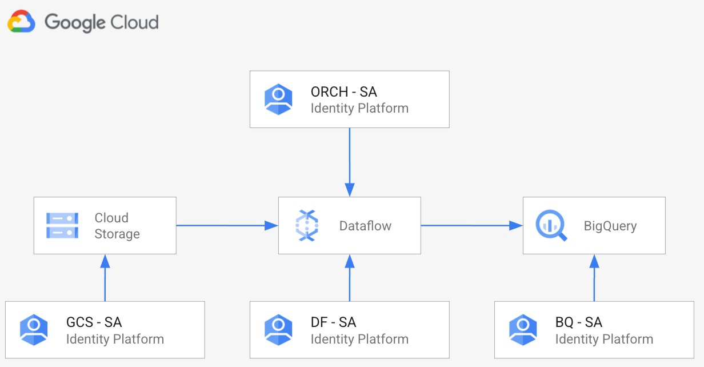
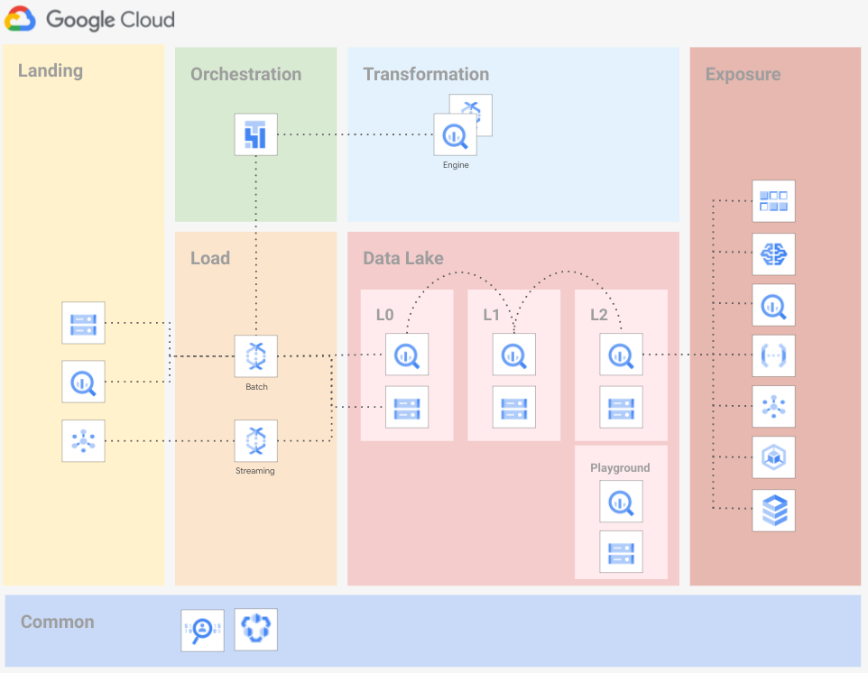
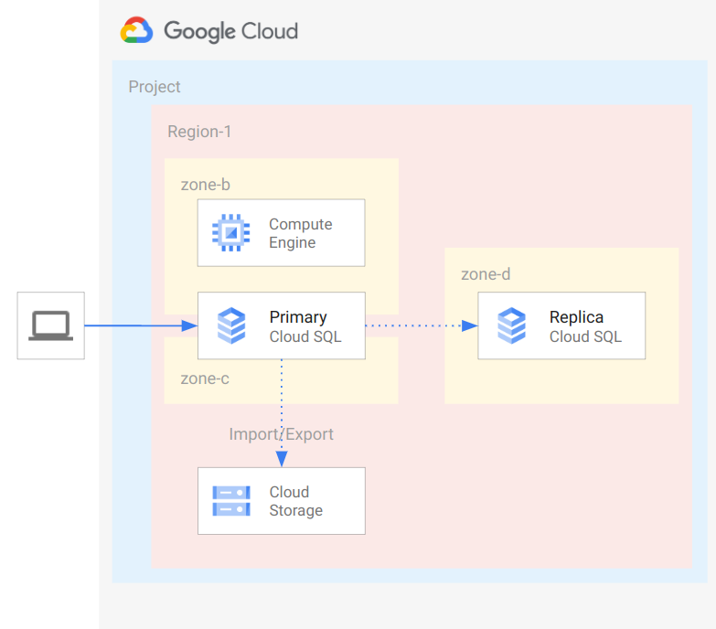

# GCP Data Services examples

The examples in this folder implement **typical data service topologies** and **end-to-end scenarios**, that allow testing specific features like Cloud KMS to encrypt your data, or VPC-SC to mitigate data exfiltration.

They are meant to be used as minimal but complete starting points to create actual infrastructure, and as playgrounds to experiment with specific Google Cloud features.

## Examples

### GCE and GCS CMEK via centralized Cloud KMS

 This [example](./cmek-via-centralized-kms/) implements [CMEK](https://cloud.google.com/kms/docs/cmek) for GCS and GCE, via keys hosted in KMS running in a centralized project. The example shows the basic resources and permissions for the typical use case of application projects implementing encryption at rest via a centrally managed KMS service.
 

### Cloud Storage to Bigquery with Cloud Dataflow with least privileges

 This [example](./gcs-to-bq-with-least-privileges/) implements resources required to run GCS to BigQuery Dataflow pipelines. The solution rely on a set of Services account created with the least privileges principle.
 

### Data Platform Foundations

This [example](./data-platform-foundations/) implements a robust and flexible Data Foundation on GCP that provides opinionated defaults, allowing customers to build and scale out additional data pipelines quickly and reliably.
 

### SQL Server Always On Availability Groups

This [example](./data-platform-foundations/) implements SQL Server Always On Availability Groups using Fabric modules. It builds a two node cluster with a fileshare witness instance in an existing VPC and adds the necessary firewalling. The actual setup process (apart from Active Directory operations) has been scripted, so that least amount of manual works needs to performed.
 

### Cloud SQL instance with multi-region read replicas

This [example](./cloudsql-multiregion/) creates a [Cloud SQL instance](https://cloud.google.com/sql) with multi-region read replicas as described in the [Cloud SQL for PostgreSQL disaster recovery](https://cloud.google.com/architecture/cloud-sql-postgres-disaster-recovery-complete-failover-fallback) article.
 