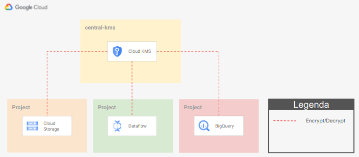
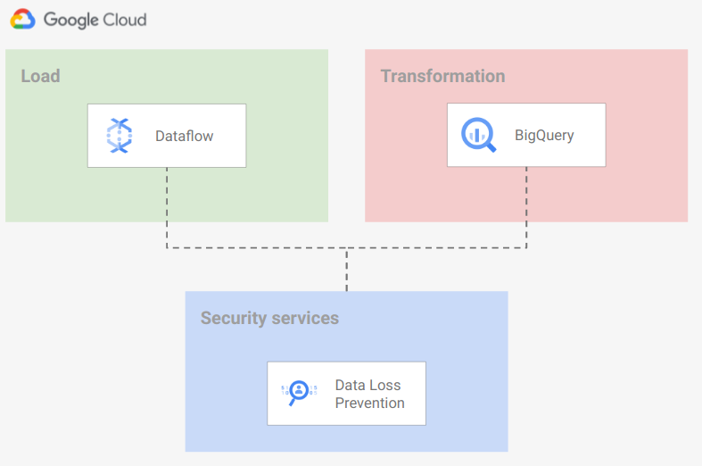

# Data Platform

This module implements an opinionated Data Platform (DP) Architecture that creates and setup projects and related resources that compose an end-to-end data environment.

The code is intentionally simple, as it's intended to provide a generic initial setup and then allow easy customizations to complete the implementation of the intended design.

The following diagram is a high-level reference of the resources created and managed here:


A demo pipeline is also part of this example: it can be built and run on top of the foundational infrastructure to verify or test the setup quickly.

## Design overview and choices

Despite its simplicity, this stage implements the basics of a design that we've seen working well for various customers.

The approach adapts to different high-level requirements:

- boundaries for each step
- clearly defined actors
- least privilege principle
- rely on service account impersonation

The code in this example doesn't address Organization-level configurations (Organization policy, VPC-SC, centralized logs). We expect those to be managed by automation stages external to this script like those in [FAST](../../../fast).

### Project structure

The DP is designed to rely on several projects, one project per data stage. The stages identified are:

- landing
- load
- data lake
- orchestration
- transformation
- exposure

This separation into projects allows adhering to the least-privilege principle by using project-level roles.

The script will create the following projects:

- **Landing** Used to store temporary data. Data is pushed to Cloud Storage, BigQuery, or Cloud PubSub. Resources are configured with a customizable lifecycle policy.
- **Load** Used to load data from landing to data lake. The load is made with minimal to zero transformation logic (mainly `cast`). Anonymization or tokenization of Personally Identifiable Information (PII) can be implemented here or in the transformation stage, depending on your requirements. The use of [Cloud Dataflow templates](https://cloud.google.com/dataflow/docs/concepts/dataflow-templates) is recommended.
- **Data Lake** Several projects distributed across 3 separate layers, to host progressively processed and refined data:
  - **L0 - Raw data** Structured Data, stored in relevant formats: structured data stored in BigQuery, unstructured data stored on Cloud Storage with additional metadata stored in BigQuery (for example pictures stored in Cloud Storage and analysis of the images for Cloud Vision API stored in BigQuery).
  - **L1 - Cleansed, aggregated and standardized data**
  - **L2 - Curated layer**
  - **Playground** Temporary tables that Data Analyst may use to perform R&D on data available in other Data Lake layers.
- **Orchestration** Used to host Cloud Composer, which orchestrates all tasks that move data across layers.
- **Transformation** Used to move data between Data Lake layers. We strongly suggest relying on BigQuery Engine to perform the transformations. If BigQuery doesn't have the features needed to perform your transformations, you can use Cloud Dataflow with [Cloud Dataflow templates](https://cloud.google.com/dataflow/docs/concepts/dataflow-templates). This stage can also optionally  anonymize or tokenize PII.
- **Exposure** Used to host resources that share processed data with external systems. Depending on the access pattern, data can be presented via Cloud SQL, BigQuery, or Bigtable. For BigQuery data, we strongly suggest relying on [Authorized views](https://cloud.google.com/bigquery/docs/authorized-views).

### Roles

We assign roles on resources at the project level, granting the appropriate role via groups for humans and individual principals for service accounts, according to best practices.

### Service accounts

Service account creation follows the least privilege principle, performing a single task which requires access to a defined set of resources. For example, the Cloud Dataflow service account only has access to the landing project and the data lake L0 project.

Using of service account keys within a data pipeline exposes to several security risks deriving from a credentials leak. This example shows how to leverage impersonation to avoid the need of creating keys.

### Groups

We use three groups to control access to resources:

- *Data Engineers* They handle and run the Data Hub, with read access to all resources in order to troubleshoot possible issues with pipelines. This team can also impersonate any service account.
- *Data Analyst*. They perform analysis on datasets, with read access to the data lake L2 project, and BigQuery READ/WRITE access to the playground project. 
- *Data Security*:. They handle security configurations related to the Data Hub.

You can configure groups via the `groups` variable.
### Virtual Private Cloud (VPC) design

As is often the case in real-world configurations, this example accepts as input an existing [Shared-VPC](https://cloud.google.com/vpc/docs/shared-vpc) via the `network_config` variable. Make sure that the GKE API (`container.googleapis.com`) is enabled in the VPC host project.

If the `network_config` variable is not provided, one VPC will be created in each project that supports network resources (load, transformation and orchestration).

### IP ranges and subnetting

To deploy this example with self-managed VPCs you need the following ranges:

- one /24 for the load project VPC subnet used for Cloud Dataflow workers
- one /24 for the transformation VPC subnet used for Cloud Dataflow workers
- one /24 range for the orchestration VPC subnet used for Composer workers
- one /22 and one /24 ranges for the secondary ranges associated with the orchestration VPC subnet

If you are using Shared VPC, you need one subnet with one /22 and one /24 secondary range defined for Composer pods and services.

In both VPC scenarios, you also need these ranges for Composer:

- one /24 for Cloud SQL
- one /28 for the GKE control plane
- one /28 for the web server

### Resource naming conventions

Resources in the script use the following acronyms:

- `lnd` for `landing`
- `lod` for `load`
- `orc` for `orchestration`
- `trf` for `transformation`
- `dtl` for `Data Lake`
- `cmn` for `common`
- `plg` for `playground`
- 2 letters acronym for GCP products, example: `bq` for `BigQuery`, `df` for `Cloud Dataflow`, ...

Resources follow the naming convention described below.

- `prefix-layer` for projects
- `prefix-layer[2]-gcp-product[2]-counter` for services and service accounts

### Encryption

We suggest a centralized approach to key management, where Security is the only team that can access encryption material, and keyrings and keys are managed in a project external to the DP.



To configure the use of Cloud KMS on resources, you have to specify the key id on the `service_encryption_keys` variable. Key locations should match resource locations. Example:

```hcl
service_encryption_keys = {
    bq       = "KEY_URL_MULTIREGIONAL"
    composer = "KEY_URL_REGIONAL"
    dataflow = "KEY_URL_REGIONAL"
    storage  = "KEY_URL_MULTIREGIONAL"
    pubsub   = "KEY_URL_MULTIREGIONAL"
```

This step is optional and depends on customer policies and security best practices.

## Data Anonymization

We suggest using Cloud Data Loss Prevention to identify/mask/tokenize your confidential data.

While implementing a Data Loss Prevention strategy is out of scope for this example, we enable the service in two different projects so that [Cloud Data Loss Prevention templates](https://cloud.google.com/dlp/docs/concepts-templates) can be configured in one of two ways:

- during the ingestion phase, from Dataflow
- during the transformation phase, from [BigQuery](https://cloud.google.com/bigquery/docs/scan-with-dlp) or [Cloud Dataflow](https://cloud.google.com/architecture/running-automated-dataflow-pipeline-de-identify-pii-dataset)

Cloud Data Loss Prevention resources and templates should be stored in the security project:



You can find more details and best practices on using DLP to De-identification and re-identification of PII in large-scale datasets in the [GCP documentation](https://cloud.google.com/architecture/de-identification-re-identification-pii-using-cloud-dlp).

## How to run this script

To deploy this example on your GCP organization, you will need

- a folder or organization where new projects will be created
- a billing account that will be associated with the new projects

The DP is meant to be executed by a Service Account (or a regular user) having this minimal set of permission:

- **Org level**:
  - `"compute.organizations.enableXpnResource"`
  - `"compute.organizations.disableXpnResource"`
  - `"compute.subnetworks.setIamPolicy"`
- **Folder level**:
  - `"roles/logging.admin"`
  - `"roles/owner"`
  - `"roles/resourcemanager.folderAdmin"`
  - `"roles/resourcemanager.projectCreator"`
- **Cloud Key Management Keys** (if Cloud Key Management keys are configured):
  - `"roles/cloudkms.admin"` or Permissions: `cloudkms.cryptoKeys.getIamPolicy`, `cloudkms.cryptoKeys.list`, `cloudkms.cryptoKeys.setIamPolicy`
- **On the host project** for the Shared VPC/s
  - `"roles/browser"`
  - `"roles/compute.viewer"`
  - `"roles/dns.admin"`

## Variable configuration

There are three sets of variables you will need to fill in:

```hcl
prefix             = "myco"
project_create = {
  parent             = "folders/123456789012"
  billing_account_id = "111111-222222-333333"
}
organization = {
  domain = "domain.com"
}
```

For more fine details check variables on [`variables.tf`](./variables.tf) and update according to the desired configuration. Remember to create team groups described [below](#groups).

Once the configuration is complete, run the project factory by running

```bash
terraform init
terraform apply

## Customizations

### Create Cloud Key Management keys as part of the DP

To create Cloud Key Management keys in the DP you can uncomment the Cloud Key Management resources configured in the [`06-common.tf`](./06-common.tf) file and update Cloud Key Management keys pointers on `local.service_encryption_keys.*` to the local resource created.

### Assign roles at BQ Dataset level

To handle multiple groups of `data-analysts` accessing the same Data Lake layer projects but only to the dataset belonging to a specific group, you may want to assign roles at BigQuery dataset level instead of at project-level.
To do this, you need to remove IAM binging at project-level for the `data-analysts` group and give roles at BigQuery dataset level using the `iam` variable on `bigquery-dataset` modules.

## Demo pipeline

The application layer is out of scope of this script, but as a demo, it is provided with a Cloud Composer DAG to mode data from the `landing` area to the `DataLake L2` dataset.

Just follow the commands you find in the `demo_commands` Terraform output, go in the Cloud Composer UI and run the `data_pipeline_dag`.

Description of commands:

- 01: copy sample data to a `landing` Cloud Storage bucket impersonating the `load` service account.
- 02: copy sample data structure definition in the `orchestration` Cloud Storage bucket impersonating the `orchestration` service account.
- 03: copy the Cloud Composer DAG to the Cloud Composer Storage bucket impersonating the `orchestration` service account.
- 04: Open the Cloud Composer Airflow UI and run the imported DAG.
- 05: Run the BigQuery query to see results.
<!-- BEGIN TFDOC -->

## Variables

| name | description | type | required | default |
|---|---|:---:|:---:|:---:|
| [organization](variables.tf#L113) | Organization details. | <code title="object&#40;&#123;&#10;  domain &#61; string&#10;&#125;&#41;">object&#40;&#123;&#8230;&#125;&#41;</code> | ✓ |  |
| [prefix](variables.tf#L120) | Unique prefix used for resource names. Not used for projects if 'project_create' is null. | <code>string</code> | ✓ |  |
| [composer_config](variables.tf#L17) |  | <code title="object&#40;&#123;&#10;  node_count             &#61; number&#10;  ip_range_cloudsql      &#61; string&#10;  ip_range_gke_master    &#61; string&#10;  ip_range_web_server    &#61; string&#10;  project_policy_boolean &#61; map&#40;bool&#41;&#10;  region                 &#61; string&#10;  ip_allocation_policy &#61; object&#40;&#123;&#10;    use_ip_aliases                &#61; string&#10;    cluster_secondary_range_name  &#61; string&#10;    services_secondary_range_name &#61; string&#10;  &#125;&#41;&#10;&#125;&#41;">object&#40;&#123;&#8230;&#125;&#41;</code> |  | <code title="&#123;&#10;  node_count             &#61; 3&#10;  ip_range_cloudsql      &#61; &#34;10.20.10.0&#47;24&#34;&#10;  ip_range_gke_master    &#61; &#34;10.20.11.0&#47;28&#34;&#10;  ip_range_web_server    &#61; &#34;10.20.11.16&#47;28&#34;&#10;  project_policy_boolean &#61; null&#10;  region                 &#61; &#34;europe-west1&#34;&#10;  ip_allocation_policy &#61; &#123;&#10;    use_ip_aliases                &#61; &#34;true&#34;&#10;    cluster_secondary_range_name  &#61; &#34;pods&#34;&#10;    services_secondary_range_name &#61; &#34;services&#34;&#10;  &#125;&#10;&#125;">&#123;&#8230;&#125;</code> |
| [data_force_destroy](variables.tf#L46) | Flag to set 'force_destroy' on data services like BiguQery or Cloud Storage. | <code>bool</code> |  | <code>false</code> |
| [groups](variables.tf#L52) | Groups. | <code>map&#40;string&#41;</code> |  | <code title="&#123;&#10;  data-analysts  &#61; &#34;gcp-data-analysts&#34;&#10;  data-engineers &#61; &#34;gcp-data-engineers&#34;&#10;  data-security  &#61; &#34;gcp-data-security&#34;&#10;&#125;">&#123;&#8230;&#125;</code> |
| [location_config](variables.tf#L173) | Locations where resources will be deployed. Map to configure region and multiregion specs. | <code title="object&#40;&#123;&#10;  region       &#61; string&#10;  multi_region &#61; string&#10;&#125;&#41;">object&#40;&#123;&#8230;&#125;&#41;</code> |  | <code title="&#123;&#10;  region       &#61; &#34;europe-west1&#34;&#10;  multi_region &#61; &#34;eu&#34;&#10;&#125;">&#123;&#8230;&#125;</code> |
| [network_config](variables.tf#L62) | Network configurations to use. Specify a shared VPC to use, if null networks will be created in projects. | <code title="object&#40;&#123;&#10;  enable_cloud_nat &#61; bool&#10;  host_project     &#61; string&#10;  network          &#61; string&#10;  vpc_subnet &#61; object&#40;&#123;&#10;    load &#61; object&#40;&#123;&#10;      range           &#61; string&#10;      secondary_range &#61; map&#40;string&#41;&#10;    &#125;&#41;&#10;    transformation &#61; object&#40;&#123;&#10;      range           &#61; string&#10;      secondary_range &#61; map&#40;string&#41;&#10;    &#125;&#41;&#10;    orchestration &#61; object&#40;&#123;&#10;      range           &#61; string&#10;      secondary_range &#61; map&#40;string&#41;&#10;    &#125;&#41;&#10;  &#125;&#41;&#10;  vpc_subnet_self_link &#61; object&#40;&#123;&#10;    load           &#61; string&#10;    transformation &#61; string&#10;    orchestration  &#61; string&#10;  &#125;&#41;&#10;&#125;&#41;">object&#40;&#123;&#8230;&#125;&#41;</code> |  | <code title="&#123;&#10;  enable_cloud_nat &#61; false&#10;  host_project     &#61; null&#10;  network          &#61; null&#10;  vpc_subnet &#61; &#123;&#10;    load &#61; &#123;&#10;      range           &#61; &#34;10.10.0.0&#47;24&#34;&#10;      secondary_range &#61; null&#10;    &#125;&#10;    transformation &#61; &#123;&#10;      range           &#61; &#34;10.10.0.0&#47;24&#34;&#10;      secondary_range &#61; null&#10;    &#125;&#10;    orchestration &#61; &#123;&#10;      range &#61; &#34;10.10.0.0&#47;24&#34;&#10;      secondary_range &#61; &#123;&#10;        pods     &#61; &#34;10.10.8.0&#47;22&#34;&#10;        services &#61; &#34;10.10.12.0&#47;24&#34;&#10;      &#125;&#10;    &#125;&#10;  &#125;&#10;  vpc_subnet_self_link &#61; null&#10;&#125;">&#123;&#8230;&#125;</code> |
| [project_create](variables.tf#L125) | Provide values if project creation is needed, uses existing project if null. Parent is in 'folders/nnn' or 'organizations/nnn' format. | <code title="object&#40;&#123;&#10;  billing_account_id &#61; string&#10;  parent             &#61; string&#10;&#125;&#41;">object&#40;&#123;&#8230;&#125;&#41;</code> |  | <code>null</code> |
| [project_id](variables.tf#L134) | Project id, references existing project if `project_create` is null. | <code title="object&#40;&#123;&#10;  landing             &#61; string&#10;  load                &#61; string&#10;  orchestration       &#61; string&#10;  trasformation       &#61; string&#10;  datalake-l0         &#61; string&#10;  datalake-l1         &#61; string&#10;  datalake-l2         &#61; string&#10;  datalake-playground &#61; string&#10;  common              &#61; string&#10;  exposure            &#61; string&#10;&#125;&#41;">object&#40;&#123;&#8230;&#125;&#41;</code> |  | <code title="&#123;&#10;  landing             &#61; &#34;lnd&#34;&#10;  load                &#61; &#34;lod&#34;&#10;  orchestration       &#61; &#34;orc&#34;&#10;  trasformation       &#61; &#34;trf&#34;&#10;  datalake-l0         &#61; &#34;dtl-0&#34;&#10;  datalake-l1         &#61; &#34;dtl-1&#34;&#10;  datalake-l2         &#61; &#34;dtl-2&#34;&#10;  datalake-playground &#61; &#34;dtl-plg&#34;&#10;  common              &#61; &#34;cmn&#34;&#10;  exposure            &#61; &#34;exp&#34;&#10;&#125;">&#123;&#8230;&#125;</code> |
| [project_services](variables.tf#L162) | List of core services enabled on all projects. | <code>list&#40;string&#41;</code> |  | <code title="&#91;&#10;  &#34;cloudresourcemanager.googleapis.com&#34;,&#10;  &#34;iam.googleapis.com&#34;,&#10;  &#34;serviceusage.googleapis.com&#34;,&#10;  &#34;stackdriver.googleapis.com&#34;&#10;&#93;">&#91;&#8230;&#93;</code> |

## Outputs

| name | description | sensitive |
|---|---|:---:|
| [bigquery-datasets](outputs.tf#L17) | BigQuery datasets. |  |
| [demo_commands](outputs.tf#L93) | Demo commands. |  |
| [gcs-buckets](outputs.tf#L28) | GCS buckets. |  |
| [kms_keys](outputs.tf#L42) | Cloud MKS keys. |  |
| [projects](outputs.tf#L47) | GCP Projects informations. |  |
| [vpc_network](outputs.tf#L75) | VPC network. |  |
| [vpc_subnet](outputs.tf#L84) | VPC subnetworks. |  |

<!-- END TFDOC -->
## TODOs

Features to add in future releases:

- Add support for Column level access on BigQuery
- Add example templates for Data Catalog
- Add example on how to use Cloud Data Loss Prevention
- Add solution to handle Tables, Views, and Authorized Views lifecycle
- Add solution to handle Metadata lifecycle

## To Test/Fix

- Composer require "Require OS Login" not enforced
- External Shared-VPC
