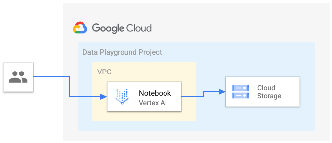

# Data Playground

This example creates a minimum viable template for a data experimentation project with the needed APIs enabled, basic VPC and Firewall set in place, GCS bucket and an AI notebook to get started.

This is the high level diagram:

## Managed resources and services

This sample creates several distinct groups of resources:

- projects
    - Service Project configured for GCE instances and GCS buckets
- networking
    - VPC network
    - One default subnet
    - Firewall rules for [SSH access via IAP](https://cloud.google.com/iap/docs/using-tcp-forwarding) and open communication within the VPC
- Vertex AI notebook
  - One Jupyter lab notebook instance with public access
- GCS
    - One bucket initial bucket

## Variables
| name                      | description                                                                                                                             | type        | required | default      |
| ------------------------- | --------------------------------------------------------------------------------------------------------------------------------------- | ----------- | -------- | ------------ |
| project\_id               | Project id, references existing project if \`project\_create\` is null.                                                                 | string      | ✓        |              |
| location                  | The location where resources will be deployed                                                                                           | string      |          | europe       |
| region                    | The region where resources will be deployed.                                                                                            | string      |          | europe-west1 |
| project\_create           | Provide values if project creation is needed, uses existing project if null. Parent format: folders/folder\_id or organizations/org\_id | object({…}) |          | null         |
| prefix                    | Unique prefix used for resource names. Not used for project if 'project\_create' is null.                                               | string      |          | dp           |
| service\_encryption\_keys | Cloud KMS to use to encrypt different services. Key location should match service region.                                               | object({…}) |          | null         |
| vpc\_config               | Parameters to create a simple VPC for the Data Playground                                                                               | object({…}) |          | {...}        |

## Outputs
| Name                                                                                                                                                  | Description             |
| ----------------------------------------------------------------------------------------------------------------------------------------------------- | ----------------------- |
| bucket  | GCS Bucket URL.         |
| project | Project id              |
| vpc                                                                                                                                                   | VPC Network name        |
| notebook                                                                                                                                              | Vertex AI notebook name |
