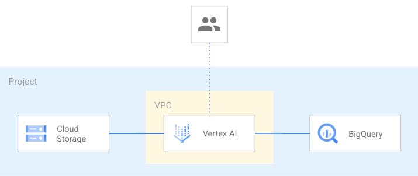

# Data Playground

This example creates a minimum viable template for a data experimentation project with the needed APIs enabled, basic VPC and Firewall set in place, BigQuesy dataset, GCS bucket and an AI notebook to get started.

This is the high level diagram:

## Managed resources and services

This sample creates several distinct groups of resources:

- project
- networking
    - VPC network with a default subnet and CloudNat
    - Firewall rules for [SSH access via IAP](https://cloud.google.com/iap/docs/using-tcp-forwarding) and open communication within the VPC
- Vertex AI Workbench notebook with a specialized Service Account
- One bucket bucket
- One BigQuery dataset
<!-- BEGIN TFDOC -->

## Variables

| name | description | type | required | default |
|---|---|:---:|:---:|:---:|
| [prefix](variables.tf#L36) | Unique prefix used for resource names. Not used for project if 'project_create' is null. | <code>string</code> | ✓ |  |
| [project_id](variables.tf#L22) | Project id, references existing project if `project_create` is null. | <code>string</code> | ✓ |  |
| [location](variables.tf#L16) | The location where resources will be deployed. | <code>string</code> |  | <code>&#34;EU&#34;</code> |
| [project_create](variables.tf#L27) | Provide values if project creation is needed, uses existing project if null. Parent format:  folders/folder_id or organizations/org_id | <code title="object&#40;&#123;&#10;  billing_account_id &#61; string&#10;  parent             &#61; string&#10;&#125;&#41;">object&#40;&#123;&#8230;&#125;&#41;</code> |  | <code>null</code> |
| [region](variables.tf#L41) | The region where resources will be deployed. | <code>string</code> |  | <code>&#34;europe-west1&#34;</code> |
| [vpc_config](variables.tf#L57) | Parameters to create a VPC. | <code title="object&#40;&#123;&#10;  ip_cidr_range &#61; string&#10;&#125;&#41;">object&#40;&#123;&#8230;&#125;&#41;</code> |  | <code title="&#123;&#10;  ip_cidr_range &#61; &#34;10.0.0.0&#47;20&#34;&#10;&#125;">&#123;&#8230;&#125;</code> |

## Outputs

| name | description | sensitive |
|---|---|:---:|
| [bucket](outputs.tf#L15) | GCS Bucket URL. |  |
| [notebook](outputs.tf#L20) | Vertex AI notebook details. |  |
| [project](outputs.tf#L28) | Project id |  |
| [vpc](outputs.tf#L33) | VPC Network |  |

<!-- END TFDOC -->
