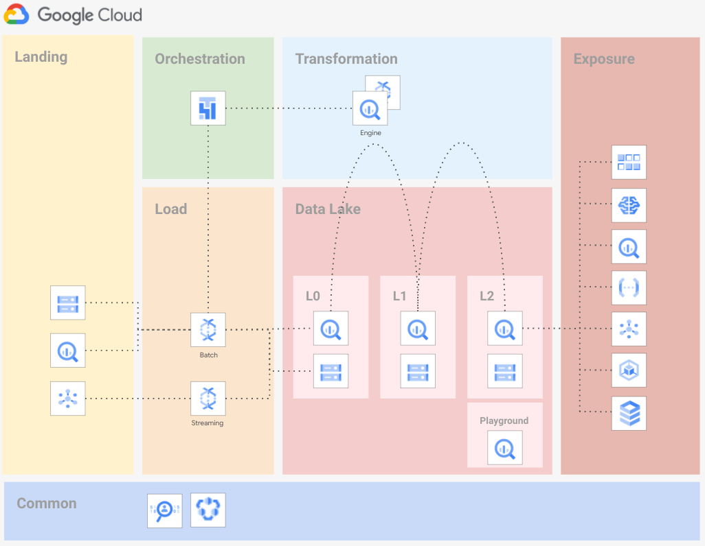
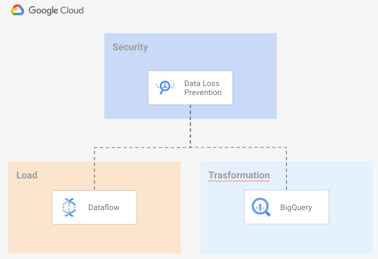

# Data Platform

This module implement an opinionated Data Platform (DP) Architecture that create and set up projects (and related resources) to be used for to create your data platform.

The code is intentionally simple, as it's intended to provide a generic initial setup (Networking, Security, etc.), and then allow easy customizations to complete the implementation of the intended hierarchy design.

The following diagram is a high level reference of the resources created and managed here:



# Design overview and choices
Despite its simplicity, this stage implements the basics of a design that we've seen working well for a variety of customers.

The approach adapts to different high level requirements: 
- boundaries for each step
- help identify actors
- help assign minimal roles

Additionally, a few critical benefits are directly provided by this design:
- adding a new set

## Project structure
The DP is designed to rely on several projects, one prj per data stage. This is done to better separate different stages of the data journey and rely on project level roles.

The following projects will be created:
* **Landing** This Project is intended to store data temporarily. Data are pushed to Cloud Storage, BigQuery or Cloud PubSub. Resource configured with 3 months lifecycle policy.

* **Load** This Project is intended to load data from `landing` to `data lake`. Load is made with minimal to zero transformation logic (mainly `cast`). Anonymization/tokenization/DLP PII data can be applied at this stage or in the transofmation stage depending on your requirements. The use of [Cloud Dataflow templates](https://cloud.google.com/dataflow/docs/concepts/dataflow-templates) is suggested.

* **Data Lake** Those projects is intended to store your data. It reppresents where data will be persisted within 3 Layers. These layers reppresent different stages where data is processed and progressivly refined
  * **L0 - Raw data** Structured Data, stored in adeguate format: structured data stored in bigquery, unstructured data stored on Cloud Storage with additional metadata stored in Bigquery (for example pictures stored in Cloud Storage and analysis of the picture for Cloud Vision API stored in Bigquery). 
  * **L1 - Cleansed, aggregated and standardized data**
  * **L2 - Curated layer**
  * **Experimental** Store temporary tables that Data Analyst may use to perform R&D on data available on other Data Lake layers
* **Orchestration** This project is inteded to host Cloud Composer. Cloud Composer will orchestrate all tasks to move your data on its journey.
* **Transformation** This project is intended to host resources to move data from one layer of the Data Lake to the other. We strongly suggest to rely on BigQuery engine to perform transformation. If Bigquery do not have the feature needed to perform your transformation you suggest to use Clud Dataflow.
* **Exposure** This project is intended to host resources to expose your data. To expose Bigquery data, we strongly suggest to rely on Authorized views. Other resources may better fit on particular data access pattern, example: Cloud SQL may be needed if you need to expose data with low latency, BigTable may be needed on use case where you need low latency to access data.

## Roles
We assigned roles on resources at Project level assigning the appropriate role to groups. We recommend not adding human users directly to the resource-access groups with IAM permissions to access data.

## Service accounts
Service Account creation follow the following principals:
- Each service account perform a single task aving access to the minimun number of resources (example: the Cloud Dataflow Service Account has access to the Landing project and to the Data Lake L0 project)
- Each Service Account has least privilage on each project.

### Service Account Keys
Service Account Keys (SAK) are out of scope for this example. The example implemented rely on Service Account Impersonification avoiding the creation of SAK.

The use of SAK within a data pipeline incurs several security risks, as these are physical credentials, matched to an automated system, that can be distributed without oversight or control. 

Whilst necessary in some scenarios, such as programmatic access from on-premise or alternative clouds, we recommend identify a structured process to mitigate risks associated with the use of service account keys.

## Groups
As default groups, we identified the following actors:
- *Data Engineers*: the group that handle and run the Data Hub. The group has Read access to all resources to be able to troubleshoot possible issue with the pipeline. The team has also the ability to impersonate all service accounts. Default value: `gcp-data-engineers@DOMAIN.COM`. 
- *Data Analyst*: the group that perform analysis on the dataset. The group has Read access to the Data Lake L2 project and Bigquery READ/WRITE access to the `experimental` project. Default value: `gcp-data-analyst@DOMAIN.COM`
- *Data Security*: the project that handle security features related to the Data Hub. Default name: `gcp-data-security@DOMAIN.com`
## VPC design
The DP except as input an existing Shared-VPC to run resources. You can configure subsets for DP resource specifying the link to the subnet in the `network_config` variable. You may want to configure a shared-VPC to run your resources in the case your pipelines may need to reach on-premise resources.

If `network_config` variable is not configured, the script will create a VPC on each project that require a VPC: *laod*, *trasformation* and *orchestration* projects with the default configuration.
## IP ranges, subnetting
To run your DP resources you need the following ranges:
- Load project VPC for Cloud Dataflow workers. Range: '/24'.
- Transformation VPC for Cloud Dataflow workers. Range: '/24'.
- Orchestration VPC for Cloud Composer:
  - Cloud SQL. Range: '/24'
  - GKE Master. Range: '/28'
  - Web Server: Range: '/28'
  - Secondary ip ranges. Pods range: '/22', Services range: '/24'  

## Resource naming convention
Reousces in the script use the following acronims:
 - `lnd` for `landing`
 - `lod` for `load`
 - `orc` for `orchestration`
 - `trf` for `trasformation`
 - `dtl` for `Data Lake`
 - 2 letters acronym for GCP products, example: `bq` for `Bigquery`, `df` for `Cloud Dataflow`, ...

Resources follow the naming convention described below.

Projects:
```
PREFIX-LAYER
```

Services:
```
PREFIX-LAYER[2]-GCP_PRODUCT[2]-COUNTER
```

Service Accounts:
```
PREFIX-LAYER[2]-GCP_PRODUCT[2]-COUNTER
```

## Encryption
We suggest a centralized approach to Keys management, to let the Security team be the only team that can access encryption material. Keyrings and Keys belongs to a project external to the DP. 


To configure the use of Cloud KMS on resources you have to specify key URL on the 'service_encryption_keys'. Key location should match the resource location. Example:

```
service_encryption_keys = {
    bq       = "KEY_URL_MULTIREGIONAL"
    composer = "KEY_URL_REGIONAL"
    dataflow = "KEY_URL_REGIONAL"
    storage  = "KEY_URL_MULTIREGIONAL"
    pubsub   = "KEY_URL_MULTIREGIONAL"
```

We consider this step optional, it depend on customer policy and security best practices.

# Data Anonymization
We suggest the use of Cloud Data Loss Prevention to identify/mask/tokenize your confidential data. The implementation of the Data Loss Prevention strategy is out of scope for this example. We enable the service in 2 different projects to let you implement the DLP strategy. We expect you will use DLP templates in one of the following way:
- During the ingestion phase, from Dataflow
- During the transformation phase, from BigQuery or Dataflow

We implemented a centralized model for Data Loss Prevention material. Templates will be stored in the security project:



# How to run this script
The Data Platform is meant to be executed by a Service Account (or a regular user) having this minial set of permission:
* **Org level**:
  * `"compute.organizations.enableXpnResource"`
  * `"compute.organizations.disableXpnResource"`
  * `"compute.subnetworks.setIamPolicy"`
* **Folder level**:
  * `"roles/logging.admin"`
  * `"roles/owner"`
  * `"roles/resourcemanager.folderAdmin"`
  * `"roles/resourcemanager.projectCreator"`
* **Cloud KMS Keys** (if Cloud KMS keys are configured):
  * `"roles/cloudkms.admin"` or Permissions: `cloudkms.cryptoKeys.getIamPolicy`, `cloudkms.cryptoKeys.list`, `cloudkms.cryptoKeys.setIamPolicy`
* **on the host project** for the Shared VPC/s
  * `"roles/browser"`
  * `"roles/compute.viewer"`
  * `"roles/dns.admin"`

# Variable configuration
There are three sets of variables you will need to fill in:

```
prefix             = "PRFX"
project_create = {
  parent             = "folders/123456789012"
  billing_account_id = "111111-222222-333333"
}
organization = {
  domain = "DOMAIN.com"
}
```

For a more fined grained configuration, check variables on [`variables.tf`](./variables.tf) and update accordingly to the desired configuration.

# Customizations
## Create Cloud KMS as part of the Data Platform
To create Cloud KMS keys within the Data Platform you can uncomment the Cloud KMS resources configuraed in the [`06-sec-main.tf`](./06-sec-main.tf) file and update KMS keys pointers on `local.service_encryption_keys.*` to the local resource created.

## Assign roles at BQ Dataset level
To handle multiple groups of `data-analyst` accessing the same Data Lake layer Projects but only to the dataset belonging to a specific group, you may want to assign roles at Bigquery dataset level instead of at project level. 
To do this, you need to remove IAM binging at Project level for the `data-analyst` group and assign roles at Bigquery dataset level using the `iam` variable on `bigquery-dataset` modules.

# Demo pipeline
The application layer is out of scope of this script, but as a demo, it is provided a Cloud Composer DAG to mode data from the `landing` area to `DataLake L2` dataset.

Just follow the commands you find in the `demo_commands` Terraform output, go in the Cloud Composer UI and run the `data_pipeline_dag`.

Description of commands:
- 01: copy sample data to `landing` storage bucket impersonating the `load` service account.
- 02: copy sample data structure definition in the `orchestration` storage bucket impersonating the `orchestration` service account.
- 03: copy the Cloud Composer DAG to Cloud Composer storage bucket impersonating the `orchestration` service account.
- 04: Open the Cloud Composer Airflow UI and run the imported DAG.
- 05: Run the Bigquery query to see results.
<!-- BEGIN TFDOC -->

## Variables

| name | description | type | required | default |
|---|---|:---:|:---:|:---:|
| [organization](variables.tf#L76) | Organization details. | <code title="object&#40;&#123;&#10;  domain &#61; string&#10;&#125;&#41;">object&#40;&#123;&#8230;&#125;&#41;</code> | ✓ |  |
| [prefix](variables.tf#L83) | Unique prefix used for resource names. Not used for project if 'project_create' is null. | <code>string</code> | ✓ |  |
| [composer_config](variables.tf#L17) |  | <code title="object&#40;&#123;&#10;  ip_range_cloudsql   &#61; string&#10;  ip_range_gke_master &#61; string&#10;  ip_range_web_server &#61; string&#10;  region              &#61; string&#10;  secondary_ip_range &#61; object&#40;&#123;&#10;    pods     &#61; string&#10;    services &#61; string&#10;  &#125;&#41;&#10;&#125;&#41;">object&#40;&#123;&#8230;&#125;&#41;</code> |  | <code title="&#123;&#10;  ip_range_cloudsql   &#61; &#34;10.20.10.0&#47;24&#34;&#10;  ip_range_gke_master &#61; &#34;10.20.11.0&#47;28&#34;&#10;  ip_range_web_server &#61; &#34;10.20.11.16&#47;28&#34;&#10;  region              &#61; &#34;europe-west1&#34;&#10;  secondary_ip_range &#61; &#123;&#10;    pods     &#61; &#34;10.10.8.0&#47;22&#34;&#10;    services &#61; &#34;10.10.12.0&#47;24&#34;&#10;  &#125;&#10;&#125;">&#123;&#8230;&#125;</code> |
| [data_force_destroy](variables.tf#L40) | Flag to set 'force_destroy' on data services like biguqery or cloud storage. | <code>bool</code> |  | <code>false</code> |
| [groups](variables.tf#L46) | Groups. | <code>map&#40;string&#41;</code> |  | <code title="&#123;&#10;  data-analysts  &#61; &#34;gcp-data-analysts&#34;&#10;  data-engineers &#61; &#34;gcp-data-engineers&#34;&#10;  data-security  &#61; &#34;gcp-data-security&#34;&#10;&#125;">&#123;&#8230;&#125;</code> |
| [location_config](variables.tf#L128) | Locations where resources will be deployed. Map to configure region and multiregion specs. | <code title="object&#40;&#123;&#10;  region       &#61; string&#10;  multi_region &#61; string&#10;&#125;&#41;">object&#40;&#123;&#8230;&#125;&#41;</code> |  | <code title="&#123;&#10;  region       &#61; &#34;europe-west1&#34;&#10;  multi_region &#61; &#34;eu&#34;&#10;&#125;">&#123;&#8230;&#125;</code> |
| [network_config](variables.tf#L56) | Shared VPC to use. If not null networks will be created in projects. | <code title="object&#40;&#123;&#10;  network &#61; string&#10;  vpc_subnet_range &#61; object&#40;&#123;&#10;    load           &#61; string&#10;    transformation &#61; string&#10;    orchestration  &#61; string&#10;  &#125;&#41;&#10;&#125;&#41;">object&#40;&#123;&#8230;&#125;&#41;</code> |  | <code title="&#123;&#10;  network &#61; null&#10;  vpc_subnet_range &#61; &#123;&#10;    load           &#61; &#34;10.10.0.0&#47;24&#34;&#10;    transformation &#61; &#34;10.10.0.0&#47;24&#34;&#10;    orchestration  &#61; &#34;10.10.0.0&#47;24&#34;&#10;  &#125;&#10;&#125;">&#123;&#8230;&#125;</code> |
| [project_create](variables.tf#L88) | Provide values if project creation is needed, uses existing project if null. Parent is in 'folders/nnn' or 'organizations/nnn' format. | <code title="object&#40;&#123;&#10;  billing_account_id &#61; string&#10;  parent             &#61; string&#10;&#125;&#41;">object&#40;&#123;&#8230;&#125;&#41;</code> |  | <code>null</code> |
| [project_id](variables.tf#L97) | Project id, references existing project if `project_create` is null. | <code title="object&#40;&#123;&#10;  landing       &#61; string&#10;  load          &#61; string&#10;  orchestration &#61; string&#10;  trasformation &#61; string&#10;  datalake      &#61; string&#10;  security      &#61; string&#10;&#125;&#41;">object&#40;&#123;&#8230;&#125;&#41;</code> |  | <code title="&#123;&#10;  landing       &#61; &#34;lnd&#34;&#10;  load          &#61; &#34;lod&#34;&#10;  orchestration &#61; &#34;orc&#34;&#10;  trasformation &#61; &#34;trf&#34;&#10;  datalake      &#61; &#34;dtl&#34;&#10;  security      &#61; &#34;sec&#34;&#10;&#125;">&#123;&#8230;&#125;</code> |
| [project_services](variables.tf#L117) | List of core services enabled on all projects. | <code>list&#40;string&#41;</code> |  | <code title="&#91;&#10;  &#34;cloudresourcemanager.googleapis.com&#34;,&#10;  &#34;iam.googleapis.com&#34;,&#10;  &#34;serviceusage.googleapis.com&#34;,&#10;  &#34;stackdriver.googleapis.com&#34;&#10;&#93;">&#91;&#8230;&#93;</code> |

## Outputs

| name | description | sensitive |
|---|---|:---:|
| [VPC](outputs.tf#L61) | VPC networks. |  |
| [bigquery-datasets](outputs.tf#L17) | BigQuery datasets. |  |
| [demo_commands](outputs.tf#L70) | Demo commands. |  |
| [gcs-buckets](outputs.tf#L28) | GCS buckets. |  |
| [kms_keys](outputs.tf#L42) | Cloud MKS keys. |  |
| [projects](outputs.tf#L47) | GCP Projects. |  |

<!-- END TFDOC -->
# TODOs
Features to add in futere releases:
 * Add support for Column level access on Bigquery
 * Add example templates for DataCatalog
 * Add example on how to use Cloud DLP
 * Add solution to handle Tables, Views and Authorized Views lifecycle
 * Add solution to handle Metadata lifecycle

# To Test/Fix
 * Composer require "Require OS Login" not enforced
 * External Shared-VPC