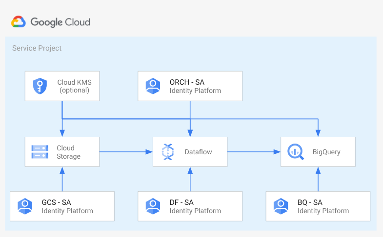

# Cloud Storage to Bigquery with Cloud Dataflow with least privileges

This example creates the infrastructure needed to run a [Cloud Dataflow](https://cloud.google.com/dataflow) pipeline to import data from [GCS](https://cloud.google.com/storage) to [Bigquery](https://cloud.google.com/bigquery). The example will create different service accounts with least privileges on resources. To run the pipeline, users listed in `data_eng_principals` can impersonate all those service accounts.

The solution will use:
 - internal IPs for GCE and Cloud Dataflow instances
 - Cloud NAT to let resources egress to the Internet, to run system updates and install packages
 - rely on [Service Account Impersonation](https://cloud.google.com/iam/docs/impersonating-service-accounts) to avoid the use of service account keys
 - Service Accounts with least privilege on each resource
 - (Optional) CMEK encription for GCS bucket, DataFlow instances and BigQuery tables
 
The example is designed to match real-world use cases with a minimum amount of resources and some compromise listed below. It can be used as a starting point for more complex scenarios.

This is the high level diagram:


## Move to real use case consideration
In the example we implemented some compromise to keep the example minimal and easy to read. On a real word use case, you may evaluate the option to:
 - Configure a Shared-VPC
 - Use only Identity Groups to assigne roles
 - Use Authorative IAM role assignement
 - Split resources in different project: Data Landing, Data Transformation, Data Lake, ...
 - Use VPC-SC to mitigate data exfiltration

## Managed resources and services

This sample creates several distinct groups of resources:

- projects
  - Service Project configured for GCS buckets, Dataflow instances and BigQuery tables and orchestration
- networking
  - VPC network
  - One subnet
  - Firewall rules for [SSH access via IAP](https://cloud.google.com/iap/docs/using-tcp-forwarding) and open communication within the VPC
- IAM
  - One service account for uploading data into the GCS landing bucket
  - One service account for Orchestration
  - One service account for Dataflow instances
  - One service account for Bigquery tables
- GCS
  - One bucket
- BQ
  - One dataset
  - One table. Tables are defined in Terraform for the porpuse of the example. Probably, in real scenario, would handle Tables creation in a separate Terraform State or using a different tool/pipeline (for example: Dataform).

In this example you can also configure users or group of user to assign them viewer role on the resources created and the ability to imprsonate service accounts to test dataflow pipelines before autometing them with Composer or any other orchestration systems.

## Deploy your enviroment

We assume the identiy running the following steps has the following role:
 - `resourcemanager.projectCreator` in case a new project will be created.
 - `owner` on the project in case you use an existing project. 

Run Terraform init:

```
$ terraform init
```

Configure the Terraform variable in your `terraform.tfvars` file. You need to spefify at least the following variables:

```
data_eng_principals = ["user:data-eng@domain.com"]
project_id      = "datalake-001"
prefix          = "prefix"
```

You can run now:

```
$ terraform apply
```

You should see the output of the Terraform script with resources created and some command pre-created for you to run the example following steps below.

## Test your environment with Cloud Dataflow

We assume all those steps are run using a user listed on `data_eng_principals`. You can authenticate as the user using the following command:

```
$ gcloud init
$ gcloud auth application-default login 
```

For the purpose of the example we will import from GCS to Bigquery a CSV file with the following structure:

```
name,surname,timestam
```

We need to create 3 file:
 - A `person.csv` file containing your data in the form `name,surname,timestam`. Here an example line `Lorenzo,Caggioni,1637771951'.
 - A `person_udf.js` containing the UDF javascript file used by the Dataflow template.
 - A `person_schema.json` file containing the table schema used to import the CSV.
 
You can find an example of those file in the folder `./data-demo`. You can copy the example files in the GCS bucket using the  command returned in the terraform output as `command-01-gcs`. Below an example:

```bash
gsutil -i gcs-landing@PROJECT.iam.gserviceaccount.com cp data-demo/* gs://LANDING_BUCKET
```

We can now run the Dataflow pipeline using the `gcloud` returned in the terraform output as `command-02-dataflow`. Below an example:

```bash
gcloud --impersonate-service-account=orch-test@PROJECT.iam.gserviceaccount.com dataflow jobs run test_batch_01 \
    --gcs-location gs://dataflow-templates/latest/GCS_Text_to_BigQuery \
    --project PROJECT \
    --region REGION \
    --disable-public-ips \
    --subnetwork https://www.googleapis.com/compute/v1/projects/PROJECT/regions/REGION/subnetworks/subnet \
    --staging-location gs://PREFIX-df-tmp \
    --service-account-email df-loading@PROJECT.iam.gserviceaccount.com \
    --parameters \
javascriptTextTransformFunctionName=transform,\
JSONPath=gs://PREFIX-data/person_schema.json,\
javascriptTextTransformGcsPath=gs://PREFIX-data/person_udf.js,\
inputFilePattern=gs://PREFIX-data/person.csv,\
outputTable=PROJECT:datalake.person,\
bigQueryLoadingTemporaryDirectory=gs://PREFIX-df-tmp 
```

You can check data imported into Google BigQuery using the  command returned in the terraform output as `command-03-bq`. Below an example:

```
bq query --use_legacy_sql=false 'SELECT * FROM `PROJECT.datalake.person` LIMIT 1000'
```
<!-- BEGIN TFDOC -->

## Variables

| name | description | type | required | default |
|---|---|:---:|:---:|:---:|
| [prefix](variables.tf#L26) | Unique prefix used for resource names. Not used for project if 'project_create' is null. | <code>string</code> | ✓ |  |
| [project_id](variables.tf#L40) | Project id, references existing project if `project_create` is null. | <code>string</code> | ✓ |  |
| [cmek_encryption](variables.tf#L15) | Flag to enable CMEK on GCP resources created. | <code>bool</code> |  | <code>false</code> |
| [data_eng_principals](variables.tf#L21) | Groups with Service Account Token creator role on service accounts in IAM format, eg 'group:group@domain.com'. | <code>list&#40;string&#41;</code> |  | <code>&#91;&#93;</code> |
| [project_create](variables.tf#L31) | Provide values if project creation is needed, uses existing project if null. Parent is in 'folders/nnn' or 'organizations/nnn' format | <code title="object&#40;&#123;&#10;  billing_account_id &#61; string&#10;  parent             &#61; string&#10;&#125;&#41;">object&#40;&#123;&#8230;&#125;&#41;</code> |  | <code>null</code> |
| [region](variables.tf#L45) | The region where resources will be deployed. | <code>string</code> |  | <code>&#34;europe-west1&#34;</code> |
| [vpc_subnet_range](variables.tf#L51) | Ip range used for the VPC subnet created for the example. | <code>string</code> |  | <code>&#34;10.0.0.0&#47;20&#34;</code> |

## Outputs

| name | description | sensitive |
|---|---|:---:|
| [bq_tables](outputs.tf#L15) | Bigquery Tables. |  |
| [buckets](outputs.tf#L20) | GCS bucket Cloud KMS crypto keys. |  |
| [command-01-gcs](outputs.tf#L43) | gcloud command to copy data into the created bucket impersonating the service account. |  |
| [command-02-dataflow](outputs.tf#L48) | Command to run Dataflow template impersonating the service account. |  |
| [command-03-bq](outputs.tf#L70) | BigQuery command to query imported data. |  |
| [project_id](outputs.tf#L28) | Project id. |  |
| [serviceaccount](outputs.tf#L33) | Service account. |  |

<!-- END TFDOC -->
