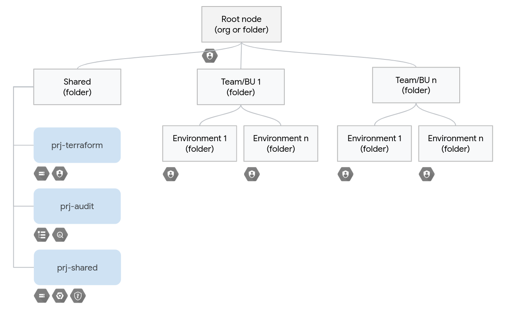

# Business-units based organizational sample

This sample creates an organizational layout with two folder levels, where the first level is usually mapped to one business unit or team (infra, data, analytics) and the second level represents environments (prod, test). It also sets up all prerequisites for automation (GCS state buckets, service accounts, etc.), and the correct roles on those to enforce separation of duties at the environment level.

This layout is well suited for medium-sized infrastructures managed by different sets of teams, and in cases where the core infrastructure is managed centrally, as the top-level automation service accounts for each environment allow cross-team management of the base resources (projects, IAM, etc.).

Refer to the [section-level README](../README.md) for general considerations about this type of samples, and usage instructions.

## Managed resources and services

This sample creates several distinct groups of resources:

- one top-level folder per business unit/team
- one top-level folder for shared services
- one second-level folder for each environment in all the business unit top-level folders
- one project in the shared folder to hold Terraform-related resources
- one project in the shared folder to set up and host centralized audit log exports
- one project in the shared folder to hold services used across environments like GCS, GCR, KMS, Cloud Build, etc.

The number of resources in this sample is kept to a minimum so as to make it generally applicable, more resources can be easily added by leveraging other [modules from our bundle](../../../modules/), or from other sources like the [CFT suite](https://github.com/terraform-google-modules).

## Shared services

This sample uses a top-level folder to encapsulate projects that host resources that are not specific to a single environment. If no shared services are needed,the Terraform and audit modules can be easily attached to the root node, and the shared services folder and project removed from `main.tf`.
<!-- BEGIN TFDOC -->

## Variables

| name | description | type | required | default |
|---|---|:---:|:---:|:---:|
| [billing_account_id](variables.tf#L27) | Billing account id used as default for new projects. | <code>string</code> | ✓ |  |
| [organization_id](variables.tf#L69) | Organization id in organizations/nnnnnnn format. | <code>string</code> | ✓ |  |
| [prefix](variables.tf#L74) | Prefix used for resources that need unique names. | <code>string</code> | ✓ |  |
| [root_node](variables.tf#L88) | Root node for the new hierarchy, either 'organizations/org_id' or 'folders/folder_id'. | <code>string</code> | ✓ |  |
| [audit_filter](variables.tf#L17) | Audit log filter used for the log sink. | <code>string</code> |  | <code title="&#34;&#10;logName: &#34;&#47;logs&#47;cloudaudit.googleapis.com&#37;2Factivity&#34;&#10;OR&#10;logName: &#34;&#47;logs&#47;cloudaudit.googleapis.com&#37;2Fsystem_event&#34;&#34;">&#8230;</code> |
| [environments](variables.tf#L32) | Environment short names. | <code>map&#40;string&#41;</code> |  | <code title="&#123;&#10;  dev  &#61; &#34;Development&#34;,&#10;  test &#61; &#34;Testing&#34;,&#10;  prod &#61; &#34;Production&#34;&#10;&#125;">&#123;&#8230;&#125;</code> |
| [gcs_defaults](variables.tf#L42) | Defaults use for the state GCS buckets. | <code>map&#40;string&#41;</code> |  | <code title="&#123;&#10;  location      &#61; &#34;EU&#34;&#10;  storage_class &#61; &#34;MULTI_REGIONAL&#34;&#10;&#125;">&#123;&#8230;&#125;</code> |
| [iam_audit_viewers](variables.tf#L51) | Audit project viewers, in IAM format. | <code>list&#40;string&#41;</code> |  | <code>&#91;&#93;</code> |
| [iam_shared_owners](variables.tf#L57) | Shared services project owners, in IAM format. | <code>list&#40;string&#41;</code> |  | <code>&#91;&#93;</code> |
| [iam_terraform_owners](variables.tf#L63) | Terraform project owners, in IAM format. | <code>list&#40;string&#41;</code> |  | <code>&#91;&#93;</code> |
| [project_services](variables.tf#L79) | Service APIs enabled by default in new projects. | <code>list&#40;string&#41;</code> |  | <code title="&#91;&#10;  &#34;container.googleapis.com&#34;,&#10;  &#34;stackdriver.googleapis.com&#34;,&#10;&#93;">&#91;&#8230;&#93;</code> |

## Outputs

| name | description | sensitive |
|---|---|:---:|
| [audit_logs_project](outputs.tf#L17) | Project that holds the audit logs export resources. |  |
| [bootstrap_tf_gcs_bucket](outputs.tf#L22) | GCS bucket used for the bootstrap Terraform state. |  |
| [bu_business_intelligence](outputs.tf#L27) | Business Intelligence attributes. |  |
| [bu_business_intelligence_keys](outputs.tf#L37) | Business Intelligence service account keys. | ✓ |
| [bu_machine_learning](outputs.tf#L43) | Machine Learning attributes. |  |
| [bu_machine_learning_keys](outputs.tf#L53) | Machine Learning service account keys. | ✓ |
| [shared_folder_id](outputs.tf#L59) | Shared folder id. |  |
| [shared_resources_project](outputs.tf#L64) | Project that holdes resources shared across business units. |  |
| [terraform_project](outputs.tf#L69) | Project that holds the base Terraform resources. |  |

<!-- END TFDOC -->
