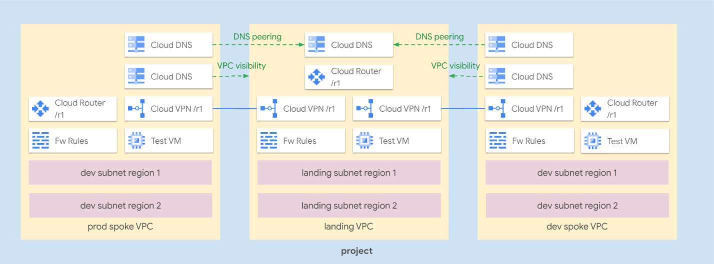

# Hub and Spoke via VPN

This example creates a simple **Hub and Spoke VPN** setup, where the VPC network connects satellite locations (spokes) through a single intermediary location (hub) via [IPsec HA VPN](https://cloud.google.com/network-connectivity/docs/vpn/concepts/overview#ha-vpn).

A few additional features are also shown:

- [custom BGP advertisements](https://cloud.google.com/router/docs/how-to/advertising-overview) to implement optional full mesh
- [VPC Global Routing](https://cloud.google.com/network-connectivity/docs/router/how-to/configuring-routing-mode) to use a regional set of VPN gateways from subnets in different regions (used here for illustrative purposes of course)
- [Cloud DNS Cross-Project bindings](https://cloud.google.com/dns/docs/zones/cross-project-binding) to delegate zone configuration without increasing DNS peering complexity

The example has been purposefully kept simple to show how to use and wire the VPC and VPN-HA modules together, and so that it can be used as a basis for more complex scenarios. This is the high level diagram:



## Managed resources and services

This sample creates several distinct groups of resources:

- one VPC for each hub and each spoke
- one set of firewall rules for each VPC
- one HA VPN gateway with two tunnels and one Cloud Router for each spoke
- two HA VPN gateways with two tunnels and a shared Cloud Routers for the hub
- one DNS private zone in the hub
- one DNS peering zone and one DNS private zone in each spoke
- one test instance for the hub each spoke

## Prerequisites

A single pre-existing project is used in this example to keep variables and complexity to a minimum, in a real world scenarios each spoke would probably use a separate project.

The provided project needs a valid billing account, the Compute and DNS APIs are enabled by the example.

You can easily create such a project by commenting the `project_create`variable and adding a billing account in `main.tf` as in this snippet:

```hcl
module "project" {
  source           = "../../..//modules/project"
  name             = var.project_id
  # project_create = false
  # add the following line and set your billing account id as a value
  billing_account  = "12345-ABCD-12345"
  services = [
    "compute.googleapis.com",
    "dns.googleapis.com"
  ]
  service_config = {
    disable_on_destroy         = false
    disable_dependent_services = false
  }
}
```

## Testing

Once the example is up, you can quickly test features by logging in to one of the test VMs:

```bash
gcloud compute ssh hs-ha-land-test-r1
# test DNS resolution of the landing zone
ping test-r1.example.com
# test DNS resolution of the prod zone, and prod reachability
ping test-r1.prod.example.com
# test DNS resolution of the dev zone, and dev reachability via global routing
ping test-r2.dev.example.com
```

<!-- BEGIN TFDOC -->

## Variables

| name | description | type | required | default |
|---|---|:---:|:---:|:---:|
| [project_id](variables.tf#L40) | Project id for all resources. | <code>string</code> | ✓ |  |
| [ip_ranges](variables.tf#L15) | Subnet IP CIDR ranges. | <code>map&#40;string&#41;</code> |  | <code title="&#123;&#10;  land-0-r1 &#61; &#34;10.0.0.0&#47;24&#34;&#10;  land-0-r2 &#61; &#34;10.0.8.0&#47;24&#34;&#10;  dev-0-r1  &#61; &#34;10.0.16.0&#47;24&#34;&#10;  dev-0-r2  &#61; &#34;10.0.24.0&#47;24&#34;&#10;  prod-0-r1 &#61; &#34;10.0.32.0&#47;24&#34;&#10;  prod-0-r2 &#61; &#34;10.0.40.0&#47;24&#34;&#10;&#125;">&#123;&#8230;&#125;</code> |
| [ip_secondary_ranges](variables.tf#L28) | Subnet secondary ranges. | <code>map&#40;map&#40;string&#41;&#41;</code> |  | <code>&#123;&#125;</code> |
| [prefix](variables.tf#L34) | Prefix used in resource names. | <code>string</code> |  | <code>null</code> |
| [regions](variables.tf#L45) | VPC regions. | <code>map&#40;string&#41;</code> |  | <code title="&#123;&#10;  r1 &#61; &#34;europe-west1&#34;&#10;  r2 &#61; &#34;europe-west4&#34;&#10;&#125;">&#123;&#8230;&#125;</code> |
| [vpn_configs](variables.tf#L54) | VPN configurations. | <code title="map&#40;object&#40;&#123;&#10;  asn           &#61; number&#10;  custom_ranges &#61; map&#40;string&#41;&#10;&#125;&#41;&#41;">map&#40;object&#40;&#123;&#8230;&#125;&#41;&#41;</code> |  | <code title="&#123;&#10;  land-r1 &#61; &#123;&#10;    asn &#61; 64513&#10;    custom_ranges &#61; &#123;&#10;      &#34;10.0.0.0&#47;8&#34; &#61; &#34;internal default&#34;&#10;    &#125;&#10;  &#125;&#10;  dev-r1 &#61; &#123;&#10;    asn           &#61; 64514&#10;    custom_ranges &#61; null&#10;  &#125;&#10;  prod-r1 &#61; &#123;&#10;    asn           &#61; 64515&#10;    custom_ranges &#61; null&#10;  &#125;&#10;&#125;">&#123;&#8230;&#125;</code> |

<!-- END TFDOC -->
