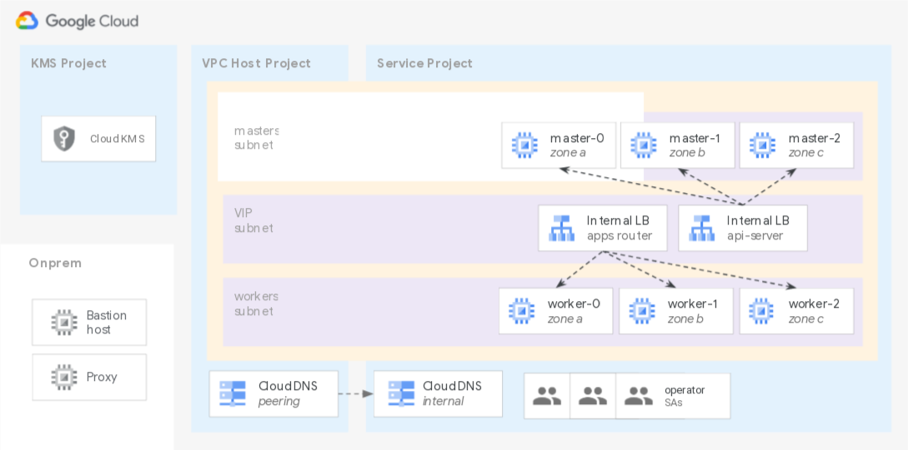

# Third Party Solutions

The examples in this folder show how to automate installation of specific third party products on GCP, following typical best practices.

## Examples

### OpenShift cluster bootstrap on Shared VPC

 This [example](./openshift/) shows how to quickly bootstrap an OpenShift 4.7 cluster on GCP, using typical enterprise features like Shared VPC and CMEK for instance disks.
