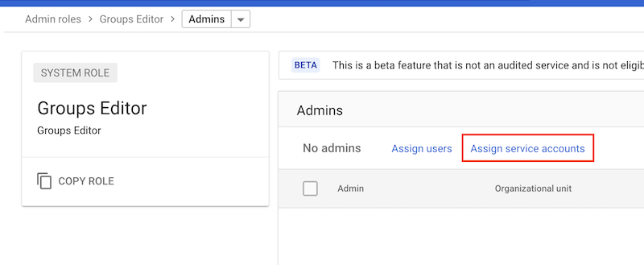

# Fabric Project Press

## Before installation

Before installation, consider the following questions:

1. Am I ok with managing project groups in Cloud Identity only? (If you want to manage
   your project groups and their memberships in an external IAM system (like Active
   Directory), you will have to pre-provision the groups)

2. What's my project naming format? (prefix, suffix, etc) 

3. Will I centralize my project creation or do I want to have independent business units 
   managing their own projects? 

4. Which environments do I need? (production, nonproduction, dev, staging, qa, etc.)

## Installation

The project factory consists of several different parts:

  - Project creation through YAML-based project definitions
  - Management of Cloud Identity groups and IAM permissions for project specific groups
  - Project schema validation, commit validation
  - (Gitlab/Github project creation)
  - Sample pipelines for Gitlab and GitHub Actions

## Overview of installation

The installation is done in steps:

  1. Setting up the organization: prepare folders, groups, Shared VPC host projects, monitoring projects 
     (a good way to achieve this is [Fabric's foundations](https://github.com/terraform-google-modules/cloud-foundation-fabric/tree/master/foundations)).

  2. Creating Project Factory service account and associated privileges.

  3. Configuring Terraform related things, like storage bucket for Terraform state

  4. Configuring the Project Factory's `config.yaml` file with the details of your organization.

  5. Creating an initial project request.

  6. Running Terraform locally with the service account to bootstrap the first project.

  7. Importing the code into a source code repository and configuring the pipeline.
  
  8. Build the CI/CD build container. 

## Setting up the organisation

This Project Factory has been designed around a per business unit per environment
hub and spoke model, but can be adapted to work for different models as well (advanced
setup). If you are setting up a hub and spoke architecture, make sure you have
these created up front:

- Hub and spoke projects with Shared VPCs that are peered via VPC Peering or VPNs
- Monitoring projects (either per environment, like prod and nonprod, or per spoke, or
  per spoke per environment)

For certain features to work (namely automatic group and IAM management), you'll want to 
set up two sets of groups:

- Shared VPC access groups, per folder per environment (ie. `ppress-svpc-folder-nonprod@ppress.project`)
- Serverless VPC access groups, per folder per environment (ie. `ppress-serverless-folder-nonprod@ppress.project`)
- Monitoring groups, per environment (`ppress-monitoring-nonprod@ppress.project`)

For the Shared VPC access groups, give them the permissions `Compute Network User` and `Compute Viewer``
in their respective Shared VPC host projects.

For the Serverless VPC groups, give them the permission `Serverless VPC Access User` in the their respective
Shared VPC host projects (or the projects which are hosting the VPC projects that host the Serverless VPC
connectors).

For the monitoring groups, give them the permissions (just an example set of permissions) `Monitoring AlertPolicy Editor`,
`Monitoring Dashboard Configuration Editor`, `Monitoring NotificationChannel Editor`, `Monitoring Services Editor`, 
and `Monitoring Viewer` in the respective monitoring projects.

If you don't set up some of these groups, please leave them set to empty (`""`) in `config.yaml`.

## Configuration pieces

## Setup process

1. Set up the Terraform seed project and backend bucket
2. Set up the Project Factory service account (see below)
3. Copy `config-example.yaml` to `config.yaml` and change the settings according to your environment.
4. Copy `project-example.yaml` into `projects/YOUR-PROJECT.yaml` and change according to the project you want to create.
5. If you are bootstrapping the project from your machine, install the Python dependencies: `pip3 install --user -r scripts/requirements.txt`
6. Change to `terraform` directory and run `terraform init`.
7. Run `terraform plan` and verify everything looks good.
8. Run `terraform apply` to create the project.
9. Integrate into CI/CD system by looking at the examples in `cloudbuild.yaml` and `.gitlab-ci.yml`. 

## Project factory service account

⚠️ Warning: The project factory service account is highly privileged. Please take the utmost care to protect it.

### One Project Factory per organization

You can use Cloud Shell for example to set the initial service account first. Let's some variables in the shell first:

```sh
export ORGANIZATION_ID=1234567890         # Your organization ID
export TF_SEED_PROJECT=your-project-id    # Your Terraform seed project (will host the service account)
export SA_NAME=ppress-project-factory      # Set the name for the service account
```

Then create the service account and add it the necessary permissions. Please note that you can customize these privileges
to grant less privileges or to enable a service account per folder tree.

```sh
gcloud iam service-accounts create $SA_NAME --project $TF_SEED_PROJECT
gcloud iam service-accounts add-iam-policy-binding $SA_NAME@$TF_SEED_PROJECT.iam.gserviceaccount.com --member=serviceAccount:$SA_NAME@$TF_SEED_PROJECT.iam.gserviceaccount.com --role=roles/iam.serviceAccountTokenCreator

for role in roles/billing.admin roles/resourcemanager.projectCreator roles/resourcemanager.folderViewer roles/resourcemanager.folderMover roles/orgpolicy.policyAdmin roles/accesscontextmanager.policyAdmin roles/compute.xpnAdmin
do
  gcloud organizations add-iam-policy-binding $ORGANIZATION_ID --member=serviceAccount:$SA_NAME@$TF_SEED_PROJECT.iam.gserviceaccount.com --role=$role
done
```

If you are using Pub/Sub notifications for billing, add Pub/Sub editor to service account in the project containing the 
Pub/Sub topics:

```sh
gcloud projects add-iam-policy-binding your-billing-project --member=serviceAccount:$SA_NAME@$TF_SEED_PROJECT.iam.gserviceaccount.com --role=roles/pubsub.editor
```

If you are using Pub/Sub notifications for recommendations reports, add Pub/Sub editor and Cloud Scheduler Admin to service account in the project containing the 
Pub/Sub topics (please see [additional setup instructions](https://cloud.google.com/scheduler/docs/setup) for Cloud Scheduler): 

```sh
gcloud projects add-iam-policy-binding your-recommendations-report-project --member=serviceAccount:$SA_NAME@$TF_SEED_PROJECT.iam.gserviceaccount.com --role=roles/pubsub.editor
gcloud projects add-iam-policy-binding $TF_SEED_PROJECT --member=serviceAccount:$SA_NAME@$TF_SEED_PROJECT.iam.gserviceaccount.com --role=roles/cloudscheduler.admin
```

Enable some required APIs:
```sh
gcloud services enable cloudresourcemanager.googleapis.com --project $TF_SEED_PROJECT
gcloud services enable admin.googleapis.com --project $TF_SEED_PROJECT
gcloud services enable iam.googleapis.com --project $TF_SEED_PROJECT
gcloud services enable iamcredentials.googleapis.com --project $TF_SEED_PROJECT
gcloud services enable cloudbilling.googleapis.com --project $TF_SEED_PROJECT
gcloud services enable cloudidentity.googleapis.com --project $TF_SEED_PROJECT
gcloud services enable groupssettings.googleapis.com --project $TF_SEED_PROJECT
gcloud services enable stackdriver.googleapis.com --project $TF_SEED_PROJECT
gcloud services enable monitoring.googleapis.com --project $TF_SEED_PROJECT
gcloud services enable cloudscheduler.googleapis.com --project $TF_SEED_PROJECT
gcloud services enable serviceusage.googleapis.com --project $TF_SEED_PROJECT
gcloud services enable essentialcontacts.googleapis.com --project $TF_SEED_PROJECT
```

#### Setting up Cloud Identity Groups permission via UI

You can add the service account the `Groups Administrator` role via `admin.google.com` > Account > Admin roles > Groups Administrator > Assign service account. This is the recommended approach. 



#### Setting up Cloud Identity Groups permission via API

In the Cloud Console under IAM > Service Accounts, find the service account you created in the previous step and make a note of the `Unique ID` (a number).

Navigate to: https://developers.google.com/admin-sdk/directory/v1/reference/roles/list?apix_params=%7B%22customer%22%3A%22my_customer%22%7D&apix=true

Replace `my-customer` with your Cloud Identity customer ID. Run the API call and find the `roleId` (a number) for `Groups Administrator`.

Navigate to: https://developers.google.com/admin-sdk/directory/v1/reference/roleAssignments/insert

Replace `customer` with your Cloud Identity customer ID. Add the following fields to the request body:
- `roleId` from the previous step (add quotes around the roleId, even though the API explorer will complain)
- `scopeType` to `CUSTOMER`
- `assignedTo` to the service account Unique ID

To automatically add your projects into Stackdriver monitoring workspaces, you'll need your Terraform seed project
whitelisted. Please contact your Google representative to facilitate that. In addition, you'll need to create a 
separate API key.

In the Cloud Console, navigate to APIs & Services > Credentials. Click Create credentials and select API key.
*Restrict the key* to Stackdriver API only. 

Grant the service account permissions to manage monitoring in the monitoring projects:
```sh
export MONITORING_PROJECTS="your-monitoring-prod your-monitoring-nonprod"

for project in $MONITORING_PROJECTS
do
    gcloud projects add-iam-policy-binding $project --member=serviceAccount:$SA_NAME@$TF_SEED_PROJECT.iam.gserviceaccount.com --role=roles/monitoring.metricsScopesAdmin 
    gcloud projects add-iam-policy-binding $project --member=serviceAccount:$SA_NAME@$TF_SEED_PROJECT.iam.gserviceaccount.com --role=roles/monitoring.admin
done
```

### Multiple Project Factories per organization

If you want to have multiple Project Factories deployed (for example, one per subsidiary folder), you can create
multiple service accounts. Repeat the service account creation above per folder and assign the following
permissions:

```sh
export FOLDER_ID=1234567

# These roles must be set on an organizational level
for role in roles/billing.admin roles/orgpolicy.policyAdmin roles/accesscontextmanager.policyAdmin roles/compute.xpnAdmin
do
  gcloud organizations add-iam-policy-binding $ORGANIZATION_ID --member=serviceAccount:$SA_NAME@$TF_SEED_PROJECT.iam.gserviceaccount.com --role=$role
done

for role in roles/resourcemanager.projectCreator roles/iam.serviceAccountAdmin roles/serviceusage.serviceUsageAdmin
do
  gcloud resource-manager folders add-iam-policy-binding $FOLDER_ID --member=serviceAccount:$SA_NAME@$TF_SEED_PROJECT.iam.gserviceaccount.com --role=$role
done

export SHARED_VPC_PROJECTS="svpc-folder-nonprod svpc-folder-prod"
for project in $SHARED_VPC_PROJECTS 
do
  for role in roles/viewer
  do
    gcloud projects add-iam-policy-binding $project --member=serviceAccount:$SA_NAME@$TF_SEED_PROJECT.iam.gserviceaccount.com --role=$role
  done
done
```

Remember to grant permissions to the Stackdriver projects and Pub/sub similarly as above.

*Please note:* if you don't want to have the folder-level accounts permissions to create global
groups, you'll need to grant custom Groups Administrator role to the service accounts. For
more information, see: https://support.google.com/a/answer/6129577


## Terraform backend bucket

### One Project Factory per organization

Create a new storage bucket (in this example, we'll call it `ppress-project-factory-bucket`) using either
the console or a `gsutil mb`. Select uniform IAM privileges for the bucket and preferably a multi-regional
location.

Grant the project factory service account permissions to the bucket:
```sh
gsutil iam ch serviceAccount:$SA_NAME@$TF_SEED_PROJECT.iam.gserviceaccount.com:objectAdmin gs://ppress-project-factory-bucket
```

### Multiple Project Factories per organization

For multiple organizations, you can should create multiple buckets for each of the folder-level service
accounts and manage permissions to them by service account (ie. reporting above permission assignment
per service account).

## Helper scripts

In `scripts/` directory you can find multiple helper scripts for CI/CD pipelines.

- `validate-project.py`: checks project YAML file syntax
- `validate-changes.py`: validates the difference between original and modified project YAML file
- `validate-plan.py`: checks Terraform plan for deletions
- `generate-gitlab-configuration.sh`: Generates a Gitlab configuration file.
- `git-original-files.sh`: Tries to find files from beginning of a branch and current HEAD for `validate-changes.py` script.

## Gitlab

Gitlab pipeline is available in `.gitlab-ci.yml`. 

Also add your Gitlab API project token to a environment variable called `GITLAB_ACCESS_TOKEN`.

The Gitlab pipeline uses a build container with preinstalled `gcloud`, `terraform` and necessary
Python dependencies. The pipeline builds the container automatically when the `scripts/Dockerfile`
is changed. You can host the builder image on GCR or Gitlab's own repository. Add the location
for the build container in an environment variable called `BUILD_CONTAINER` (eg.
`gcr.io/<YOUR-GCR-PROJECT>/project-factory:latest`).

The Project Factory service account needs to be granted access to the GCR registry:

```sh
gsutil iam ch serviceAccount:$SA_NAME@$TF_SEED_PROJECT.iam.gserviceaccount.com:admin gs://artifacts.<YOUR-GCR-PROJECT>.appspot.com

# Or for regional GCR endpoints, like eu.gcr.io:
gsutil iam ch serviceAccount:$SA_NAME@$TF_SEED_PROJECT.iam.gserviceaccount.com:admin gs://<STORAGE-REGION>.artifacts.<YOUR-GCR-PROJECT>.appspot.com
```

If you want to leverage the Gitlab runner deployment functionality, you'll need to grant the ppress
Project Factory service account the rights to deploy to your Gitlab (or Gitlab runner) cluster and
create the necessary roles and role bindings:

```sh
export GITLAB_CLUSTER_PROJECT=<project>
gcloud projects add-iam-policy-binding $GITLAB_CLUSTER_PROJECT --member=serviceAccount:$SA_NAME@$TF_SEED_PROJECT.iam.gserviceaccount.com --role=rroles/container.admin
```

## GitHub

GitHub pipeline is available in `.github/workflows/ci.yml`.
