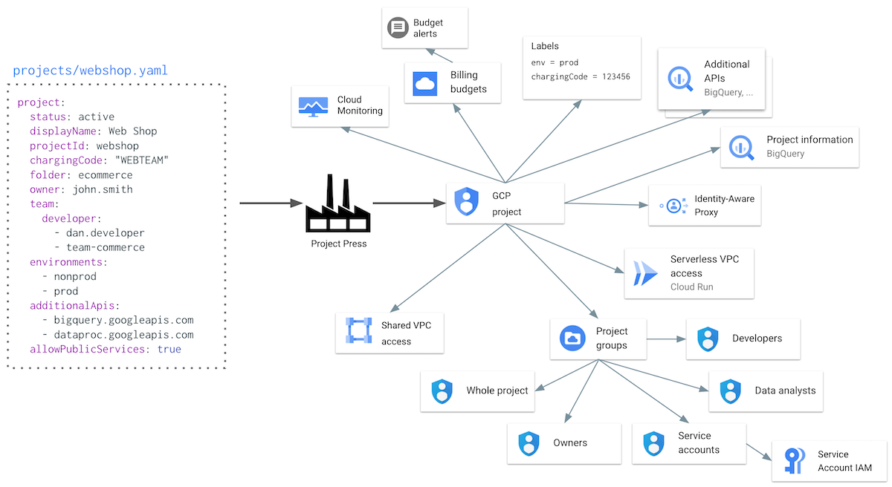
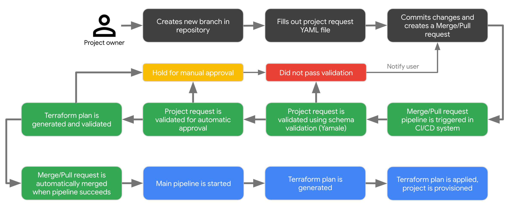

  

# Cloud Foundation Fabric: Project Press

## Project Factory

The Fabric Project Press consists of Terraform implementation of an end-to-end method of 
provisioning new GCP projects. The project factory contains the following features:

  1. Provisioning a GCP project with a project ID which is automatically augmented with the necessary 
   organisation specific suffixes and postfixes
  2. Attaching the billing account to the project
  3. Attaching pre-defined and project-level labels to a project. Note: this does not include 
     anything other than rudimentary format validation of those labels.
  4. Placing the project under the correct folder for the environment
  5. Activating a set of default APIs (and any specific additional APIs) in the project
  6. Adjusting the IAM privileges of default service accounts to least privileges (or other
     configured permissions)
  7. Sharing the correct Shared VPC into the project (however it's not necessary to use 
     a Shared VPC)
  8. Adding Cloud Run/Cloud Functions service accounts to Serverless VPC access groups.
  9. Setting up billing budgets and alerts according to either a predefined budget or a 
     project-specific budget
  10. Creating project-specific groups for different role types (ie. developers, data-analysts, 
      system administrators, etc)
  11. Create convenience group for all project groups (aka "main group"), owners and service accounts)
  12. Join the project-specific groups to Shared VPC and monitoring groups
  13. Granting the project specific groups the desired set of IAM privileges in 
      the project
  14. Adding the project to the correct Cloud Monitoring metric scope
  15. For services exposing public services, placing organisational policy overrides 
      on the project (like allowing external IPs)
  16. Configuring Identity-Aware Proxy consent screen (including support email group) 
      if defined in project
  17. Configure project-wide common metadata (eg. OS Login)
  18. Manage Essential Contacts for the project (people who receive project related
      email communications)
  19. Place project in desired VPC-SC perimeters
  20. Create high-privileged service accounts in the projects from predefined service account roles
  21. Writing information on all projects to BigQuery dataset

Additionally the following features are provided as scripts to facilitate deployment of 
the project factory as part of a CI/CD pipeline:

  - Project definition YAML file schema validation
    - Prevents human errors
  - Project auto-approval schema validation
    - Allows "known good" projects to be automatically approved
  - Project change validation
    - Allow implementation of guardrails when project settings are changed (such as changing project 
      from not allowing public services to allowing public services or changing project owner)
  - Terraform plan validation
    - Guards against mistakes and misconfigurations by checking the Terraform plan for any 
      offending deletion operations
  - GitHub and Gitlab support

## Project request process

## The directory structure 

| Directory | Description |
| ---       | ---         |
| [projects/](projects/) | Where project request files are placed |
| [scripts/](scripts/) | Helper scripts for CI/CD pipelines |
| [modules/main/](modules/main/) | Main Terraform module |
| [modules/](modules/) | Terraform submodules |
| [modules/project/](modules/project/) | Submodule: Provisions the project |
| [modules/groups/](modules/groups/) | Submodule: Provisions the project groups | 
| [modules/iam/](modules/iam/) | Submodule: Attaches permissions to the project groups (or existing groups) |
| [modules/shared-vpc/](modules/shared-vpc/) | Submodule: Attaches the Shared VPC host project to the provisioned service project |
| [modules/monitoring/](modules/monitoring/) | Submodule: Adds project to the correct Stackdriver workspace and user groups |
| [modules/default-sa/](modules/default-sa/) | Submodule: Adds the defined permissions back into the project service accounts |
| [modules/sa-group/](modules/sa-group/) | Submodule: Manages the Cloud Identity group service accounts |
| [modules/iap/](modules/iap/) | Submodule: Manages the Identity-Aware Proxy configuration |
| [modules/public-services/](modules/public-services/) | Submodule:  Grants exceptions for the project for defined organisational policies when project has been defined to expose public facing services |

The project factory also includes a fully fledged pipeline for Gitlab and a simpler example for Cloud Build.

## Configuration files

The configuration files are:

  - [`config.yaml`](config/config-example.yaml) for main configuration (see `config-example.yaml`)
  - [`projectSchema.yaml`](config/projectSchema.yaml) for project schema overall validation
  - [`projectSchemaHelp.yaml`](config/projectSchemaHelp.yaml) for project schema help when something fails
  - [`projectSchemaAutoApprove.yaml`](config/projectSchemaAutoApprove.yaml) for automatic approval validation
  - [`projectSchemaHoldApproval.yaml`](config/projectSchemaHoldApproval.yaml) for project definition modifications
  - [`projectApprovedApis.yaml`](config/projectApprovedApis.yaml) for approved Cloud APIs 
  - [`projectServiceAccountPermissions.yaml`](config/projectServiceAccountPermissions.yaml) for approved `additionalIamPermissions` for service accounts
  - [`projects/project-id.yaml`](config/project-example.yaml) for project configurations (see `project-example.yaml`)
  - [`.gitlab-ci.yml`](.gitlab-ci.yml) for Gitlab pipeline
  - [`.github`](.github/) for GitHub Actions workflows
  
## Concepts

### Environment

An environment in Project Factory is usually mapped to an entity like `dev`, `nonprod`, `qa`,
`stg` or `prod`. When a project request is created, the environments are specified in
which the project should be provisioned in. 

### Configuration per environment

Many variables, like folders and Shared VPCs, are configured per-environment basis to
facilitate the project factory working in a hub-and-spoke model. However, you can 
configure all the variables for different environments to be the same if you are
not using a hub-and-spoke model. 

For some parameters, you can disable the functionality by defining an empty
value (`""`). 

### Managing groups and group memberships

Project Factory is built around the idea that it will manage the Cloud Identity
groups and their memberships completely. However, if you are managing all your
CI groups via federation from another system like Active Directory or Azure AD,
you can also have Project Factory only assign permissions to pre-provisioned
groups. Please note that the groups have to be provisioned in Cloud Identity
BEFORE a project is created.

### On label validation

The Project Factory performs some rudimentary label validation:

  - Labels defined in the project request file are checked for compliance to GCP labeling 
    rules (length, alphanumeric characters, etc) when the project is validated using the 
    projectSchema.yaml and validate-project.py.
  - Enforced labels defined in the config.yaml are not validated, but some transformations 
    are applied (such as %owner% is lowercased, @ characters are transformed to _at_ and periods 
    are changed to dashes).
    
Additional label validation can be added by adding custom validators (which are defined 
in scripts/validator.py).

## Setup process

For installation process, see [INSTALL.md](INSTALL.md).
