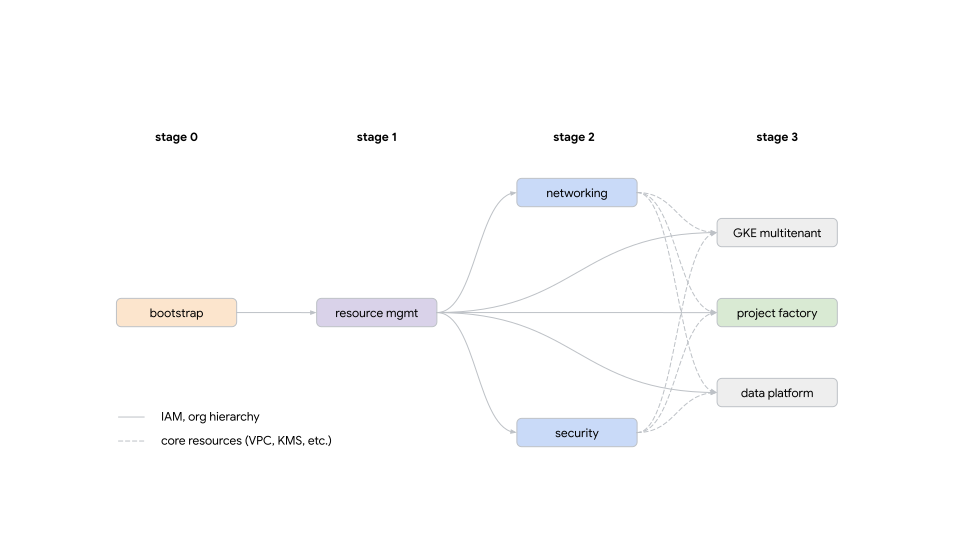
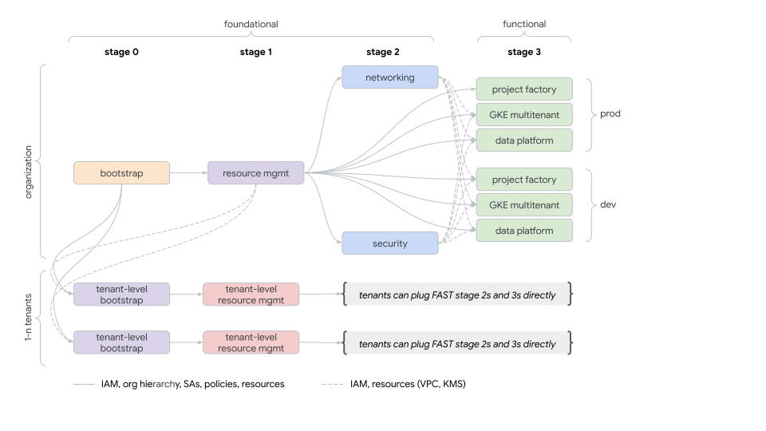

# Fabric FAST

Setting up a production-ready GCP organization is often a time-consuming process. Fabric FAST aims to speed up this process via two complementary goals. On the one hand, FAST provides a design of a GCP organization that includes the typical elements required by enterprise customers. Secondly, we provide a reference implementation of the FAST design using Terraform.

Note that while our implementation is necessarily influenced (and constrained) by the way Terraform works, the design we put forward only refers to GCP constructs and features. In other words, while we use Terraform for our reference implementation, in theory, the FAST design can be implemented using any other tool (e.g., Pulumi, bash scripts, or even calling the relevant APIs directly).

Fabric FAST comes from engineers in Google Cloud's Professional Services Organization, with a combined experience of decades solving the typical technical problems faced by GCP customers. While every GCP user has specific requirements, many common issues arise repeatedly. Solving those issues correctly from the beginning is key to a robust and scalable GCP setup. It's those common issues and their solutions that Fabric FAST aims to collect and present coherently.

Fabric FAST was initially conceived to help enterprises quickly set up a GCP organization following battle-tested and widely-used patterns. Despite its origin in enterprise environments, FAST includes many customization points making it an ideal blueprint for organizations of all sizes, ranging from startups to the largest companies.

## Guiding principles

### Contracts and stages

FAST uses the concept of stages, which individually perform precise tasks but taken together build a functional, ready-to-use GCP organization. More importantly, stages are modeled around the security boundaries that typically appear in mature organizations. This arrangement allows delegating ownership of each stage to the team responsible for the types of resources it manages. For example, as its name suggests, the networking stage sets up all the networking elements and is usually the responsibility of a dedicated networking team within the organization.

From the perspective of FAST's overall design, stages also work as contacts or interfaces, defining a set of pre-requisites and inputs required to perform their designed task and generating outputs needed by other stages lower in the chain. The diagram below shows the relationships between stages.

  

Please refer to the [stages](./stages/) section for further details on each stage. For details on tenant-level stages which introduce a deeper level of autonomy via nested FAST setups rooted in a top-level folder, refer to the [multitenant stages](#multitenant-organizations) section below.

### Security-first design

Security was, from the beginning, one of the most critical elements in the design of Fabric FAST. Many of FAST's design decisions aim to build the foundations of a secure organization. In fact, the first stage deals mainly with the organization-wide security setup, and the second stage partitions the organization hierarchy and puts guardrails in place for each hierarchy branch.

FAST also aims to minimize the number of permissions granted to principals according to the security-first approach previously mentioned. We achieve this through the meticulous use of groups, service accounts, custom roles, and [Cloud IAM Conditions](https://cloud.google.com/iam/docs/conditions-overview), among other things.

### Extensive use of factories

A resource factory consumes a simple representation of a resource (e.g., in YAML) and deploys it (e.g., using Terraform). Used correctly, factories can help decrease the management overhead of large-scale infrastructure deployments. See "[Resource Factories: A descriptive approach to Terraform](https://medium.com/google-cloud/resource-factories-a-descriptive-approach-to-terraform-581b3ebb59c)" for more details and the rationale behind factories.

FAST uses YAML-based factories to deploy subnets and firewall rules and, as its name suggests, in the [project factory](./stages/3-project-factory/) stage.

### CI/CD

One of our objectives with FAST is to provide a lightweight reference design for the IaC repositories, and a built-in implementation for running our code in automated pipelines. Our CI/CD approach leverages [Workload Identity Federation](https://cloud.google.com/iam/docs/workload-identity-federation), and provides sample workflow configurations for several major providers. Refer to the [CI/CD section in the bootstrap stage](./stages/0-bootstrap/README.md#cicd) for more details. We also provide separate [optional small stages](./extras/) to help you configure your CI/CD provider.

### Multitenant organizations

FAST has built-in support for two types of multitenancy implemented in [stage 1](stages/1-resman/README.md):

- lightweight tenants that need extensive control over part of the organizational hierarchy, including potential use of their own billing account
- complex tenants that need to behave like their own landing zone inside a shared GCP organization

The first approach allows easy creation of branches with loose guardrails in place and wide control over their resources, and is suited where tenants implement highly specialized, custom architectures and don't need FAST compliance inside their own branch.

The second approach is used when tenants need to behave as their own landing zone, and direct use of FAST stage 2s and 3s inside the tenant space is desired to achieve a full Landing Zone for each tenant. This approach leverages [dedicated stages](stages-multitenant) for tenant-level bootstrap and resource management that are run after organization-wide bootstrap and resource management. The diagram below shows the relationships between organization-level and tenant-level stages.

  

## Implementation

There are many decisions and tasks required to convert an empty GCP organization to one that can host production environments safely. Arguably, FAST could expose those decisions as configuration options to allow for different outcomes. However, supporting all the possible combinations is almost impossible and leads to code which is hard to maintain efficiently.

Instead, FAST aims to leverage different reference architectures as “pluggable modules”, and then have a small set of variables covering only the essential options of each stage. While we could expose every option of the underlying resources as stage-level variables, we prefer to provide the basic implementation and encourage users to modify the codebase if additional (or different) behavior is needed.

Since we expect users to customize FAST to their specific needs, we strive to make its code easy to understand and modify. Root-level modules (i.e., stages) should be low in complexity, which among other things, means:

- Code should avoid magic and be as explicit as possible.
- We hide advanced features and complexity behind modules.
- We prefer as little indirection as possible.
- We favor flat over nested.

We also recognize that FAST users don't need all of its features. Therefore, you don't need to use our project factory or our GKE implementation if you don't want to. Instead, remove those stages or pieces of code and keep what suits you.

Those familiar with Python will note that FAST follows many of the maxims in the [Zen of Python](https://www.python.org/dev/peps/pep-0020/#id2).

## Roadmap

Besides the features already described, FAST also includes:

- Stage to deploy environment-specific multitenant GKE clusters following Google's best practices
- Stage to deploy a fully featured data platform
- Reference implementation to use FAST in CI/CD pipelines
- Static policy enforcement (planned)
