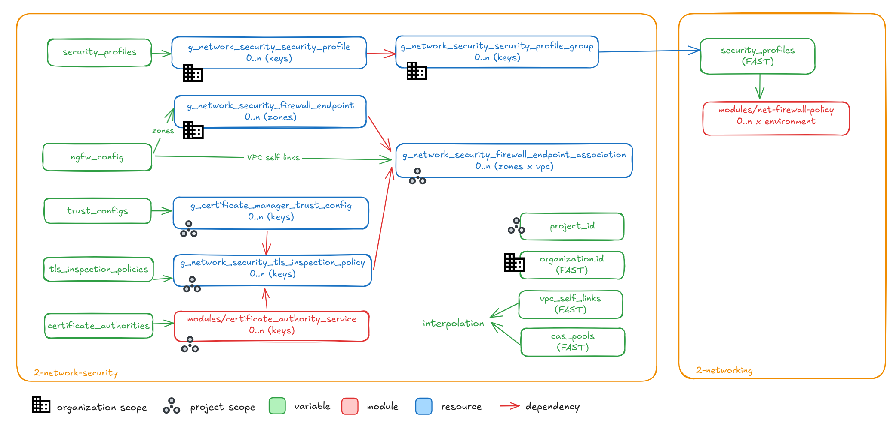

# NGFW Enterprise Networking Add-on

This add-on includes all configurations and resources required to activate [Cloud Next Generation Firewall](https://cloud.google.com/firewall/docs/about-firewalls), and associate its endpoints to an arbitrary number of VPC networks.

This diagram shows the resources used by this add-on, and their relationships with its networking parent stage.

<p align="center">
  
</p>

<!-- BEGIN TOC -->
- [Design overview and choices](#design-overview-and-choices)
- [How to run this stage](#how-to-run-this-stage)
  - [Provider and Terraform variables](#provider-and-terraform-variables)
  - [Impersonating the automation service account](#impersonating-the-automation-service-account)
  - [Variable configuration](#variable-configuration)
  - [Running the stage](#running-the-stage)
  - [Using add-on resources from the networking stage](#using-add-on-resources-from-the-networking-stage)
- [Files](#files)
- [Variables](#variables)
<!-- END TOC -->

## Design overview and choices

This add-on is intentionally self-contained to allow directly using it to implement different designs, via a single instance or multiple instances.

All project-level resources in this stage with the exception of VPC associations are created in the same project, so that dependencies and IAM configurations are kept as simple as possible, and everything is within the same span of control.

The controlling project is usually one of those already created and managed by the networking stage: the landing host project, or a shared environment project if that exists. Alternatively, a dedicated project can be created and used here provided the necessary IAM and organization policies configurations are also defined.

## How to run this stage

Once the main networking stage has been configured and applied, the following configuration is added the the resource management `fast_addon` variable to create the add-on provider files, and its optional CI/CD resources if those are also required. The add-on name (`networking-ngfw`) is customizable, in case the add-on needs to be run multiple times for example to create different sets of endpoints and NGFW configurations per environment.

```hcl
fast_addon = {
  networking-ngfw = {
    parent_stage = "2-networking"
    # cicd_config = {
    #   identity_provider = "github-test"
    #   repository = {
    #     name   = "test/ngfw"
    #     type   = "github"
    #     branch = "main"
    #   }
    # }
  }
}
```

### Provider and Terraform variables

As all other FAST stages, the [mechanism used to pass variable values and pre-built provider files from one stage to the next](../../stages/0-bootstrap/README.md#output-files-and-cross-stage-variables) is also leveraged here.

The commands to link or copy the provider and terraform variable files can be easily derived from the `fast-links.sh` script in the FAST stages folder, passing it a single argument with the local output files folder (if configured) or the GCS output bucket in the automation project (derived from stage 0 outputs). The following example uses local files but GCS behaves identically.

```bash
../../stages/fast-links.sh ~/fast-config
# File linking commands for NGFW Enterprise networking add-on stage

# provider file
ln -s ~/fast-config/providers/2-networking-ngfw-providers.tf ./

# input files from other stages
ln -s ~/fast-config/tfvars/0-globals.auto.tfvars.json ./
ln -s ~/fast-config/tfvars/0-bootstrap.auto.tfvars.json ./
ln -s ~/fast-config/tfvars/1-resman.auto.tfvars.json ./
ln -s ~/fast-config/tfvars/2-networking.auto.tfvars.json ./

# conventional place for stage tfvars (manually created)
ln -s ~/fast-config/2-networking-ngfw.auto.tfvars ./

# optional files
ln -s ~/fast-config/tfvars/2-security.auto.tfvars.json ./
```

### Impersonating the automation service account

The preconfigured provider file uses impersonation to run with this stage's automation service account's credentials. The `gcp-devops` and `organization-admins` groups have the necessary IAM bindings in place to do that, so make sure the current user is a member of one of those groups.

### Variable configuration

Variables in this stage -- like most other FAST stages -- are broadly divided into three separate sets:

- variables which refer to global values for the whole organization (org id, billing account id, prefix, etc.), which are pre-populated via the `0-globals.auto.tfvars.json` file linked or copied above
- variables which refer to resources managed by previous stages, which are prepopulated here via the `0-bootstrap.auto.tfvars.json`, `1-resman.auto.tfvars.json` and `2-networking.auto.tfvars.json` files linked or copied above
- and finally variables that optionally control this stage's behaviour and customizations, and can to be set in a custom `terraform.tfvars` file

The first two sets are defined in the `variables-fast.tf` file, the latter set in the `variables.tf` file. The full list of variables can be found in the [Variables](#variables) table at the bottom of this document.

Note that the `outputs_location` variable is disabled by default, you need to explicitly set it in your `terraform.tfvars` file if you want output files to be generated by this stage. This is a sample `terraform.tfvars` that configures it, refer to the [bootstrap stage documentation](../../stages/0-bootstrap/README.md#output-files-and-cross-stage-variables) for more details:

```tfvars
outputs_location = "~/fast-config"
```

Once output files are in place, define your addon configuration in a tfvars file. This is an example of configuring this addon, with optional variable attributes filled in for illustration purposes.

```hcl
certificate_authorities = {
  # if CA pools defined in the security stage are used this is optional
  ngfw-0 = {
    location = "europe-west8"
    ca_configs = {
      ca-0 = {
        deletion_protection = false
        subject = {
          common_name  = "example.org"
          organization = "Test Organization"
        }
      }
    }
  }
}
ngfw_config = {
  name           = "ngfw-0"
  endpoint_zones = ["europe-west8-b"]
  network_associations = {
    prod = {
      # VPC ids defined in the network stage can be referred to via short name
      # vpc_id              = "prod-spoke-0"
      vpc_id                = "projects/xxx-prod-net-spoke-0/global/networks/prod-spoke-0"
      tls_inspection_policy = "ngfw-0"
    }
  }
}
outputs_location = "~/fast-config"
project_id       = "xxx-prod-net-landing-0"
security_profiles = {
  ngfw-0 = {
    # these are optional and shown here for convenience
    threat_prevention_profile = {
      severity_overrides = {
        informational-allow = {
          action   = "ALLOW"
          severity = "INFORMATIONAL"
        }
      }
      threat_overrides = {
        allow-280647 = {
          action    = "ALLOW"
          threat_id = "280647"
        }
      }
    }
  }
}
tls_inspection_policies = {
  ngfw-0 = {
    # reference the pool defined above, or an external one
    # CA pools defined in the security stage can be referred to via short name
    ca_pool_id   = "ngfw-0"
    location     = "europe-west8"
    trust_config = "ngfw-0"
  }
}
trust_configs = {
  ngfw-0 = {
    location = "europe-west8"
    allowlisted_certificates = {
      server-0 = "~/fast-config/data/2-networking-ngfw/server-0.cert.pem"
    }
    trust_stores = {
      ludo-joonix = {
        intermediate_cas = {
          issuing-ca-1 = "~/fast-config/data/2-networking-ngfw/intermediate.cert.pem"
        }
        trust_anchors = {
          root-ca-1 = "~/fast-config/data/2-networking-ngfw/ca.cert.pem"
        }
      }
    }
  }
}
```

### Running the stage

Once provider and variable values are in place and the correct user is configured, the stage can be run:

```bash
terraform init
terraform apply
```

### Using add-on resources from the networking stage

Security profiles group defined here are exported via output variable file, and can be consumed in the firewall policies defined in the networking stage.

<!-- TFDOC OPTS files:1 show_extra:1 exclude:2-networking-ngfw-providers.tf -->
<!-- BEGIN TFDOC -->
## Files

| name | description | modules | resources |
|---|---|---|---|
| [main.tf](./main.tf) | Module-level locals and resources. | <code>project</code> |  |
| [ngfw.tf](./ngfw.tf) | NGFW Enteprise resources. |  | <code>google_network_security_firewall_endpoint</code> · <code>google_network_security_firewall_endpoint_association</code> |
| [outputs.tf](./outputs.tf) | Module outputs. |  | <code>google_storage_bucket_object</code> · <code>local_file</code> |
| [security-profiles.tf](./security-profiles.tf) | Organization-level network security profiles. |  | <code>google_network_security_security_profile</code> · <code>google_network_security_security_profile_group</code> |
| [tls-inspection.tf](./tls-inspection.tf) | TLS inspection policies and supporting resources. | <code>certificate-authority-service</code> | <code>google_certificate_manager_trust_config</code> · <code>google_network_security_tls_inspection_policy</code> |
| [variables-fast.tf](./variables-fast.tf) | FAST stage interface. |  |  |
| [variables.tf](./variables.tf) | Module variables. |  |  |

## Variables

| name | description | type | required | default | producer |
|---|---|:---:|:---:|:---:|:---:|
| [automation](variables-fast.tf#L28) | Automation resources created by the bootstrap stage. | <code title="object&#40;&#123;&#10;  outputs_bucket &#61; string&#10;&#125;&#41;">object&#40;&#123;&#8230;&#125;&#41;</code> | ✓ |  | <code>0-bootstrap</code> |
| [ngfw_config](variables.tf#L113) | Configuration for NGFW Enterprise endpoints. Billing project defaults to the automation project. Network and TLS inspection policy ids support interpolation. | <code title="object&#40;&#123;&#10;  endpoint_zones &#61; list&#40;string&#41;&#10;  name           &#61; optional&#40;string, &#34;ngfw-0&#34;&#41;&#10;  network_associations &#61; optional&#40;map&#40;object&#40;&#123;&#10;    vpc_id                &#61; string&#10;    disabled              &#61; optional&#40;bool&#41;&#10;    tls_inspection_policy &#61; optional&#40;string&#41;&#10;    zones                 &#61; optional&#40;list&#40;string&#41;&#41;&#10;  &#125;&#41;&#41;, &#123;&#125;&#41;&#10;&#125;&#41;">object&#40;&#123;&#8230;&#125;&#41;</code> | ✓ |  |  |
| [organization](variables-fast.tf#L56) | Organization details. | <code title="object&#40;&#123;&#10;  domain      &#61; string&#10;  id          &#61; number&#10;  customer_id &#61; string&#10;&#125;&#41;">object&#40;&#123;&#8230;&#125;&#41;</code> | ✓ |  | <code>0-globals</code> |
| [project_id](variables.tf#L134) | Project where the network security resources will be created. | <code>string</code> | ✓ |  |  |
| [_fast_debug](variables-fast.tf#L19) | Internal FAST variable used for testing and debugging. Do not use. | <code title="object&#40;&#123;&#10;  skip_datasources &#61; optional&#40;bool, false&#41;&#10;&#125;&#41;">object&#40;&#123;&#8230;&#125;&#41;</code> |  | <code>&#123;&#125;</code> |  |
| [certificate_authorities](variables.tf#L17) | Certificate Authority Service pool and CAs. If host project ids is null identical pools and CAs are created in every host project. | <code title="map&#40;object&#40;&#123;&#10;  location              &#61; string&#10;  iam                   &#61; optional&#40;map&#40;list&#40;string&#41;&#41;, &#123;&#125;&#41;&#10;  iam_bindings          &#61; optional&#40;map&#40;any&#41;, &#123;&#125;&#41;&#10;  iam_bindings_additive &#61; optional&#40;map&#40;any&#41;, &#123;&#125;&#41;&#10;  iam_by_principals     &#61; optional&#40;map&#40;list&#40;string&#41;&#41;, &#123;&#125;&#41;&#10;  ca_configs &#61; map&#40;object&#40;&#123;&#10;    deletion_protection                    &#61; optional&#40;string, true&#41;&#10;    type                                   &#61; optional&#40;string, &#34;SELF_SIGNED&#34;&#41;&#10;    is_ca                                  &#61; optional&#40;bool, true&#41;&#10;    lifetime                               &#61; optional&#40;string, null&#41;&#10;    pem_ca_certificate                     &#61; optional&#40;string, null&#41;&#10;    ignore_active_certificates_on_deletion &#61; optional&#40;bool, false&#41;&#10;    skip_grace_period                      &#61; optional&#40;bool, true&#41;&#10;    labels                                 &#61; optional&#40;map&#40;string&#41;, null&#41;&#10;    gcs_bucket                             &#61; optional&#40;string, null&#41;&#10;    key_spec &#61; optional&#40;object&#40;&#123;&#10;      algorithm  &#61; optional&#40;string, &#34;RSA_PKCS1_2048_SHA256&#34;&#41;&#10;      kms_key_id &#61; optional&#40;string, null&#41;&#10;    &#125;&#41;, &#123;&#125;&#41;&#10;    key_usage &#61; optional&#40;object&#40;&#123;&#10;      cert_sign          &#61; optional&#40;bool, true&#41;&#10;      client_auth        &#61; optional&#40;bool, false&#41;&#10;      code_signing       &#61; optional&#40;bool, false&#41;&#10;      content_commitment &#61; optional&#40;bool, false&#41;&#10;      crl_sign           &#61; optional&#40;bool, true&#41;&#10;      data_encipherment  &#61; optional&#40;bool, false&#41;&#10;      decipher_only      &#61; optional&#40;bool, false&#41;&#10;      digital_signature  &#61; optional&#40;bool, false&#41;&#10;      email_protection   &#61; optional&#40;bool, false&#41;&#10;      encipher_only      &#61; optional&#40;bool, false&#41;&#10;      key_agreement      &#61; optional&#40;bool, false&#41;&#10;      key_encipherment   &#61; optional&#40;bool, true&#41;&#10;      ocsp_signing       &#61; optional&#40;bool, false&#41;&#10;      server_auth        &#61; optional&#40;bool, true&#41;&#10;      time_stamping      &#61; optional&#40;bool, false&#41;&#10;    &#125;&#41;, &#123;&#125;&#41;&#10;    subject &#61; optional&#40;&#10;      object&#40;&#123;&#10;        common_name         &#61; string&#10;        organization        &#61; string&#10;        country_code        &#61; optional&#40;string&#41;&#10;        locality            &#61; optional&#40;string&#41;&#10;        organizational_unit &#61; optional&#40;string&#41;&#10;        postal_code         &#61; optional&#40;string&#41;&#10;        province            &#61; optional&#40;string&#41;&#10;        street_address      &#61; optional&#40;string&#41;&#10;      &#125;&#41;,&#10;      &#123;&#10;        common_name  &#61; &#34;test.example.com&#34;&#10;        organization &#61; &#34;Test Example&#34;&#10;      &#125;&#10;    &#41;&#10;    subject_alt_name &#61; optional&#40;object&#40;&#123;&#10;      dns_names       &#61; optional&#40;list&#40;string&#41;, null&#41;&#10;      email_addresses &#61; optional&#40;list&#40;string&#41;, null&#41;&#10;      ip_addresses    &#61; optional&#40;list&#40;string&#41;, null&#41;&#10;      uris            &#61; optional&#40;list&#40;string&#41;, null&#41;&#10;    &#125;&#41;, null&#41;&#10;    subordinate_config &#61; optional&#40;object&#40;&#123;&#10;      root_ca_id              &#61; optional&#40;string&#41;&#10;      pem_issuer_certificates &#61; optional&#40;list&#40;string&#41;&#41;&#10;    &#125;&#41;, null&#41;&#10;  &#125;&#41;&#41;&#10;  ca_pool_config &#61; optional&#40;object&#40;&#123;&#10;    create_pool &#61; optional&#40;object&#40;&#123;&#10;      name &#61; optional&#40;string&#41;&#10;      tier &#61; optional&#40;string, &#34;DEVOPS&#34;&#41;&#10;    &#125;&#41;&#41;&#10;    use_pool &#61; optional&#40;object&#40;&#123;&#10;      id &#61; string&#10;    &#125;&#41;&#41;&#10;  &#125;&#41;&#41;&#10;&#125;&#41;&#41;">map&#40;object&#40;&#123;&#8230;&#125;&#41;&#41;</code> |  | <code>&#123;&#125;</code> |  |
| [certificate_authority_pools](variables-fast.tf#L36) | Certificate authority pools. | <code title="map&#40;object&#40;&#123;&#10;  id       &#61; string&#10;  ca_ids   &#61; map&#40;string&#41;&#10;  location &#61; string&#10;&#125;&#41;&#41;">map&#40;object&#40;&#123;&#8230;&#125;&#41;&#41;</code> |  | <code>&#123;&#125;</code> | <code>2-security</code> |
| [enable_services](variables.tf#L97) | Configure project by enabling services required for this add-on. | <code>bool</code> |  | <code>true</code> |  |
| [host_project_ids](variables-fast.tf#L48) | Networking stage host project id aliases. | <code>map&#40;string&#41;</code> |  | <code>&#123;&#125;</code> | <code>2-networking</code> |
| [names](variables.tf#L104) | Configuration for names used for output files. | <code title="object&#40;&#123;&#10;  output_files_prefix &#61; optional&#40;string, &#34;2-networking-ngfw&#34;&#41;&#10;&#125;&#41;">object&#40;&#123;&#8230;&#125;&#41;</code> |  | <code>&#123;&#125;</code> |  |
| [outputs_location](variables.tf#L128) | Path where providers and tfvars files for the following stages are written. Leave empty to disable. | <code>string</code> |  | <code>null</code> |  |
| [security_profiles](variables.tf#L140) | Security profile groups for Layer 7 inspection. Null environment list means all environments. | <code title="map&#40;object&#40;&#123;&#10;  description &#61; optional&#40;string&#41;&#10;  threat_prevention_profile &#61; optional&#40;object&#40;&#123;&#10;    severity_overrides &#61; optional&#40;map&#40;object&#40;&#123;&#10;      action   &#61; string&#10;      severity &#61; string&#10;    &#125;&#41;&#41;&#41;&#10;    threat_overrides &#61; optional&#40;map&#40;object&#40;&#123;&#10;      action    &#61; string&#10;      threat_id &#61; string&#10;    &#125;&#41;&#41;&#41;&#10;  &#125;&#41;, &#123;&#125;&#41;&#10;&#125;&#41;&#41;">map&#40;object&#40;&#123;&#8230;&#125;&#41;&#41;</code> |  | <code title="&#123;&#10;  ngfw-default &#61; &#123;&#125;&#10;&#125;">&#123;&#8230;&#125;</code> |  |
| [tls_inspection_policies](variables.tf#L182) | TLS inspection policies configuration. CA pools, trust configs and host project ids support interpolation. | <code title="map&#40;object&#40;&#123;&#10;  ca_pool_id            &#61; string&#10;  location              &#61; string&#10;  exclude_public_ca_set &#61; optional&#40;bool&#41;&#10;  trust_config          &#61; optional&#40;string&#41;&#10;  tls &#61; optional&#40;object&#40;&#123;&#10;    custom_features &#61; optional&#40;list&#40;string&#41;&#41;&#10;    feature_profile &#61; optional&#40;string&#41;&#10;    min_version     &#61; optional&#40;string&#41;&#10;  &#125;&#41;, &#123;&#125;&#41;&#10;&#125;&#41;&#41;">map&#40;object&#40;&#123;&#8230;&#125;&#41;&#41;</code> |  | <code>&#123;&#125;</code> |  |
| [trust_configs](variables.tf#L224) | Certificate Manager trust configurations for TLS inspection policies. Project ids and region can reference keys in the relevant FAST variables. | <code title="map&#40;object&#40;&#123;&#10;  location                 &#61; string&#10;  description              &#61; optional&#40;string&#41;&#10;  allowlisted_certificates &#61; optional&#40;map&#40;string&#41;&#41;&#10;  trust_stores &#61; optional&#40;map&#40;object&#40;&#123;&#10;    intermediate_cas &#61; optional&#40;map&#40;string&#41;&#41;&#10;    trust_anchors    &#61; optional&#40;map&#40;string&#41;&#41;&#10;  &#125;&#41;&#41;&#41;&#10;&#125;&#41;&#41;">map&#40;object&#40;&#123;&#8230;&#125;&#41;&#41;</code> |  | <code title="&#123;&#10;&#125;">&#123;&#8230;&#125;</code> |  |
| [vpc_self_links](variables-fast.tf#L66) | VPC network self links. | <code>map&#40;string&#41;</code> |  | <code>&#123;&#125;</code> | <code>2-networking</code> |
<!-- END TFDOC -->
