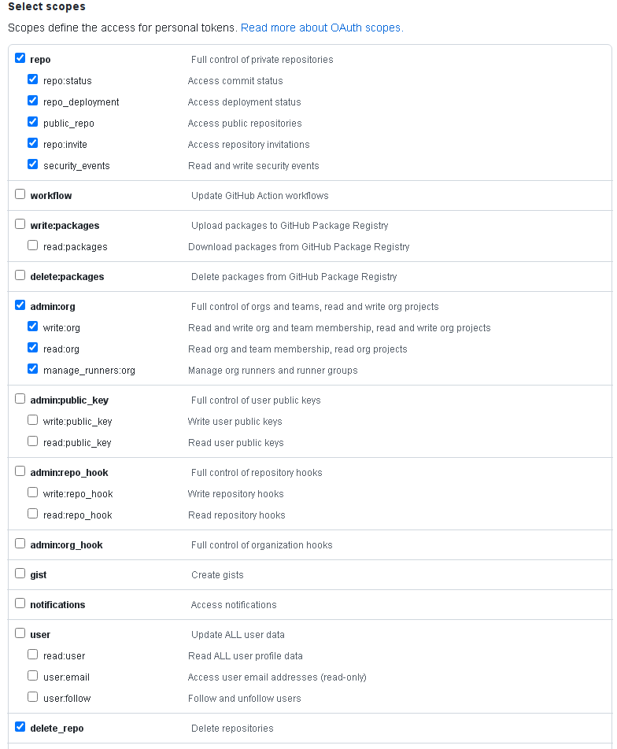

# FAST GitHub repository management

This small extra stage allows creating and populating GitHub repositories used to host FAST stage code, including rewriting of module sources and secrets used for private modules repository access.

It is designed for use in a GitHub organization, and is only meant as a one-shot solution with perishable state especially when used for initial population, as you don't want Terraform to keep overwriting your changes with initial versions of files.

Initial population is only meant to be used with actual stage, while populating the modules repository should be done by hand to avoid hitting the GitHub hourly limit for their API.

Once initial population is done, you need to manually push to the repository

- the `.tfvars` file with custom variable values for your stages
- the workflow configuration file generated by FAST stages

> A [bug](https://github.com/integrations/terraform-provider-github/issues/710) in the provider results in corrupted binary files. Use this code for text files only, and at your own risk. See discussion in #2503.

## GitHub provider credentials

A [GitHub token](https://github.com/settings/tokens) is needed to authenticate against their API. The token needs organization-level permissions, like shown in this screenshot:

<p align="center">
  
</p>

Once a token is available set it in the `GITHUB_TOKEN` environment variable before running Terraform.

## Variable configuration

The `organization` required variable sets the GitHub organization where repositories will be created, and is used to configure the Terraform provider.

### Modules repository and sources

The `modules_config` variable controls creation and management of the key and secret used to access the private modules repository, and indirectly control population of initial files: if the `modules_config` variable is not specified no module repository is know to the code, so module source paths cannot be replaced, and initial population of files cannot happen. If the variable is specified, an optional `source_ref` attribute can be set to the reference used to pin modules versions.

This is an example that configures the modules repository name and an optional reference, enabling initial population of repositories where the feature has been turned on:

```hcl
modules_config = {
  repository_name = "GoogleCloudPlatform/cloud-foundation-fabric"
  source_ref      = "v19.0.0"
}
# tftest skip
```

If the modules are located in a non modules only repository, use the module_prefix attribute to set the location of your modules within the repository:

```hcl
modules_config = {
  repository_name = "GoogleCloudPlatform/cloud-foundation-fabric"
  module_prefix   = "modules/"
}
# tftest skip
```

In the above example, no key options are set so it's assumed modules will be fetched from a public repository. If modules repository authentication is needed the `key_config` attribute also needs to be set.

If no keypair path is specified an internally generated key will be stored as an access key in the modules repository, and as secrets in the stage repositories:

```hcl
modules_config = {
  repository_name = "GoogleCloudPlatform/cloud-foundation-fabric"
  key_config = {
    create_key     = true
    create_secrets = true
  }
}
# tftest skip
```

To use an existing keypair pass the path to the private key, the public key name is assumed to have the same name ending with the `.pub` suffix. This is useful in cases where the access key has already been set in the modules repository, and new repositories need to be created and their corresponding secret set:

```hcl
modules_config = {
  repository_name = "GoogleCloudPlatform/cloud-foundation-fabric"
  key_config = {
    create_secrets = true
    keypair_path   = "~/modules-repository-key"
  }
}
# tftest skip
```

### Repositories

The `repositories` variable is where you configure which repositories to create and whether initial population of files is desired.

This is an example that creates repositories for stages 00 and 01, and populates initial files for stages 00, 01, and 02:

```tfvars
repositories = {
  fast_00_bootstrap = {
    create_options = {
      description = "FAST bootstrap."
      features = {
        issues = true
      }
    }
    populate_from = "../../stages/0-bootstrap"
  }
  fast_01_resman = {
    create_options = {
      description = "FAST resource management."
      features = {
        issues = true
      }
    }
    populate_from = "../../stages/1-resman"
  }
  fast_02_networking = {
    populate_from = "../../stages/2-networking-peering"
  }
}
# tftest skip
```

The `create_options` repository attribute controls creation: if the attribute is not present, the repository is assumed to be already existing.

Initial population depends on a modules repository being configured in the `modules_config` variable described in the preceding section and on the`populate_from` attributes in each repository where population is required, which point to the folder holding the files to be committed.

Each repository may contain some sample tfvars and data files that can be used as a starting point for your own files. By default, the samples are not populate. However, you can enable this by setting the `populate_samples` attribute to `true`. Here's an updated example:

```tfvars
repositories = {
  fast_00_bootstrap = {
    create_options = {
      description = "FAST bootstrap."
      features = {
        issues = true
      }
    }
    populate_from = "../../stages/0-bootstrap"
    populate_samples = true
  }
  fast_01_resman = {
    create_options = {
      description = "FAST resource management."
      features = {
        issues = true
      }
    }
    populate_from = "../../stages/1-resman"
    populate_samples = true
  }
  fast_02_networking = {
    populate_from = "../../stages/2-networking-peering"
    populate_samples = true
  }
}
# tftest skip

Please note that setting `populate_samples` to `true` will populate the sample files to the repository, potentially overwriting any existing files with the same name. To minimize the risk of overwriting existing files, we populate the original `data` directory to a `data.sample` directory. In any case, be careful when enabling this option and review commit history to check any changes made to the sample files.

### Commit configuration

An optional variable `commit_config` can be used to configure the author, email, and message used in commits for the initial population of files. Its defaults are probably fine for most use cases.

### Pull Request configuration

An optional variable `pull_request_config` can be used to configure the title, body, head_ref, and base_ref of the pull request created for the initial population or update of files. By default, no pull request is created. To create a pull request, set the `create` attribute to `true`. `base_ref` defaults to `main` and `head_ref` to the head branch name. If the head branch does not exist, it will be created from the base_ref branch.

```hcl
pull_request_config = {
  create   = true
  title    = "FAST: initial loading or update"
  body     = ""
  base_ref = "main"
  head_ref = "fast-loader"
}
# tftest skip
```

To start using a pull request workflow, if the initial loading was created without a pull request in the past, please use the following command to delete the actual branch files from the Terraform state to keep it in the current state:

```bash
terraform state list | grep github_repository_file | awk '{print "terraform state rm '\''"$1"'\''"}'
```
<!-- TFDOC OPTS files:1 -->
<!-- BEGIN TFDOC -->

## Files

| name | description | resources |
|---|---|---|
| [cicd-versions.tf](./cicd-versions.tf) | Provider version. |  |
| [main.tf](./main.tf) | Module-level locals and resources. | <code>github_actions_secret</code> · <code>github_branch</code> · <code>github_repository</code> · <code>github_repository_deploy_key</code> · <code>github_repository_file</code> · <code>github_repository_pull_request</code> · <code>tls_private_key</code> |
| [outputs.tf](./outputs.tf) | Module outputs. |  |
| [providers.tf](./providers.tf) | Provider configuration. |  |
| [variables.tf](./variables.tf) | Module variables. |  |

## Variables

| name | description | type | required | default |
|---|---|:---:|:---:|:---:|
| [organization](variables.tf#L51) | GitHub organization. | <code>string</code> | ✓ |  |
| [commit_config](variables.tf#L17) | Configure commit metadata. | <code title="object&#40;&#123;&#10;  author  &#61; optional&#40;string, &#34;FAST loader&#34;&#41;&#10;  email   &#61; optional&#40;string, &#34;fast-loader&#64;fast.gcp.tf&#34;&#41;&#10;  message &#61; optional&#40;string, &#34;FAST initial loading&#34;&#41;&#10;&#125;&#41;">object&#40;&#123;&#8230;&#125;&#41;</code> |  | <code>&#123;&#125;</code> |
| [modules_config](variables.tf#L28) | Configure access to repository module via key, and replacement for modules sources in stage repositories. | <code title="object&#40;&#123;&#10;  repository_name &#61; string&#10;  source_ref      &#61; optional&#40;string&#41;&#10;  module_prefix   &#61; optional&#40;string, &#34;&#34;&#41;&#10;  key_config &#61; optional&#40;object&#40;&#123;&#10;    create_key     &#61; optional&#40;bool, false&#41;&#10;    create_secrets &#61; optional&#40;bool, false&#41;&#10;    keypair_path   &#61; optional&#40;string&#41;&#10;  &#125;&#41;, &#123;&#125;&#41;&#10;&#125;&#41;">object&#40;&#123;&#8230;&#125;&#41;</code> |  | <code>null</code> |
| [pull_request_config](variables.tf#L56) | Configure pull request metadata. | <code title="object&#40;&#123;&#10;  create   &#61; optional&#40;bool, false&#41;&#10;  title    &#61; optional&#40;string, &#34;FAST: initial loading or update&#34;&#41;&#10;  body     &#61; optional&#40;string, &#34;&#34;&#41;&#10;  base_ref &#61; optional&#40;string, &#34;main&#34;&#41;&#10;  head_ref &#61; optional&#40;string, &#34;fast-loader&#34;&#41;&#10;&#125;&#41;">object&#40;&#123;&#8230;&#125;&#41;</code> |  | <code>&#123;&#125;</code> |
| [repositories](variables.tf#L69) | Repositories to create. | <code title="map&#40;object&#40;&#123;&#10;  create_options &#61; optional&#40;object&#40;&#123;&#10;    allow &#61; optional&#40;object&#40;&#123;&#10;      auto_merge   &#61; optional&#40;bool&#41;&#10;      merge_commit &#61; optional&#40;bool&#41;&#10;      rebase_merge &#61; optional&#40;bool&#41;&#10;      squash_merge &#61; optional&#40;bool&#41;&#10;    &#125;&#41;&#41;&#10;    auto_init   &#61; optional&#40;bool&#41;&#10;    description &#61; optional&#40;string&#41;&#10;    features &#61; optional&#40;object&#40;&#123;&#10;      issues   &#61; optional&#40;bool&#41;&#10;      projects &#61; optional&#40;bool&#41;&#10;      wiki     &#61; optional&#40;bool&#41;&#10;    &#125;&#41;&#41;&#10;    templates &#61; optional&#40;object&#40;&#123;&#10;      gitignore &#61; optional&#40;string, &#34;Terraform&#34;&#41;&#10;      license   &#61; optional&#40;string&#41;&#10;      repository &#61; optional&#40;object&#40;&#123;&#10;        name  &#61; string&#10;        owner &#61; string&#10;      &#125;&#41;&#41;&#10;    &#125;&#41;, &#123;&#125;&#41;&#10;    visibility &#61; optional&#40;string, &#34;private&#34;&#41;&#10;  &#125;&#41;&#41;&#10;  populate_from    &#61; optional&#40;string&#41;&#10;  populate_samples &#61; optional&#40;bool, false&#41;&#10;&#125;&#41;&#41;">map&#40;object&#40;&#123;&#8230;&#125;&#41;&#41;</code> |  | <code>&#123;&#125;</code> |

## Outputs

| name | description | sensitive |
|---|---|:---:|
| [clone](outputs.tf#L17) | Clone repository commands. |  |

<!-- END TFDOC -->
