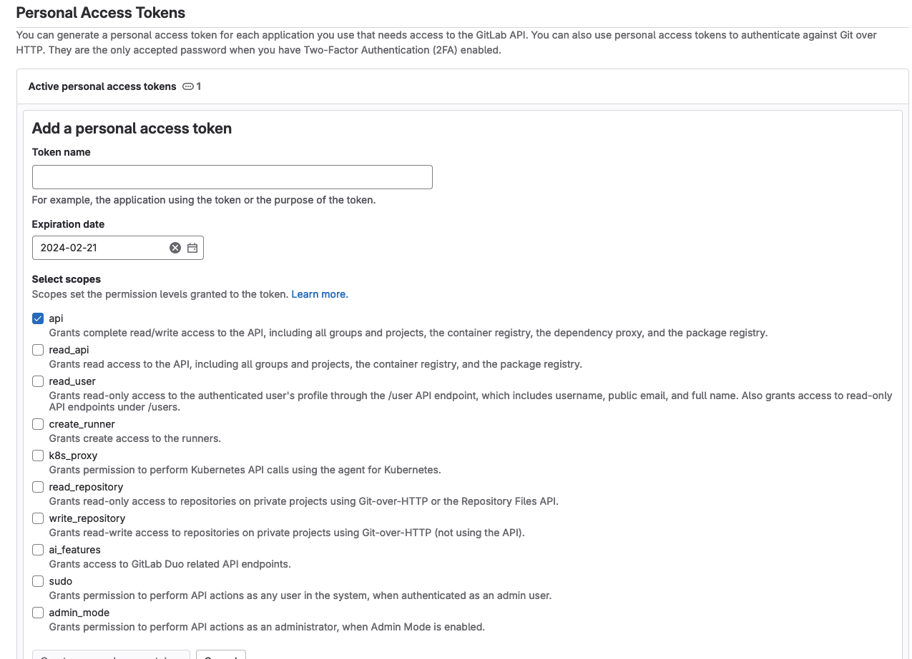

# FAST Gitlab repository management

This small extra stage allows creating and populating Gitlab groups and projects
used to host FAST stages code, including rewriting of module sources and secrets
used for private modules repository access.

It is designed for use in a Gitlab self-managed, and is only meant as a one-shot
solution with perishable state especially when used for initial population, as
you don't want Terraform to keep overwriting your changes with initial versions
of files.

## Gitlab provider credentials

A [Gitlab token](https://docs.gitlab.com/ee/user/profile/personal_access_tokens.html)
is needed to authenticate against their API. The token needs admin permissions,
like shown in this screenshot:

<p align="center">
  
</p>

Once a token is available set it in the `gitlab_config.access_token` terraform
variable before running Terraform. You might also want to update the default
Gitlab hostname and SSH port on the `gitlab_config` section.

## Variable configuration

### Modules project and sources

The `modules_config` variable controls creation and management of both the
Gitlab project hosting fast modules and key and secret used to access it, and
indirectly control population of initial files: if the `modules_config` variable
is not specified no module repository is know to the code, so module source
paths cannot be replaced, and initial population of files cannot happen. If the
variable is specified, an optional `source_ref` attribute can be set to the
reference used to pin modules versions.

This is an example that configures the modules project in Gitlab in a "shared"
group with source ref:

```hcl
modules_config = {
  project_name = "modules"
  key_config   = {
    create_key     = true
    create_secrets = true
  }
  group = "shared"
}
# tftest skip
```

If the modules are located in a non modules only repository, use the
module_prefix attribute to set the location of your modules within the
repository:

```hcl
modules_config = {
  project_name = "modules"
  key_config   = {
    create_key     = true
    create_secrets = true
  }
  group         = "shared"
  module_prefix = "modules/"
}
# tftest skip
```

In the above example, no key options are set so it's assumed modules will be
fetched from a public repository. If modules repository authentication is needed
the `key_config` attribute also needs to be set.

If no keypair path is specified an internally generated key will be stored as a
deploy key in the modules project, and as secrets in the stage repositories:

```hcl
modules_config = {
  project_name = "modules"
  key_config   = {
    create_key     = true
    create_secrets = true
  }
  group      = "shared"
  key_config = {
    create_key     = true
    create_secrets = true
  }
}
# tftest skip
```

To use an existing keypair pass the path to the private key, the public key name
is assumed to have the same name ending with the `.pub` suffix. This is useful
in cases where the access key has already been set in the modules repository,
and new repositories need to be created and their corresponding secret set:

```hcl
modules_config = {
  project_name = "modules"
  key_config   = {
    create_key     = true
    create_secrets = true
  }
  group      = "shared"
  key_config = {
    create_secrets = true
    keypair_path   = "~/modules-repository-key"
  }
}
# tftest skip
```

### Projects

The `projects` variable is where you configure which projects to create in which
groups and whether initial population of files is desired.

This is an example that creates repositories for stages 00 and 01 and 02:

```tfvars
projects = {
  fast_00_bootstrap = {
    create_options = {
      description = "FAST bootstrap."
      features = {
        issues = true
      }
    }
    group         = "org-admins"
    populate_from = "../../stages/0-bootstrap"
    workflow_file = "bootstrap-workflow.yaml"
  }
  fast_01_resman = {
    create_options = {
      description = "FAST resource management."
      features = {
        issues = true
      }
    }
    group         = "org-admins"
    populate_from = "../../stages/1-resman"
    workflow_file = "resman-workflow.yaml"
  }
  fast_02_networking = {
    create_options = {
      description = "FAST networking management."
      features = {
        issues = true
      }
    }
    group         = "net-admins"
    populate_from = "../../stages/2-networking-a-peering"
    workflow_file = "networking-workflow.yaml"
  }
}
# tftest skip
```

The `create_options` repository attribute controls creation: if the attribute is
not present, the repository is assumed to be already existing.

The group attribute

Initial population depends on a modules repository being configured in
the `modules_config` variable described in the preceding section and on
the`populate_from` attributes in each repository where population is required,
which point to the folder holding the files to be committed.

Each repository may contain some sample tfvars and data files that can be used
as a starting point for your own files. By default, the samples are not
populate. However, you can enable this by setting the `populate_samples`
attribute to `true`. Here's an updated example:

```tfvars
projects = {
  fast_00_bootstrap = {
    create_options = {
      description = "FAST bootstrap."
      features    = {
        issues = true
      }
    }
    group           = "org-admins"
    populate_from   = "../../stages/0-bootstrap"
    populate_sample = true
    workflow_file   = "bootstrap-workflow.yaml"
  }
  fast_01_resman = {
    create_options = {
      description = "FAST resource management."
      features    = {
        issues = true
      }
    }
    group           = "org-admins"
    populate_from   = "../../stages/1-resman"
    populate_sample = true
    workflow_file   = "resman-workflow.yaml"
  }
  fast_02_networking = {
    create_options = {
      description = "FAST networking management."
      features    = {
        issues = true
      }
    }
    group           = "net-admins"
    populate_from   = "../../stages/2-networking-a-peering"
    populate_sample = true
    workflow_file   = "networking-workflow.yaml"
  }
}
# tftest skip
```

Please note that setting `populate_samples` to `true` will populate the sample
files to the repository, potentially overwriting any existing files with the
same name. To minimize the risk of overwriting existing files, we populate the
original `data` directory to a `data.sample` directory. In any case, be careful
when enabling this option and review commit history to check any changes made to
the sample files.

Each project is created inside a group, this mapping is done via `group`
attribute being set on the project. The `group` attribute is either a reference
to the key of a group to create in the `groups` variable or the id of an
existing group in Gilab. Please find below a full example of projects + groups
initialization.

```tfvars
projects = {
  fast_00_bootstrap = {
    create_options = {
      description = "FAST bootstrap."
      features    = {
        issues = true
      }
    }
    group           = "org-admins"
    populate_from   = "../../stages/0-bootstrap"
    populate_sample = true
    workflow_file   = "bootstrap-workflow.yaml"
  }
  fast_01_resman = {
    create_options = {
      description = "FAST resource management."
      features    = {
        issues = true
      }
    }
    group           = "org-admins"
    populate_from   = "../../stages/1-resman"
    populate_sample = true
    workflow_file   = "resman-workflow.yaml"
  }
  fast_02_networking = {
    create_options = {
      description = "FAST networking management."
      features    = {
        issues = true
      }
    }
    group           = "net-admins"
    populate_from   = "../../stages/2-networking-a-peering"
    populate_sample = true
    workflow_file   = "networking-workflow.yaml"
  }
}

groups = {
  org-admins = {
    name        = "gcp-org-admins"
    path        = "gcp-org-admins"
    description = "GCP Organization administrators"
  }
  net-admins = {
    name        = "gcp-net-admins"
    path        = "gcp-net-admins"
    description = "GCP Network administrators"
  }
  shared = {
    name        = "shared"
    path        = "shared"
    description = "Shared repositories"
  }
}
# tftest skip
```

### Groups configuration

The `groups` variable can be used to create groups in Gitlab, please find below
a sample usage of this variable.

```tfvars
groups = {
  org-admins = {
    name        = "gcp-org-admins"
    path        = "gcp-org-admins"
    description = "GCP Organization administrators"
  }
  net-admins = {
    name        = "gcp-net-admins"
    path        = "gcp-net-admins"
    description = "GCP Network administrators"
  }
  shared = {
    name        = "shared"
    path        = "shared"
    description = "Shared repositories"
  }
}
# tftest skip
```

### Commit configuration

An optional variable `commit_config` can be used to configure the author, email,
and message used in commits for the initial population of files. Its defaults
are probably fine for most use cases.

## How to run this stage:

Connect to Gitlab as root user and create a personal access token with permissions as per the [gitlab provider credentials](#gitlab-provider-credentials).
Set the newly created personal access as `gitlab_config.access_token` variable
and then issue the following commands:

```bash
gcloud storage cp gs://${prefix}-prod-iac-core-outputs-0/workflows/*-workflow.yaml ./workflows/
```

This will download Gitlab CICD workflow files generated during 0-bootstrap stage
on the local .workflows directory for later being uploaded on the new Gitlab
projects.

Set `http_proxy` and `https_proxy` env vars to http://localhost:3128 and then
run:

```bash
terraform init
terraform apply
```

Navigate Gitlab URL and check whether new groups and projects has been
bootstrapped successfully. Update the default pipeline template replacing the
ssh-keyscan default configuration with the following commands:

```bash
ssh-keyscan -p 2222 -H 'gitlab.gcp.example.com' >> ~/.ssh/known_hosts
ssh-keyscan -p 2222 gitlab.gcp.example.com | sort -u - ~/.ssh/known_hosts -o ~/.ssh/known_hosts
```

Please specify the right hostname and port for the gitlab executor to fetch the
right host key otherwise you might get an _Host key verification failed._ during
terraform init.

Try to create a merge request to trigger a CI pipeline on one of FAST stages and
check if the plan pipeline executes successfully.


<!-- TFDOC OPTS files:1 -->
<!-- BEGIN TFDOC -->
## Files

| name | description | resources |
|---|---|---|
| [cicd-versions.tf](./cicd-versions.tf) | Provider version. |  |
| [main.tf](./main.tf) | Module-level locals and resources. | <code>gitlab_deploy_key</code> · <code>gitlab_group</code> · <code>gitlab_project</code> · <code>gitlab_project_variable</code> · <code>gitlab_repository_file</code> · <code>tls_private_key</code> |
| [outputs.tf](./outputs.tf) | Module outputs. |  |
| [providers.tf](./providers.tf) | Provider configuration. |  |
| [variables.tf](./variables.tf) | Module variables. |  |

## Variables

| name | description | type | required | default |
|---|---|:---:|:---:|:---:|
| [gitlab_config](variables.tf#L28) | Gitlab config. | <code title="object&#40;&#123;&#10;  access_token &#61; string&#10;  hostname     &#61; optional&#40;string, &#34;gitlab.gcp.example.com&#34;&#41;&#10;  ssh_port     &#61; optional&#40;number, 2222&#41;&#10;&#125;&#41;">object&#40;&#123;&#8230;&#125;&#41;</code> | ✓ |  |
| [groups](variables.tf#L37) | Gitlab groups. | <code title="map&#40;object&#40;&#123;&#10;  name        &#61; string&#10;  path        &#61; string&#10;  description &#61; string&#10;&#125;&#41;&#41;">map&#40;object&#40;&#123;&#8230;&#125;&#41;&#41;</code> | ✓ |  |
| [commit_config](variables.tf#L17) | Configure commit metadata. | <code title="object&#40;&#123;&#10;  author  &#61; optional&#40;string, &#34;FAST loader&#34;&#41;&#10;  email   &#61; optional&#40;string, &#34;fast-loader&#64;fast.gcp.tf&#34;&#41;&#10;  message &#61; optional&#40;string, &#34;FAST initial loading&#34;&#41;&#10;&#125;&#41;">object&#40;&#123;&#8230;&#125;&#41;</code> |  | <code>&#123;&#125;</code> |
| [modules_config](variables.tf#L46) | Gitlab modules config. | <code title="object&#40;&#123;&#10;  bootstrap     &#61; optional&#40;bool, true&#41;&#10;  module_prefix &#61; optional&#40;string, &#34;&#34;&#41;&#10;  group         &#61; optional&#40;string&#41;&#10;  project_name  &#61; string&#10;  source_ref    &#61; optional&#40;string&#41;&#10;  key_config &#61; optional&#40;object&#40;&#123;&#10;    create_key     &#61; optional&#40;bool, false&#41;&#10;    create_secrets &#61; optional&#40;bool, false&#41;&#10;    keypair_path   &#61; optional&#40;string&#41;&#10;  &#125;&#41;, &#123;&#125;&#41;&#10;&#125;&#41;">object&#40;&#123;&#8230;&#125;&#41;</code> |  | <code>null</code> |
| [projects](variables.tf#L71) | Gitlab projects to create. | <code title="map&#40;object&#40;&#123;&#10;  create_options &#61; optional&#40;object&#40;&#123;&#10;    allow &#61; optional&#40;object&#40;&#123;&#10;      auto_merge   &#61; optional&#40;bool&#41;&#10;      merge_commit &#61; optional&#40;bool&#41;&#10;      rebase_merge &#61; optional&#40;bool&#41;&#10;      squash_merge &#61; optional&#40;bool&#41;&#10;    &#125;&#41;&#41;&#10;    auto_init   &#61; optional&#40;bool&#41;&#10;    description &#61; optional&#40;string&#41;&#10;    features &#61; optional&#40;object&#40;&#123;&#10;      issues   &#61; optional&#40;bool&#41;&#10;      projects &#61; optional&#40;bool&#41;&#10;      wiki     &#61; optional&#40;bool&#41;&#10;    &#125;&#41;&#41;&#10;    templates &#61; optional&#40;object&#40;&#123;&#10;      gitignore &#61; optional&#40;string, &#34;Terraform&#34;&#41;&#10;      license   &#61; optional&#40;string&#41;&#10;      repository &#61; optional&#40;object&#40;&#123;&#10;        name  &#61; string&#10;        owner &#61; string&#10;      &#125;&#41;&#41;&#10;    &#125;&#41;, &#123;&#125;&#41;&#10;    visibility &#61; optional&#40;string, &#34;private&#34;&#41;&#10;  &#125;&#41;&#41;&#10;  group            &#61; string&#10;  populate_from    &#61; optional&#40;string&#41;&#10;  populate_samples &#61; optional&#40;bool, false&#41;&#10;  workflow_file    &#61; optional&#40;string, null&#41;&#10;&#125;&#41;&#41;">map&#40;object&#40;&#123;&#8230;&#125;&#41;&#41;</code> |  | <code>&#123;&#125;</code> |

## Outputs

| name | description | sensitive |
|---|---|:---:|
| [clone](outputs.tf#L17) | Clone projects commands. |  |
<!-- END TFDOC -->
