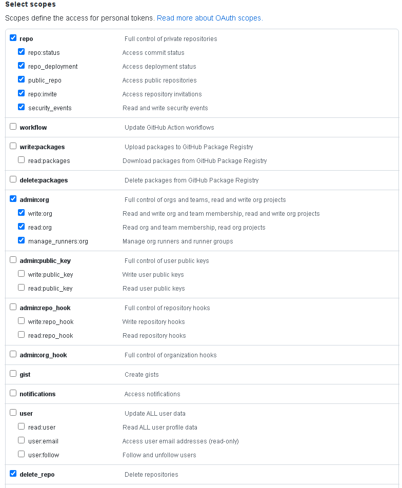

# FAST GitHub repository management

This small extra stage allows creation and management of GitHub repositories used to host FAST stage code, including initial population of files and rewriting of module sources.

This stage is designed for quick repository creation in a GitHub organization, and is not suited for medium or long-term repository management especially if you enable initial population of files.

## Initial population caveats

Initial file population of repositories is controlled via the `populate_from` attribute, and needs a bit of care:

- never run this stage with the same variables used for population once the repository starts being used, as **Terraform will manage file state and revert any changes at each apply**, which is probably not what you want.
- initial population of the modules repository is discouraged, as the number of resulting files Terraform needs to manage is very close to the GitHub hourly limit for their API, it's much easier to populate modules via regular git commands

The scenario for which this stage has been designed is one-shot creation and/or population of stage repositories, running it multiple times with different variables and Terraform states if incremental creation is needed for subsequent FAST stages (e.g. GKE, data platform, etc.).

Once initial population is done, you need to manually push to the repository

- the `.tfvars` file with custom variable values for your stages
- the workflow configuration file generated by FAST stages

## GitHub provider credentials

A [GitHub token](https://github.com/settings/tokens) is needed to authenticate against their API. The token needs organization-level permissions, like shown in this screenshot:

<p align="center">
  
</p>

## Variable configuration

The `organization` required variable sets the GitHub organization where repositories will be created, and is used to configure the Terraform provider.

The `repositories` variable is where you configure which repositories to create, whether initial population of files is desired, and which repository is used to host modules.

This is an example that creates repositories for stages 00 and 01, defines an existing repositories as the source for modules, and populates initial files for stages 00, 01, and 02:

```hcl
organization = "ludomagno"
repositories = {
  fast_00_bootstrap = {
    create_options = {
      description = "FAST bootstrap."
      features = {
        issues = true
      }
    }
    populate_from = "../../stages/00-bootstrap"
  }
  fast_01_resman = {
    create_options = {
      description = "FAST resource management."
      features = {
        issues = true
      }
    }
    populate_from = "../../stages/01-resman"
  }
  fast_02_networking = {
    populate_from = "../../stages/02-networking-peering"
  }
  fast_modules = {
    has_modules = true
  }
}
```

The `create_options` repository attribute controls creation: if the attribute is not present, the repository is assumed to be already existing.

Initial population depends on a modules repository being configured, identified by the `has_modules` attribute, and on `populate_from` attributes in each repository where population is required, pointing to the folder holding the files to be committed.

Finally, a `commit_config` variable is optional: it can be used to configure author, email and message used in commits for initial population of files, its defaults are probably fine for most use cases.

## Modules secret

When initial population is configured for a repository, this stage also adds a secret with the private key used to authenticate against the modules repository. This matches the configuration of the GitHub workflow files created for each FAST stage when CI/CD is enabled.

<!-- TFDOC OPTS files:1 -->
<!-- BEGIN TFDOC -->

## Files

| name | description | resources |
|---|---|---|
| [cicd-versions.tf](./cicd-versions.tf) | Provider version. |  |
| [main.tf](./main.tf) | Module-level locals and resources. | <code>github_actions_secret</code> · <code>github_repository</code> · <code>github_repository_deploy_key</code> · <code>github_repository_file</code> · <code>tls_private_key</code> |
| [outputs.tf](./outputs.tf) | Module outputs. |  |
| [providers.tf](./providers.tf) | Provider configuration. |  |
| [variables.tf](./variables.tf) | Module variables. |  |

## Variables

| name | description | type | required | default |
|---|---|:---:|:---:|:---:|
| [organization](variables.tf#L34) | GitHub organization. | <code>string</code> | ✓ |  |
| [commmit_config](variables.tf#L17) | Configure commit metadata. | <code title="object&#40;&#123;&#10;  author  &#61; optional&#40;string, &#34;FAST loader&#34;&#41;&#10;  email   &#61; optional&#40;string, &#34;fast-loader&#64;fast.gcp.tf&#34;&#41;&#10;  message &#61; optional&#40;string, &#34;FAST initial loading&#34;&#41;&#10;&#125;&#41;">object&#40;&#123;&#8230;&#125;&#41;</code> |  | <code>&#123;&#125;</code> |
| [modules_ref](variables.tf#L28) | Optional git ref used in module sources. | <code>string</code> |  | <code>null</code> |
| [repositories](variables.tf#L39) | Repositories to create. | <code title="map&#40;object&#40;&#123;&#10;  create_options &#61; optional&#40;object&#40;&#123;&#10;    allow &#61; optional&#40;object&#40;&#123;&#10;      auto_merge   &#61; optional&#40;bool&#41;&#10;      merge_commit &#61; optional&#40;bool&#41;&#10;      rebase_merge &#61; optional&#40;bool&#41;&#10;      squash_merge &#61; optional&#40;bool&#41;&#10;    &#125;&#41;&#41;&#10;    auto_init   &#61; optional&#40;bool&#41;&#10;    description &#61; optional&#40;string&#41;&#10;    features &#61; optional&#40;object&#40;&#123;&#10;      issues   &#61; optional&#40;bool&#41;&#10;      projects &#61; optional&#40;bool&#41;&#10;      wiki     &#61; optional&#40;bool&#41;&#10;    &#125;&#41;&#41;&#10;    templates &#61; optional&#40;object&#40;&#123;&#10;      gitignore &#61; optional&#40;string, &#34;Terraform&#34;&#41;&#10;      license   &#61; optional&#40;string&#41;&#10;      repository &#61; optional&#40;object&#40;&#123;&#10;        name  &#61; string&#10;        owner &#61; string&#10;      &#125;&#41;&#41;&#10;    &#125;&#41;, &#123;&#125;&#41;&#10;    visibility &#61; optional&#40;string, &#34;private&#34;&#41;&#10;  &#125;&#41;&#41;&#10;  has_modules   &#61; optional&#40;bool, false&#41;&#10;  populate_from &#61; optional&#40;string&#41;&#10;&#125;&#41;&#41;">map&#40;object&#40;&#123;&#8230;&#125;&#41;&#41;</code> |  | <code>&#123;&#125;</code> |

## Outputs

| name | description | sensitive |
|---|---|:---:|
| [clone](outputs.tf#L17) | Clone repository commands. |  |

<!-- END TFDOC -->
