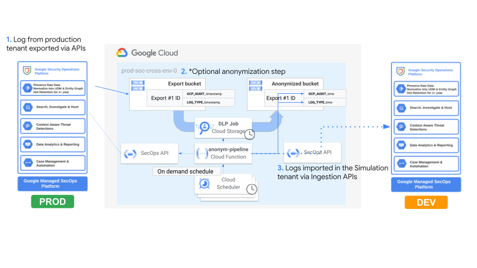

# SecOps Anonymization Pipeline

This application template offers a comprehensive and adaptable solution for constructing a SecOps pipeline for exporting raw data from a SecOps tenant, optionally anonymize this data and then import data back in a different SecOps tenant. The pipeline is built on top of various Google Cloud products.

## Prerequisites

The [`project.yaml`](./project.yaml) file describes the project-level configuration needed in terms of API activation and IAM bindings.

If you are deploying this inside a FAST-enabled organization, the file can be lightly edited to match your configuration, and then used directly in the [project factory](../../stages/2-project-factory/).

This Terraform can of course be deployed using any pre-existing project. In that case use the YAML file to determine the configuration you need to set on the project:

- enable the APIs listed under `services`
- grant the permissions listed under `iam` to the principal running Terraform, either machine (service account) or human


### High level architecture

The following diagram illustrates the high-level design of the solution, which can be adapted to specific requirements via variables and/or simple terraform and Python code customizations:



The use case is a SecOps deployment composed of 2 tenants (one for production and one for development/testing). There might be the need to export production data from the prod tenant and import them back in DEV (possibly anonymizing it) for rules and/or parser development, that is why this pipeline might be convenient for speeding up the data migration process.

### Pipeline Steps

- **SecOps Export**: Triggered via the corresponding TRIGGER-EXPORT action. Call SecOps Export API to trigger raw logs export on a GCS bucket based on either all the log types or one o more of them for a specific time frame. By default, the export will be for the previous day, otherwise the following parameters can be specified to change the time frame:
  * `EXPORT_DATE` date for the export (format %Y-%m-%d)
  * `EXPORT_START_DATETIME` and `EXPORT_END_DATETIME` start and end datetime for the export (format %Y-%m-%dT%H:%M:%SZ). This is useful for verbose log source with GB/TB of raw logs ingested on a daily basis
- **Anonymize Data**: Triggered via the corresponding ANONYMIZE-DATA action. Split the exported CSV files to one or more CSV files where the size of each file is less than 60MB (which is the maximum file size supported by DLP). It also renames those files in .log for better handling by the DLP Job. It will then trigger an asynchronous DLP job to anonymize data.
- **Import Data**: Triggered via the corresponding IMPORT-DATA action. Import the exported raw logs (or anonymized ones according to the pipeline configuration) data into the target SecOps tenant leveraging the [Ingestion API](https://cloud.google.com/chronicle/docs/reference/ingestion-api).

### Limitations

- The pipeline can be schedule to run on a daily basis or on-demand, being all asynchronous tasks the anonymization and/or import logs should be triggered after the export is completed successfully
- This pipeline is built for migrating few logs between tenants, lack of multi-threading and limitations on the Cloud Function memory result in the function being able to process at most order of MB of raw logs data (no GB)
- Currently, SecOps export API supports 3 concurrent export requests for each tenant, due to each export request being associated to eithe all log types or a specific log type this result in no more than 3 log types exported within the same export request.

### Deployment

#### Step 0: Cloning the repository

If you want to deploy from your Cloud Shell, click on the image below, sign in
if required and when the prompt appears, click on “confirm”.

[](https://shell.cloud.google.com/cloudshell/editor?cloudshell_git_repo=https%3A%2F%2Fgithub.com%2FGoogleCloudPlatform%2Fcloud-foundation-fabric&cloudshell_workspace=blueprints%2Fthird-party-solutions%2Fwordpress%2Fcloudrun)

Otherwise, in your console of choice:

```bash
git clone REPO_URL
```

Before you deploy the architecture, you will need at least the following
information (for more precise configuration see the Variables section):

* GCP Project ID for SecOps anonymization pipeline deployment
* SecOps tenants information:
  * GCP projects of SecOps tenants
  * customer ID
  * deployment region for both the tenants (must be the same)
  * SA credentials with export permissions on source tenant
  * SA credentials with ingestion API grants on target tenant

#### Step 2: Prepare the variables

Once you have the required information, head back to your cloned repository.
Make sure you’re in the directory of this tutorial (where this README is in).

Configure the Terraform variables in your `terraform.tfvars` file.
See sample TF variables in README.md file as starting point - just
copy them to a new `terraform.tfvars` file and update accordingly.
See the variables documentation below for more information.

#### Step 3: Prepare the DLP template

When anonymization is required (variable `skip_anonymization` is false) a Data Loss prevention API configuration is required for the corresponding DLP job.

By default, the blueprint will provision a very basic DLP inspect and de-identify template for identifying and masking with just a sample value common PII information such as email addresses, person names, IP addresses and so on, more information available on the corresponding TF script in [dlp.tf](./dlp.tf).

In general a more advanced configuration is required for custom info types or a better de-identification template based on multiple anonymized values for the same info type (more email addresses or IP addresses to guarantee differentiation), in that case you can build your own DLP templates and pass them to the anonymization pipeline leveraging the `dlp_config` variable.

#### Step 4: Deploy resources

Initialize your Terraform environment and deploy the resources:

```shell
terraform init
terraform apply
```

#### Step 5: Test solution

Test the solution triggering an export from the Cloud Scheduler page, after few hours (accoding to the size of the export) logs should be available on secops-export bucket. Please check for any issue during export using the corresponding APIs and the export ID.
<!-- BEGIN TFDOC -->
## Variables

| name | description | type | required | default |
|---|---|:---:|:---:|:---:|
| [prefix](variables.tf#L59) | Prefix used for resource names. | <code>string</code> | ✓ |  |
| [project_id](variables.tf#L69) | Project id, references existing project if `project_create` is null. | <code>string</code> | ✓ |  |
| [secops_config](variables.tf#L86) | SecOps config. | <code title="object&#40;&#123;&#10;  region            &#61; string&#10;  alpha_apis_region &#61; string&#10;  source_tenant &#61; object&#40;&#123;&#10;    gcp_project          &#61; string&#10;    export_sa_key_base64 &#61; string&#10;  &#125;&#41;&#10;  target_tenant &#61; object&#40;&#123;&#10;    gcp_project             &#61; string&#10;    customer_id             &#61; string&#10;    ingestion_sa_key_base64 &#61; string&#10;  &#125;&#41;&#10;&#125;&#41;">object&#40;&#123;&#8230;&#125;&#41;</code> | ✓ |  |
| [anonymization_scheduler](variables.tf#L17) | Schedule for triggering export, anonymization and import of data. | <code title="object&#40;&#123;&#10;  trigger-export &#61; string&#10;  anonymize-data &#61; string&#10;  import-data    &#61; string&#10;&#125;&#41;">object&#40;&#123;&#8230;&#125;&#41;</code> |  | <code title="&#123;&#10;  trigger-export &#61; &#34;0 8 29 2 &#42;&#34;&#10;  anonymize-data &#61; &#34;0 12 29 2 &#42;&#34;&#10;  import-data    &#61; &#34;0 13 29 2 &#42;&#34;&#10;&#125;">&#123;&#8230;&#125;</code> |
| [cloud_function_config](variables.tf#L31) | Optional Cloud Function configuration. | <code title="object&#40;&#123;&#10;  build_worker_pool_id &#61; optional&#40;string&#41;&#10;  build_sa             &#61; optional&#40;string&#41;&#10;  debug                &#61; optional&#40;bool, false&#41;&#10;  cpu                  &#61; optional&#40;number, 1&#41;&#10;  memory_mb            &#61; optional&#40;number, 2048&#41;&#10;  timeout_seconds      &#61; optional&#40;number, 3600&#41;&#10;  vpc_connector &#61; optional&#40;object&#40;&#123;&#10;    name            &#61; string&#10;    egress_settings &#61; optional&#40;string, &#34;ALL_TRAFFIC&#34;&#41;&#10;  &#125;&#41;&#41;&#10;&#125;&#41;">object&#40;&#123;&#8230;&#125;&#41;</code> |  | <code>&#123;&#125;</code> |
| [dlp_config](variables.tf#L49) | Data Loss prevention configuration. | <code title="object&#40;&#123;&#10;  region                 &#61; string&#10;  deidentify_template_id &#61; string&#10;  inspect_template_id    &#61; string&#10;&#125;&#41;">object&#40;&#123;&#8230;&#125;&#41;</code> |  | <code>null</code> |
| [regions](variables.tf#L74) | Regions: primary for all resources and secondary for clouds scheduler since the latter is available in few regions. | <code title="object&#40;&#123;&#10;  primary   &#61; string&#10;  secondary &#61; string&#10;&#125;&#41;">object&#40;&#123;&#8230;&#125;&#41;</code> |  | <code title="&#123;&#10;  primary   &#61; &#34;europe-west1&#34;&#10;  secondary &#61; &#34;europe-west1&#34;&#10;&#125;">&#123;&#8230;&#125;</code> |
| [skip_anonymization](variables.tf#L103) | Whether to skip anonymization step and just import data exported from source tenant. | <code>bool</code> |  | <code>false</code> |

## Outputs

| name | description | sensitive |
|---|---|:---:|
| [function_sa](outputs.tf#L17) | Chronicle Anonymization function service account. |  |
<!-- END TFDOC -->
## Test

```hcl
module "test" {
  source = "./fabric/fast/project-templates/secops-anonymization-pipeline"
  secops_config = {
    region            = "europe"
    alpha_apis_region = "eu"
    source_tenant = {
      gcp_project          = "SOURCE_PROJECT_ID"
      export_sa_key_base64 = "dGVzdAo="
    }
    target_tenant = {
      gcp_project             = "TARGET_PROJECT_ID"
      customer_id             = "xxx-xxxxxx-xxxxx"
      ingestion_sa_key_base64 = "dGVzdAo="
    }
  }
  skip_anonymization = false
  prefix             = "pre"
  project_id         = "gcp-project-id"
  regions = {
    primary   = "europe-west1"
    secondary = "europe-west1"
  }
}
# tftest modules=8 resources=54
```
