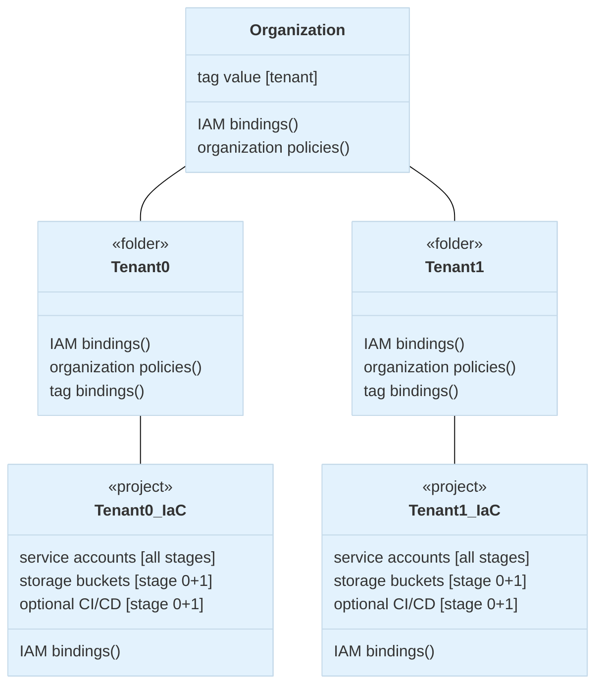

# Tenant bootstrap

The primary purpose of this stage is to decouple a single tenant from centrally managed resources in the organization, so that subsequent management of the tenant's own hierarchy and resources can be implemented with a high degree of autonomy.

The stage is intentionally simple as it still operates at the organization level, using the organization's resource management service account to create the following tenant resources:

- the tag value in the `tenant` key used in IAM conditions
- the IAM bindings on the org and billing account for the tenant service accounts and administration group
- any organization policies needed for the tenant which are not delegated via tags
- the top-level folder which acts as the root of the tenant's hierarchy
- the automation project
- service accounts for all tenant stages in the automation project (created by this stage so as to grant them selected permissions on the org and billing account)
- the storage bucket for this and the resource management tenant stages
- optional CI/CD setup for this and the resource management tenant stages
- tenant-specific Workload Identity Federation pool and providers (planned)

<!-- https://mdigi.tools/darken-color/#f1f8e9 -->

<!-- style>
  svg .edgePaths path {
    stroke: #bebebe !important;
  }
  .mermaidExternal > rect {
    fill: #f6f6f6 !important;
    stroke-dasharray: 5,5;
    stroke: #bebebe !important;
  }
  .mermaidOrg > rect {
    fill: #F6F6F6 !important;
  }
  .mermaidFolder > rect {
    fill: #F1F8E9 !important;
    stroke: #abd57b !important;
  }
</style -->

The following diagram is a high level reference of what this stage manages, showing two hypothetical tenants (which would need two distinct copies of this stage):

## Design overview and choices

## User groups

## Tenant-level IAM

## Automation project and resources

## Billing account

## Tenant-level logging

## Naming

## Workload Identity Federation and CI/CD

## How to run this stage

### Tenant-level configuration

### Output files and cross-stage variables

### Running the stage

## Customizations

### IAM

### Log sinks and log destinations

### Workload Identity Federation

### CI/CD repositories

<!-- TFDOC OPTS files:1 show_extra:1 -->
<!-- BEGIN TFDOC -->

<!-- END TFDOC -->