# Tenant bootstrap

The primary purpose of this stage is to decouple a single tenant from centrally managed resources in the organization, so that subsequent management of the tenant's own hierarchy and resources can be implemented with a high degree of autonomy.

It is logically equivalent to organization-level bootstrap as it's concerned with setting up IAM bindings on a root node and creating supporting projects attached to it, but it depends on the organization-level resource management stage and uses the same service account and permissions since it operates at the hierarchy level (folders, tags, organization policies).

The resources and policies managed here are:

- the tag value in the `tenant` key used in IAM conditions
- the billing IAM bindings for the tenant-specific automation service accounts
- the organization-level IAM binding that allows conditional managing of org policies on the tenant folder
- the top-level tenant folder which acts as the root of the tenant's hierarchy
- any organization policy that needs to be set for the tenant on its root folder
- the tenant automation and logging projects
- service accounts for all tenant stages
- GCS buckets for bootstrap and resource management state
- optional CI/CD setup for this and the resource management tenant stages
- tenant-specific Workload Identity Federation pool and providers (planned)

One notable difference compared to organization-level bootstrap is the creation of service accounts for all tenant stages: this is done here so that Billing and Organization Policy Admin bindings can be set, leveraging permissions of  the org-level resman service account which is used to run this stage. Doing this here avoids the need to grant broad scoped permissions on the organization to tenant-level service accounts, and effectively decouples the tenant from the organization.

The following diagram is a high level reference of what this stage manages, showing one hypothetical tenant (additional tenants require additional instances of this stage being deployed):

```mermaid
%%{init: {'theme':'base'}}%%
classDiagram
    Organization~🏢~ -- Tenant 0~📁~
    Tenant 0~📁~ -- tn0_automation
    Tenant 0~📁~ -- tn0_logging
    class Organization~🏢~ {
        - tag value
        - IAM bindings()
        - org policies()
    }
    class Tenant 0~📁~ {
        - log sinks
        - IAM bindings()
        - tag bindings()
    }
    class tn0_automation {
        - GCS buckets
        - service accounts
        - optional CI/CD
        - IAM bindings()
    }
    class tn0_logging {
        - log sink destinations
    }
```



As most of the features of this stage follow the same design and configurations of the [organization-level bootstrap stage](../../stages/0-bootstrap/), we will only focus on the tenant-specific configuration in this document.

## Naming

This stage sets the prefix used to name tenant resources, and passes it downstream to the other tenant stages together with the other globals needed by the tenant. The default is to append the tenant short name (an acronym or abbreviation with a minimum of 2 and a maximum of 4 characters) to the organization-level prefix. If that is not desired this can be changed by editing local definitions in the `main.tf` file. Just be aware that some resources have name length constraints.

Note that if the organization-level prefix contains 9 characters then the tenant-level prefix will be limited to 2 characters. Use a shorter organization-level prefix if you want to use a longer tenant-level prefix.

## How to run this stage

The tenant bootstrap stage is the effective boundary between organization and tenant-level resources: it uses the same inputs as the organization-level resource management stage, and produces outputs which provide the needed context to all other tenant stages.

### Output files and cross-stage variables

As mentioned above, the organization-level set of output files are used here with one exception: the provider file is different since state is specific to this stage. The `stage-links.sh` script can be used to get the commands needed for the provider and output files, just pass a single argument with your FAST output files folder path, or GCS bucket URI:

```bash
../../stage-links.sh ~/fast-config
```

The script output can be copy/pasted to a terminal:

```bash
# copy and paste the following commands for '0-bootstrap-tenant'

cp ~/fast-config/providers/0-bootstrap-tenant-providers.tf ./
ln -s ~/fast-config/tfvars/0-globals.auto.tfvars.json ./
ln -s ~/fast-config/tfvars/0-bootstrap.auto.tfvars.json ./
ln -s ~/fast-config/tfvars/1-resman.auto.tfvars.json ./

# ---> remember to set the prefix in the provider file <---
```

As shown in the script output above, the provider file is a template used as a source for potentially multiple tenant installations, so it needs to be specifically configured for this tenant by setting the backend `prefix` to a unique string so that the Terraform state file will not overlap with other tenants. Open it in an editor and perform the change before proceeding.

Note that the `outputs_location` variable is disabled by default, you need to explicitly set it in your `terraform.tfvars` file if you want output files to be generated by this stage. This is a sample `terraform.tfvars` that configures it, refer to the [org-level bootstrap stage documentation](../../stages/0-bootstrap/README.md#output-files-and-cross-stage-variables) for more details:

```tfvars
outputs_location = "~/fast-config"
```

### Global overrides

The globals variable file linked above contains definition which were set for the organization, for example the locations used for log sink destinations. These might not be correct for each tenant, so this stage allows overriding them via the tenant configuration variable described in the next section.

### Tenant-level configuration

The tenant configuration resides in the `tenant_config` variable, this is an example configuration for a tenant with comments explaining the different choices that need to be made:

```tfvars
tenant_config = {
  # used for the top-level folder name
  descriptive_name = "My First Tenant"
  # tenant-specific groups, only the admin group is required
  # the organization domain is automatically added after the group name
  groups = {
    gcp-admins          = "tn01-admins"
    # gcp-devops          = "tn01-devops"
    # gcp-network-admins  = "tn01-networking"
    # gcp-security-admins = "tn01-security"
  }
  # the 3 or 4 letter acronym or abbreviation used in resource names
  short_name = "tn01"
  # optional CI/CD configuration, refer to the org-level stages for information 
  # cicd = {
  #   branch            = null
  #   identity_provider = "foo-provider"
  #   name              = "myorg/tn01-bootstrap"
  #   type              = "github"
  # }
  # optional group-level IAM bindings to add to the top-level folder
  # group_iam = {
  #   tn01-support = ["roles/viewer"]
  # }
  # optional IAM bindings to add to the top-level folder
  # iam       = {
  #   "roles/logging.admin" = [
  #     "serviceAccount:foo@myprj.iam.gserviceaccount.com"
  #   ]
  # }
  # optional location overrides to global locations
  # locations = {
  #   bq      = null
  #   gcs     = null
  #   logging = null
  #   pubsub  = null
  # }
  # optional folder ids for automation and logging project folders, typically
  # added in later stages and entered here once created
  # project_parent_ids = {
  #   automation = "folders/012345678"
  #   logging    = "folders/0123456789"
  # }
}
```

Configure the tenant variable in a tfvars file for this stage. A few minor points worth noting:

- the administrator group is the only one required here, specifying other groups only has the effect of populating the output file with group names for reuse in later stages
- the `iam` variable is merged with the IAM bindings for service accounts in the `main.tf` file, which take precedence; if a role specified in the variable is ignored, that's probably the case
- locations can be overridden at the attribute level, there's no need to specify those that are equal to the ones in the organization globals file

### Running the stage

Once the configuration is done just go through the usual `init/apply` cycle. On successful apply, a tfvars file specific for this tenant and a set of provider files will be created.

#### Using delayed billing association for projects

This configuration is possible but unsupported and only exists for development purposes, use at your own risk:

- temporarily switch `billing_account.id` to `null` in `0-globals.auto.tfvars.json`
- for each project resources in the project modules used in this stage (`automation-project`, `log-export-project`)
  - apply using `-target`, for example
    `terraform apply -target 'module.automation-project.google_project.project[0]'`
  - untaint the project resource after applying, for example
    `terraform untaint 'module.automation-project.google_project.project[0]'`
- go through the process to associate the billing account with the two projects
- switch `billing_account.id` back to the real billing account id
- resume applying normally

### TODO

- [ ] tenant-level Workload Identity Federation pool and providers configuration
- [ ] tenant-level logging project and sinks

<!-- TFDOC OPTS files:1 show_extra:1 -->
<!-- BEGIN TFDOC -->
## Files

| name | description | modules | resources |
|---|---|---|---|
| [automation-sas.tf](./automation-sas.tf) | Tenant automation stage 2 and 3 service accounts. | <code>iam-service-account</code> | <code>google_organization_iam_member</code> |
| [automation.tf](./automation.tf) | Tenant automation project and resources. | <code>gcs</code> · <code>iam-service-account</code> · <code>project</code> |  |
| [billing.tf](./billing.tf) | Billing roles for standalone billing accounts. |  | <code>google_billing_account_iam_member</code> |
| [cicd.tf](./cicd.tf) | Workload Identity Federation configurations for CI/CD. | <code>iam-service-account</code> · <code>source-repository</code> |  |
| [identity-providers.tf](./identity-providers.tf) | Workload Identity Federation provider definitions. |  | <code>google_iam_workload_identity_pool</code> · <code>google_iam_workload_identity_pool_provider</code> |
| [log-export.tf](./log-export.tf) | Audit log project and sink. | <code>bigquery-dataset</code> · <code>gcs</code> · <code>logging-bucket</code> · <code>project</code> · <code>pubsub</code> |  |
| [main.tf](./main.tf) | Module-level locals and resources. | <code>folder</code> |  |
| [organization.tf](./organization.tf) | Organization tag and conditional IAM grant. | <code>organization</code> | <code>google_tags_tag_value_iam_member</code> |
| [outputs-files.tf](./outputs-files.tf) | Output files persistence to local filesystem. |  | <code>local_file</code> |
| [outputs-gcs.tf](./outputs-gcs.tf) | Output files persistence to automation GCS bucket. |  | <code>google_storage_bucket_object</code> |
| [outputs.tf](./outputs.tf) | Module outputs. |  |  |
| [variables.tf](./variables.tf) | Module variables. |  |  |

## Variables

| name | description | type | required | default | producer |
|---|---|:---:|:---:|:---:|:---:|
| [automation](variables.tf#L20) | Automation resources created by the organization-level bootstrap stage. | <code title="object&#40;&#123;&#10;  outputs_bucket          &#61; string&#10;  project_id              &#61; string&#10;  project_number          &#61; string&#10;  federated_identity_pool &#61; string&#10;  federated_identity_providers &#61; map&#40;object&#40;&#123;&#10;    audiences        &#61; list&#40;string&#41;&#10;    issuer           &#61; string&#10;    issuer_uri       &#61; string&#10;    name             &#61; string&#10;    principal_tpl    &#61; string&#10;    principalset_tpl &#61; string&#10;  &#125;&#41;&#41;&#10;&#125;&#41;">object&#40;&#123;&#8230;&#125;&#41;</code> | ✓ |  | <code>0-bootstrap</code> |
| [billing_account](variables.tf#L39) | Billing account id. If billing account is not part of the same org set `is_org_level` to `false`. To disable handling of billing IAM roles set `no_iam` to `true`. | <code title="object&#40;&#123;&#10;  id           &#61; string&#10;  is_org_level &#61; optional&#40;bool, true&#41;&#10;  no_iam       &#61; optional&#40;bool, false&#41;&#10;&#125;&#41;">object&#40;&#123;&#8230;&#125;&#41;</code> | ✓ |  |  |
| [organization](variables.tf#L214) | Organization details. | <code title="object&#40;&#123;&#10;  domain      &#61; string&#10;  id          &#61; number&#10;  customer_id &#61; string&#10;&#125;&#41;">object&#40;&#123;&#8230;&#125;&#41;</code> | ✓ |  | <code>0-bootstrap</code> |
| [prefix](variables.tf#L230) | Prefix used for resources that need unique names. Use 9 characters or less. | <code>string</code> | ✓ |  | <code>0-bootstrap</code> |
| [tag_keys](variables.tf#L253) | Organization tag keys. | <code title="object&#40;&#123;&#10;  context     &#61; string&#10;  environment &#61; string&#10;  tenant      &#61; string&#10;&#125;&#41;">object&#40;&#123;&#8230;&#125;&#41;</code> | ✓ |  | <code>1-resman</code> |
| [tag_names](variables.tf#L264) | Customized names for resource management tags. | <code title="object&#40;&#123;&#10;  context     &#61; string&#10;  environment &#61; string&#10;  tenant      &#61; string&#10;&#125;&#41;">object&#40;&#123;&#8230;&#125;&#41;</code> | ✓ |  | <code>1-resman</code> |
| [tag_values](variables.tf#L275) | Organization resource management tag values. | <code>map&#40;string&#41;</code> | ✓ |  | <code>1-resman</code> |
| [tenant_config](variables.tf#L282) | Tenant configuration. Short name must be 4 characters or less. If `short_name_is_prefix` is true, short name must be 9 characters or less, and will be used as the prefix as is. | <code title="object&#40;&#123;&#10;  descriptive_name &#61; string&#10;  groups &#61; object&#40;&#123;&#10;    gcp-admins          &#61; string&#10;    gcp-devops          &#61; optional&#40;string&#41;&#10;    gcp-network-admins  &#61; optional&#40;string&#41;&#10;    gcp-security-admins &#61; optional&#40;string&#41;&#10;  &#125;&#41;&#10;  short_name           &#61; string&#10;  short_name_is_prefix &#61; optional&#40;bool, false&#41;&#10;  fast_features &#61; optional&#40;object&#40;&#123;&#10;    data_platform   &#61; optional&#40;bool&#41;&#10;    gke             &#61; optional&#40;bool&#41;&#10;    project_factory &#61; optional&#40;bool&#41;&#10;    sandbox         &#61; optional&#40;bool&#41;&#10;    teams           &#61; optional&#40;bool&#41;&#10;  &#125;&#41;, &#123;&#125;&#41;&#10;  locations &#61; optional&#40;object&#40;&#123;&#10;    bq      &#61; optional&#40;string&#41;&#10;    gcs     &#61; optional&#40;string&#41;&#10;    logging &#61; optional&#40;string&#41;&#10;    pubsub  &#61; optional&#40;list&#40;string&#41;&#41;&#10;  &#125;&#41;, &#123;&#125;&#41;&#10;&#125;&#41;">object&#40;&#123;&#8230;&#125;&#41;</code> | ✓ |  |  |
| [cicd_repositories](variables.tf#L49) | CI/CD repository configuration. Identity providers reference keys in the `federated_identity_providers` variable. Set to null to disable, or set individual repositories to null if not needed. | <code title="object&#40;&#123;&#10;  bootstrap &#61; optional&#40;object&#40;&#123;&#10;    branch            &#61; optional&#40;string&#41;&#10;    identity_provider &#61; string&#10;    name              &#61; string&#10;    type              &#61; string&#10;  &#125;&#41;&#41;&#10;  resman &#61; optional&#40;object&#40;&#123;&#10;    branch            &#61; optional&#40;string&#41;&#10;    identity_provider &#61; string&#10;    name              &#61; string&#10;    type              &#61; string&#10;  &#125;&#41;&#41;&#10;&#125;&#41;">object&#40;&#123;&#8230;&#125;&#41;</code> |  | <code>null</code> |  |
| [custom_roles](variables.tf#L95) | Custom roles defined at the organization level, in key => id format. | <code title="object&#40;&#123;&#10;  service_project_network_admin &#61; string&#10;  tenant_network_admin          &#61; string&#10;&#125;&#41;">object&#40;&#123;&#8230;&#125;&#41;</code> |  | <code>null</code> | <code>0-bootstrap</code> |
| [fast_features](variables.tf#L105) | Selective control for top-level FAST features. | <code title="object&#40;&#123;&#10;  data_platform   &#61; optional&#40;bool, true&#41;&#10;  gke             &#61; optional&#40;bool, true&#41;&#10;  project_factory &#61; optional&#40;bool, true&#41;&#10;  sandbox         &#61; optional&#40;bool, true&#41;&#10;  teams           &#61; optional&#40;bool, true&#41;&#10;&#125;&#41;">object&#40;&#123;&#8230;&#125;&#41;</code> |  | <code>&#123;&#125;</code> | <code>0-bootstrap</code> |
| [federated_identity_providers](variables.tf#L119) | Workload Identity Federation pools. The `cicd_repositories` variable references keys here. | <code title="map&#40;object&#40;&#123;&#10;  attribute_condition &#61; optional&#40;string&#41;&#10;  issuer              &#61; string&#10;  custom_settings &#61; optional&#40;object&#40;&#123;&#10;    issuer_uri &#61; optional&#40;string&#41;&#10;    audiences  &#61; optional&#40;list&#40;string&#41;, &#91;&#93;&#41;&#10;  &#125;&#41;, &#123;&#125;&#41;&#10;&#125;&#41;&#41;">map&#40;object&#40;&#123;&#8230;&#125;&#41;&#41;</code> |  | <code>&#123;&#125;</code> |  |
| [group_iam](variables.tf#L133) | Tenant-level custom group IAM settings in group => [roles] format. | <code>map&#40;list&#40;string&#41;&#41;</code> |  | <code>&#123;&#125;</code> |  |
| [groups](variables.tf#L139) | Group names or emails to grant organization-level permissions. If just the name is provided, the default organization domain is assumed. | <code title="object&#40;&#123;&#10;  gcp-devops          &#61; optional&#40;string&#41;&#10;  gcp-network-admins  &#61; optional&#40;string&#41;&#10;  gcp-security-admins &#61; optional&#40;string&#41;&#10;&#125;&#41;">object&#40;&#123;&#8230;&#125;&#41;</code> |  | <code>&#123;&#125;</code> | <code>0-bootstrap</code> |
| [iam](variables.tf#L152) | Tenant-level custom IAM settings in role => [principal] format. | <code>map&#40;list&#40;string&#41;&#41;</code> |  | <code>&#123;&#125;</code> |  |
| [iam_bindings_additive](variables.tf#L158) | Individual additive IAM bindings. Keys are arbitrary. | <code title="map&#40;object&#40;&#123;&#10;  member &#61; string&#10;  role   &#61; string&#10;  condition &#61; optional&#40;object&#40;&#123;&#10;    expression  &#61; string&#10;    title       &#61; string&#10;    description &#61; optional&#40;string&#41;&#10;  &#125;&#41;&#41;&#10;&#125;&#41;&#41;">map&#40;object&#40;&#123;&#8230;&#125;&#41;&#41;</code> |  | <code>&#123;&#125;</code> |  |
| [locations](variables.tf#L173) | Optional locations for GCS, BigQuery, and logging buckets created here. These are the defaults set at the organization level, and can be overridden via the tenant config variable. | <code title="object&#40;&#123;&#10;  bq      &#61; string&#10;  gcs     &#61; string&#10;  logging &#61; string&#10;  pubsub  &#61; list&#40;string&#41;&#10;&#125;&#41;">object&#40;&#123;&#8230;&#125;&#41;</code> |  | <code title="&#123;&#10;  bq      &#61; &#34;EU&#34;&#10;  gcs     &#61; &#34;EU&#34;&#10;  logging &#61; &#34;global&#34;&#10;  pubsub  &#61; &#91;&#93;&#10;&#125;">&#123;&#8230;&#125;</code> | <code>0-bootstrap</code> |
| [log_sinks](variables.tf#L193) | Tenant-level log sinks, in name => {type, filter} format. | <code title="map&#40;object&#40;&#123;&#10;  filter &#61; string&#10;  type   &#61; string&#10;&#125;&#41;&#41;">map&#40;object&#40;&#123;&#8230;&#125;&#41;&#41;</code> |  | <code title="&#123;&#10;  audit-logs &#61; &#123;&#10;    filter &#61; &#34;logName:&#92;&#34;&#47;logs&#47;cloudaudit.googleapis.com&#37;2Factivity&#92;&#34; OR logName:&#92;&#34;&#47;logs&#47;cloudaudit.googleapis.com&#37;2Fsystem_event&#92;&#34;&#34;&#10;    type   &#61; &#34;logging&#34;&#10;  &#125;&#10;&#125;">&#123;&#8230;&#125;</code> |  |
| [outputs_location](variables.tf#L224) | Enable writing provider, tfvars and CI/CD workflow files to local filesystem. Leave null to disable. | <code>string</code> |  | <code>null</code> |  |
| [project_parent_ids](variables.tf#L240) | Optional parents for projects created here in folders/nnnnnnn format. Null values will use the tenant folder as parent. | <code title="object&#40;&#123;&#10;  automation &#61; string&#10;  logging    &#61; string&#10;&#125;&#41;">object&#40;&#123;&#8230;&#125;&#41;</code> |  | <code title="&#123;&#10;  automation &#61; null&#10;  logging    &#61; null&#10;&#125;">&#123;&#8230;&#125;</code> |  |
| [test_principal](variables.tf#L323) | Used when testing to bypass the data source returning the current identity. | <code>string</code> |  | <code>null</code> |  |

## Outputs

| name | description | sensitive | consumers |
|---|---|:---:|---|
| [cicd_workflows](outputs.tf#L109) | CI/CD workflows for tenant bootstrap and resource management stages. | ✓ |  |
| [federated_identity](outputs.tf#L115) | Workload Identity Federation pool and providers. |  |  |
| [provider](outputs.tf#L125) | Terraform provider file for tenant resource management stage. | ✓ | <code>stage-01</code> |
| [tenant_resources](outputs.tf#L132) | Tenant-level resources. |  |  |
| [tfvars](outputs.tf#L143) | Terraform variable files for the following tenant stages. | ✓ |  |
<!-- END TFDOC -->
