# Tenant resource management

This stage is run for a specific tenant after [tenant bootstrap](../0-bootstrap-tenant/) has successfully created initial resources for the tenant, which is then decoupled from the organization.

It is logically equivalent and almost identical in code to the corresponding [organization resource management stage](../../stages/1-resman/), with a few notable differences:

- the hierarchy is rooted in the tenant top-level folder instead of the organization
- there's no management of tag values and keys since they organization-level resources (it could be implemented for tenant-specific tags if the need arises)
- automation service accounts for subsequent stages are configured but not created here (tenant-level bootstrap creates them and assigns organization-level permissions)

The stage runs with a dedicated service account for the tenant, which has no permissions at the organization level except for billing and organization policies, constrained by a condition on the tenant tag.

The following diagram is a high level reference of what this stage manages, showing one hypothetical tenant (additional tenants require additional instances of this stage being deployed):

```mermaid
%%{init: {'theme':'base'}}%%
classDiagram
    Tenant_root~📁~ -- tn0_automation
    Tenant_root~📁~ -- Networking~📁~
    Tenant_root~📁~ -- Security~📁~
    Tenant_root~📁~ -- Data_Platform~📁~
    Data_Platform~📁~ -- DP_Dev~📁~
    Data_Platform~📁~ -- DP_Prod~📁~
    Tenant_root~📁~ -- GKE~📁~
    GKE~📁~ -- GKE_Dev~📁~
    GKE~📁~ -- GKE_Prod~📁~
    Tenant_root~📁~ -- Teams~📁~
    Teams~📁~ -- Team_0~📁~
    Team_0~📁~ -- Team_0_Dev~📁~
    Team_0~📁~ -- Team_0_Prod~📁~
    Tenant_root~📁~ -- Sandbox~📁~
    class Tenant_root~📁~ {
        - IAM bindings()
        - org policies()
    }
    class tn0_automation {
        - GCS buckets
        - IAM bindings()
    }
    class Data_Platform~📁~ {
      - IAM bindings()
      - tag bindings()
    }
    class DP_Dev~📁~ {
      - IAM bindings()
      - tag bindings()
    }
    class DP_Prod~📁~ {
      - IAM bindings()
      - tag bindings()
    }
    class GKE~📁~ {
      - IAM bindings()
      - tag bindings()
    }
    class GKE_Dev~📁~ {
      - IAM bindings()
      - tag bindings()
    }
    class GKE_Prod~📁~ {
      - IAM bindings()
      - tag bindings()
    }
    class Networking~📁~ {
      - IAM bindings()
      - tag bindings()
    }
    class Security~📁~ {
      - IAM bindings()
      - tag bindings()
    }
    class Sandbox~📁~ {
      - IAM bindings()
      - tag bindings()
    }
    class Teams~📁~ {
      - IAM bindings()
      - tag bindings()
    }
    class Team_0~📁~ {
      - IAM bindings()
      - tag bindings()
    }
    class Team_0_Dev~📁~ {
      - IAM bindings()
      - tag bindings()
    }
    class Team_0_Prod~📁~ {
      - IAM bindings()
      - tag bindings()
    }
```



As most of the features of this stage follow the same design and configurations of the [organization-level resource management stage](../../stages/1-resman/), we will only focus on the tenant-specific configuration in this document.

## How to run this stage

As mentioned above this stage is decoupled from organization-level stages: it uses a service account and state bucket from the tenant-specific automation project, and its tfvars and provider files are also tenant-specific.

The `stage-links.sh` script can be used to get the commands needed for the provider and output files, just set the variable for the tenant shortname (the same one specified in the tenant bootstrap stage) and pass a single argument with your FAST output files folder path, or GCS bucket URI:

```bash
TENANT=tn0 ../../stage-links.sh ~/fast-config
```

The script output can be copy/pasted to a terminal:

```bash
# copy and paste the following commands for '1-resman-tenant'

ln -s ~/fast-config/tenants/tn0/providers/1-resman-tenant-providers.tf ./
ln -s ~/fast-config/tenants/tn0/tfvars/0-bootstrap-tenant.auto.tfvars.json ./
```

Once that is done, stage-level configuration variables are the same as the corresponding organization-level stage.

Note that the `outputs_location` variable is disabled by default, you need to explicitly set it in your `terraform.tfvars` file if you want output files to be generated by this stage. This is a sample `terraform.tfvars` that configures it, refer to the [org-level bootstrap stage documentation](../../stages/0-bootstrap/README.md#output-files-and-cross-stage-variables) for more details:

```tfvars
outputs_location = "~/fast-config"
```

### Running the stage

Once the configuration is done just go through the usual `init/apply` cycle. On successful apply, a tfvars file specific for this tenant and a set of provider files will be created.

<!-- TFDOC OPTS files:1 show_extra:1 -->
<!-- BEGIN TFDOC -->
## Files

| name | description | modules | resources |
|---|---|---|---|
| [branch-data-platform.tf](./branch-data-platform.tf) | Data Platform stages resources. | <code>folder</code> · <code>gcs</code> · <code>iam-service-account</code> |  |
| [branch-gke.tf](./branch-gke.tf) | GKE multitenant stage resources. | <code>folder</code> · <code>gcs</code> · <code>iam-service-account</code> |  |
| [branch-networking.tf](./branch-networking.tf) | Networking stage resources. | <code>folder</code> · <code>gcs</code> · <code>iam-service-account</code> |  |
| [branch-project-factory.tf](./branch-project-factory.tf) | Project factory stage resources. | <code>gcs</code> · <code>iam-service-account</code> |  |
| [branch-sandbox.tf](./branch-sandbox.tf) | Sandbox stage resources. | <code>folder</code> · <code>gcs</code> |  |
| [branch-security.tf](./branch-security.tf) | Security stage resources. | <code>folder</code> · <code>gcs</code> · <code>iam-service-account</code> |  |
| [branch-teams.tf](./branch-teams.tf) | Team stage resources. | <code>folder</code> · <code>gcs</code> · <code>iam-service-account</code> |  |
| [cicd-data-platform.tf](./cicd-data-platform.tf) | CI/CD resources for the data platform branch. | <code>iam-service-account</code> · <code>source-repository</code> |  |
| [cicd-gke.tf](./cicd-gke.tf) | CI/CD resources for the data platform branch. | <code>iam-service-account</code> · <code>source-repository</code> |  |
| [cicd-networking.tf](./cicd-networking.tf) | CI/CD resources for the networking branch. | <code>iam-service-account</code> · <code>source-repository</code> |  |
| [cicd-project-factory.tf](./cicd-project-factory.tf) | CI/CD resources for the teams branch. | <code>iam-service-account</code> · <code>source-repository</code> |  |
| [cicd-security.tf](./cicd-security.tf) | CI/CD resources for the security branch. | <code>iam-service-account</code> · <code>source-repository</code> |  |
| [main.tf](./main.tf) | Module-level locals and resources. |  |  |
| [outputs-files.tf](./outputs-files.tf) | Output files persistence to local filesystem. |  | <code>local_file</code> |
| [outputs-gcs.tf](./outputs-gcs.tf) | Output files persistence to automation GCS bucket. |  | <code>google_storage_bucket_object</code> |
| [outputs.tf](./outputs.tf) | Module outputs. |  |  |
| [root_node.tf](./root_node.tf) | Tenant root folder configuration. | <code>folder</code> |  |
| [variables.tf](./variables.tf) | Module variables. |  |  |

## Variables

| name | description | type | required | default | producer |
|---|---|:---:|:---:|:---:|:---:|
| [automation](variables.tf#L20) | Automation resources created by the bootstrap stage. | <code title="object&#40;&#123;&#10;  outputs_bucket           &#61; string&#10;  project_id               &#61; string&#10;  project_number           &#61; string&#10;  federated_identity_pools &#61; list&#40;string&#41;&#10;  federated_identity_providers &#61; map&#40;object&#40;&#123;&#10;    audiences        &#61; list&#40;string&#41;&#10;    issuer           &#61; string&#10;    issuer_uri       &#61; string&#10;    name             &#61; string&#10;    principal_tpl    &#61; string&#10;    principalset_tpl &#61; string&#10;  &#125;&#41;&#41;&#10;  service_accounts &#61; object&#40;&#123;&#10;    networking &#61; string&#10;    resman     &#61; string&#10;    security   &#61; string&#10;    dp-dev     &#61; optional&#40;string&#41;&#10;    dp-prod    &#61; optional&#40;string&#41;&#10;    gke-dev    &#61; optional&#40;string&#41;&#10;    gke-prod   &#61; optional&#40;string&#41;&#10;    pf-dev     &#61; optional&#40;string&#41;&#10;    pf-prod    &#61; optional&#40;string&#41;&#10;    sandbox    &#61; optional&#40;string&#41;&#10;    teams      &#61; optional&#40;string&#41;&#10;  &#125;&#41;&#10;&#125;&#41;">object&#40;&#123;&#8230;&#125;&#41;</code> | ✓ |  | <code>0-bootstrap</code> |
| [billing_account](variables.tf#L52) | Billing account id. If billing account is not part of the same org set `is_org_level` to `false`. To disable handling of billing IAM roles set `no_iam` to `true`. | <code title="object&#40;&#123;&#10;  id           &#61; string&#10;  is_org_level &#61; optional&#40;bool, true&#41;&#10;  no_iam       &#61; optional&#40;bool, false&#41;&#10;&#125;&#41;">object&#40;&#123;&#8230;&#125;&#41;</code> | ✓ |  | <code>0-bootstrap</code> |
| [organization](variables.tf#L205) | Organization details. | <code title="object&#40;&#123;&#10;  domain      &#61; string&#10;  id          &#61; number&#10;  customer_id &#61; string&#10;&#125;&#41;">object&#40;&#123;&#8230;&#125;&#41;</code> | ✓ |  | <code>0-bootstrap</code> |
| [prefix](variables.tf#L227) | Prefix used for resources that need unique names. Use 9 characters or less. | <code>string</code> | ✓ |  | <code>0-bootstrap</code> |
| [root_node](variables.tf#L237) | Root folder node for the tenant, in folders/nnnnnn format. | <code>string</code> | ✓ |  |  |
| [short_name](variables.tf#L242) | Short name used to identify the tenant. | <code>string</code> | ✓ |  |  |
| [tags](variables.tf#L247) | Resource management tags. | <code title="object&#40;&#123;&#10;  keys &#61; object&#40;&#123;&#10;    context     &#61; string&#10;    environment &#61; string&#10;    tenant      &#61; string&#10;  &#125;&#41;&#10;  names &#61; object&#40;&#123;&#10;    context     &#61; string&#10;    environment &#61; string&#10;    tenant      &#61; string&#10;  &#125;&#41;&#10;  values &#61; map&#40;string&#41;&#10;&#125;&#41;">object&#40;&#123;&#8230;&#125;&#41;</code> | ✓ |  |  |
| [cicd_repositories](variables.tf#L63) | CI/CD repository configuration. Identity providers reference keys in the `automation.federated_identity_providers` variable. Set to null to disable, or set individual repositories to null if not needed. | <code title="object&#40;&#123;&#10;  data_platform_dev &#61; object&#40;&#123;&#10;    branch            &#61; string&#10;    identity_provider &#61; string&#10;    name              &#61; string&#10;    type              &#61; string&#10;  &#125;&#41;&#10;  data_platform_prod &#61; object&#40;&#123;&#10;    branch            &#61; string&#10;    identity_provider &#61; string&#10;    name              &#61; string&#10;    type              &#61; string&#10;  &#125;&#41;&#10;  gke_dev &#61; object&#40;&#123;&#10;    branch            &#61; string&#10;    identity_provider &#61; string&#10;    name              &#61; string&#10;    type              &#61; string&#10;  &#125;&#41;&#10;  gke_prod &#61; object&#40;&#123;&#10;    branch            &#61; string&#10;    identity_provider &#61; string&#10;    name              &#61; string&#10;    type              &#61; string&#10;  &#125;&#41;&#10;  networking &#61; object&#40;&#123;&#10;    branch            &#61; string&#10;    identity_provider &#61; string&#10;    name              &#61; string&#10;    type              &#61; string&#10;  &#125;&#41;&#10;  project_factory_dev &#61; object&#40;&#123;&#10;    branch            &#61; string&#10;    identity_provider &#61; string&#10;    name              &#61; string&#10;    type              &#61; string&#10;  &#125;&#41;&#10;  project_factory_prod &#61; object&#40;&#123;&#10;    branch            &#61; string&#10;    identity_provider &#61; string&#10;    name              &#61; string&#10;    type              &#61; string&#10;  &#125;&#41;&#10;  security &#61; object&#40;&#123;&#10;    branch            &#61; string&#10;    identity_provider &#61; string&#10;    name              &#61; string&#10;    type              &#61; string&#10;  &#125;&#41;&#10;&#125;&#41;">object&#40;&#123;&#8230;&#125;&#41;</code> |  | <code>null</code> |  |
| [custom_roles](variables.tf#L145) | Custom roles defined at the org level, in key => id format. | <code title="object&#40;&#123;&#10;  service_project_network_admin &#61; string&#10;&#125;&#41;">object&#40;&#123;&#8230;&#125;&#41;</code> |  | <code>null</code> | <code>0-bootstrap</code> |
| [data_dir](variables.tf#L154) | Relative path for the folder storing configuration data. | <code>string</code> |  | <code>&#34;data&#34;</code> |  |
| [fast_features](variables.tf#L160) | Selective control for top-level FAST features. | <code title="object&#40;&#123;&#10;  data_platform   &#61; optional&#40;bool, false&#41;&#10;  gke             &#61; optional&#40;bool, false&#41;&#10;  project_factory &#61; optional&#40;bool, false&#41;&#10;  sandbox         &#61; optional&#40;bool, false&#41;&#10;  teams           &#61; optional&#40;bool, false&#41;&#10;&#125;&#41;">object&#40;&#123;&#8230;&#125;&#41;</code> |  | <code>&#123;&#125;</code> | <code>0-0-bootstrap</code> |
| [groups](variables.tf#L174) | Group names to grant organization-level permissions. | <code title="object&#40;&#123;&#10;  gcp-devops          &#61; optional&#40;string&#41;&#10;  gcp-network-admins  &#61; optional&#40;string&#41;&#10;  gcp-security-admins &#61; optional&#40;string&#41;&#10;&#125;&#41;">object&#40;&#123;&#8230;&#125;&#41;</code> |  | <code>&#123;&#125;</code> | <code>0-bootstrap</code> |
| [locations](variables.tf#L187) | Optional locations for GCS, BigQuery, and logging buckets created here. | <code title="object&#40;&#123;&#10;  bq      &#61; string&#10;  gcs     &#61; string&#10;  logging &#61; string&#10;  pubsub  &#61; list&#40;string&#41;&#10;&#125;&#41;">object&#40;&#123;&#8230;&#125;&#41;</code> |  | <code title="&#123;&#10;  bq      &#61; &#34;EU&#34;&#10;  gcs     &#61; &#34;EU&#34;&#10;  logging &#61; &#34;global&#34;&#10;  pubsub  &#61; &#91;&#93;&#10;&#125;">&#123;&#8230;&#125;</code> | <code>0-bootstrap</code> |
| [organization_policy_data_path](variables.tf#L215) | Path for the data folder used by the organization policies factory. | <code>string</code> |  | <code>null</code> |  |
| [outputs_location](variables.tf#L221) | Enable writing provider, tfvars and CI/CD workflow files to local filesystem. Leave null to disable. | <code>string</code> |  | <code>null</code> |  |
| [team_folders](variables.tf#L265) | Team folders to be created. Format is described in a code comment. | <code title="map&#40;object&#40;&#123;&#10;  descriptive_name     &#61; string&#10;  group_iam            &#61; map&#40;list&#40;string&#41;&#41;&#10;  impersonation_groups &#61; list&#40;string&#41;&#10;&#125;&#41;&#41;">map&#40;object&#40;&#123;&#8230;&#125;&#41;&#41;</code> |  | <code>null</code> |  |
| [test_skip_data_sources](variables.tf#L275) | Used when testing to bypass data sources. | <code>bool</code> |  | <code>false</code> |  |

## Outputs

| name | description | sensitive | consumers |
|---|---|:---:|---|
| [cicd_repositories](outputs.tf#L192) | WIF configuration for CI/CD repositories. |  |  |
| [dataplatform](outputs.tf#L206) | Data for the Data Platform stage. |  |  |
| [gke_multitenant](outputs.tf#L222) | Data for the GKE multitenant stage. |  | <code>03-gke-multitenant</code> |
| [networking](outputs.tf#L243) | Data for the networking stage. |  |  |
| [project_factories](outputs.tf#L252) | Data for the project factories stage. |  |  |
| [providers](outputs.tf#L267) | Terraform provider files for this stage and dependent stages. | ✓ | <code>02-networking</code> · <code>02-security</code> · <code>03-dataplatform</code> · <code>xx-sandbox</code> · <code>xx-teams</code> |
| [sandbox](outputs.tf#L274) | Data for the sandbox stage. |  | <code>xx-sandbox</code> |
| [security](outputs.tf#L288) | Data for the networking stage. |  | <code>02-security</code> |
| [teams](outputs.tf#L298) | Data for the teams stage. |  |  |
| [tfvars](outputs.tf#L310) | Terraform variable files for the following stages. | ✓ |  |
<!-- END TFDOC -->
