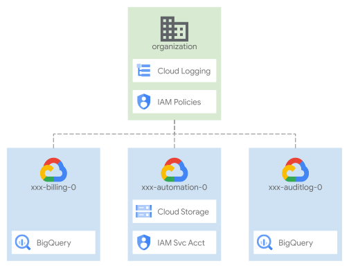

# Organization bootstrap

The primary purpose of this stage is to enable critical organization-level functionalities that depend on broad administrative permissions, and prepare the prerequisites needed to enable automation in this and future stages.

It is intentionally simple, to minimize usage of administrative-level permissions and enable simple auditing and troubleshooting, and only deals with three sets of resources:

- project, service accounts, and GCS buckets for automation
- projects, BQ datasets, and sinks for audit log and billing exports
- IAM bindings on the organization

Use the following diagram as a simple high level reference for the following sections, which describe the stage and its possible customizations in detail.

<p align="center">
  
</p>

## Table of contents

- [Design overview and choices](#design-overview-and-choices)
  - [User groups](#user-groups)
  - [Organization-level IAM](#organization-level-iam)
  - [Automation project and resources](#automation-project-and-resources)
  - [Billing account](#billing-account)
  - [Organization-level logging](#organization-level-logging)
  - [Naming](#naming)
  - [Workload Identity Federation and CI/CD](#workload-identity-federation-and-cicd)
- [How to run this stage](#how-to-run-this-stage)
  - [Prerequisites](#prerequisites)
  - [Output files and cross-stage variables](#output-files-and-cross-stage-variables)
  - [Running the stage](#running-the-stage)
- [Customizations](#customizations)
  - [Group names](#group-names)
  - [IAM](#iam)
  - [Log sinks and log destinations](#log-sinks-and-log-destinations)
  - [Names and naming convention](#names-and-naming-convention)
  - [Workload Identity Federation](#workload-identity-federation)
  - [CI/CD repositories](#cicd-repositories)

## Design overview and choices

As mentioned above, this stage only does the bare minimum required to bootstrap automation, and ensure that base audit and billing exports are in place from the start to provide some measure of accountability, even before the security configurations are applied in a later stage.

It also sets up organization-level IAM bindings so the Organization Administrator role is only used here, trading off some design freedom for ease of auditing and troubleshooting, and reducing the risk of costly security mistakes down the line. The only exception to this rule is for the [Resource Management stage](../1-resman) service account, described below.

### User groups

User groups are important, not only here but throughout the whole automation process. They provide a stable frame of reference that allows decoupling the final set of permissions for each group, from the stage where entities and resources are created and their IAM bindings defined. For example, the final set of roles for the networking group is contributed by this stage at the organization level (XPN Admin, Cloud Asset Viewer, etc.), and by the Resource Management stage at the folder level.

We have standardized the initial set of groups on those outlined in the [GCP Enterprise Setup Checklist](https://cloud.google.com/docs/enterprise/setup-checklist) to simplify adoption. They provide a comprehensive and flexible starting point that can suit most users. Adding new groups, or deviating from the initial setup is  possible and reasonably simple, and it's briefly outlined in the customization section below.

### Organization-level IAM

The service account used in the [Resource Management stage](../1-resman) needs to be able to grant specific permissions at the organizational level, to enable specific functionality for subsequent stages that deal with network or security resources, or billing-related activities.

In order to be able to assign those roles without having the full authority of the Organization Admin role, this stage defines a custom role that only allows setting IAM policies on the organization, and grants it via a [delegated role grant](https://cloud.google.com/iam/docs/setting-limits-on-granting-roles) that only allows it to be used to grant a limited subset of roles.

In this way, the Resource Management service account can effectively act as an Organization Admin, but only to grant the specific roles it needs to control.

One consequence of the above setup is the need to configure IAM bindings that can be assigned via the condition as non-authoritative, since those same roles are effectively under the control of two stages: this one and Resource Management. Using authoritative bindings for these roles (instead of non-authoritative ones) would generate potential conflicts, where each stage could try to overwrite and negate the bindings applied by the other at each `apply` cycle.

A full reference of IAM roles managed by this stage [is available here](./IAM.md).

### Automation project and resources

One other design choice worth mentioning here is using a single automation project for all foundational stages. We trade off some complexity on the API side (single source for usage quota, multiple service activation) for increased flexibility and simpler operations, while still effectively providing the same degree of separation via resource-level IAM.

### Billing account

We support three use cases in regards to billing:

- the billing account is part of this same organization, IAM bindings will be set at the organization level
- the billing account is not considered part of an organization (even though it might be), billing IAM bindings are set on the billing account itself
- billing IAM is managed separately, and no bindings should (or can) be set via Terraform, this requires a few extra steps and is definitely not recommended and mainly used for development purposes

For same-organization billing, we configure a custom organization role that can set IAM bindings, via a delegated role grant to limit its scope to the relevant roles.

For details on configuring the different billing account modes, refer to the [How to run this stage](#how-to-run-this-stage) section below.

Because of limitations of API availability, manual steps have to be followed to enable billing export within billing project to BigQuery dataset `billing_export` which will be created as part of the bootstrap stage. The process to share billing data [is outlined here](https://cloud.google.com/billing/docs/how-to/export-data-bigquery-setup#enable-bq-export).

### Organization-level logging

We create organization-level log sinks early in the bootstrap process to ensure a proper audit trail is in place from the very beginning.  By default, we provide log filters to capture [Cloud Audit Logs](https://cloud.google.com/logging/docs/audit) and [VPC Service Controls violations](https://cloud.google.com/vpc-service-controls/docs/troubleshooting#vpc-sc-errors) into a Bigquery dataset in the top-level audit project.

The [Customizations](#log-sinks-and-log-destinations) section explains how to change the logs captured and their destination.

### Naming

We are intentionally not supporting random prefix/suffixes for names, as that is an antipattern typically only used in development. It does not map to our customer's actual production usage, where they always adopt a fixed naming convention.

What is implemented here is a fairly common convention, composed of tokens ordered by relative importance:

- a static prefix less or equal to 9 characters (e.g. `myco` or `myco-gcp`)
- an environment identifier (e.g. `prod`)
- a team/owner identifier (e.g. `sec` for Security)
- a context identifier (e.g. `core` or `kms`)
- an arbitrary identifier used to distinguish similar resources (e.g. `0`, `1`)

Tokens are joined by a `-` character, making it easy to separate the individual tokens visually, and to programmatically split them in billing exports to derive initial high-level groupings for cost attribution.

The convention is used in its full form only for specific resources with globally unique names (projects, GCS buckets). Other resources adopt a shorter version for legibility, as the full context can always be derived from their project.

The [Customizations](#names-and-naming-convention) section on names below explains how to configure tokens, or implement a different naming convention.

### Workload Identity Federation and CI/CD

This stage also implements initial support for two interrelated features

- configuration of [Workload Identity Federation](https://cloud.google.com/iam/docs/workload-identity-federation) pools and providers
- configuration of CI/CD repositories to allow impersonation via Workload identity Federation, and stage running via provided workflow templates

Workload Identity Federation support allows configuring external providers independently from CI/CD, and offers predefined attributes for a few well known ones (more can be easily added by editing the `identity-providers.tf` file). Once providers have been configured their names are passed to the following stages via interface outputs, and can be leveraged to set up access or impersonation in IAM bindings.

CI/CD support is fully implemented for GitHub, Gitlab, and Cloud Source Repositories / Cloud Build. For GitHub, we also offer a [separate supporting setup](../../extras/0-cicd-github/) to quickly create / configure repositories.

<!-- TODO: add a general overview of our design -->

For details on how to configure both features, refer to the Customizations sections below on [Workload Identity Federation](#workload-identity-federation) and [CI/CD repositories](#cicd-repositories).

These features are optional and only enabled if the relevant variables have been populated.

## How to run this stage

This stage has straightforward initial requirements, as it is designed to work on newly created GCP organizations. Four steps are needed to bring up this stage:

- an Organization Admin self-assigns the required roles listed below
- the same administrator runs the first `init/apply` sequence passing a special variable to `apply`
- the providers configuration file is derived from the Terraform output or linked from the generated file
- a second `init` is run to migrate state, and from then on, the stage is run via impersonation

### Prerequisites

The roles that the Organization Admin used in the first `apply` needs to self-grant are:

- Billing Account Administrator (`roles/billing.admin`)
  either on the organization or the billing account (see the following section for details)
- Logging Admin (`roles/logging.admin`)
- Organization Role Administrator (`roles/iam.organizationRoleAdmin`)
- Organization Administrator (`roles/resourcemanager.organizationAdmin`)
- Project Creator (`roles/resourcemanager.projectCreator`)

To quickly self-grant the above roles, run the following code snippet as the initial Organization Admin:

```bash
# set variable for current logged in user
export FAST_BU=$(gcloud config list --format 'value(core.account)')

# find and set your org id
gcloud organizations list
export FAST_ORG_ID=123456

# set needed roles
export FAST_ROLES="roles/billing.admin roles/logging.admin \
  roles/iam.organizationRoleAdmin roles/resourcemanager.projectCreator"

for role in $FAST_ROLES; do
  gcloud organizations add-iam-policy-binding $FAST_ORG_ID \
    --member user:$FAST_BU --role $role
done
```

Then make sure the same user is also part of the `gcp-organization-admins` group so that impersonating the automation service account later on will be possible.

#### Standalone billing account

If you are using a standalone billing account, the identity applying this stage for the first time needs to be a billing account administrator:

```bash
export FAST_BILLING_ACCOUNT_ID=ABCD-01234-ABCD
gcloud beta billing accounts add-iam-policy-binding $FAST_BILLING_ACCOUNT_ID \
  --member user:$FAST_BU --role roles/billing.admin
```

#### Preventing creation of billing-related IAM bindings

This configuration is possible but unsupported and only present for development purposes, use at your own risk:

- configure `billing_account.id` as `null` and `billing.no_iam` to `true` in your `tfvars` file
- apply with `terraform apply -target 'module.automation-project.google_project.project[0]'` in addition to the initial user variable
- once Terraform raises an error run `terraform untaint 'module.automation-project.google_project.project[0]'`
- repeat the two steps above for `'module.log-export-project.google_project.project[0]'`
- go through the process to associate the billing account with the two projects
- configure `billing_account.id` with the real billing account id
- resume applying normally

#### Groups

Before the first run, the following IAM groups must exist to allow IAM bindings to be created (actual names are flexible, see the [Customization](#customizations) section):

- `gcp-billing-admins`
- `gcp-devops`
- `gcp-network-admins`
- `gcp-organization-admins`
- `gcp-security-admins`

You can refer to [this animated image](./groups.gif) for a step by step on group creation.

Please note that FAST also supports an additional group for users with permissions to create support tickets and view logging and monitoring data. To remain consistent with the [Google Cloud Enterprise Checklist](https://cloud.google.com/docs/enterprise/setup-checklist) we map these permissions to the `gcp-devops` by default. However, we recommend creating a dedicated `gcp-support` group and updating the `groups` variable with the right value.

#### Configure variables

Then make sure you have configured the correct values for the following variables by providing a `terraform.tfvars` file:

- `billing_account`
  an object containing `id` as the id of your billing account, derived from the Cloud Console UI or by running `gcloud beta billing accounts list`, and the `is_org_level` flag that controls whether organization or account-level bindings are used, and a billing export project and dataset are created
- `groups`
  the name mappings for your groups, if you're following the default convention you can leave this to the provided default
- `organization.id`, `organization.domain`, `organization.customer_id`
  the id, domain and customer id of your organization, derived from the Cloud Console UI or by running `gcloud organizations list`
- `prefix`
  the fixed prefix used in your naming, maximum 9 characters long

You can also adapt the example that follows to your needs:

```tfvars
# use `gcloud beta billing accounts list`
# if you have too many accounts, check the Cloud Console :)
billing_account = {
 id              = "012345-67890A-BCDEF0"
}

# use `gcloud organizations list`
organization = {
 domain      = "example.org"
 id          = 1234567890
 customer_id = "C000001"
}

outputs_location = "~/fast-config"

# use something unique and no longer than 9 characters
prefix = "abcd"
```

### Output files and cross-stage variables

Each foundational FAST stage generates provider configurations and variable files can be consumed by the following stages, and saves them in a dedicated GCS bucket in the automation project. These files are a handy way to simplify stage configuration, and are also used by our CI/CD workflows to configure the repository files in the pipelines that validate and apply the code.

Alongisde the GCS stored files, you can also configure a second copy to be saves on the local filesystem, as a convenience when developing or bringing up the infrastructure before a proper CI/CD setup is in place.

This second set of files is disabled by default, you can enable it by setting the `outputs_location` variable to a valid path on a local filesystem, e.g.

```tfvars
outputs_location = "~/fast-config"
```

Once the variable is set, `apply` will generate and manage providers and variables files, including the initial one used for this stage after the first run. You can then link these files in the relevant stages, instead of manually transfering outputs from one stage, to Terraform variables in another.

Below is the outline of the output files generated by all stages, which is identical for both the GCS and local filesystem copies:

```bash
[path specified in outputs_location]
├── providers
│   ├── 0-bootstrap-providers.tf
│   ├── 1-resman-providers.tf
│   ├── 2-networking-providers.tf
│   ├── 2-security-providers.tf
│   ├── 3-project-factory-dev-providers.tf
│   ├── 3-project-factory-prod-providers.tf
│   └── 9-sandbox-providers.tf
└── tfvars
│   ├── 0-bootstrap.auto.tfvars.json
│   ├── 1-resman.auto.tfvars.json
│   ├── 2-networking.auto.tfvars.json
│   └── 2-security.auto.tfvars.json
└── workflows
    └── [optional depending on the configured CI/CD repositories]
```

### Running the stage

Before running `init` and `apply`, check your environment so no extra variables that might influence authentication are present (e.g. `GOOGLE_IMPERSONATE_SERVICE_ACCOUNT`). In general you should use user application credentials, and FAST will then take care to provision automation identities and configure impersonation for you.

When running the first `apply` as a user, you need to pass a special runtime variable so that the user roles are preserved when setting IAM bindings.

```bash
terraform init
terraform apply \
  -var bootstrap_user=$(gcloud config list --format 'value(core.account)')
```

> If you see an error related to project name already exists, please make sure the project name is unique or the project was not deleted recently

Once the initial `apply` completes successfully, configure a remote backend using the new GCS bucket, and impersonation on the automation service account for this stage. To do this you can use the generated `providers.tf` file from either

- the local filesystem if you have configured output files as described above
- the GCS bucket where output files are always stored
- Terraform outputs (not recommended as it's more complex)

The following two snippets show how to leverage the `stage-links.sh` script in the root FAST folder to fetch the commands required for output files linking or copying, using either the local output folder configured via Terraform variables, or the GCS bucket which can be derived from the `automation` output.

```bash
../../stage-links.sh ~/fast-config

# copy and paste the following commands for '0-bootstrap'

ln -s ~/fast-config/providers/0-bootstrap-providers.tf ./
```

```bash
../../stage-links.sh gs://xxx-prod-iac-core-outputs-0

# copy and paste the following commands for '0-bootstrap'

gcloud alpha storage cp gs://xxx-prod-iac-core-outputs-0/providers/0-bootstrap-providers.tf ./
```

Copy/paste the command returned by the script to link or copy the provider file, then migrate state with `terraform init` and run `terraform apply`:

```bash
terraform init -migrate-state
terraform apply
```

Make sure the user you're logged in with is a member of the `gcp-organization-admins` group or impersonation will not be possible.

## Customizations

Most variables (e.g. `billing_account` and `organization`) are only used to input actual values and should be self-explanatory. The only meaningful customizations that apply here are groups, and IAM roles.

### Group names

As we mentioned above, groups reflect the convention used in the [GCP Enterprise Setup Checklist](https://cloud.google.com/docs/enterprise/setup-checklist), with an added level of indirection: the `groups` variable maps logical names to actual names, so that you don't need to delve into the code if your group names do not comply with the checklist convention.

For example, if your network admins team is called `net-rockstars@example.com`, simply set that name in the variable, minus the domain which is interpolated internally with the organization domain:

```hcl
variable "groups" {
  description = "Group names to grant organization-level permissions."
  type        = map(string)
  default = {
    gcp-network-admins = "net-rockstars"
    # [...]
  }
}
# tftest skip
```

If your groups layout differs substantially from the checklist, define all relevant groups in the `groups` variable, then rearrange IAM roles in the code to match your setup.

### IAM

One other area where we directly support customizations is IAM. The code here, as in all stages, follows a simple pattern derived from best practices:

- operational roles for humans are assigned to groups
- any other principal is a service account

In code, the distinction above reflects on how IAM bindings are specified in the underlying module variables:

- group roles "for humans" always use `iam_groups` variables
- service account roles always use `iam` variables

This makes it easy to tweak user roles by adding mappings to the `iam_groups` variables of the relevant resources, without having to understand and deal with the details of service account roles.

In those cases where roles need to be assigned to end-user service accounts (e.g. an application or pipeline service account), we offer a stage-level `iam` variable that allows pinpointing individual role/members pairs, without having to touch the code internals, to avoid the risk of breaking a critical role for a robot account. The variable can also be used to assign roles to specific users or to groups external to the organization, e.g. to support external suppliers.

The one exception to this convention is for roles which are part of the delegated grant condition described above, and which can then be assigned from other stages. In this case, use the `iam_additive` variable as they are implemented with non-authoritative resources. Using non-authoritative bindings ensure that re-executing this stage will not override any bindings set in downstream stages.

A full reference of IAM roles managed by this stage [is available here](./IAM.md).

### Log sinks and log destinations

You can customize organization-level logs through the `log_sinks` variable in two ways:

- creating additional log sinks to capture more logs
- changing the destination of captured logs

By default, all logs are exported to a log bucket, but FAST can create sinks to BigQuery, GCS, or PubSub.

If you need to capture additional logs, please refer to GCP's documentation on [scenarios for exporting logging data](https://cloud.google.com/architecture/exporting-stackdriver-logging-for-security-and-access-analytics), where you can find ready-made filter expressions for different use cases.

### Names and naming convention

Configuring the individual tokens for the naming convention described above, has varying degrees of complexity:

- the static prefix can be set via the `prefix` variable once
- the environment identifier is set to `prod` as resources here influence production and are considered as such, and can be changed in `main.tf` locals

All other tokens are set directly in resource names, as providing abstractions to manage them would have added too much complexity to the code, making it less readable and more fragile.

If a different convention is needed, identify names via search/grep (e.g. with `^\s+name\s+=\s+"`) and change them in an editor: it should take a couple of  minutes at most, as there's just a handful of modules and resources to change.

Names used in internal references (e.g. `module.foo-prod.id`) are only used by Terraform and do not influence resource naming, so they are best left untouched to avoid having to debug complex errors.

### Workload Identity Federation

At any time during this stage's lifecycle you can configure a Workload Identity Federation pool, and one or more providers. These are part of this stage's interface, included in the automatically generated `.tfvars` files and accepted by the Resource Managent stage that follows.

The variable maps each provider's `issuer` attribute with the definitions in the `identity-providers.tf` file. We currently support GitHub and Gitlab directly, and extending to definitions to support more providers is trivial (send us a PR if you do!).

Provider key names are used by the `cicd_repositories` variable to configure authentication for CI/CD repositories, and generally from your Terraform code whenever you need to configure IAM access or impersonation for federated identities.

This is a sample configuration of a GitHub and a Gitlab provider, `attribute_condition` attribute can use any of the mapped attribute for the provider (refer to the `identity-providers.tf` file for the full list) or set to `null` if needed:

```tfvars
federated_identity_providers = {
  github-sample = {
    attribute_condition = "attribute.repository_owner==\"my-github-org\""
    issuer              = "github"
    custom_settings     = null
  }
  gitlab-sample = {
    attribute_condition = "attribute.namespace_path==\"my-gitlab-org\""
    issuer              = "gitlab"
    custom_settings     = null
  }
  gitlab-ce-sample = {
    attribute_condition = "attribute.namespace_path==\"my-gitlab-org\""
    issuer              = "gitlab"
    custom_settings = {
      issuer_uri        = "https://gitlab.fast.example.com"
      allowed_audiences = ["https://gitlab.fast.example.com"]
    }
  }
}
```

### CI/CD repositories

FAST is designed to directly support running in automated workflows from separate repositories for each stage. The `cicd_repositories` variable allows you to configure impersonation from external repositories leveraging Workload identity Federation, and pre-configures a FAST workflow file that can be used to validate and apply the code in each repository.

The repository design we support is fairly simple, with a repository for modules that enables centralization and versioning, and one repository for each stage optionally configured from the previous stage.

This is an example of configuring the bootstrap and resource management repositories in this stage. CI/CD configuration is optional, so the entire variable or any of its attributes can be set to null if not needed.

```tfvars
cicd_repositories = {
  bootstrap = {
    branch            = null
    identity_provider = "github-sample"
    name              = "my-gh-org/fast-bootstrap"
    type              = "github"
  }
  resman = {
    branch            = "main"
    identity_provider = "github-sample"
    name              = "my-gh-org/fast-resman"
    type              = "github"
  }
}
```

The `type` attribute can be set to one of the supported repository types: `github`, `gitlab`, or `sourcerepo`.

Once the stage is applied the generated output files will contain pre-configured workflow files for each repository, that will use Workload Identity Federation via a dedicated service account for each repository to impersonate the automation service account for the stage.

You can use Terraform to automate creation of the repositories using the extra stage defined in [fast/extras/0-cicd-github](../../extras/0-cicd-github/) (only for Github for now).

The remaining configuration is manual, as it regards the repositories themselves:

- create a repository for modules
  - clone and populate it with the Fabric modules
  - configure authentication to the modules repository
    - for GitHub
      - create a key pair
      - create a [deploy key](https://docs.github.com/en/developers/overview/managing-deploy-keys#deploy-keys) in the modules repository with the public key
      - create a `CICD_MODULES_KEY` secret with the private key in each of the repositories that need to access modules (for Gitlab, please Base64 encode the private key for masking)
    - for Gitlab
      - TODO
    - for Source Repositories
      - assign the reader role to the CI/CD service accounts
- create one repository for each stage
  - clone and populate them with the stage source
  - edit the modules source to match your modules repository
    - a simple way is using the "Replace in files" function of your editor
      - search for `source\s*= "../../../modules/([^"]+)"`
      - replace with:
        - modules stored on GitHub: `source = "git@github.com:my-org/fast-modules.git//$1?ref=v1.0"`
        - modules stored on Gitlab: `source = "git::ssh://git@gitlab.com/my-org/fast-modules.git//$1?ref=v1.0"`
        - modules stored on Source Repositories: `source = git::https://source.developers.google.com/p/my-project/r/my-repository//$1?ref=v1.0"`. You may need to run `git config --global credential.'https://source.developers.google.com'.helper gcloud.sh` first as documented [here](https://cloud.google.com/source-repositories/docs/adding-repositories-as-remotes#add_the_repository_as_a_remote)
  - copy the generated workflow file for the stage from the GCS output files bucket or from the local clone if enabled
    - for GitHub, place it in a `.github/workflows` folder in the repository root
    - for Gitlab, rename it to `.gitlab-ci.yml` and place it in the repository root
    - for Source Repositories, place it in `.cloudbuild/workflow.yaml`

<!-- TFDOC OPTS files:1 show_extra:1 -->
<!-- BEGIN TFDOC -->

## Files

| name | description | modules | resources |
|---|---|---|---|
| [automation.tf](./automation.tf) | Automation project and resources. | <code>gcs</code> · <code>iam-service-account</code> · <code>project</code> |  |
| [billing.tf](./billing.tf) | Billing export project and dataset. | <code>bigquery-dataset</code> · <code>project</code> | <code>google_billing_account_iam_member</code> |
| [cicd.tf](./cicd.tf) | Workload Identity Federation configurations for CI/CD. | <code>iam-service-account</code> · <code>source-repository</code> |  |
| [identity-providers.tf](./identity-providers.tf) | Workload Identity Federation provider definitions. |  | <code>google_iam_workload_identity_pool</code> · <code>google_iam_workload_identity_pool_provider</code> |
| [log-export.tf](./log-export.tf) | Audit log project and sink. | <code>bigquery-dataset</code> · <code>gcs</code> · <code>logging-bucket</code> · <code>project</code> · <code>pubsub</code> |  |
| [main.tf](./main.tf) | Module-level locals and resources. |  |  |
| [organization.tf](./organization.tf) | Organization-level IAM. | <code>organization</code> | <code>google_organization_iam_binding</code> |
| [outputs-files.tf](./outputs-files.tf) | Output files persistence to local filesystem. |  | <code>local_file</code> |
| [outputs-gcs.tf](./outputs-gcs.tf) | Output files persistence to automation GCS bucket. |  | <code>google_storage_bucket_object</code> |
| [outputs.tf](./outputs.tf) | Module outputs. |  |  |
| [variables.tf](./variables.tf) | Module variables. |  |  |

## Variables

| name | description | type | required | default | producer |
|---|---|:---:|:---:|:---:|:---:|
| [billing_account](variables.tf#L17) | Billing account id. If billing account is not part of the same org set `is_org_level` to `false`. To disable handling of billing IAM roles set `no_iam` to `true`. | <code title="object&#40;&#123;&#10;  id           &#61; string&#10;  is_org_level &#61; optional&#40;bool, true&#41;&#10;  no_iam       &#61; optional&#40;bool, false&#41;&#10;&#125;&#41;">object&#40;&#123;&#8230;&#125;&#41;</code> | ✓ |  |  |
| [organization](variables.tf#L194) | Organization details. | <code title="object&#40;&#123;&#10;  domain      &#61; string&#10;  id          &#61; number&#10;  customer_id &#61; string&#10;&#125;&#41;">object&#40;&#123;&#8230;&#125;&#41;</code> | ✓ |  |  |
| [prefix](variables.tf#L209) | Prefix used for resources that need unique names. Use 9 characters or less. | <code>string</code> | ✓ |  |  |
| [bootstrap_user](variables.tf#L27) | Email of the nominal user running this stage for the first time. | <code>string</code> |  | <code>null</code> |  |
| [cicd_repositories](variables.tf#L33) | CI/CD repository configuration. Identity providers reference keys in the `federated_identity_providers` variable. Set to null to disable, or set individual repositories to null if not needed. | <code title="object&#40;&#123;&#10;  bootstrap &#61; optional&#40;object&#40;&#123;&#10;    branch            &#61; string&#10;    identity_provider &#61; string&#10;    name              &#61; string&#10;    type              &#61; string&#10;  &#125;&#41;&#41;&#10;  resman &#61; optional&#40;object&#40;&#123;&#10;    branch            &#61; string&#10;    identity_provider &#61; string&#10;    name              &#61; string&#10;    type              &#61; string&#10;  &#125;&#41;&#41;&#10;&#125;&#41;">object&#40;&#123;&#8230;&#125;&#41;</code> |  | <code>null</code> |  |
| [custom_role_names](variables.tf#L79) | Names of custom roles defined at the org level. | <code title="object&#40;&#123;&#10;  organization_iam_admin        &#61; string&#10;  service_project_network_admin &#61; string&#10;  tenant_network_admin          &#61; string&#10;&#125;&#41;">object&#40;&#123;&#8230;&#125;&#41;</code> |  | <code title="&#123;&#10;  organization_iam_admin        &#61; &#34;organizationIamAdmin&#34;&#10;  service_project_network_admin &#61; &#34;serviceProjectNetworkAdmin&#34;&#10;  tenant_network_admin          &#61; &#34;tenantNetworkAdmin&#34;&#10;&#125;">&#123;&#8230;&#125;</code> |  |
| [fast_features](variables.tf#L93) | Selective control for top-level FAST features. | <code title="object&#40;&#123;&#10;  data_platform   &#61; optional&#40;bool, false&#41;&#10;  gke             &#61; optional&#40;bool, false&#41;&#10;  project_factory &#61; optional&#40;bool, false&#41;&#10;  sandbox         &#61; optional&#40;bool, false&#41;&#10;  teams           &#61; optional&#40;bool, false&#41;&#10;&#125;&#41;">object&#40;&#123;&#8230;&#125;&#41;</code> |  | <code>&#123;&#125;</code> |  |
| [federated_identity_providers](variables.tf#L106) | Workload Identity Federation pools. The `cicd_repositories` variable references keys here. | <code title="map&#40;object&#40;&#123;&#10;  attribute_condition &#61; string&#10;  issuer              &#61; string&#10;  custom_settings &#61; object&#40;&#123;&#10;    issuer_uri        &#61; string&#10;    allowed_audiences &#61; list&#40;string&#41;&#10;  &#125;&#41;&#10;&#125;&#41;&#41;">map&#40;object&#40;&#123;&#8230;&#125;&#41;&#41;</code> |  | <code>&#123;&#125;</code> |  |
| [groups](variables.tf#L120) | Group names to grant organization-level permissions. | <code>map&#40;string&#41;</code> |  | <code title="&#123;&#10;  gcp-billing-admins      &#61; &#34;gcp-billing-admins&#34;,&#10;  gcp-devops              &#61; &#34;gcp-devops&#34;,&#10;  gcp-network-admins      &#61; &#34;gcp-network-admins&#34;&#10;  gcp-organization-admins &#61; &#34;gcp-organization-admins&#34;&#10;  gcp-security-admins     &#61; &#34;gcp-security-admins&#34;&#10;  gcp-support &#61; &#34;gcp-devops&#34;&#10;&#125;">&#123;&#8230;&#125;</code> |  |
| [iam](variables.tf#L138) | Organization-level custom IAM settings in role => [principal] format. | <code>map&#40;list&#40;string&#41;&#41;</code> |  | <code>&#123;&#125;</code> |  |
| [iam_additive](variables.tf#L144) | Organization-level custom IAM settings in role => [principal] format for non-authoritative bindings. | <code>map&#40;list&#40;string&#41;&#41;</code> |  | <code>&#123;&#125;</code> |  |
| [locations](variables.tf#L150) | Optional locations for GCS, BigQuery, and logging buckets created here. | <code title="object&#40;&#123;&#10;  bq      &#61; string&#10;  gcs     &#61; string&#10;  logging &#61; string&#10;  pubsub  &#61; list&#40;string&#41;&#10;&#125;&#41;">object&#40;&#123;&#8230;&#125;&#41;</code> |  | <code title="&#123;&#10;  bq      &#61; &#34;EU&#34;&#10;  gcs     &#61; &#34;EU&#34;&#10;  logging &#61; &#34;global&#34;&#10;  pubsub  &#61; &#91;&#93;&#10;&#125;">&#123;&#8230;&#125;</code> |  |
| [log_sinks](variables.tf#L169) | Org-level log sinks, in name => {type, filter} format. | <code title="map&#40;object&#40;&#123;&#10;  filter &#61; string&#10;  type   &#61; string&#10;&#125;&#41;&#41;">map&#40;object&#40;&#123;&#8230;&#125;&#41;&#41;</code> |  | <code title="&#123;&#10;  audit-logs &#61; &#123;&#10;    filter &#61; &#34;logName:&#92;&#34;&#47;logs&#47;cloudaudit.googleapis.com&#37;2Factivity&#92;&#34; OR logName:&#92;&#34;&#47;logs&#47;cloudaudit.googleapis.com&#37;2Fsystem_event&#92;&#34;&#34;&#10;    type   &#61; &#34;logging&#34;&#10;  &#125;&#10;  vpc-sc &#61; &#123;&#10;    filter &#61; &#34;protoPayload.metadata.&#64;type&#61;&#92;&#34;type.googleapis.com&#47;google.cloud.audit.VpcServiceControlAuditMetadata&#92;&#34;&#34;&#10;    type   &#61; &#34;logging&#34;&#10;  &#125;&#10;&#125;">&#123;&#8230;&#125;</code> |  |
| [outputs_location](variables.tf#L203) | Enable writing provider, tfvars and CI/CD workflow files to local filesystem. Leave null to disable. | <code>string</code> |  | <code>null</code> |  |
| [project_parent_ids](variables.tf#L219) | Optional parents for projects created here in folders/nnnnnnn format. Null values will use the organization as parent. | <code title="object&#40;&#123;&#10;  automation &#61; string&#10;  billing    &#61; string&#10;  logging    &#61; string&#10;&#125;&#41;">object&#40;&#123;&#8230;&#125;&#41;</code> |  | <code title="&#123;&#10;  automation &#61; null&#10;  billing    &#61; null&#10;  logging    &#61; null&#10;&#125;">&#123;&#8230;&#125;</code> |  |

## Outputs

| name | description | sensitive | consumers |
|---|---|:---:|---|
| [automation](outputs.tf#L86) | Automation resources. |  |  |
| [billing_dataset](outputs.tf#L91) | BigQuery dataset prepared for billing export. |  |  |
| [cicd_repositories](outputs.tf#L96) | CI/CD repository configurations. |  |  |
| [custom_roles](outputs.tf#L108) | Organization-level custom roles. |  |  |
| [federated_identity](outputs.tf#L113) | Workload Identity Federation pool and providers. |  |  |
| [outputs_bucket](outputs.tf#L123) | GCS bucket where generated output files are stored. |  |  |
| [project_ids](outputs.tf#L128) | Projects created by this stage. |  |  |
| [providers](outputs.tf#L138) | Terraform provider files for this stage and dependent stages. | ✓ | <code>stage-01</code> |
| [service_accounts](outputs.tf#L145) | Automation service accounts created by this stage. |  |  |
| [tfvars](outputs.tf#L154) | Terraform variable files for the following stages. | ✓ |  |

<!-- END TFDOC -->
