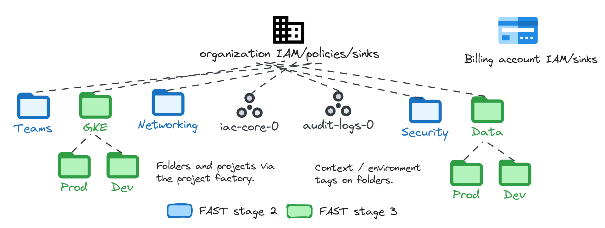

# FAST Organization Setup

<!-- BEGIN TOC -->
- [Quickstart](#quickstart)
  - [Prerequisites](#prerequisites)
  - [Select/configure a factory dataset](#selectconfigure-a-factory-dataset)
  - [Configure defaults](#configure-defaults)
  - [Initial user permissions](#initial-user-permissions)
  - [First apply cycle](#first-apply-cycle)
    - [Importing org policies](#importing-org-policies)
    - [Local output files storage](#local-output-files-storage)
    - [Init and apply the stage](#init-and-apply-the-stage)
  - [Provider setup and final apply cycle](#provider-setup-and-final-apply-cycle)
- [Default factory datasets](#default-factory-datasets)
  - ["Classic FAST" dataset](#classic-fast-dataset)
  - ["Hardened" dataset](#hardened-dataset)
  - ["Minimal" dataset (TBD)](#minimal-dataset-tbd)
  - ["Tenants" dataset (TBD)](#tenants-dataset-tbd)
- [Detailed configuration](#detailed-configuration)
  - [Context interpolation](#context-interpolation)
  - [Factory data](#factory-data)
  - [Defaults configuration](#defaults-configuration)
  - [Billing account IAM and billing export](#billing-account-iam-and-billing-export)
    - [Context-based replacement in the billing account factory](#context-based-replacement-in-the-billing-account-factory)
  - [Organization configuration](#organization-configuration)
    - [Context-based replacement in organization factories](#context-based-replacement-in-organization-factories)
  - [Resource management hierarchy](#resource-management-hierarchy)
    - [Context-based replacement in the folders factory](#context-based-replacement-in-the-folders-factory)
  - [Project factory](#project-factory)
  - [CI/CD configuration](#cicd-configuration)
    - [Okta](#okta)
- [Leveraging classic FAST Stages](#leveraging-classic-fast-stages)
  - [VPC Service Controls](#vpc-service-controls)
  - [Security](#security)
- [Files](#files)
- [Variables](#variables)
- [Outputs](#outputs)
<!-- END TOC -->

This stage implements a flexible approach to organization bootstrapping and resource management, that offers full customization via YAML factories.

It heavily relies on a new [project factory module](../../../modules/project-factory/) for folder and project configurations, and leverages a new approach to [context-based interpolation](../../../modules/project-factory/README.md#context-based-interpolation) that allows writing legible, portable YAML definitions.

The default set of YAML configuration files in the `data` folder mirrors the traditional FAST layout, and implements full compatibility with existing FAST stages like VPC-SC, security, networking, etc.

The default configuration can be used as a starting point for radically different Landing Zone designs, or it can be trimmed down to the bare minimum required for a secure, organization-level configuration with a working project factory.

## Quickstart

The high-level flow for running this stage is:

- ensure all **pre-requisites** are in place, and identify at least one GCP organization admin principal (ideally a group)
- select the **factory data set** for the factories among those available - populate the **defaults file** with attributes matching your configuration (organization id, billing account, etc.)
(`data`, `data-minimal`, etc.) or edit/create your own
- assign a set of **initial IAM roles** to the admin principal
- run a **first init/apply cycle** using user credentials
- copy the generated provider file, **migrate state**, then run a second init/apply cycle using service account impersonated credentials

### Prerequisites

This stage only requires minimal prerequisites:

- one organization
- credentials with admin access to the organization and one billing account

The organization ideally needs to be empty. If pre-existing resources are present some care needs to be put into preserving their existing IAM and org policies. Ideally, move legacy projects to a dedicated folder where the current org-level configuration can be replicated.

Billing admin permissions are ideally available on either an org-contained billing account or an external one. If those are unavailable, the YAML configuration files need to be updated to remove billing IAM bindings, and those need to be assigned via an external flow. Refer to the [billing section](#billing-account-iam) for more details or non-standard configurations.

The admin principal is typically a group that includes the user running the first apply, but any kind of principal is supported. More principals (network admins, security admins, etc.) are present in some of the [default factories datasets](#default-factory-datasets), and others can be added if needed by editing the YAML configuration files.

### Select/configure a factory dataset

The `factories_config` variable points to several paths containing the YAML configuration files used by this stage. The default variable configuration points to the legacy FAST compatible fileset in the `data` folder.

If this configuration matches requirements, no changes are necessary at this stage. To select a different setup create a `tfvars` file and set paths to the desired data folder, like shown in the example below. The different configurations produced by each fileset are described [later in this document](#default-factory-datasets).

```bash
# create a file named 0-org-setup.auto.tfvars containing the following
# and replace paths by pointing them to the desired data folder
factories_config = {
  billing_accounts = "datasets/classic/billing-accounts"
  cicd             = "datasets/classic/cicd.yaml"
  defaults         = "datasets/classic/defaults.yaml"
  folders          = "datasets/classic/folders"
  organization     = "datasets/classic/organization"
  projects         = "datasets/classic/projects"
}
```

### Configure defaults

Configurations defaults are stored in the `defaults.yaml` file in the dataset selected above. Before starting, edit the following attributes in the file to match your configuration.

The standard datasets use the `gcp-organization-admins` alias to assign administrator roles. The alias is expanded via the `context.iam_principals` attribute in the default file, which should be set to a valid group. Also make sure that the user running the initial apply is a member.

```yaml
global:
  # gcloud beta billing accounts list
  billing_account: 123456-123456-123456
  organization:
    # gcloud organizations list
    domain: example.org
    id: 1234567890
    customer_id: ABC0123CDE
projects:
  defaults:
    # define a unique prefix with a maximum of 9 characters
    prefix: foo-1
  locations:
    bigquery: $locations:primary
    logging: $locations:primary
    storage: $locations:primary
context:
  iam_principals:
    # make sure the user running apply is a member of this group
    gcp-organization-admins: group:fabric-fast-owners@example.com
  locations:
    primary: europe-west1
```

A more detailed example containing a few other attributes that can be set in the file is in a [later section](#defaults-configuration) in this document.

### Initial user permissions

Like in classic FAST, the user running the first apply cycle needs specific permissions on the organization and billing account. Copy the following snippet, edit it to match your organization/billing account ids, then run each command.

To quickly self-grant the above roles, run the following code snippet as the initial Organization Admin. The best approach is to use the same group used for organization admins above.

```bash
export FAST_PRINCIPAL="group:gcp-organization-admins@example.com"

# find your organization and export its id in the FAST_ORG variable
gcloud organizations list
export FAST_ORG_ID=123456

# set needed roles (billing role only needed for organization-owned account)
export FAST_ROLES="\
  roles/billing.admin \
  roles/logging.admin \
  roles/iam.organizationRoleAdmin \
  roles/orgpolicy.policyAdmin \
  roles/resourcemanager.folderAdmin \
  roles/resourcemanager.organizationAdmin \
  roles/resourcemanager.projectCreator \
  roles/resourcemanager.tagAdmin \
  roles/owner"

for role in $FAST_ROLES; do
  gcloud organizations add-iam-policy-binding $FAST_ORG_ID \
    --member $FAST_PRINCIPAL --role $role --condition None
done
```

If you are using an externally managed billing account, make sure user has Billing Admin role assigned on the account.

### First apply cycle

#### Importing org policies

If your dataset includes org policies which are already set in the organization, you must either comment them out in the relevant YAML files or configure this stage to import them. To figure out which policies are set, run `gcloud org-policies list --organization [your org id]`, then set the `org_policies_imports` variable in your tfvars file. The following is an example.

```bash
gcloud org-policies list --organization 1234567890
CONSTRAINT                                       LIST_POLICY  BOOLEAN_POLICY
iam.allowedPolicyMemberDomains                   SET          -
compute.disableSerialPortAccess                  -            SET
```

```tfvars
# create or edit the 0-org-setup.auto.tfvars.file
org_policies_imports = [
  'iam.allowedPolicyMemberDomains',
  'compute.disableSerialPortAccess'
]
```

Once org policies have been imported, the variable definition can be removed from the tfvars file.

#### Local output files storage

Like any other FAST stage, this stage creates output files that contain information about the resources it manages, or provide initial provider and backend configuration for the following stages.

These files are only persisted by default on a special outputs bucket, but can additionally be also persisted to a local path. This is very useful during the initial deployment, as it allows rapid apply iteration cycles between stages, and provides an easy way to check or derive resource ids.

To enable local output files storage, set the `outputs_location` variable in your tfvars file to a filesystem path dedicated to this organization's output files. The following snippet provides an example.

```tfvars
# create or edit the 0-org-setup.auto.tfvars.file
outputs_location = "~/fast-configs/test-0"
```

#### Init and apply the stage

Once everything has been configured go through the standard Terraform init/apply cycle.

```bash
terraform init
terraform apply
```

### Provider setup and final apply cycle

When the first apply cycle has completed successfully, you are ready to switch Terraform to use the new GCS backend and service account credentials.

The first step is to link the generated provider file, either copying it from the GCS bucket or linking it from the local path if it has been configured in the previous step.

The instructions also assume that you have moved the `0-org-setup.auto.tfvars` file (if you have one) to the GCS bucket or the local config files. This is good practice in order to have the tfvars file persisted, either via GCS or by committing it to a repository with the source code in a dedicated config folder. The file needs to be copied or moved by hand. Alternatively, the last copy/link command can be ignored.

If local output files are available adjust the path, run the script, then copy/paste the resulting commands.

```bash
# if local outputs file are available
../fast-links.sh ~/fast-configs/test-0
# File linking commands for FAST Organization Setup stage

# provider file
ln -s /home/user/fast-configs/test-0/providers/0-org-setup-providers.tf ./

# conventional location for this stage terraform.tfvars (manually managed)
ln -s /home/user/fast-configs/test-0/0-org-setup.auto.tfvars ./
```

If you did not configure local output files use the GCS bucket to fetch output files. The bucket name can be derived from the `tfvars.org_setup.automation.outputs_bucket` Terraform output. Adjust the path, run the script, then copy/paste the resulting commands.

```bash
../fast-links.sh gs://test0-prod-iac-core-0-iac-outputs
# File linking commands for FAST Organization Setup stage

# provider file
gcloud storage cp gs://test0-prod-iac-core-0-iac-outputs/providers/0-org-setup-providers.tf ./

# conventional location for this stage terraform.tfvars (manually managed)
gcloud storage cp gs://test0-prod-iac-core-0-iac-outputs/0-org-setup.auto.tfvars ./
```

Once the provider file has been setup, migrate local state to the GCS backend and re-run apply.

```bash
terraform init -migrate-state
terraform apply
```

## Default factory datasets

A few example datasets are included with the stage, each implementing a different widely used organizational design. The datasets can be used as-is, potentially with slight changes to better suit specific use cases, or they can serve as a starting point to implement radically different approaches.

### "Classic FAST" dataset

This dataset implements a Classic FAST design that replicates legacy bootstrap and resource management stages. The resulting layout is easy to customize, and supports VPC SC, networking, security and potentially any FAST stage 3 directly as explained in a [later section](#leveraging-classic-fast-stages).

The organizational layout mirrors the consolidated FAST one, where shared infrastructure (stage 2 and 3) is partitioned via folders at the top, and further subdivided in environment-level folders for data or fleet management (Stage 3). An example "Teams" folder allows for the integration of an application-level project factory as a separate stage, which can then be used to define per-team subdivisions and create projects.

<p align="center">
  
</p>

### "Hardened" dataset

This dataset implements a hardened design focusing on strict security and compliance requirements. It expands on the "Classic FAST" layout by incorporating more advanced and granular preventive and detective controls from the start.

This dataset provides a stronger and centrally-managed security baseline, ensuring that projects and resources deployed adhere to stricter security and compliance from inception. It includes both **preventive controls** (organization policies and custom constraints) and **detective controls** (monitoring alerts and Security Command Center custom module detectors). For more details on the content of this hardened dataset and the various controls provisioned, refer to the [hardened dataset documentation](./datasets/hardened/README.md).

### "Minimal" dataset (TBD)

This dataset is meant as a minimalistic starting point for organizations where a security baseline and a project factory are all that's needed, at least initially. The design can then organically grow to support more functionality, converging to the Classic or other types of layouts.

### "Tenants" dataset (TBD)

This dataset implements a design where internal tenants are given control over parts of the organization, while still retaining a degree of central control over core policies and resources.

## Detailed configuration

The following sections explain how to configure and run this stage, and should be read in sequence when using it for the first time.

### Context interpolation

Module-level context interpolation is extensively supported in this stage. This allows intuitive, portable referencing of resources independent from the specific configuration.

This is a simple reference table of available interpolation namespaces, refer to the [project factory module](../../../modules/project-factory/README.md#context-based-interpolation) for more details on this feature.

- `$custom_roles:my_role`
- `$folder_ids:my_folder`
- `$iam_principals:my_principal`
- `$iam_principals:service_accounts/my_project/my_sa`
- `$iam_principals:service_agents/my_project/my_api`
- `$kms_keys:my_key`
- `$kms_keys:autokeys/my_key`
- `$log_buckets:my_project/my_bucket`
- `$locations:my_location`
- `$notification_channels:my_channel`
- `$project_ids:my_project`
- `$service_account_ids:my_project/my_sa`
- `$service_account_ids:my_project/automation/my_sa`
- `$service_agents:compute`
- `$tag_values:my_value`
- `$vpc_host_projects:my_project`
- `$vpc_sc_perimeters:my_perimeter`

### Factory data

The resources created by this stage are controlled by several factories, which point to YAML configuration files and folders. Data locations for each factory are controlled via the `var.factories_config` variable, and each factory path can be overridden individually.

The default paths point to the dataset in the `data` folder which deploys a FAST-compliant configuration. These are the available factories in this stage, with file-level factories based on a single YAML file, and folder-level factories based on sets of YAML files contained within a filesystem folder:

- **defaults** (`datasets/classic/defaults.yaml`) \
  file-level factory to define stage defaults (organization id, locations, prefix, etc.) and static context mappings
- **billing_accounts** (`datasets/classic/billing-accounts`) \
  folder-level factory where each YAML file defines billing-account level IAM for one billing account; only used for externally managed accounts
- **organization** (`datasets/classic/organization/.config.yaml`) \
  file-level factory to define organization IAM and log sinks
  - **custom roles** (`datasets/classic/organization/custom-roles`) \
    folder-level factory to define organization-level custom roles
  - **org policies** (`datasets/classic/organization/org-policies`) \
    folder-level factory to define organization-level org policies
  - **tags** (`datasets/classic/organization/tags`) \
    folder-level factory to define organization-level resource management tags
- **folders** (`datasets/classic/folders`) \
  folder-level factory to define the resource management hierarchy and individual folder attributes (IAM, org policies, tag bindings, etc.); also supports defining folder-level IaC resources
- **projects** (`datasets/classic/projects`) \
  folder-level factory to define projects and their attributes (projejct factory)
- **cicd** (`datasets/classic/cicd.yaml`) \
  file-level factory to define CI/CD configurations for this and subsequent stages

### Defaults configuration

The prerequisite configuration for this stage is done via a `defaults.yaml` file, which implements part or all of the [relevant JSON schema](./schemas/defaults.schema.json). The location of the file defaults to `datasets/classic/defaults.yaml` but can be easily changed via the `factories_config.defaults` variable.

This is a commented example of a defaults file, showing a minimal working configuration. Refer to the YAML schema for all available options.

```yaml
# global defaults used by org setup and persisted in the globals output file
global:
  # billing account also set as default in the internal project factory
  billing_account: 123456-123456-123456
  # default locations for this stage resources
  locations:
    bigquery: europe-west1
    logging: europe-west1
  # organization attributes (id is required)
  organization:
    domain: example.org
    id: 1234567890
    customer_id: ABC0123CDE
# project defaults and overrides used by the internal project factory
projects:
  defaults:
    # setting a prefix either here or in overrides is required
    prefix: foo-1
    # default location for storage buckets
    storage_location: europe-west1
  overrides: {}
# FAST output files generated by this stage
output_files:
  # optional path for locally persisted output files
  local_path: ~/fast-config/foo-1
  # required storage bucket for output files (supports context interpolation)
  storage_bucket: $storage_buckets:iac-0/iac-outputs
  # FAST stage provider files (supports context interpolation)
  providers:
    0-org-setup:
      bucket: $storage_buckets:iac-0/iac-org-state
      service_account: $iam_principals:service_accounts/iac-0/iac-org-rw
    # [...]
# static values added to context interpolation tables and used in factories
context:
  iam_principals:
    gcp-organization-admins: group:fabric-fast-owners@example.com
```

### Billing account IAM and billing export

FAST traditionally supports three different billing configurations:

- billing account in the same organization, where billing IAM is set via organization-level bindings
- external billing account, where billing IAM is set via account-level bindings
- no billing IAM, where FAST assumes bindings are managed by some externally defined process

This stage allows the same flexibility, and even makes it possible to mix and match approaches by making billing IAM explicit:

- if billing-account level IAM bindings are needed, they can be set via the billing account factory
- if organization-level IAM bindings are needed, they can be set via the organization factory
- if no billing IAM can be managed here, it's enough to disable the billing account factory by pointing it to an empty or non-existent filesystem folder

The default dataset assumes an externally managed billing account is used, and configures its IAM accordingly via the billing account factory. The example below shows some of the IAM bindings configured at the billing account level, and how context-based interpolation is used there.

Where billing exports need to be configured as part of a FAST installation, the default dataset includes a dedicated project and a BigQuery dataset that can be used as part of [manual process to set up exports](https://cloud.google.com/billing/docs/how-to/export-data-bigquery-setup#enable-bq-export).

<details>
<summary>Context-based replacement examples for the billing accounts factory</summary>

#### Context-based replacement in the billing account factory

Principal expansion leverages the `$iam_principals:` context, which is populated from the static mappings defined in defaults, and the service accounts generated via the internal project factory [described in a later section](#project-factory). Log sink definitions also support `$project_ids:` and `$storage_buckets` expansions.

```yaml
# example billing account factory file
# file: billing-accounts/default.yaml
id: $defaults:billing_account
iam_bindings_additive:
  billing_admin_org_admins:
    role: roles/billing.admin
    # statically defined principal (via defaults.yaml)
    member: $iam_principals:gcp-organization-admins
  billing_admin_org_sa:
    role: roles/billing.admin
    # internally managed principal (project factory service account)
    member: $iam_principals:service_accounts/iac-0/iac-org-rw
logging_sinks:
  test:
    description: Test sink
    destination: $project_ids:log-0
    type: project
```

</details>

### Organization configuration

The default dataset implements a classic FAST design, recreating the required custom roles, IAM bindings, org policies, tags, and log sinks via the factories described in a previous section.

Compared to classic FAST this approach makes org-level configuration explicit, allowing easy customization of IAM and all other attributes. Before running this stage, check that the data files match your expected design.

Context-based interpolation is heavily used in the organization configuration files to refer to external or project-level resources, so as to make the factory files portable. Some examples are provided below to better illustrate usage and facilitate editing organization-level data.

<details>
<summary>Context-based replacement examples for organization factories</summary>

#### Context-based replacement in organization factories

Principal expansion leverages the `$iam_principals:` context, which is populated from the static mappings defined in defaults, and the service accounts generated via the internal project factory [described in a later section](#project-factory).

```yaml
# example principal-level context interpolation
# file: datasets/classic/organization/.config.yaml
iam_by_principals:
  # statically defined principal (via defaults.yaml)
  $iam_principals:gcp-organization-admins:
    - roles/cloudasset.owner
    - roles/cloudsupport.admin
    - roles/compute.osAdminLogin
    # [...]
  # internally managed principal (project factory service account)
  $iam_principals:service_accounts/iac-0/iac-org-rw:
    - roles/accesscontextmanager.policyAdmin
    - roles/cloudasset.viewer
    - roles/essentialcontacts.admin
    # [...]
iam_by_principals_additive:
  $iam_principals:gcp-billing-admins:
    - roles/billing.admin
```

Log sinks can refer to project-level destination via different contexts.

```yaml
# example log sinks showing different destination contexts
# file: datasets/classic/organization/.config.yaml
logging:
  storage_location: $locations:default
  sinks:
    # log bucket destination
    audit-logs:
      destination: $log_buckets:log-0/audit-logs
      filter: |
        log_id("cloudaudit.googleapis.com/activity") OR
        log_id("cloudaudit.googleapis.com/system_event") OR
        log_id("cloudaudit.googleapis.com/policy") OR
        log_id("cloudaudit.googleapis.com/access_transparency")
    # storage bucket destination
    iam:
      destination: $storage_buckets:log-0/iam-sink
      filter: |
        protoPayload.serviceName="iamcredentials.googleapis.com" OR
        protoPayload.serviceName="iam.googleapis.com" OR
        protoPayload.serviceName="sts.googleapis.com"
    # project destination
    vpc-sc:
      destination: $projject_ids:log-0
      filter: |
        protoPayload.metadata.@type="type.googleapis.com/google.cloud.audit.VpcServiceControlAuditMetadata"
```

Context-based expansion is not limited to the organization's `.config.yaml` file, but is also available in the other factories, like in this example for the organization-level tag factory.

```yaml
# example usage of context interpolation in tag values IAM
# file: datasets/classic/organization/tags/environment.yaml
description: "Organization-level environments."
values:
  development:
    description: "Development."
    iam:
      "roles/resourcemanager.tagUser":
        - $iam_principals:service_accounts/iac-0/iac-networking-rw
        - $iam_principals:service_accounts/iac-0/iac-security-rw
        - $iam_principals:service_accounts/iac-0/iac-pf-rw
      "roles/resourcemanager.tagViewer":
        - $iam_principals:service_accounts/iac-0/iac-networking-ro
        - $iam_principals:service_accounts/iac-0/iac-security-ro
        - $iam_principals:service_accounts/iac-0/iac-pf-ro
  # [...]
```

An exception to the namespaced-based context replacements is in IAM conditions, where Terraform limitations force use of native string templating, as in the example below.

```yaml
iam_bindings:
  pf_org_policy_admin:
    role: roles/orgpolicy.policyAdmin
    members:
      - $iam_principals:service_accounts/iac-0/iac-pf-rw
    condition:
      # $organization is set as a string template variable by the module
      expression: resource.matchTag('${organization}/context', 'project-factory')
      title: Project factory org policy admin
```

</details>

### Resource management hierarchy

The folder hierarchy is managed via a filesystem tree of YAML configuration files, and leverages the [project factory module](../../../modules/project-factory/README.md#folder-hierarchy) implementation, which supports up to 3 levels of folders (4 or more can be easily implemented in the module if needed). The module documentation provides additional information on this factory usage and formats.

The default dataset implements a classic FAST layout, with top-level folders for stage 2 and stage 3, and can be easily tweaked by adding or removing any needed folder.

```bash
datasets/classic/folders
├── networking
│   ├── .config.yaml
│   ├── dev
│   │   └── .config.yaml
│   └── prod
│       └── .config.yaml
├── security
│   └── .config.yaml
└── teams
    └── .config.yaml
```

Different layouts are very easy to implement by simply modeling the desired hierarchy in the filesystem, and configuring each folder via `.config.yaml` files.

The project factory also supports embedding folder-aware project definitions in folders, but that approach is best used with caution to prevent potential race conditions when moving or deleting folders and projects.

As with the factories described above, context replacements can be used in folder configurations. Some examples are provided below.

<details>
<summary>Context-based replacement examples for the folder factory</summary>

#### Context-based replacement in the folders factory

As with other examples before, the main use case is to infer IAM principals from either the static or internally defined context. One additional context which is often useful here is tag values, which allows defining a scope for organization-level conditional IAM bindings or org policies.

```yaml
# file: datasets/classic/folders/teams/.config.yaml
name: Teams
iam_by_principals:
  $iam_principals:service_accounts/iac-0/iac-pf-rw:
    - roles/owner
    - roles/resourcemanager.folderAdmin
    # [...]
tag_bindings:
  context: $tag_values:context/project-factory
```

</details>

### Project factory

The project factory is managed via a set of YAML configuration files, which like folders leverages the [project factory module](../../../modules/project-factory/README.md#folder-hierarchy) implementation. The module documentation provides additional information on this factory usage and formats.

The default dataset implements a classic FAST layout, with two top-level projects for log exports and IaC resources. Those projects can easily be changed, for example rooting them in a folder by specifying the folder id or context name in their `parent` attribute.

The provided project configurations also create several key resources for the stage like log buckets, storage buckets, and service accounts. Context-based expansions for projects are very similar to the ones defined for folders, you can refer to the above section for details.

### CI/CD configuration

CI/CD support is implemented in a similar way to classic/legacy FAST, except for being driven by a factory that points to a single file.

This allows defining a single Workload Identity provider that will be used to exchange external tokens for the pipelines, and one or more workflows that can interpolate internal (from the project factory) or external (user defined) attributes.

This is the default file which implements a workflow for this stage. To enable it, pass the file path to the `factories_config.cicd` variable.

```yaml
workload_identity_federation:
  pool_name: iac-0
  project: $project_ids:iac-0
  providers:
    github:
      # the condition is optional but recommended, use your GitHub org name
      attribute_condition: attribute.repository_owner=="my_org"
      issuer: github
      # custom_settings:
      #   issuer_uri:
      #   audiences: []
      #   jwks_json_path:
workflows:
  org_setup:
    template: github
    workload_identity_provider:
      id: $wif_providers:github
      audiences: []
    repository:
      name: org-setup
      branch: main
    output_files:
      storage_bucket: $storage_buckets:iac-0/iac-outputs
      providers:
        apply: $output_files:providers/0-org-setup
        plan: $output_files:providers/0-org-setup-ro
      files:
        - tfvars/0-boostrap.auto.tfvars.json
    service_accounts:
      apply: $iam_principals:service_accounts/iac-0/iac-org-cicd-rw
      plan: $iam_principals:service_accounts/iac-0/iac-org-cicd-ro
```

#### Okta

<details>
<summary>Configure Okta as  Workload Identity provider</summary>

Okta is a special case. Unlike providers such as GitHub or GitLab, it's an identity provider that doesn't manage repositories. To use Okta as a Workload Identity provider, configure it in your `datasets/classic/cicd.yaml` file as shown in the following example:

```yaml
workload_identity_federation:
  pool_name: iac-0
  project: $project_ids:iac-0
  providers:
    okta:
      issuer: okta
      provider_id: okta
      custom_settings:
        audiences:
          - <REPLACE_WITH_CUSTOM_AUDIENCE>   // Modify this
        okta:
          auth_server_name: <REPLACE_WITH_SERVER_NAME>   // Modify this
          organization_name: <REPLACE_WITH_ORG_NAME>.okta.com   // Modify this
workflows:
  org-setup:
    template: okta
    workload_identity_provider:
      id: $wif_providers:okta
      audiences: []
    output_files:
      storage_bucket: $storage_buckets:iac-0/iac-outputs
      providers:
        apply: $output_files:providers/0-org-setup
        plan: $output_files:providers/0-org-setup-ro
      files:
        - 0-org-setup.auto.tfvars.json
    service_accounts:
      apply: $iam_principals:service_accounts/iac-0/iac-org-cicd-rw
      plan: $iam_principals:service_accounts/iac-0/iac-org-cicd-ro
```

Finally you will need to modify the following org policies and IAM permissions in `datasets/classic/organization/org-policies/iam.yaml` file: 

- Under `org_polices` add your Okta provider URL :

```yaml
org_policies:
  iam.workloadIdentityPoolProviders:
    rules:
      - allow:
          values:
            - https://token.actions.githubusercontent.com
            - https://gitlab.com
            - https://app.terraform.io
            - https://<REPLACE_WITH_ORG_NAME>.okta.com/oauth2/default   // Modify this
```
This configuration adds Okta to the list of allowed Workload Identity providers in your GCP organization.

- Under `iac-org-cicd-ro` and `iac-org-cicd-rw` service accounts add `roles/iam.workloadIdentityUser` to each of them:


```yaml
  iac-org-cicd-ro:
    display_name: IaC service account for org setup CI/CD (read-only).
    iam_sa_roles:
      $service_account_ids:iac-0/iac-org-ro:
        - roles/iam.workloadIdentityUser
        - roles/iam.serviceAccountTokenCreator
    iam: 
      roles/iam.workloadIdentityUser: 
        - principalSet://iam.googleapis.com/projects/<REPLACE_WITH_IAC_PROJECT_NUMBER>/locations/global/workloadIdentityPools/iac-0/*    // Modify this

  iac-org-cicd-rw:
    display_name: IaC service account for org setup CI/CD (read-write).
    iam_sa_roles:
      $service_account_ids:iac-0/iac-org-rw:
        - roles/iam.workloadIdentityUser
        - roles/iam.serviceAccountTokenCreator
    iam: 
      roles/iam.workloadIdentityUser: 
        - principalSet://iam.googleapis.com/projects/<REPLACE_WITH_IAC_PROJECT_NUMBER>/locations/global/workloadIdentityPools/iac-0/*    // Modify this
```
This allows identities from the Workload Identity Pool to impersonate both IaC service accounts.
</details>

## Leveraging classic FAST Stages

Classic Fast stage 2 and 3 can be directly used after applying this if the [Classic FAST layout](#classic-fast-dataset) is used, or similar identities and permissions are implemented in a different design.

Specific changes or considerations needed for each stage are described below.

### VPC Service Controls

To use the predefined logging ingress policy in the VPC SC stage, define it like in the following example.

```yaml
from:
  access_levels:
    - "*"
  identities:
    - $identity_sets:logging_identities
to:
  operations:
    - service_name: "*"
  resources:
    - $project_numbers:log-0
```

### Security

Define values for the `var.environments` variable in a tfvars file.

<!-- TFDOC OPTS files:1 -->
<!-- BEGIN TFDOC -->
## Files

| name | description | modules | resources |
|---|---|---|---|
| [billing.tf](./billing.tf) | None | <code>billing-account</code> |  |
| [cicd-workflows-preconditions.tf](./cicd-workflows-preconditions.tf) | None |  | <code>terraform_data</code> |
| [cicd-workflows.tf](./cicd-workflows.tf) | None | <code>iam-service-account</code> | <code>google_storage_bucket_object</code> · <code>local_file</code> |
| [factory.tf](./factory.tf) | None | <code>project-factory</code> |  |
| [identity-providers-defs.tf](./identity-providers-defs.tf) | None |  |  |
| [imports.tf](./imports.tf) | None |  |  |
| [main.tf](./main.tf) | Module-level locals and resources. |  | <code>terraform_data</code> |
| [organization.tf](./organization.tf) | None | <code>organization</code> |  |
| [output-files.tf](./output-files.tf) | None |  | <code>google_storage_bucket_object</code> · <code>local_file</code> |
| [outputs.tf](./outputs.tf) | Module outputs. |  |  |
| [variables.tf](./variables.tf) | Module variables. |  |  |

## Variables

| name | description | type | required | default |
|---|---|:---:|:---:|:---:|
| [context](variables.tf#L17) | Context-specific interpolations. | <code title="object&#40;&#123;&#10;  custom_roles          &#61; optional&#40;map&#40;string&#41;, &#123;&#125;&#41;&#10;  email_addresses       &#61; optional&#40;map&#40;string&#41;, &#123;&#125;&#41;&#10;  folder_ids            &#61; optional&#40;map&#40;string&#41;, &#123;&#125;&#41;&#10;  iam_principals        &#61; optional&#40;map&#40;string&#41;, &#123;&#125;&#41;&#10;  locations             &#61; optional&#40;map&#40;string&#41;, &#123;&#125;&#41;&#10;  kms_keys              &#61; optional&#40;map&#40;string&#41;, &#123;&#125;&#41;&#10;  notification_channels &#61; optional&#40;map&#40;string&#41;, &#123;&#125;&#41;&#10;  project_ids           &#61; optional&#40;map&#40;string&#41;, &#123;&#125;&#41;&#10;  service_account_ids   &#61; optional&#40;map&#40;string&#41;, &#123;&#125;&#41;&#10;  tag_keys              &#61; optional&#40;map&#40;string&#41;, &#123;&#125;&#41;&#10;  tag_values            &#61; optional&#40;map&#40;string&#41;, &#123;&#125;&#41;&#10;  vpc_host_projects     &#61; optional&#40;map&#40;string&#41;, &#123;&#125;&#41;&#10;  vpc_sc_perimeters     &#61; optional&#40;map&#40;string&#41;, &#123;&#125;&#41;&#10;&#125;&#41;">object&#40;&#123;&#8230;&#125;&#41;</code> |  | <code>&#123;&#125;</code> |
| [factories_config](variables.tf#L38) | Configuration for the resource factories or external data. | <code title="object&#40;&#123;&#10;  billing_accounts  &#61; optional&#40;string, &#34;datasets&#47;classic&#47;billing-accounts&#34;&#41;&#10;  cicd_workflows    &#61; optional&#40;string&#41;&#10;  defaults          &#61; optional&#40;string, &#34;datasets&#47;classic&#47;defaults.yaml&#34;&#41;&#10;  folders           &#61; optional&#40;string, &#34;datasets&#47;classic&#47;folders&#34;&#41;&#10;  organization      &#61; optional&#40;string, &#34;datasets&#47;classic&#47;organization&#34;&#41;&#10;  project_templates &#61; optional&#40;string, &#34;datasets&#47;classic&#47;templates&#34;&#41;&#10;  projects          &#61; optional&#40;string, &#34;datasets&#47;classic&#47;projects&#34;&#41;&#10;&#125;&#41;">object&#40;&#123;&#8230;&#125;&#41;</code> |  | <code>&#123;&#125;</code> |
| [org_policies_imports](variables.tf#L53) | List of org policies to import. These need to also be defined in data files. | <code>list&#40;string&#41;</code> |  | <code>&#91;&#93;</code> |

## Outputs

| name | description | sensitive |
|---|---|:---:|
| [iam_principals](outputs.tf#L17) | IAM principals. |  |
| [projects](outputs.tf#L22) | Attributes for managed projects. |  |
| [tfvars](outputs.tf#L27) | Stage tfvars. | ✓ |
<!-- END TFDOC -->
