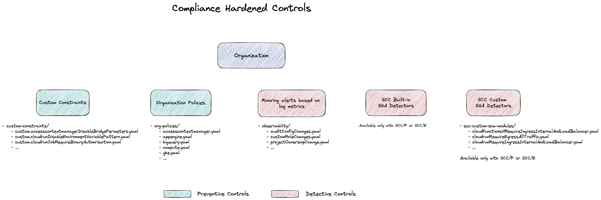

# Hardened Dataset for FAST Organization Setup

This hardened dataset contains a set of compliance controls that can be applied to your Google Cloud environment.
It includes preventive controls (custom constraints and organization policies) and detective controls (Security Command Center custom module detectors and observability alerts).

## Prerequisites

This dataset configuration configures a set of compliance and security controls based on recommendations gathered from various customer engagements.

The **preventive controls** are based on a recommended list of organization policies and custom organization policies. Many of these help enforce CIS Benchmarks and PCI-DSS requirements and are broadly applicable.

The **detective controls** are based on the following:

- Security Health Analytics (SHA) and Custom SHA modules: These require **a Security Command Center (SCC) Premium or Enterprise subscription.**
- Log-based metrics and Monitoring Alerts: These can be used by any organization.

## High level architecture

The dataset contains the configurations for various controls, which are consumed by the Terraform modules using the factory configuration.

|                                      | Organization Policies  |    Custom Constraint     |  Monitoring Alerts  |                    SCC SHA                    |        SCC Custom SHA        |
|:-----------------------------------: |:---------------------: |:-----------------------: |:------------------: |:--------------------------------------------: |:---------------------------: |
|           **Type of controls**           |       Preventive       |        Preventive        |      Detective      |                   Detective                   |          Detective           |
|            **Factory folder**            |   data/org-policies    | data/custom-constraints  | data/observability  | Already included as part of SCC Subscription  | data/scc-custom-sha-modules  |
| **Requires SCC Premium or Enterprise ?**  |           NO           |            NO            |         NO          |                      YES                      |             YES              |

The diagram below shows the relationships between the components:



## Usage

To use this `hardened` dataset, create a `0-org-setup.auto.tfvars` file in the `fast/stages/0-org-setup` directory and override the `factories_config` variable as shown below.

Inputting this configuration replaces the default factory paths with the hardened versions. However, please note that configurations not explicitly listed here (such as `billing-account`) will continue to be read from the `classic` dataset folder.

```tfvars
factories_config = {
  defaults         = "datasets/hardened/defaults.yaml"
  folders          = "datasets/hardened/folders"
  observability    = "datasets/hardened/observability"
  organization     = "datasets/hardened/organization"
  projects         = "datasets/hardened/projects"
}
```

For organizations not using **SCC Premium or Enterprise**, the following error will appear:

```
╷
│ Error: Error creating OrganizationSecurityHealthAnalyticsCustomModule: googleapi: Error 403: Security Command Center Management API has not been used in project 111111111111 before or it is disabled. Enable it by visiting https://console.developers.google.com/apis/api/securitycentermanagement.googleapis.com/overview?project=111111111111 then retry. If you enabled this API recently, wait a few minutes for the action to propagate to our systems and retry.
```

In that case, the controls placed in the `organization/scc-sha-custom-modules` folder need to be removed to ensure they are provisionned.

## Controls

### Preventive Controls

#### Organization Policies

| Policy | Description | Compliance Mapping |
|---|---|---|
| `ainotebooks.disableFileDownloads` | Prevent file downloads on new Vertex AI Workbench instances. |  |
| `ainotebooks.disableRootAccess` | Prevent root access on new Vertex AI Workbench user-managed notebooks and instances. |  |
| `ainotebooks.restrictPublicIp` | Restrict public IP access on new Vertex AI Workbench notebooks and instances. |  |
| `ainotebooks.restrictVpcNetworks` | Restrict VPC networks on new Vertex AI Workbench instances. |  |
| `appengine.disableCodeDownload` | Prevent the download of source code from App Engine. |  |
| `bigquery.disableBQOmniAWS` | Prevent the creation of BigQuery Omni tables for AWS. |  |
| `bigquery.disableBQOmniAzure` | Prevent the creation of BigQuery Omni tables for Azure. |  |
| `cloudbuild.allowedIntegrations` | Restrict Cloud Build integrations to an approved list. |  |
| `cloudbuild.allowedWorkerPools` | Restrict Cloud Build jobs to an authorized list of worker pools. |  |
| `cloudbuild.disableCreateDefaultServiceAccount` | Prevent Default Service Account for Cloud Build to be created |  |
| `cloudfunctions.allowedIngressSettings` | Ensure Cloud Functions Gen1 only allows internal and load balancer traffic. |  |
| `cloudfunctions.allowedVpcConnectorEgressSettings` | Ensure Cloud Functions v1 Egress VPC Connector settings are configured correctly. |  |
| `cloudfunctions.requireVPCConnector` | Ensure Cloud Functions v1 are configured with a VPC connector. |  |
| `compute.disableGuestAttributesAccess` | Prevent the use of Guest Attributes for Compute Engine instance metadata. |  |
| `compute.disableInternetNetworkEndpointGroup` | Prevent configuration of internet network endpoint groups. |  |
| `compute.disableNestedVirtualization` | Prevent the creation of Compute Engine instances with nested virtualization enabled. |  |
| `compute.disableSerialPortAccess` | Prevent the enablement of serial port access for VM instances. | **CIS for GCP 3.0**: 4.5<br>**CIS Controls 8.0**: 4.8<br>**PCI-DSS 4.0**: 1.2.1, 1.4.1<br>**NIST 800-53 R5**: CM-6, CM-7<br>**ISO-2700-1 v2022**: A.8.9<br>**SOC2 v2017**: CC6.6.1, CC6.6.3, CC6.6.4 |
| `compute.disableVpcExternalIpv6` | Prevent configuration of subnets with external IPv6 ranges. |  |
| `compute.disableVpcInternalIpv6` | Enforce the block of VPC subnetworks from using internal IPv6 addresses. A subnetwork with an internal IPv6 address might be exposed to potential risks due to its current limited support. |  |
| `compute.managed.blockPreviewFeatures` | Ensures that preview feature updates are blocked unless explicitly allowed |  |
| `compute.managed.disableSerialPortLogging` | Prevent serial port logging to Cloud Logging for VMs. |  |
| `compute.managed.vmCanIpForward` | Prevent IP forwarding from being enabled on Compute Engine instances. | **CIS for GCP 3.0**: 4.6<br>**CIS Controls 8.0**: 4.4, 4.5<br>**NIST 800-53 R5**: CA-9, SC-7<br>**SOC2 v2017**: CC6.6.1, CC6.6.4 |
| `compute.requireOsLogin` | Enforce the use of OS Login for all Compute Engine instances. | **CIS for GCP 3.0**: 4.4<br>**CIS Controls 8.0**: 5.6, 6.7<br>**PCI-DSS 4.0**: 1.2.5,<br>2.2.4<br>6.4.1<br>**NIST 800-53 R5**: AC-2<br>**ISO-2700-1 v2022**: A.5.15<br>**SOC2 v2017**: CC6.1.4, CC6.1.6, CC6.1.8, CC6.1.9 |
| `compute.requireShieldedVm` | Enforce the use of Shielded VM for all Compute Engine instances. | **CIS for GCP 3.0**: 4.8 |
| `compute.requireSslPolicy` | Prevent the use of weak cipher suites and TLS versions on HTTPS and SSL Proxy load balancers. | **CIS for GCP 3.0**: 3.9<br>**NIST 800-53 R4**: SC-7<br>**ISO-2700-1 v2013**: A.14.1.3 |
| `compute.requireVpcFlowLogs` | Enforce the enablement of VPC Flow Logs for every subnet in a VPC network. | **CIS for GCP 3.0**: 3.8<br>**CIS Controls 8.0**: 13.6, 8.2<br>**NIST 800-53 R4**: SI-4<br>**ISO-2700-1 v2013**: A.13.1.1 |
| `compute.restrictCloudNATUsage` | Restrict Cloud NAT usage to an authorized list. |  |
| `compute.restrictDedicatedInterconnectUsage` | Restrict the use of Dedicated Interconnect. |  |
| `compute.restrictLoadBalancerCreationForTypes` | Restrict the creation of load balancers based on type. |  |
| `compute.restrictNonConfidentialComputing` | Enforce the use of Confidential Computing for all Compute Engine instances. | **CIS for GCP 3.0**: 4.11<br>**CIS Controls 8.0**: 3.11<br>**PCI-DSS 4.0**: 3.1.1, 3.3.2, 3.3.3, 3.5.1, 3.5.1.2, 3.5.1.3, 8.3.2<br>**NIST 800-53 R5**: IA-5, SC-28<br>**NIST Cybersecurity Framework 1.0**: PR-DS-1<br>**ISO-2700-1 v2022**: A.5.33<br>**SOC2 v2017**: CC6.1.10, CC6.1.3<br>**HIPAA**: 164.312(a)(2)(iv), 164.312(e)(2)(ii)<br>**Cloud Controls Matrix 4**: CEK-03 |
| `compute.restrictPartnerInterconnectUsage` | Restrict the use of Partner Interconnect. |  |
| `compute.restrictProtocolForwardingCreationForTypes` | Restrict the creation of forwarding rules based on type. |  |
| `compute.restrictSharedVpcHostProjects` | Restrict the use of Shared VPC host projects. |  |
| `compute.restrictVpcPeering` | Restrict the use of VPC peering. |  |
| `compute.restrictVpnPeerIPs` | Restrict VPN peer IP addresses. |  |
| `compute.setNewProjectDefaultToZonalDNSOnly` | Ensure project created use Zonal DNS instead of global. |  |
| `compute.skipDefaultNetworkCreation` | Prevent the automatic creation of the default VPC network in new projects. | **CIS Controls 8.0**: 4.2<br>**NIST 800-53 R5**: AC-18, CM-2, CM-6, CM-7, CM-9<br>**NIST Cybersecurity Framework 1.0**: PR-IP-1<br>**ISO-2700-1 v2022**: A.8.9<br>**SOC2 v2017**: CC5.2.2<br>**Cloud Controls Matrix 4**: ISV-04 |
| `compute.trustedImageProjects` | Restrict the use of VM images to an authorized list of projects. |  |
| `compute.vmExternalIpAccess` | Prevent Compute Engine instances from having public IP addresses. | **CIS for GCP 3.0**: 4.9<br>**CIS Controls 8.0**: 3.3<br>**PCI-DSS 4.0**: 1.3.1<br>**NIST 800-53 R4**: CA-3, SC-7<br>**NIST 800-53 R5**: AC-3, AC-5, AC-6, MP-2<br>**NIST Cybersecurity Framework 1.0**: PR-AC-4<br>**ISO-2700-1 v2022**: A.5.10, A.5.15, A.8.3, A.8.4<br>**SOC2 v2017**: CC5.2.3, CC6.1.3, CC6.1.7<br>**HIPAA**: 164.308(a)(3)(i), 164.308(a)(3)(ii), 164.312(a)(1)<br>**Cloud Controls Matrix 4**: DSP-17 |
| `container.managed.disableABAC` | Require that Attribute-Based Access Control is disabled |  |
| `container.managed.disableInsecureKubeletReadOnlyPort` | Require disabling the insecure kubelet read-only port in GKE clusters |  |
| `container.managed.disableLegacyClientCertificateIssuance` | Prevent the use of legacy authentication methods for GKE API servers. | **CIS for GKE 1.5**: 2.1.1<br>5.8.1<br>**PCI-DSS 4.0**: 4.1 |
| `container.managed.disableRBACSystemBindings` | Requires disabling RBAC bindings to system identities in GKE clusters. |  |
| `container.managed.disallowDefaultComputeServiceAccount` | Enforce that GKE cluster nodes are assigned with the least privileged service accounts | **CIS for GKE 1.5**: 5.2.1<br>**PCI-DSS 4.0**: 2.2.4, 7.2<br>**NIST 800-53 R4**: AC-6, SC-7<br>**ISO-2700-1 v2013**: A.9.2.3 |
| `container.managed.enableBinaryAuthorization` | Enforce the enablement of Binary Authorization on GKE clusters. | **CIS for GKE 1.5**: 5.1.4<br>5.10.3<br>5.10.4<br>**PCI-DSS 4.0**: 6.2.1 |
| `container.managed.enableCloudLogging` | Enforce that GKE clusters logging is enabled | **CIS for GKE 1.5**: 5.7.1<br>**PCI-DSS 4.0**: 10.2 |
| `container.managed.enableGoogleGroupsRBAC` | Enforce that GKE is configured so Google Groups can be used with RBAC | **CIS for GKE 1.5**: 5.8.2<br>**PCI-DSS 4.0**: 1.1.2 |
| `container.managed.enableNetworkPolicy` | Enforce that GKE clusters are configured with Network Policy enabled | **CIS for GKE 1.5**: 5.6.7<br>**PCI-DSS 4.0**: 1.2,1.1,1.4<br>**ISO-2700-1 v2013**: A.13.1.1 |
| `container.managed.enablePrivateNodes` | Enforce that GKE clusters are created as private clusters with private nodes | **CIS for GKE 1.5**: 5.6.5<br>**PCI-DSS 4.0**: 1.3.1 |
| `container.managed.enableSecretsEncryption` | Enforce that the GKE clusters is configured to encrypt secret in etcd | **CIS for GKE 1.5**: 5.3.1<br>**PCI-DSS 4.0**: 3.6 |
| `container.managed.enableSecurityBulletinNotifications` | Require enabling Security Bulletin Notifications in GKE clusters. |  |
| `container.managed.enableShieldedNodes` | Enforce that GKE nodes is configured with shielded GKE nodes | **CIS for GKE 1.5**: 5.5.5 |
| `container.managed.enableWorkloadIdentityFederation` | Enforce that GKE clusters are enabled with Workload Identity  | **CIS for GKE 1.5**: 5.2.2<br>**PCI-DSS 4.0**: 7.2.2 |
| `essentialcontacts.allowedContactDomains` | Restrict essential contact domains to an authorized list. |  |
| `gcp.resourceLocations` | Restrict resource locations. |  |
| `gcp.restrictCmekCryptoKeyProjects` | Prevent the use of CMEKs from unauthorized projects. |  |
| `gcp.restrictNonCmekServices` | Ensure That All BigQuery Tables Are Encrypted With Customer-Managed Encryption Key (CMEK) | **CIS for GCP 3.0**: 7.2<br>**CIS Controls 8.0**: 3.11<br>**PCI-DSS 4.0**: 3.1.1, 3.3.2, 3.3.3, 3.5.1, 3.5.1.2, 3.5.1.3, 8.3.2<br>**NIST 800-53 R5**: IA-5, SC-28<br>**NIST Cybersecurity Framework 1.0**: PR-DS-1<br>**ISO-2700-1 v2022**: A.5.33<br>**HIPAA**: 164.312(a)(2)(iv), 164.312(e)(2)(ii)<br>**Cloud Controls Matrix 4**: CEK-03 |
| `gcp.restrictTLSCipherSuites` | Prevent the use of weak cipher suites and TLS versions on HTTPS and SSL Proxy load balancers. | **CIS for GCP 3.0**: 3.9<br>**NIST 800-53 R4**: SC-7<br>**ISO-2700-1 v2013**: A.14.1.3 |
| `gcp.restrictTLSVersion` | Prevent the use of weak cipher suites and TLS versions on HTTPS and SSL Proxy load balancers. | **CIS for GCP 3.0**: 3.9<br>**NIST 800-53 R4**: SC-7<br>**ISO-2700-1 v2013**: A.14.1.3 |
| `iam.allowedPolicyMemberDomains` | Restrict domain sharing to authorized domains. | **CIS for GCP 3.0**: 1.1<br>**NIST 800-53 R4**: AC-3<br>**ISO-2700-1 v2013**: A.9.2.3 |
| `iam.automaticIamGrantsForDefaultServiceAccounts` | Prevent the automatic granting of IAM roles to default service accounts. | **CIS for GCP 3.0**: 4.1<br>**PCI-DSS 4.0**: 2.2.2<br>2.3.1 |
| `iam.disableAuditLoggingExemption` | Prevent the use of audit logging exemptions. Detect also if audit logging are has been disabled. |  |
| `iam.disableServiceAccountKeyCreation` | Enforce the use of only GCP-managed service account keys. | **CIS for GCP 3.0**: 1.4 |
| `iam.disableServiceAccountKeyUpload` | Prevent the uploading of service account keys. |  |
| `iam.managed.disableServiceAccountApiKeyCreation` | Prevent the creation of service account API key bindings. |  |
| `iam.serviceAccountKeyExposureResponse` | Enforce Google to disable the service keys if a service account linked key is detected to be exposed publicly. |  |
| `iam.workloadIdentityPoolAwsAccounts` | Prevent creation of workload identity pools using AWS accounts, except if expliicitely allowed. |  |
| `iam.workloadIdentityPoolProviders` | Prevent creation of any workload identity pools except if expliicitely allowed. |  |
| `run.allowedBinaryAuthorizationPolicies` | Restrict Cloud Run services and jobs to an authorized list of Binary Authorization policies. |  |
| `run.allowedIngress` | Ensure Cloud Run services only allow internal and load balancer traffic. |  |
| `run.allowedVPCEgress` | Ensure all egress traffic from Cloud Run services and jobs is routed through a VPC network. |  |
| `run.managed.requireInvokerIam` | Enforce an IAM invoker check for Cloud Run services. |  |
| `sql.restrictAuthorizedNetworks` | Prevent the ability to add Authorized Networks for unproxied database access to Cloud SQL instances. |  |
| `sql.restrictPublicIp` | Ensure That Cloud SQL Database Instances Do Not Have Public IPs | **CIS for GCP 3.0**: 6.6<br>**CIS Controls 8.0**: 3.3, 4.6<br>**PCI-DSS 4.0**: 1.3.1<br>**NIST 800-53 R5**: AC-3, AC-5, AC-6, MA-4, MP-2<br>**NIST Cybersecurity Framework 1.0**: PR-AC-4<br>**ISO-2700-1 v2022**: A.5.10, A.5.15, A.8.3, A.8.4<br>**SOC2 v2017**: CC5.2.2, CC5.2.3, CC6.1.3, CC6.1.7<br>**HIPAA**: 164.308(a)(3)(i), 164.308(a)(3)(ii), 164.312(a)(1)<br>**Cloud Controls Matrix 4**: DSP-17 |
| `storage.publicAccessPrevention` | Prevent anonymous or public access to Cloud Storage buckets. | **CIS for GCP 3.0**: 5.1<br>**CIS Controls 8.0**: 3.3<br>**PCI-DSS 4.0**: 1.3.1<br>**NIST 800-53 R4**: AC-2<br>**NIST 800-53 R5**: AC-3, AC-5, AC-6, MP-2<br>**NIST Cybersecurity Framework 1.0**: PR-AC-4<br>**ISO-2700-1 v2013**: A.14.1.3, A.8.2.3<br>**ISO-2700-1 v2022**: A.5.10, A.5.15, A.8.3, A.8.4<br>**SOC2 v2017**: CC5.2.3, CC6.1.3, CC6.1.7<br>**HIPAA**: 164.308(a)(3)(i), 164.308(a)(3)(ii), 164.312(a)(1)<br>**Cloud Controls Matrix 4**: DSP-17 |
| `storage.restrictAuthTypes` | Restrict authentication types for Cloud Storage. |  |
| `storage.secureHttpTransport` | Restrict unencrypted HTTP access to Cloud Storage. |  |
| `storage.uniformBucketLevelAccess` | Enforce the enablement of uniform bucket-level access to Cloud Storage buckets. | **CIS for GCP 3.0**: 5.2<br>**CIS Controls 8.0**: 3.3<br>**PCI-DSS 4.0**: 1.3.1<br>**NIST 800-53 R5**: AC-3, AC-5, AC-6, MP-2<br>**NIST Cybersecurity Framework 1.0**: PR-AC-4<br>**ISO-2700-1 v2022**: A.5.10, A.5.15, A.8.3, A.8.4<br>**SOC2 v2017**: CC5.2.3, CC6.1.3, CC6.1.7<br>**HIPAA**: 164.308(a)(3)(i), 164.308(a)(3)(ii), 164.312(a)(1)<br>**Cloud Controls Matrix 4**: DSP-17 |

#### Custom Constraints

| Constraint | Description | Compliance Mapping |
|---|---|---|
| `accesscontextmanagerDisableBridgePerimeters` | Ensure no perimeter bridges are used. Instead, use ingress and egress rules. |  |
| `cloudbuildDisableWorkerPoolExternalIP` | Prevent the configuration of Cloud Build worker pools with external IP addresses. |  |
| `cloudkmsAllowedAlgorithms` | Ensure the algorithm used for Cloud KMS keys is configured correctly. |  |
| `cloudkmsAllowedProtectionLevel` | Ensure Cloud KMS keys are configured with the correct protection level. |  |
| `cloudkmsAllowedRotationPeriod` | Ensure Cloud KMS keys have the correct rotation period configured. | **CIS for GCP 3.0**: 1.10<br>**CIS Controls 8.0**: 3.11<br>**PCI-DSS 4.0**: 3.1.1, 3.3.2, 3.3.3, 3.5.1, 3.5.1.2, 3.5.1.3, 8.3.2<br>**NIST 800-53 R4**: SC-12<br>**NIST 800-53 R5**: IA-5, SC-28<br>**ISO-2700-1 v2013**: A.10.1.2<br>**ISO-2700-1 v2022**: A.5.33<br>**SOC2 v2017**: CC6.1.10, CC6.1.3<br>**HIPAA**: 164.312(a)(2)(iv), 164.312(e)(2)(ii)<br>**Cloud Controls Matrix 4**: CEK-03 |
| `cloudrunDisableEnvironmentVariablePattern` | Prevent secrets from being stored in Cloud Run environment variables. | **CIS for GCP 3.0**: 1.17 |
| `cloudrunJobDisableDefaultServiceAccount` | Ensure all Cloud Run jobs use a non-default service account. |  |
| `cloudrunJobRequireBinaryAuthorization` | Enforce all Cloud Run jobs use binary authorization. |  |
| `cloudrunServiceDisableDefaultServiceAccount` | Ensure all Cloud Run services use a non-default service account. |  |
| `cloudrunServiceRequireBinaryAuthorization` | Enforce all Cloud Run services use binary authorization. |  |
| `cloudsqlDisablePublicAuthorizedNetworks` | Ensure That Cloud SQL Database Instances Do Not Implicitly Whitelist All Public IP Addresses | **CIS for GCP 3.0**: 6.5<br>**CIS Controls 8.0**: 3.3<br>**PCI-DSS 4.0**: 1.3.1<br>**NIST 800-53 R4**: CA-3, SC-7<br>**NIST 800-53 R5**: AC-3, AC-5, AC-6, MP-2<br>**NIST Cybersecurity Framework 1.0**: PR-AC-4<br>**ISO-2700-1 v2013**: A.13.1.3, A.14.1.3, A.8.2.3<br>**ISO-2700-1 v2022**: A.5.10, A.5.15, A.8.3, A.8.4<br>**SOC2 v2017**: CC5.2.3, CC6.1.3, CC6.1.7<br>**HIPAA**: 164.308(a)(3)(i), 164.308(a)(3)(ii), 164.312(a)(1)<br>**Cloud Controls Matrix 4**: DSP-17 |
| `cloudsqlEnforcePasswordComplexity` | Enforce password complexity for Cloud SQL instance users. |  |
| `cloudsqlRequireAutomatedBackup` | Ensure That Cloud SQL Database Instances Are Configured With Automated Backups | **CIS for GCP 3.0**: 6.7<br>**CIS Controls 8.0**: 11.2<br>**NIST 800-53 R4**: CP-9<br>**NIST 800-53 R5**: CP-10, CP-9<br>**NIST Cybersecurity Framework 1.0**: PR-IP-4<br>**ISO-2700-1 v2013**: A.12.3.1<br>**ISO-2700-1 v2022**: A.8.13<br>**HIPAA**: 164.308(a)(7)(ii) |
| `cloudsqlRequireHighAvailability` | Ensure Cloud SQL instances are configured for high availability. |  |
| `cloudsqlRequireMySQLDatabaseFlags` | Ensure ‘Skip_show_database’ Database Flag for Cloud SQL MySQL Instance Is Set to ‘On’ | **CIS for GCP 3.0**: 6.1.2<br>**CIS Controls 8.0**: 3.3<br>**PCI-DSS 4.0**: 1.3.1<br>**NIST 800-53 R5**: AC-3, AC-5, AC-6, MP-2<br>**NIST Cybersecurity Framework 1.0**: PR-AC-4<br>**ISO-2700-1 v2022**: A.5.10, A.5.15, A.8.3, A.8.4<br>**SOC2 v2017**: CC5.2.3, CC6.1.3, CC6.1.7<br>**HIPAA**: 164.308(a)(3)(i), 164.308(a)(3)(ii), 164.312(a)(1)<br>**Cloud Controls Matrix 4**: DSP-17 |
| `cloudsqlRequirePointInTimeRecovery` | Enforce point-in-time recovery for all Cloud SQL backup configurations. |  |
| `cloudsqlRequirePostgreSQLDatabaseFlags` | Ensure That the ‘Log_connections’ Database Flag for Cloud SQL PostgreSQL Instance Is Set to ‘On’ | **CIS for GCP 3.0**: 6.2.2<br>**CIS Controls 8.0**: 8.5<br>**PCI-DSS 4.0**: 10.2.1, 10.2.1.2, 10.2.1.5, 9.4.5<br>**NIST 800-53 R5**: AU-12, AU-3, AU-7<br>**NIST Cybersecurity Framework 1.0**: DE-AE-3, DE-CM-1<br>**ISO-2700-1 v2022**: A.5.28, A.8.15<br>**SOC2 v2017**: CC5.2.3, CC7.2.1, CC7.2.2, CC7.2.3<br>**Cloud Controls Matrix 4**: DSP-17 |
| `cloudsqlRequireRootPassword` | Ensure That a MySQL Database Instance Does Not Allow Anyone To Connect With Administrative Privileges | **CIS for GCP 3.0**: 6.1.1<br>**NIST 800-53 R4**: AC-3<br>**ISO-2700-1 v2013**: A.8.2.3, A.9.4.2<br>**ISO-2700-1 v2022**: A.8.5 |
| `cloudsqlRequireSQLServerDatabaseFlags` | Ensure 'external scripts enabled' database flag for Cloud SQL SQL Server instance is set to 'off' | **CIS for GCP 3.0**: 6.3.1<br>**CIS Controls 8.0**: 2.7<br>**PCI-DSS 4.0**: 1.2.5, 2.2.4, 6.4.3<br>**NIST 800-53 R5**: CM-7, SI-7<br>**NIST Cybersecurity Framework 1.0**: PR-IP-1, PR-PT-3<br>**SOC2 v2017**: CC5.2.1, CC5.2.2, CC5.2.3, CC5.2.4 |
| `cloudsqlRequireSSLConnection` | Ensure That the Cloud SQL Database Instance Requires All Incoming Connections To Use SSL | **CIS for GCP 3.0**: 6.4<br>**NIST 800-53 R4**: SC-7<br>**ISO-2700-1 v2013**: A.13.2.1, A.14.1.3, A.8.2.3 |
| `dataprocDisableDefaultServiceAccount` | Prevent Dataproc VMs from using default user-managed service accounts. |  |
| `dataprocRequireDiskCmekEncryption` | Enforce encryption of Dataproc clusters with a Customer-Managed Encryption Key (CMEK). | **CIS for GCP 3.0**: 8.1<br>**CIS Controls 8.0**: 3.11<br>**PCI-DSS 4.0**:  3.1.1, 3.3.2, 3.3.3, 3.5.1, 3.5.1.2, 3.5.1.3, 8.3.2<br>**NIST 800-53 R5**: IA-5, SC-28<br>**NIST Cybersecurity Framework 1.0**: PR-DS-1<br>**ISO-2700-1 v2013**: A.5.33<br>**SOC2 v2017**: CC6.1.10, CC6.1.3<br>**HIPAA**: 164.312(a)(2)(iv), 164.312(e)(2)(ii)<br>**Cloud Controls Matrix 4**: CEK-03 |
| `dataprocRequireInternalIp` | Enforce the use of internal IP addresses only for Dataproc clusters. |  |
| `dataprocRequireKerberos` | Enforce the use of Kerberos for secure authentication on all Dataproc clusters. |  |
| `dnsAllowedSigningAlgorithms` | Prevent the use of the RSASHA1 algorithm for the Key-Signing Key in Cloud DNS DNSSEC. | **CIS for GCP 3.0**: 3.4<br>**PCI-DSS 4.0**: 1.1.1, 1.2.1, 1.2.6, 1.2.7, 1.4.2, 1.5.1, 2.1.1, 2.2.1<br>**NIST 800-53 R4**: 4.2<br>**NIST 800-53 R5**: AC-18, CM-2, CM-6, CM-7, CM-9<br>**NIST Cybersecurity Framework 1.0**: PR-IP-1<br>**ISO-2700-1 v2022**: A.8.9<br>**SOC2 v2017**: CC5.2.2<br>**Cloud Controls Matrix 4**: IVS-04 |
| `dnsRequireManageZoneDNSSEC` | Enforce the enablement of DNSSEC for all Cloud DNS zones. | **CIS for GCP 3.0**: 3.3<br>**CIS Controls 8.0**: 4.2<br>**PCI-DSS 4.0**: 1.1.1, 1.2.1, 1.2.6, 1.2.7, 1.4.2, 1.5.1, 2.1.1, 2.2.1<br>**NIST 800-53 R5**: AC-18, CM-2, CM-6, CM-7, CM-9<br>**NIST Cybersecurity Framework 1.0**: PR-IP-1<br>**ISO-2700-1 v2013**: A.8.2.3<br>**ISO-2700-1 v2022**: A.8.9<br>**SOC2 v2017**: CC5.2.2<br>**Cloud Controls Matrix 4**: ISV-04 |
| `dnsRequirePolicyLogging` | Enforce the enablement of Cloud DNS logging for all VPC networks. | **CIS for GCP 3.0**: 2.12<br>**PCI-DSS 4.0**: 10.4.1, 10.4.1.1, 10.4.2, 10.4.3<br>**NIST 800-53 R5**: AU-6, AU-7<br>**NIST Cybersecurity Framework 1.0**: DE-AE-2, PR-PT-1, RS-AN-1<br>**ISO-2700-1 v2022**: A.5.25<br>**SOC2 v2017**: CC4.1.1, CC4.1.2, CC4.1.3, CC4.1.4, CC4.1.5, CC4.1.6, CC4.1.7, CC4.1.8, CC7.3.1, CC7.3.2, CC7.3.3, CC7.3.4, CC7.3.5<br>**HIPAA**: 164.308(a)(1)(ii), 164.312(b)<br>**Cloud Controls Matrix 4**: LOG-05 |
| `firewallEnforcePolicyRuleLogging` | Enforce logging for Firewall Policy rules | **NIST 800-53 R4**: SI-4<br>**ISO-2700-1 v2013**: A.13.1.1 |
| `firewallEnforceRuleLogging` | Enforce logging for VPC firewall rules | **NIST 800-53 R4**: SI-4<br>**ISO-2700-1 v2013**: A.13.1.1 |
| `firewallRequireDescription` | Enforce a description for VPC firewall rules. |  |
| `firewallRestrictCacheSearchDatabasesPolicyRule` | Prevent Cassandra port access from the internet via firewall policies. | **CIS Controls 8.0**: 4.4, 4.5<br>**PCI-DSS 4.0**: 1.2.1, 1.4.1<br>**NIST 800-53 R4**: SC-7<br>**NIST 800-53 R5**: CA-9, SC-7<br>**ISO-2700-1 v2013**: A.13.1.1<br>**SOC2 v2017**: CC6.6.1, CC6.6.4 |
| `firewallRestrictCacheSearchDatabasesRule` | Prevent Cassandra port access from the internet via VPC firewall rules. | **CIS Controls 8.0**: 4.4, 4.5<br>**PCI-DSS 4.0**: 1.2.1, 1.4.1<br>**NIST 800-53 R4**: SC-7<br>**NIST 800-53 R5**: CA-9, SC-7<br>**ISO-2700-1 v2013**: A.13.1.1<br>**SOC2 v2017**: CC6.6.1, CC6.6.4 |
| `firewallRestrictDirectoryServicesPolicyRule` | Prevent directory services port access from the internet via firewall policies. | **CIS Controls 8.0**: 4.4, 4.5<br>**PCI-DSS 4.0**: 1.2.1, 1.4.1<br>**NIST 800-53 R4**: SC-7<br>**NIST 800-53 R5**: CA-9, SC-7<br>**ISO-2700-1 v2013**: A.13.1.1<br>**SOC2 v2017**: CC6.6.1, CC6.6.4 |
| `firewallRestrictDirectoryServicesRule` | Prevent directory services port access from the internet via VPC firewall rules. | **CIS Controls 8.0**: 4.4, 4.5<br>**PCI-DSS 4.0**: 1.2.1, 1.4.1<br>**NIST 800-53 R4**: SC-7<br>**NIST 800-53 R5**: CA-9, SC-7<br>**ISO-2700-1 v2013**: A.13.1.1<br>**SOC2 v2017**: CC6.6.1, CC6.6.4 |
| `firewallRestrictExplicitAllPortsPolicyRule` | Prevent rules that explicitly specify all TCP/UDP ports using ranges like 0-65535 or 1-65535 via firewall policies. |  |
| `firewallRestrictExplicitAllPortsRule` | Prevent rules that explicitly specify all TCP/UDP ports using ranges like 0-65535 or 1-65535 via VPC firewall rules or any ports. |  |
| `firewallRestrictInsecureProtocolsPolicyRule` | Prevent FTP port access from the internet via firewall policies. | **CIS Controls 8.0**: 4.4, 4.5<br>**PCI-DSS 4.0**: 1.2.1, 1.4.1<br>**NIST 800-53 R4**: SC-7<br>**NIST 800-53 R5**: CA-9, SC-7<br>**ISO-2700-1 v2013**: A.13.1.1<br>**SOC2 v2017**: CC6.6.1, CC6.6.4 |
| `firewallRestrictInsecureProtocolsRule` | Prevent FTP port access from the internet via VPC firewall rules. | **CIS Controls 8.0**: 4.4, 4.5<br>**PCI-DSS 4.0**: 1.2.1, 1.4.1<br>**NIST 800-53 R4**: SC-7<br>**NIST 800-53 R5**: CA-9, SC-7<br>**ISO-2700-1 v2013**: A.13.1.1<br>**SOC2 v2017**: CC6.6.1, CC6.6.4 |
| `firewallRestrictMailProtocolsPolicyRule` | Prevent POP3 port access from the internet via firewall policies. | **CIS Controls 8.0**: 4.4, 4.5<br>**PCI-DSS 4.0**: 1.2.1, 1.4.1<br>**NIST 800-53 R4**: SC-7<br>**NIST 800-53 R5**: CA-9, SC-7<br>**ISO-2700-1 v2013**: A.13.1.1<br>**SOC2 v2017**: CC6.6.1, CC6.6.4 |
| `firewallRestrictMailProtocolsRule` | Prevent POP3 port access from the internet via VPC firewall rules. | **CIS Controls 8.0**: 4.4, 4.5<br>**PCI-DSS 4.0**: 1.2.1, 1.4.1<br>**NIST 800-53 R4**: SC-7<br>**NIST 800-53 R5**: CA-9, SC-7<br>**ISO-2700-1 v2013**: A.13.1.1<br>**SOC2 v2017**: CC6.6.1, CC6.6.4 |
| `firewallRestrictManagementPortsPolicyRule` | Prevent Cisco Secure WebSM port access from the internet via firewall policies. | **CIS Controls 8.0**: 4.4, 4.5<br>**PCI-DSS 4.0**: 1.2.1, 1.4.1<br>**NIST 800-53 R4**: SC-7<br>**NIST 800-53 R5**: CA-9, SC-7<br>**ISO-2700-1 v2013**: A.13.1.1<br>**SOC2 v2017**: CC6.6.1, CC6.6.4 |
| `firewallRestrictManagementPortsRule` | Prevent Cisco Secure WebSM port access from the internet via VPC firewall rules. | **CIS Controls 8.0**: 4.4, 4.5<br>**PCI-DSS 4.0**: 1.2.1, 1.4.1<br>**NIST 800-53 R4**: SC-7<br>**NIST 800-53 R5**: CA-9, SC-7<br>**ISO-2700-1 v2013**: A.13.1.1<br>**SOC2 v2017**: CC6.6.1, CC6.6.4 |
| `firewallRestrictNetworkServicesPolicyRule` | Prevent DNS port access from the internet via firewall policies. | **CIS Controls 8.0**: 4.4, 4.5<br>**PCI-DSS 4.0**: 1.2.1, 1.4.1<br>**NIST 800-53 R4**: SC-7<br>**NIST 800-53 R5**: CA-9, SC-7<br>**ISO-2700-1 v2013**: A.13.1.1<br>**SOC2 v2017**: CC6.6.1, CC6.6.4 |
| `firewallRestrictNetworkServicesRule` | Prevent DNS port access from the internet via VPC firewall rules. | **CIS Controls 8.0**: 4.4, 4.5<br>**PCI-DSS 4.0**: 1.2.1, 1.4.1<br>**NIST 800-53 R4**: SC-7<br>**NIST 800-53 R5**: CA-9, SC-7<br>**ISO-2700-1 v2013**: A.13.1.1<br>**SOC2 v2017**: CC6.6.1, CC6.6.4 |
| `firewallRestrictNoSQLDatabasesPolicyRule` | Prevent Elasticsearch port access from the internet via firewall policies. | **CIS Controls 8.0**: 4.4, 4.5<br>**PCI-DSS 4.0**: 1.2.1, 1.4.1<br>**NIST 800-53 R4**: SC-7<br>**NIST 800-53 R5**: CA-9, SC-7<br>**ISO-2700-1 v2013**: A.13.1.1<br>**SOC2 v2017**: CC6.6.1, CC6.6.4 |
| `firewallRestrictNoSQLDatabasesRule` | Prevent Elasticsearch port access from the internet via VPC firewall rules. | **CIS Controls 8.0**: 4.4, 4.5<br>**PCI-DSS 4.0**: 1.2.1, 1.4.1<br>**NIST 800-53 R4**: SC-7<br>**NIST 800-53 R5**: CA-9, SC-7<br>**ISO-2700-1 v2013**: A.13.1.1<br>**SOC2 v2017**: CC6.6.1, CC6.6.4 |
| `firewallRestrictPublicAccessPolicyRule` | Prevent open to public access  via firewall policies. |  |
| `firewallRestrictPublicAccessRule` | Prevent open to public access  via VPC firewall rules. |  |
| `firewallRestrictRdpPolicyRule` | Prevent RDP access from the internet via firewall policies. | **CIS for GCP 3.0**: 3.7<br>**CIS Controls 8.0**: 4.4, 4.5<br>**PCI-DSS 4.0**: 1.2.1, 1.4.1<br>**NIST 800-53 R4**: SC-7<br>**NIST 800-53 R5**: CA-9, SC-7<br>**ISO-2700-1 v2013**: A.13.1.1<br>**SOC2 v2017**: CC6.6.1, CC6.6.4 |
| `firewallRestrictRdpRule` | Prevent RDP access from the internet via VPC firewall rules. | **CIS for GCP 3.0**: 3.7<br>**CIS Controls 8.0**: 4.4, 4.5<br>**PCI-DSS 4.0**: 1.2.1, 1.4.1<br>**NIST 800-53 R4**: SC-7<br>**NIST 800-53 R5**: CA-9, SC-7<br>**ISO-2700-1 v2013**: A.13.1.1<br>**SOC2 v2017**: CC6.6.1, CC6.6.4 |
| `firewallRestrictSQLDatabasesPolicyRule` | Prevent MySQL port access from the internet via firewall policies. | **CIS Controls 8.0**: 4.4, 4.5<br>**PCI-DSS 4.0**: 1.2.1, 1.4.1<br>**NIST 800-53 R4**: SC-7<br>**NIST 800-53 R5**: CA-9, SC-7<br>**ISO-2700-1 v2013**: A.13.1.1<br>**SOC2 v2017**: CC6.6.1, CC6.6.4 |
| `firewallRestrictSQLDatabasesRule` | Prevent MySQL port access from the internet via VPC firewall rules. | **CIS Controls 8.0**: 4.4, 4.5<br>**PCI-DSS 4.0**: 1.2.1, 1.4.1<br>**NIST 800-53 R4**: SC-7<br>**NIST 800-53 R5**: CA-9, SC-7<br>**ISO-2700-1 v2013**: A.13.1.1<br>**SOC2 v2017**: CC6.6.1, CC6.6.4 |
| `firewallRestrictSshPolicyRule` | Prevent SSH access from the internet via firewall policies. | **CIS for GCP 3.0**: 3.6<br>**CIS Controls 8.0**: 4.4, 4.5<br>**PCI-DSS 4.0**: 1.2.1, 1.4.1<br>**NIST 800-53 R4**: SC-7<br>**NIST 800-53 R5**: CA-9, SC-7<br>**ISO-2700-1 v2013**: A.13.1.1<br>**SOC2 v2017**: CC6.6.1, CC6.6.4 |
| `firewallRestrictSshRule` | Prevent SSH access from the internet via VPC firewall rules. | **CIS for GCP 3.0**: 3.6<br>**CIS Controls 8.0**: 4.4, 4.5<br>**PCI-DSS 4.0**: 1.2.1, 1.4.1<br>**NIST 800-53 R4**: SC-7<br>**NIST 800-53 R5**: CA-9, SC-7<br>**ISO-2700-1 v2013**: A.13.1.1<br>**SOC2 v2017**: CC6.6.1, CC6.6.4 |
| `gkeAllowedNodePoolImages` | Enforce that GKE nodes are using authorized node images | **CIS for GKE 1.5**: 5.5.1<br>**PCI-DSS 4.0**: 2.2.6, 5.2, 6.2.1 |
| `gkeAllowedReleaseChannels` | Enforce that GKE cluster are using authorized release channels | **CIS for GKE 1.5**: 5.5.4 |
| `gkeDisableAlphaCluster` | Prevent the use of alpha features for GKE clusters in production workloads. | **CIS for GKE 1.5**: 5.10.2 |
| `gkeDisableKubernetesDashboard` | Prevent the enablement of the GKE Web UI dashboard. | **CIS for GKE 1.5**: 5.10.1<br>**PCI-DSS 4.0**: 6.4 |
| `gkeDisableLegacyAbac` | Enforce that GKE clusters is configured with no legacy ABAC enabled | **CIS for GKE 1.5**: 5.8.3<br>**PCI-DSS 4.0**: 4.1 |
| `gkeDisableLegacyMetadataEndpoints` | Enforce that GKE clusters are created with legacy metadata endpoints disabled  | **CIS for GKE 1.5**: 5.4.1 |
| `gkeRequireCOSImage` | Enforce the nodes pool are using Container-Optimized OS for running containers  | **PCI-DSS 4.0**: 2.2.6 |
| `gkeRequireConfidentialNodes` | Enforce that the GKE clusters is using confidential nodes |  |
| `gkeRequireDataplaneV2` | Enforce that the GKE clusters is configured to use dataplane v2 |  |
| `gkeRequireGKEMetadataServer` | Enforce that GKE clusters are configured with GKE metadata server enabled | **CIS for GKE 1.5**: 5.4.2 |
| `gkeRequireIntegrityMonitoring` | Enforce that GKE nodes are configured with integrity monitoring enabled | **CIS for GKE 1.5**: 5.5.6 |
| `gkeRequireIntraNodeVisibility` | Enforce that GKE clusters intranode visibility is enabled | **CIS for GKE 1.5**: 5.6.1<br>**PCI-DSS 4.0**: 10.2 |
| `gkeRequireMasterAuthorizedNetworks` | Restrict network access to GKE control planes using master authorized networks with authorized CIDR IP ranges. | **CIS for GKE 1.5**: 5.6.3<br>**PCI-DSS 4.0**: 1.2.5 |
| `gkeRequireMonitoring` | Enforce that GKE clusters monitoring is enabled | **CIS for GKE 1.5**: 5.7.1<br>**PCI-DSS 4.0**: 10.2 |
| `gkeRequireNodePoolAutoRepair` | Enforce that GKE clusters are configured with node auto-repair enabled | **CIS for GKE 1.5**: 5.5.2<br>**PCI-DSS 4.0**: 2.2.6 |
| `gkeRequireNodePoolAutoUpgrade` | Enforce that GKE clusters are configured with node auto-upgrade enabled  | **CIS for GKE 1.5**: 5.5.3<br>**PCI-DSS 4.0**: 2.2.6 |
| `gkeRequireNodePoolCMEKEncryption` | Enforce that GKE nodes are configured with CMEK Encryption | **CIS for GKE 1.5**: 5.9.1<br>**PCI-DSS 4.0**: 3.6 |
| `gkeRequireNodePoolSandbox` | Enforce that the GKE clusters nodes are isolated using GKE sandbox | **CIS for GKE 1.5**: 5.10.3<br>**PCI-DSS 4.0**: 6.2.1 |
| `gkeRequirePrivateEndpoint` | Enforce that GKE clusters are created as private clusters with public endpoint disabled | **CIS for GKE 1.5**: 5.6.4<br>**PCI-DSS 4.0**: 1.3.1 |
| `gkeRequireRegionalClusters` | Enforce the creation of regional GKE clusters |  |
| `gkeRequireSecureBoot` | Enforce that GKE nodes are configured with secure boot enabled | **CIS for GKE 1.5**: 5.5.7 |
| `gkeRequireVPCNativeCluster` | Enforce that GKE clusters are created with VPC-native  | **CIS for GKE 1.5**: 5.6.2<br>**PCI-DSS 4.0**: 1.4.3 |
| `iamDisablePublicBindings` | Ensure That BigQuery Datasets Are Not Anonymously or Publicly Accessible | **CIS for GCP 3.0**: 7.1<br>**CIS Controls 8.0**: 3.3<br>**PCI-DSS 4.0**: 1.3.1<br>**NIST 800-53 R4**: AC-2<br>**NIST 800-53 R5**: AC-3, AC-5, AC-6, MP-2<br>**NIST Cybersecurity Framework 1.0**: PR-AC-4<br>**ISO-2700-1 v2013**: A.14.1.3, A.8.2.3<br>**ISO-2700-1 v2022**: A.5.10, A.5.15, A.8.3, A.8.4<br>**SOC2 v2017**: CC5.2.3, CC6.1.3, CC6.1.7<br>**HIPAA**: 164.308(a)(3)(i), 164.308(a)(3)(ii), 164.312(a)(1)<br>**Cloud Controls Matrix 4**: DSP-17 |
| `networkDisableTargetHTTPProxy` | Prevent the use of weak SSL policies on HTTPS and SSL Proxy load balancers. | **CIS for GCP 3.0**: 3.9 |
| `networkDisableWeakSSLPolicy` | Prevent the use of weak SSL policies on HTTPS and SSL Proxy load balancers. | **CIS for GCP 3.0**: 3.9 |
| `networkRequireBackendServiceLogging` | Enforce the enablement of logging for all HTTP(S) load balancers. | **CIS for GCP 3.0**: 2.16<br>**CIS Controls 8.0**: 8.2<br>**PCI-DSS 4.0**: 10.2.1, 10.2.1.1, 10.2.1.2, 10.2.1.3, 10.2.1.4, 10.2.1.5, 10.2.1.6, 10.2.1.7, 10.2.2, 5.3.4, 6.4.1, 6.4.2<br>**NIST 800-53 R5**: AU-12, AU-2, AU-7<br>**NIST Cybersecurity Framework 1.0**: DE-AE-3, PR-PT-1<br>**ISO-2700-1 v2022**: A.8.15, A.8.20<br>**HIPAA**: 164.312(b) |
| `networkRequireCustomModeVpc` | Ensure That the Default Network Does Not Exist in a Project | **CIS for GCP 3.0**: 3.1<br>**CIS Controls 8.0**: 4.2<br>**PCI-DSS 4.0**: 1.1.1, 1.2.1, 1.2.6, 1.2.7, 1.4.2, 1.5.1, 2.1.1, 2.2.1<br>**NIST 800-53 R5**: AC-18, CM-2, CM-6, CM-7, CM-9<br>**NIST Cybersecurity Framework 1.0**: PR-IP-1<br>**ISO-2700-1 v2022**: A.8.9<br>**SOC2 v2017**: CC5.2.2<br>**Cloud Controls Matrix 4**: ISV-04 |
| `networkRequireSubnetPrivateGoogleAccess` | Enforce Private Google Access for all VPC network subnets. |  |
| `storageRequireBucketObjectVersionning` | Enforce the enablement of versioning to Cloud Storage buckets where sinks are configured. | **NIST 800-53 R4**: AU-11<br>**ISO-2700-1 v2022**: A.12.4.2, A.18.1.3 |

### Detective Controls

#### SCC Built-in Modules Detectors

SCC SHA Detectors are available only for organization have subscribed to SCC Premium or Enterprise. Refer to <https://cloud.google.com/security-command-center/docs/service-tiers> for more information.

Complete list of built-in SCC SHA detectors is available here <https://cloud.google.com/security-command-center/docs/concepts-vulnerabilities-findings>.

#### SCC Custom Modules Detectors

SCC Custom SHA Detectors are available only for organization have subscribed to SCC Premium or Enterprise. Refer to <https://cloud.google.com/security-command-center/docs/service-tier> for more information.

| Module | Description | Compliance Mapping |
|---|---|---|
| `artifactregistryRequireCMEK` | Ensure Artifact Registry repositories are encrypted with a Customer-Managed Encryption Key (CMEK). |  |
| `cloudfunctionsV1RequireIngressInternalAndLoadBalancer` | Ensure Cloud Functions Gen1 only allows internal and load balancer traffic. |  |
| `cloudfunctionsV1RequireVPCConnector` | Ensure Cloud Functions v1 are configured with a VPC connector. |  |
| `cloudkmsAllowedAlgorithms` | Ensure the algorithm used for Cloud KMS keys is configured correctly. |  |
| `cloudkmsAllowedProtectionLevel` | Ensure Cloud KMS keys are configured with the correct protection level. |  |
| `cloudrunDisableJobDefaultServiceAccount` | Ensure all Cloud Run services use a non-default service account. |  |
| `cloudrunDisableServiceDefaultServiceAccount` | Ensure all Cloud Run jobs use a non-default service account. |  |
| `cloudrunRequireBinaryAuthorization` | Restrict Cloud Run services and jobs to an authorized list of Binary Authorization policies. |  |
| `cloudrunRequireEgressAllTraffic` | Ensure all egress traffic from Cloud Run services and jobs is routed through a VPC network. |  |
| `cloudrunRequireIngressInternalAndLoadBalancer` | Ensure Cloud Run services only allow internal and load balancer traffic. |  |
| `cloudsqlRequireHighAvailability` | Ensure Cloud SQL instances are configured for high availability. |  |
| `cloudsqlRequirePointInTimeRecovery` | Enforce point-in-time recovery for all Cloud SQL backup configurations. |  |
| `computeDisableNestedVirtualization` | Prevent the creation of Compute Engine instances with nested virtualization enabled. |  |
| `gkeDisableClientCertificateAuth` | Prevent the use of legacy authentication methods for GKE API servers. | **CIS for GKE 1.5**: 2.1.1<br>5.8.1<br>**PCI-DSS 4.0**: 4.1 |
| `gkeRequireConfidentialNodes` | Enforce that the GKE clusters is using confidential nodes |  |
| `gkeRequireDataplaneV2` | Enforce that the GKE clusters is configured to use dataplane v2 |  |
| `gkeRequireRegionalCluster` | Enforce the creation of regional GKE clusters |  |
| `secretmanagerAllowedRotationPeriod` | Ensure the rotation period for secrets is configured correctly. |  |

#### Observability

| Alert | Description | Compliance Mapping |
|---|---|---|
| `auditConfigChanges` | Ensure log metric filters and alerts exist for audit configuration changes. | **CIS for GCP 3.0**: 2.5<br>**PCI-DSS 4.0**: 10.2.1, 10.2.1.1, 10.2.1.2, 10.2.1.3, 10.2.1.4, 10.2.1.5, 10.2.1.6, 10.2.1.7, 10.2.2, 5.3.4, 6.4.1, 6.4.2 |
| `binaryAuthorizationPolicyChanges` | Prevent changes to Binary Authorization policies that could weaken enforcement or evaluation modes. |  |
| `cloudsqlInstanceChanges` | Ensure log metric filters and alerts exist for Cloud SQL instance configuration changes. | **CIS for GCP 3.0**: 2.11<br>**PCI-DSS 4.0**: 10.2.1, 10.2.1.1, 10.2.1.2, 10.2.1.3, 10.2.1.4, 10.2.1.5, 10.2.1.6, 10.2.1.7, 10.2.2, 5.3.4, 6.4.1, 6.4.2 |
| `customRoleChanges` | Ensure log metric filters and alerts exist for custom role changes. | **CIS for GCP 3.0**: 2.6<br>**PCI-DSS 4.0**: 10.2.1, 10.2.1.1, 10.2.1.2, 10.2.1.3, 10.2.1.4, 10.2.1.5, 10.2.1.6, 10.2.1.7, 10.2.2, 5.3.4, 6.4.1, 6.4.2 |
| `firewallPolicyRuleChanges` | Ensure log metric filters and alerts exist for firewall policy rule changes. | **CIS for GCP 3.0**: 2.7<br>**PCI-DSS 4.0**: 10.2.1, 10.2.1.1, 10.2.1.2, 10.2.1.3, 10.2.1.4, 10.2.1.5, 10.2.1.6, 10.2.1.7, 10.2.2, 5.3.4, 6.4.1, 6.4.2 |
| `firewallRuleChanges` | Ensure log metric filters and alerts exist for VPC network firewall rule changes. | **CIS for GCP 3.0**: 2.7<br>**PCI-DSS 4.0**: 10.2.1, 10.2.1.1, 10.2.1.2, 10.2.1.3, 10.2.1.4, 10.2.1.5, 10.2.1.6, 10.2.1.7, 10.2.2, 5.3.4, 6.4.1, 6.4.2 |
| `networkChanges` | Ensure log metric filters and alerts exist for VPC network changes. | **CIS for GCP 3.0**: 2.9 |
| `networkRouteChanges` | Ensure log metric filters and alerts exist for VPC network route changes. | **CIS for GCP 3.0**: 2.8<br>**PCI-DSS 4.0**: 10.2.1, 10.2.1.1, 10.2.1.2, 10.2.1.3, 10.2.1.4, 10.2.1.5, 10.2.1.6, 10.2.1.7, 10.2.2, 5.3.4, 6.4.1, 6.4.2 |
| `projectOwnershipChange` | Ensure log metric filters and alerts exist for project ownership changes. | **CIS for GCP 3.0**: 2.4<br>**PCI-DSS 4.0**: 10.2.1, 10.2.1.1, 10.2.1.2, 10.2.1.3, 10.2.1.4, 10.2.1.5, 10.2.1.6, 10.2.1.7, 10.2.2, 5.3.4, 6.4.1, 6.4.2 |
| `storageIamChanges` | Ensure log metric filters and alerts exist for Cloud Storage IAM permission changes. | **CIS for GCP 3.0**: 2.10<br>**PCI-DSS 4.0**: 10.2.1, 10.2.1.1, 10.2.1.2, 10.2.1.3, 10.2.1.4, 10.2.1.5, 10.2.1.6, 10.2.1.7, 10.2.2, 5.3.4, 6.4.1, 6.4.2 |

##  Configuration changes for Hardened Policies

* For organizations with strict requirements to ensure resources are created and stored within specific geographic regions (e.g., for data sovereignty or regulatory compliance), you can enforce this by enabling the `gcp.resourceLocations` Organization Policy, which is defined in the [gcp.yaml](organization/org-policies/gcp.yaml) file.

* The `compute.restrictNonConfidentialComputing` policy is disabled by default in the hardened datasets. However, for organizations that require strict assurance that only Confidential Computing resources are used, this policy can be enabled. You can enforce this restriction by updating the configuration in the [compute.yaml](organization/org-policies/compute.yaml) file.

* The `compute.requireVpcFlowLogs` policy is enabled by default in the hardened datasets. This requires to update the `2-networking` stage to configure all subnets with **VPC Flow Logs**. Here is an example of a subnet configuration with `flow_logs_config` enabled:
```yaml
name: dev-default
region: $locations:primary
ip_cidr_range: 10.73.0.0/24
description: Default primary-region subnet for dev
flow_logs_config: # This section enables VPC Flow Logs
  aggregation_interval: "INTERVAL_15_MIN"
  flow_sampling: 0.5
  metadata: "INCLUDE_ALL_METADATA"
```

* The `custom.firewallEnforcePolicyRuleLogging` policy is enabled by default in the hardened datasets. This requires to update the `2-networking` stage to configure firewall policies with logging enabled. Here is an example of a firewall policy rule with `enable_logging: true`:
```yaml
parent_id: $folder_ids:networking
attachments:
  networking: $folder_ids:networking
name: network-policy
ingress_rules:
  allow-healthchecks:
    description: Enable SSH, HTTP and HTTPS healthchecks
    priority: 1001
    enable_logging: true # Logging must be enabled per policy
    match:
      source_ranges:
        - $cidr_ranges_sets:healthchecks
      layer4_configs:
        - protocol: tcp
          ports: ["22", "80", "443"]
```

* The `compute.restrictVpcPeering` policy is enabled by default in the hardened datasets with all VPC peerings restricted to networks **within** your organization (as defined by `under:organizations/${organization.id}`). This policy will block connections from Google-managed services (e.g., Cloud SQL, Cloud Memorystore, Cloud Build) that use **Private Service Access**, as they peer from an external Google-owned network. To allow these essential services to peer, you must explicitly add Google's `servicenetworking` network to the policy's `allow` list.

Here is the required policy configuration:
```yaml
compute.restrictVpcPeering:
  rules:
    - allow:
        values:
          # Allows all peering within your organization
          - "under:organizations/${organization.id}"
          # Allows peering for Google's Private Service Access
          - "projects/<google-project-id>/global/networks/servicenetworking"
```

* The `compute.managed.disableSerialPortLogging` policy is enabled by default in the hardened datasets to prevent sensitive information leakage. However, this policy must be disabled (set to enforce: false) for projects hosting Google Kubernetes Engine (GKE) clusters. Indeed, GKE requires serial port logging to be enabled to successfully create clusters and manage low-level troubleshooting.

## Troubleshooting

### Custom Organization Policy Concurrency Issue

The following error below might appears when you are trying to create multiple custom organization policies concurrently.
As per October 2025, a bug exits providing misleading error message `Error 409: Requested entity already exists`.

```
│ Error: Error creating Policy: googleapi: Error 409: Requested entity already exists
│ 
│   with module.organization-iam[0].google_org_policy_policy.default["custom.gkeRequireVPCNativeCluster"],
│   on ../../../modules/organization/organization-policies.tf line 105, in resource "google_org_policy_policy" "default":
│  105: resource "google_org_policy_policy" "default" {
```

As per now, the workaround is to force terraform do not use concurrent requests. To fix this, you can run `terraform apply` with parallelism set to 1 the first time the custom organization policies are provisionned.

```bash
terraform apply -parallelism=1
```

### Custom Constraint Deletion

If you delete a custom constraint, any policies that have been created using that constraint continue to exist, but are ignored. You can't create another custom constraint with the same name than a previously deleted custom constraint.

See <https://cloud.google.com/resource-manager/docs/organization-policy/creating-managing-custom-constraints#delete_custom_constraint> for more information.

As per October 2025, a feature request is still opened to fix that behavior <https://issuetracker.google.com/issues/434909712>.
Meanwhile, we recommend to not remove any custom constraint created except if this is certain that the constraint will never be used anymore.

If you need to cleanup Fabric FAST Stage 0, and want to avoid issues during next reprovisionning, it is recommended to remove from Terraform state custom constraints to avoid any future issue later.

Retrieve the custom constraint part of Terraform state

```bash
$ terraform state list | grep google_org_policy_custom_constraint
module.organization[0].google_org_policy_custom_constraint.constraint["custom.accesscontextmanagerDisableBridgePerimeters"]
module.organization[0].google_org_policy_custom_constraint.constraint["custom.cloudrunDisableEnvironmentVariablePattern"]
module.organization[0].google_org_policy_custom_constraint.constraint["custom.cloudrunJobRequireBinaryAuthorization"]
module.organization[0].google_org_policy_custom_constraint.constraint["custom.cloudrunServiceRequireBinaryAuthorization"]
...
```

Remove the constraints from the state. You can do that for every constraints. Do not execute this part if permanent removal is needed.

```bash
for x in $(terraform state list | grep google_org_policy_custom_constraint); do
  terraform state rm "$x";
done
```

### Security Command Center Management API not enabled

For organizations not using **SCC Premium or Enterprise**, the kind of error error appear when `securitycentermanagement.googleapis.com` has not been enabled.

```
│ Error: Error creating OrganizationSecurityHealthAnalyticsCustomModule: googleapi: Error 403: Security Command Center Management API has not been used in project 111111111111 before or it is disabled. Enable it by visiting https://console.developers.google.com/apis/api/securitycentermanagement.googleapis.com/overview?project=111111111111 then retry. If you enabled this API recently, wait a few minutes for the action to propagate to our systems and retry.
```

In the case you do not want to use SCC detectors and do not have an SCC Premium or Enterprise subscription,  **the controls placed in the `organization/scc-sha-custom-modules` folder need to be removed to ensure they are not provisioned.**

In the case you want to use SCC detectors and have an SCC Premium or Enterprise subscription, **ensure that the API `securitycentermanagement.googleapis.com`** has been enabled successfully.

### Security Command Center Premium or Enterprise not enabled

If you get this kind of error, it means that Security Command Center Premium or Enterprise is not enabled on your organization.

```bash
Error: Error creating OrganizationSecurityHealthAnalyticsCustomModule: googleapi: Error 404: Parent resource "organizations/1234567890/locations/global" not found.
│ 
│   with module.organization[0].google_scc_management_organization_security_health_analytics_custom_module.scc_organization_custom_module["cloudfunctionsV1RequireIngressInternalAndLoadBalancer"],
│   on ../../../modules/organization/scc-sha-custom-modules.tf line 49, in resource "google_scc_management_organization_security_health_analytics_custom_module" "scc_organization_custom_module":
│   49: resource "google_scc_management_organization_security_health_analytics_custom_module" "scc_organization_custom_module" {
```

In the case you want to use SCC detectors and have an SCC Premium or Enterprise subscription, **ensure that the Security Command Center Premium or Enterprise`** has been enabled successfully enabled on the organization.
