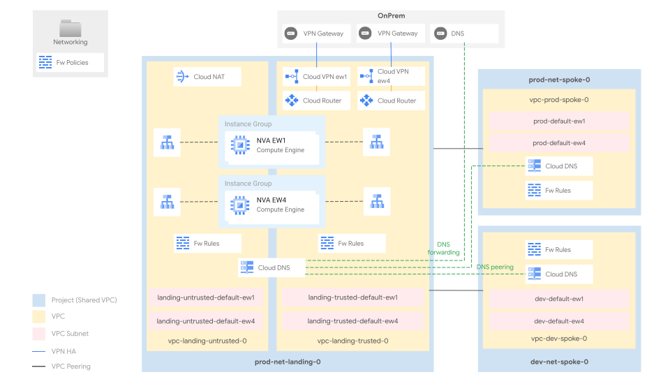

# Networking with Network Virtual Appliance

This stage sets up the shared network infrastructure for the whole organization.
It is an alternative to the [02-networking stage](../02-networking/README.md).

It is designed for those who would like to leverage Network Virtual Appliances (NVAs) between trusted and untrusted areas of the network, for example for Intrusion Prevention System (IPS) purposes.

It adopts the common “hub and spoke” reference design, which is well suited to multiple scenarios, and it offers several advantages versus other designs:

- the "trusted hub" VPC centralizes the external connectivity towards trusted network resources (e.g. to on-prem, other cloud environments and the spokes), and it is ready to host cross-environment services like CI/CD, code repositories, and monitoring probes
- the "spoke" VPCs allow partitioning workloads (e.g. by environment like in this setup), while still retaining controlled access to central connectivity and services
- Shared VPCs in both hub and spokes split management of network resources into specific (host) projects, while still allowing them to be consumed from the workload (service) projects
- the design facilitates DNS centralization

Connectivity between the hub and the spokes is established via [VPC network peerings](https://cloud.google.com/vpc/docs/vpc-peering), which offer uncapped bandwidth, lower latencies, at no additional costs and with a very low management overhead. Different ways of implementing connectivity, and related pros and cons, are discussed below.

The diagram shows the high-level design and it should be used as a reference throughout the following sections. The final number of subnets, and their IP addressing will depend on the user-specific requirements. It can be easily changed via variables or external data files, without any need to edit the code.

<p align="center">
  
</p>

## Design overview and choices

### Multi-regional deployment

The stage deploys the the infrastructure in two regions. By default, europe-west1 and europe-west4. Regional resources (deployed in this stage in two regions) include NVAs (templates, MIGs, ILBs) and test VMs.
This provides enough redundancy to be resilient to regional failures.

### VPC design

The "landing zone" is divided into two VPC networks:
- the trusted VPC: the connectivity hub towards other trusted networks
- the untrusted VPC: the connectivity hub towards any other untrusted network

The VPCs are connected with two sets of sample NVA machines, grouped by region in [Managed Instance Groups (MIGs)](https://cloud.google.com/compute/docs/instance-groups). The appliances are plain Linux machines, performing simple routing/natting, leveraging some standard Linux features, such as *ip route* or *iptables*. While they are suited for demo purposes only, they should be substituted with enterprise appliances, before moving to production.
The traffic destined to the VMs in each MIG is mediated through internal load balancers in each region, both in the trusted and in the untrusted networks.

By default, the design assumes the following:

- on-premise networks (and related resources) are considered trusted. As such, the VPNs connecting with on-premises are terminated in GCP, in the trusted VPC
- the public Internet is considered untrusted. As such [Cloud NAT](https://cloud.google.com/nat/docs/overview) has been deployed in the untrusted landing VPC only
- cross-environment traffic, and traffic from any untrusted network to any trusted network (and vice versa) pass through the NVAs. For demo purposes, the current NVA performs simple routing/natting only
- any traffic from a trusted network to an untrusted network (e.g. Internet) is natted by the appliances. Users can anyway configure further exclusions

The trusted landing VPC acts as a hub: it bridges internal resources with the outside world and it hosts the shared services consumed by the spoke VPCs, connected to the hub thorugh VPC network peerings. Spokes are used to partition the environments. By default:

- one spoke VPC to host the development environment resources
- one spoke VPC to host the production environment resources

Each virtual network is a [shared VPC](https://cloud.google.com/vpc/docs/shared-vpc): shared VPCs are managed in dedicated *host projects* and shared with other *service projects* that can only consume the network resources.
Shared VPC lets organization administrators delegate administrative responsibilities, such as creating and managing instances, to Service Project Admins while maintaining centralized control over network resources like subnets, routes, and firewalls.

Users can easily extend the design to host additional environments, or adopt different logical mappings for the spokes (for example, in order to create a new spoke for each company entity). Adding spokes is a trivial operation and it does not increase the design complexity. The steps to add more spokes are provided in the following sections.

In multi-organization scenarios, where production and non-production resources use different Cloud Identity and GCP organizations, the hub/landing VPC is usually part of the production organization. It establishes connections with the production spokes within the same organization, and with non-production spokes in a different organization.

### External connectivity

External connectivity to on-prem is implemented via [VPN HA](https://cloud.google.com/network-connectivity/docs/vpn/concepts/topologies) (two tunnels per region), as this is the minimum common denominator often used directly, or as a stop-gap solution to validate routing and to transfer data, while waiting for [interconnects](https://cloud.google.com/network-connectivity/docs/interconnect) to be provisioned.

Connectivity to additional on-prem sites or to other cloud providers should be implemented in a similar fashion, via VPN tunnels or interconnects, in the landing VPC (either trusted or untrusted, depending by the nature of the peer), sharing the same regional router.

### Internal connectivity

As mentioned, there are other ways to implement internal connectivity other than VPC network peering. These can be easily retrofitted with minimal code changes, although they introduce additional considerations on service interoperability, quotas and management.

This is an options summary:

- [VPC Peering](https://cloud.google.com/vpc/docs/vpc-peering) (implemented here to connect the trusted landing VPC with the spokes)
  - Pros: no additional costs, full bandwidth with no configurations, no extra latency
  - Cons: no transitivity (e.g. to GKE masters, Cloud SQL, etc.), no selective exchange of routes, several quotas and limits shared between VPCs in a peering group
- [Multi-NIC appliances](https://cloud.google.com/architecture/best-practices-vpc-design#multi-nic) (implemented here to connect the trusted landing and untrusted VPCs)
  - Pros: provides additional security features (e.g. IPS), potentially better integration with on-prem systems by using the same vendor
  - Cons: complex HA/failover setup, limited by VM bandwidth and scale, additional costs for VMs and licenses, out of band management of a critical cloud component
- [VPN HA](https://cloud.google.com/network-connectivity/docs/vpn/concepts/topologies)
  - Pros: simple compatibility with GCP services that leverage peering internally, better control on routes, avoids peering groups shared quotas and limits
  - Cons: additional costs, marginal increase in latency, requires multiple tunnels for full bandwidth

### IP ranges, subnetting, routing

Minimizing the number of routes (and subnets) in the cloud environment is important, as it simplifies management and it avoids hitting [Cloud Router](https://cloud.google.com/network-connectivity/docs/router/quotas) and [VPC](https://cloud.google.com/vpc/docs/quota) quotas and limits. For this reason, we recommend to carefully plan the IP space used in your cloud environment, thus being able to use larger IP CIDR blocks in routes, whenever possible.

This stage uses a dedicated /16 block, which should be sized to the users' needs. The subnets created in each VPC derive from this range.

Spoke VPCs also define and reserve two "special" CIDR ranges dedicated to [PSA (Private Service Access)](https://cloud.google.com/vpc/docs/private-services-access) and [Internal HTTPs Load Balancers (L7ILB)](https://cloud.google.com/load-balancing/docs/l7-internal).

Routes in GCP are either automatically created (e.g. when a subnet is added to a VPC), manually created via static routes, dynamically exchanged through VPC peerings, or dynamically programmed by [Cloud Routers](https://cloud.google.com/network-connectivity/docs/router#docs) when a BGP session is established. BGP sessions can be configured to advertise VPC ranges, and/or custom ranges via custom advertisements.

In this setup:

- routes between multiple subnets within the same VPC are automatically exchanged by GCP
- the spokes and the trusted landing VPC exchange routes with via VPC peering
- on-premises is connected to the trusted landing VPC and it dynamically exchanges BGP routes with GCP (with the trusted VPC) using VPN HA
- for cross-environment (spokes) communications, and for connections to on-premises and to the Internet, the spokes leverage some default tagged routes that send the traffic of each region (whose machines are identified by a dedicated network tag, e.g. *ew1*) to a corresponding regional NVA in the trusted VPC, through an ILB (whose VIP is set as the route next-hop)
- the spokes are configured with backup default routes, so if the NVAs in the same region become unavailable, more routes to the NVAs in the other region are already available. Current routes are not able to understand if the next-hop ILBs become unhealthy. As such, in case of a regional failure, users will need to manually withdraw the primary default routes, so the secondaries will take over
- the NVAs are configured with static routes that allow the communication with on-premises and between the GCP resources (including the cross-environment communication)

The Cloud Routers (connected to the VPN gateways in the trusted VPC) are configured to exclude the default advertisement of VPC ranges and they only advertise their respective aggregate ranges, via custom advertisements. This greatly simplifies the routing configuration and avoids quota or limit issues, by keeping the number of routes small, instead of making it proportional to the subnets and to the secondary ranges in the VPCs.

### Internet egress

In this setup, Internet egress is realized through [Cloud NAT](https://cloud.google.com/nat/docs/overview), deployed in the untrusted landing VPC. This allows instances in all other VPCs to reach the Internet, passing through the NVAs (being the public Internet considered untrusted).

Several other scenarios are possible, with varying degrees of complexity:

- deploy Cloud NAT in every VPC
- add forwarding proxies, with optional URL filters
- send Internet traffic to on-premises, so the existing egress infrastructure can be leveraged

Future pluggable modules will allow users to easily experiment the above scenarios.

### VPC and Hierarchical Firewall

The GCP Firewall is a stateful, distributed feature that allows the creation of L4 policies, either via VPC-level rules or more recently via hierarchical policies applied on the resource hierarchy (organization, folders).

The current setup adopts both firewall types, and uses hierarchical rules on the Networking folder for common ingress rules (egress is open by default), e.g. from health check or IAP forwarders ranges, and VPC rules for the environment or workload-level ingress.

Rules and policies are defined in simple YAML files, described below.

### DNS

DNS often goes hand in hand with networking, especially on GCP where Cloud DNS zones and policies are associated at the VPC level. This setup implements both the DNS flows:

- on-prem to cloud via private DNS zones for cloud-managed domains, and an [inbound policy](https://cloud.google.com/dns/docs/server-policies-overview#dns-server-policy-in) used as the forwarding target or via delegation (it requires some extra configuration) from on-prem DNS resolvers
- cloud to on-prem via forwarding zones for the on-prem managed domains

DNS configuration is further centralized by leveraging peering zones, so that

- the landing project hosts Cloud DNS hosts configurations for on-prem forwarding and Google API domains. Both the trusted and the untrusted VPC have been given visibility to this zones and the spokes consume them via DNS peering zones
- the spokes Cloud DNS host configurations for the environment-specific domains, with the trusted and untrusted VPCs acting as consumers (via DNS peering zones configured in the landing project)

To complete the configuration, the 35.199.192.0/19 range should be routed on the VPN tunnels from on-prem, and the following names configured for DNS forwarding to cloud:

- `private.googleapis.com`
- `restricted.googleapis.com`
- `gcp.example.com` (used as a placeholder)

From the cloud, the `example.com` domain (used as a placeholder) is forwarded to on-prem.

This configuration is battle-tested, and flexible enough to lend itself to simple modifications without subverting its design, for example by forwarding and peering root zones to bypass Cloud DNS external resolution.

## How to run this stage

This stage is meant to be executed after the [resman](../01-resman) stage has run, as it leverages the automation service account and bucket created there, and additional resources configured in the [bootstrap](../00-boostrap) stage.

It's possible to run this stage in isolation, but that's outside the scope of this document. Please, refer to the previous stages for the environmental requirements.

Before running this stage, you need to make sure you have the correct credentials and permissions, and localize variables by assigning values that match your configuration.

### Providers configuration

The default way of making sure you have the right permissions, is to use the identity of the service account pre-created for this stage during the [resource management](./01-resman) stage, and that you are a member of the group that can impersonate it via provider-level configuration (`gcp-devops` or `organization-admins`).

To simplify setup, the previous stage pre-configures a valid providers file in its output, and optionally writes it to a local file if the `outputs_location` variable is set to a valid path.

If you have set a valid value for `outputs_location` in the bootstrap stage, simply link the relevant `providers.tf` file from this stage's folder in the path you specified:

```bash
# `outputs_location` is set to `../../configs/example`
ln -s ../../configs/example/02-networking-nva-nva/providers.tf
```

If you have not configured `outputs_location` in bootstrap, you can derive the providers file from that stage's outputs:

```bash
cd ../00-bootstrap
terraform output -json providers | jq -r '.["02-networking-nva"]' \
  > ../02-networking-nva-nva/providers.tf
```

### Variable configuration

There are two broad sets of variables you will need to fill in:

- variables shared by other stages (org id, billing account id, etc.), or derived from a resource managed by a different stage (folder id, automation project id, etc.)
- variables specific to resources managed by this stage

To avoid the tedious job of filling in the first group of variables with values derived from other stages' outputs, the same mechanism used above for the provider configuration can be used to leverage pre-configured `.tfvars` files.

If you have set a valid value for `outputs_location` in the bootstrap and in the resman stage, simply link the relevant `terraform-*.auto.tfvars.json` files from this stage's folder in the path you specified, where the `*` above is set to the name of the stage that produced it. For this stage, a single `.tfvars` file is available:

```bash
# `outputs_location` is set to `../../configs/example`
ln -s ../../configs/example/02-networking-nva/terraform-bootstrap.auto.tfvars.json
ln -s ../../configs/example/02-networking-nva/terraform-resman.auto.tfvars.json
```

Please refer to the [Variables](#variables) table below for a map of the variable origins, and to the sections below on how to adapt this stage to your networking configuration.

### VPCs

VPCs are defined in separate files, one for `untrusted landing`, one for `trusted landing`, one for each of `prod` and `dev`.
These files contain different resources:

- The **project** ([`project`](https://github.com/terraform-google-modules/cloud-foundation-fabric/tree/master/modules/project)) contains the VPC, and enables the required APIs and sets itself as a "[host project](https://cloud.google.com/vpc/docs/shared-vpc)".
- The **VPC** ([`net-vpc`](https://github.com/terraform-google-modules/cloud-foundation-fabric/tree/master/modules/net-vpc)) manages the subnets, the explicit routes for `{private,restricted}.googleapis.com`, and the DNS inbound policy (for the trusted landing VPC). Subnets are created leveraging a "resource factory" paradigm, where the configuration is separated from the module that implements it, and stored in a well-structured file. To add a new subnet, simply create a new file in the `data_folder` directory defined in the module, following the examples found in the [Fabric `net-vpc` documentation](https://github.com/terraform-google-modules/cloud-foundation-fabric/tree/master/modules/net-vpc#subnet-factory). Sample subnets are shipped in [data/subnets](./data/subnets), and can be easily customized to fit users' needs.

Subnets for [L7 ILBs](https://cloud.google.com/load-balancing/docs/l7-internal/proxy-only-subnets) are handled differently, and defined in variable `l7ilb_subnets`, while ranges for [PSA](https://cloud.google.com/vpc/docs/configure-private-services-access#allocating-range) are configured by variable `psa_ranges` - such variables are consumed by spoke VPCs.

- **Cloud NAT** ([`net-cloudnat`](https://github.com/terraform-google-modules/cloud-foundation-fabric/tree/master/modules/net-cloudnat)) (in case of the untrusted VPC) that manages the networking infrastructure required to enable the Internet egress.

### VPNs

Connectivity between on-prem and GCP (the trusted landing VPC) is implemented with VPN HA ([`net-vpn`](https://github.com/terraform-google-modules/cloud-foundation-fabric/tree/master/modules/net-vpn)) and defined in [`vpn-onprem.tf`](./vpn-onprem.tf). The file provisionally implements a single logical connection between on-premises and landing at `europe-west1`, and the relevant parameters for its configuration are found in variable `vpn_onprem_configs`.

### Routing and BGP

Each VPC network ([`net-vpc`](https://github.com/terraform-google-modules/cloud-foundation-fabric/tree/master/modules/net-vpc)) manages a separate routing table, which can define static routes (e.g. to private.googleapis.com) and receives dynamic routes through VPC peering and BGP sessions established with neighbor networks (e.g. landing receives routes from on-premises, and the spokes receive RFC1918 from landing).

Static routes are defined in `vpc-*.tf` files, in the `routes` section of each `net-vpc` module.

BGP sessions for trusted landing to on-premises are configured through the variable `vpn_onprem_configs`.

### Firewall

**VPC firewall rules** ([`net-vpc-firewall`](https://github.com/terraform-google-modules/cloud-foundation-fabric/tree/master/modules/net-vpc-firewall)) are defined per-vpc on each `vpc-*.tf` file and leverage a resource factory to massively create rules.
To add a new firewall rule, create a new file or edit an existing one in the `data_folder` directory defined in the module `net-vpc-firewall`, following the examples of the "[Rules factory](https://github.com/terraform-google-modules/cloud-foundation-fabric/tree/master/modules/net-vpc-firewall#rules-factory)" section of the module documentation. Sample firewall rules are shipped in [data/firewall-rules/landing](./data/firewall-rules/landing) and can be easily customized.

**Hierarchical firewall policies** ([`folder`](https://github.com/terraform-google-modules/cloud-foundation-fabric/tree/master/modules/folder)) are defined in `main.tf`, and managed through a policy factory implemented by the `folder` module, which applies the defined hierarchical to the `Networking` folder, which contains all the core networking infrastructure. Policies are defined in the `rules_file` file - to define a new one simply use the instructions found on "[Firewall policy factory](https://github.com/terraform-google-modules/cloud-foundation-fabric/tree/master/modules/organization#firewall-policy-factory)". Sample hierarchical firewall policies are shipped in [data/hierarchical-policy-rules.yaml](./data/hierarchical-policy-rules.yaml) and can be easily customized.

### DNS architecture

The DNS ([`dns`](https://github.com/terraform-google-modules/cloud-foundation-fabric/tree/master/modules/dns)) infrastructure is defined in [`dns-*.tf`] files.

Cloud DNS manages on-premises forwarding, the main GCP zone (in this example `gcp.example.com`) and is peered to environment-specific zones (i.e. `dev.gcp.example.com` and `prod.gcp.example.com`).

#### Cloud environment

The root DNS zone defined in the landing project acts as the source of truth for DNS within the Cloud environment. Resources defined in the spoke VPCs consume the landing DNS infrastructure through DNS peering (e.g. `prod-landing-root-dns-peering`).
Spokes can optionally define private zones (e.g. `prod-dns-private-zone`) - granting visibility to the Landing VPC ensures that the whole cloud environment can query such zones.

#### Cloud to on-premises

Leveraging the forwarding zones defined on landing project (e.g. `onprem-example-dns-forwarding` and `reverse-10-dns-forwarding`), the cloud environment can resolve `in-addr.arpa.` and `onprem.example.com.` using the on-premises DNS infrastructure. On-premise resolvers IPs are set in variable `dns.onprem`.

DNS queries sent to the on-premises infrastructure come from the `35.199.192.0/19` source range.

#### On-premises to cloud

The [Inbound DNS Policy](https://cloud.google.com/dns/docs/server-policies-overview#dns-server-policy-in) defined in *trusted landing VPC module* ([`vpc-landing.tf`](./vpc-landing.tf)) automatically reserves the first available IP address on each subnet (typically the third one in a CIDR) to expose the Cloud DNS service, so that it can be consumed from outside of GCP.

### Private Google Access

[Private Google Access](https://cloud.google.com/vpc/docs/private-google-access) (or PGA) enables VMs and on-premise systems to consume Google APIs from within the Google network, and is already fully configured on this environment.

For PGA to work:

- Private Google Access should be enabled on the subnet. \
Subnets created using the `net-vpc` module are PGA-enabled by default.

- 199.36.153.4/30 (`restricted.googleapis.com`) and 199.36.153.8/30 (`private.googleapis.com`) should be routed from on-premises to VPC, and from there to the `default-internet-gateway`. \
Per variable `vpn_onprem_configs` such ranges are advertised to on-premises - furthermore every VPC (e.g. see `landing-vpc` in [`landing.tf`](./landing.tf)) has explicit routes set in case the `0.0.0.0/0` route is changed.

- A private DNS zone for `googleapis.com` should be created and configured per [this article](https://cloud.google.com/vpc/docs/configure-private-google-access-hybrid#config-domain), as implemented in module `googleapis-private-zone` in [`dns.tf`](./dns.tf)

### Preliminar activities

Before running `terraform apply` on this stage, make sure to adapt all of `variables.tf` to your needs, to update all references to regions (e.g. `europe-west1` or `ew1`) in the whole directory to match your preferences.

If you're not using FAST, you'll also need to create a `providers.tf` file to configure the GCS backend and the service account to use to run the deployment.

You're now ready to run `terraform init` and `apply`.

### Post-deployment activities

- On-premise routers should be configured to advertise all relevant CIDRs to the GCP environments. To avoid hitting GCP quotas, we recommend aggregating routes as much as possible.
- On-premise routers should accept BGP sessions from their cloud peers.
- On-premise DNS servers should have forward zones for GCP-managed ones.

## Customizations

### Adding an environment

To create a new environment (e.g. `staging`), a few changes are required.

Create a `vpc-spoke-staging.tf` file by copying `vpc-spoke-prod.tf` file,
and adapt the new file by replacing the value "prod" with the value "staging".
Running `diff vpc-spoke-dev.tf vpc-spoke-prod.tf` can help to see how environment files differ.

The new VPC requires a set of dedicated CIDRs, one per region, added to variable `custom_adv` (for example as `spoke_staging_ew1` and `spoke_staging_ew4`).
>`custom_adv` is a map that "resolves" CIDR names to actual addresses, and will be used later to configure routing.
>
Variables managing L7 Internal Load Balancers (`l7ilb_subnets`) and Private Service Access (`psa_ranges`) should also be adapted, and subnets and firewall rules for the new spoke should be added as described above.

VPC network peering connectivity to the `trusted landing VPC` is managed by the `vpc-peering-*.tf` files.
Copy `vpc-peering-prod.tf` to `vpc-peering-staging.tf` and replace within the files "prod" with "staging", where relevant.

Configure the NVAs deployed or update the sample NVA config files (for [ew1](data/nva-startup-script-ew1.tftpl) and for [ew4](data/nva-startup-script-ew1.tftpl)), thus making sure they support the new subnets, so the interconnection with the rest of the system.

DNS configurations are managed in the `dns-*.tf` files.
Copy for example the `dns-dev.tf` to `dns-staging.tf` and replace within the files "prod" with "staging", where relevant.
Don't forget to add a peering zone in the landing project and point it to the newly created environment private zone.

<!-- TFDOC OPTS files:1 show_extra:1 -->
<!-- BEGIN TFDOC -->

## Files

| name | description | modules | resources |
|---|---|---|---|
| [dns-dev.tf](./dns-dev.tf) | Development spoke DNS zones and peerings setup. | <code>dns</code> |  |
| [dns-landing.tf](./dns-landing.tf) | Landing DNS zones and peerings setup. | <code>dns</code> |  |
| [dns-prod.tf](./dns-prod.tf) | Production spoke DNS zones and peerings setup. | <code>dns</code> |  |
| [main.tf](./main.tf) | Networking folder and hierarchical policy. | <code>folder</code> |  |
| [monitoring.tf](./monitoring.tf) | Network monitoring dashboards. |  | <code>google_monitoring_dashboard</code> |
| [nva.tf](./nva.tf) | None | <code>compute-mig</code> · <code>compute-vm</code> · <code>net-ilb</code> |  |
| [outputs.tf](./outputs.tf) | Module outputs. |  | <code>local_file</code> |
| [test-resources.tf](./test-resources.tf) | temporary instances for testing | <code>compute-vm</code> |  |
| [variables.tf](./variables.tf) | Module variables. |  |  |
| [vpc-landing.tf](./vpc-landing.tf) | Landing VPC and related resources. | <code>net-cloudnat</code> · <code>net-vpc</code> · <code>net-vpc-firewall</code> · <code>project</code> |  |
| [vpc-spoke-dev.tf](./vpc-spoke-dev.tf) | Dev spoke VPC and related resources. | <code>net-address</code> · <code>net-vpc</code> · <code>net-vpc-firewall</code> · <code>net-vpc-peering</code> · <code>project</code> |  |
| [vpc-spoke-prod.tf](./vpc-spoke-prod.tf) | Production spoke VPC and related resources. | <code>net-address</code> · <code>net-vpc</code> · <code>net-vpc-firewall</code> · <code>net-vpc-peering</code> · <code>project</code> |  |
| [vpn-onprem.tf](./vpn-onprem.tf) | VPN between landing and onprem. | <code>net-vpn-ha</code> |  |

## Variables

| name | description | type | required | default | producer |
|---|---|:---:|:---:|:---:|:---:|
| [billing_account_id](variables.tf#L17) | Billing account id. | <code>string</code> | ✓ |  | <code>00-bootstrap</code> |
| [organization](variables.tf#L99) | Organization details. | <code title="object&#40;&#123;&#10;  domain      &#61; string&#10;  id          &#61; number&#10;  customer_id &#61; string&#10;&#125;&#41;">object&#40;&#123;&#8230;&#125;&#41;</code> | ✓ |  | <code>00-bootstrap</code> |
| [prefix](variables.tf#L115) | Prefix used for resources that need unique names. | <code>string</code> | ✓ |  | <code>00-bootstrap</code> |
| [custom_adv](variables.tf#L23) | Custom advertisement definitions in name => range format. | <code>map&#40;string&#41;</code> |  | <code title="&#123;&#10;  cloud_dns                 &#61; &#34;35.199.192.0&#47;19&#34;&#10;  gcp_all                   &#61; &#34;10.128.0.0&#47;16&#34;&#10;  gcp_dev_ew1               &#61; &#34;10.128.128.0&#47;19&#34;&#10;  gcp_dev_ew4               &#61; &#34;10.128.160.0&#47;19&#34;&#10;  gcp_landing_trusted_ew1   &#61; &#34;10.128.64.0&#47;19&#34;&#10;  gcp_landing_trusted_ew4   &#61; &#34;10.128.96.0&#47;19&#34;&#10;  gcp_landing_untrusted_ew1 &#61; &#34;10.128.0.0&#47;19&#34;&#10;  gcp_landing_untrusted_ew4 &#61; &#34;10.128.32.0&#47;19&#34;&#10;  gcp_prod_ew1              &#61; &#34;10.128.192.0&#47;19&#34;&#10;  gcp_prod_ew4              &#61; &#34;10.128.224.0&#47;19&#34;&#10;  googleapis_private        &#61; &#34;199.36.153.8&#47;30&#34;&#10;  googleapis_restricted     &#61; &#34;199.36.153.4&#47;30&#34;&#10;  rfc_1918_10               &#61; &#34;10.0.0.0&#47;8&#34;&#10;  rfc_1918_172              &#61; &#34;172.16.0.0&#47;12&#34;&#10;  rfc_1918_192              &#61; &#34;192.168.0.0&#47;16&#34;&#10;&#125;">&#123;&#8230;&#125;</code> |  |
| [data_dir](variables.tf#L45) | Relative path for the folder storing configuration data for network resources. | <code>string</code> |  | <code>&#34;data&#34;</code> |  |
| [dns](variables.tf#L51) | Onprem DNS resolvers | <code>map&#40;list&#40;string&#41;&#41;</code> |  | <code title="&#123;&#10;  onprem &#61; &#91;&#34;10.0.200.3&#34;&#93;&#10;&#125;">&#123;&#8230;&#125;</code> |  |
| [folder_id](variables.tf#L59) | Folder to be used for the networking resources in folders/nnnnnnnnnnn format. If null, folder will be created. | <code>string</code> |  | <code>null</code> | <code>01-resman</code> |
| [l7ilb_subnets](variables.tf#L73) | Subnets used for L7 ILBs. | <code title="map&#40;list&#40;object&#40;&#123;&#10;  ip_cidr_range &#61; string&#10;  region        &#61; string&#10;&#125;&#41;&#41;&#41;">map&#40;list&#40;object&#40;&#123;&#8230;&#125;&#41;&#41;&#41;</code> |  | <code title="&#123;&#10;  prod &#61; &#91;&#10;    &#123; ip_cidr_range &#61; &#34;10.136.240.0&#47;24&#34;, region &#61; &#34;europe-west1&#34; &#125;,&#10;    &#123; ip_cidr_range &#61; &#34;10.137.240.0&#47;24&#34;, region &#61; &#34;europe-west4&#34; &#125;&#10;  &#93;&#10;  dev &#61; &#91;&#10;    &#123; ip_cidr_range &#61; &#34;10.144.240.0&#47;24&#34;, region &#61; &#34;europe-west1&#34; &#125;,&#10;    &#123; ip_cidr_range &#61; &#34;10.145.240.0&#47;24&#34;, region &#61; &#34;europe-west4&#34; &#125;&#10;  &#93;&#10;&#125;">&#123;&#8230;&#125;</code> |  |
| [onprem_cidr](variables.tf#L91) | Onprem addresses in name => range format. | <code>map&#40;string&#41;</code> |  | <code title="&#123;&#10;  main &#61; &#34;10.0.0.0&#47;24&#34;&#10;&#125;">&#123;&#8230;&#125;</code> |  |
| [outputs_location](variables.tf#L109) | Path where providers and tfvars files for the following stages are written. Leave empty to disable. | <code>string</code> |  | <code>null</code> |  |
| [project_factory_sa](variables.tf#L121) | IAM emails for project factory service accounts | <code>map&#40;string&#41;</code> |  | <code>&#123;&#125;</code> | <code>01-resman</code> |
| [psa_ranges](variables.tf#L128) | IP ranges used for Private Service Access (e.g. CloudSQL). | <code>map&#40;map&#40;string&#41;&#41;</code> |  | <code title="&#123;&#10;  prod &#61; &#123;&#10;    cloudsql-mysql     &#61; &#34;10.136.250.0&#47;24&#34;&#10;    cloudsql-sqlserver &#61; &#34;10.136.251.0&#47;24&#34;&#10;  &#125;&#10;  dev &#61; &#123;&#10;    cloudsql-mysql     &#61; &#34;10.144.250.0&#47;24&#34;&#10;    cloudsql-sqlserver &#61; &#34;10.144.251.0&#47;24&#34;&#10;  &#125;&#10;&#125;">&#123;&#8230;&#125;</code> |  |
| [router_configs](variables.tf#L143) | Configurations for CRs and onprem routers. | <code title="map&#40;object&#40;&#123;&#10;  adv &#61; object&#40;&#123;&#10;    custom  &#61; list&#40;string&#41;&#10;    default &#61; bool&#10;  &#125;&#41;&#10;  asn &#61; number&#10;&#125;&#41;&#41;">map&#40;object&#40;&#123;&#8230;&#125;&#41;&#41;</code> |  | <code title="&#123;&#10;  landing-trusted-ew1 &#61; &#123;&#10;    asn &#61; &#34;65534&#34;&#10;    adv &#61; null&#10;  &#125;&#10;  landing-trusted-ew1 &#61; &#123;&#10;    asn &#61; &#34;65534&#34;&#10;    adv &#61; null&#10;  &#125;&#10;&#125;">&#123;&#8230;&#125;</code> |  |
| [vpn_onprem_configs](variables.tf#L166) | VPN gateway configuration for onprem interconnection. | <code title="map&#40;object&#40;&#123;&#10;  adv &#61; object&#40;&#123;&#10;    default &#61; bool&#10;    custom  &#61; list&#40;string&#41;&#10;  &#125;&#41;&#10;  peer_external_gateway &#61; object&#40;&#123;&#10;    redundancy_type &#61; string&#10;    interfaces &#61; list&#40;object&#40;&#123;&#10;      id         &#61; number&#10;      ip_address &#61; string&#10;    &#125;&#41;&#41;&#10;  &#125;&#41;&#10;  tunnels &#61; list&#40;object&#40;&#123;&#10;    peer_asn                        &#61; number&#10;    peer_external_gateway_interface &#61; number&#10;    secret                          &#61; string&#10;    session_range                   &#61; string&#10;    vpn_gateway_interface           &#61; number&#10;  &#125;&#41;&#41;&#10;&#125;&#41;&#41;">map&#40;object&#40;&#123;&#8230;&#125;&#41;&#41;</code> |  | <code title="&#123;&#10;  landing-trusted-ew1 &#61; &#123;&#10;    adv &#61; &#123;&#10;      default &#61; false&#10;      custom &#61; &#91;&#10;        &#34;cloud_dns&#34;, &#34;googleapis_private&#34;, &#34;googleapis_restricted&#34;, &#34;gcp_all&#34;&#10;      &#93;&#10;    &#125;&#10;    peer_external_gateway &#61; &#123;&#10;      redundancy_type &#61; &#34;SINGLE_IP_INTERNALLY_REDUNDANT&#34;&#10;      interfaces &#61; &#91;&#10;        &#123; id &#61; 0, ip_address &#61; &#34;8.8.8.8&#34; &#125;,&#10;      &#93;&#10;    &#125;&#10;    tunnels &#61; &#91;&#10;      &#123;&#10;        peer_asn                        &#61; 65534&#10;        peer_external_gateway_interface &#61; 0&#10;        secret                          &#61; &#34;foobar&#34;&#10;        session_range                   &#61; &#34;169.254.1.0&#47;30&#34;&#10;        vpn_gateway_interface           &#61; 0&#10;      &#125;,&#10;      &#123;&#10;        peer_asn                        &#61; 65534&#10;        peer_external_gateway_interface &#61; 0&#10;        secret                          &#61; &#34;foobar&#34;&#10;        session_range                   &#61; &#34;169.254.1.4&#47;30&#34;&#10;        vpn_gateway_interface           &#61; 1&#10;      &#125;&#10;    &#93;&#10;  &#125;&#10;  landing-trusted-ew4 &#61; &#123;&#10;    adv &#61; &#123;&#10;      default &#61; false&#10;      custom &#61; &#91;&#10;        &#34;cloud_dns&#34;, &#34;googleapis_private&#34;, &#34;googleapis_restricted&#34;, &#34;gcp_all&#34;&#10;      &#93;&#10;    &#125;&#10;    peer_external_gateway &#61; &#123;&#10;      redundancy_type &#61; &#34;SINGLE_IP_INTERNALLY_REDUNDANT&#34;&#10;      interfaces &#61; &#91;&#10;        &#123; id &#61; 0, ip_address &#61; &#34;8.8.8.8&#34; &#125;,&#10;      &#93;&#10;    &#125;&#10;    tunnels &#61; &#91;&#10;      &#123;&#10;        peer_asn                        &#61; 65534&#10;        peer_external_gateway_interface &#61; 0&#10;        secret                          &#61; &#34;foobar&#34;&#10;        session_range                   &#61; &#34;169.254.1.0&#47;30&#34;&#10;        vpn_gateway_interface           &#61; 0&#10;      &#125;,&#10;      &#123;&#10;        peer_asn                        &#61; 65534&#10;        peer_external_gateway_interface &#61; 0&#10;        secret                          &#61; &#34;foobar&#34;&#10;        session_range                   &#61; &#34;169.254.1.4&#47;30&#34;&#10;        vpn_gateway_interface           &#61; 1&#10;      &#125;&#10;    &#93;&#10;  &#125;&#10;&#125;">&#123;&#8230;&#125;</code> |  |

## Outputs

| name | description | sensitive | consumers |
|---|---|:---:|---|
| [cloud_dns_inbound_policy](outputs.tf#L42) | IP Addresses for Cloud DNS inbound policy. |  |  |
| [project_ids](outputs.tf#L47) | Network project ids. |  |  |
| [project_numbers](outputs.tf#L56) | Network project numbers. |  |  |
| [shared_vpc_host_projects](outputs.tf#L65) | Shared VPC host projects. |  |  |
| [shared_vpc_self_links](outputs.tf#L74) | Shared VPC host projects. |  |  |
| [tfvars](outputs.tf#L98) | Network-related variables used in other stages. | ✓ |  |
| [vpn_gateway_endpoints](outputs.tf#L84) | External IP Addresses for the GCP VPN gateways. |  |  |

<!-- END TFDOC -->
