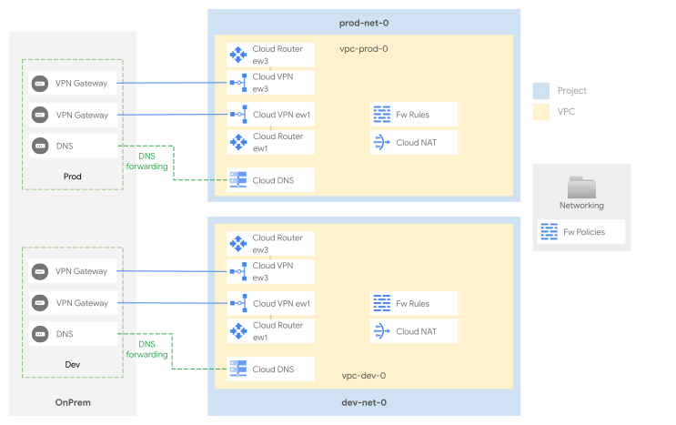

# Networking

This stage sets up the shared network infrastructure for the whole organization. It implements a single shared VPC per environment, where each environment is independently connected to the on-premise environment, to maintain a fully separated routing domain on GCP.

While no communication between environment is implemented on this design, that could be achieved with a number of different options:

- [VPC Peering](https://cloud.google.com/vpc/docs/vpc-peering) - which is not recommended as it would effectively create a full line of sight between workloads belonging to different environments
- [VPN HA](https://cloud.google.com/network-connectivity/docs/vpn/concepts/topologies) tunnels between environments, exchanging a subset of well-defined routes. 
- [Multi-NIC appliances](https://cloud.google.com/architecture/best-practices-vpc-design#multi-nic) connecting the different environments, allowing the use of NVAs to enforce networking policies. This design would require the usage of a "decoupling" VPC peered to one of the environments. 

  

<!-- TFDOC OPTS files:1 show_extra:1 -->
<!-- BEGIN TFDOC -->

## Files

| name | description | modules | resources |
|---|---|---|---|
| [dns-dev.tf](./dns-dev.tf) | Development spoke DNS zones and peerings setup. | <code>dns</code> |  |
| [dns-prod.tf](./dns-prod.tf) | Production spoke DNS zones and peerings setup. | <code>dns</code> |  |
| [main.tf](./main.tf) | Networking folder and hierarchical policy. | <code>folder</code> |  |
| [monitoring.tf](./monitoring.tf) | Network monitoring dashboards. |  | <code>google_monitoring_dashboard</code> |
| [net-dev.tf](./net-dev.tf) | Dev spoke VPC and related resources. | <code>net-cloudnat</code> · <code>net-vpc</code> · <code>net-vpc-firewall</code> · <code>project</code> | <code>google_project_iam_binding</code> |
| [net-prod.tf](./net-prod.tf) | Production spoke VPC and related resources. | <code>net-cloudnat</code> · <code>net-vpc</code> · <code>net-vpc-firewall</code> · <code>project</code> | <code>google_project_iam_binding</code> |
| [outputs.tf](./outputs.tf) | Module outputs. |  | <code>local_file</code> |
| [test-resources.tf](./test-resources.tf) | temporary instances for testing | <code>compute-vm</code> |  |
| [variables.tf](./variables.tf) | Module variables. |  |  |
| [vpn-onprem-dev.tf](./vpn-onprem-dev.tf) | VPN between dev and onprem. | <code>net-vpn-ha</code> |  |
| [vpn-onprem-prod.tf](./vpn-onprem-prod.tf) | VPN between prod and onprem. | <code>net-vpn-ha</code> |  |

## Variables

| name | description | type | required | default | producer |
|---|---|:---:|:---:|:---:|:---:|
| [billing_account](variables.tf#L17) | Billing account id and organization id ('nnnnnnnn' or null). | <code title="object&#40;&#123;&#10;  id              &#61; string&#10;  organization_id &#61; number&#10;&#125;&#41;">object&#40;&#123;&#8230;&#125;&#41;</code> | ✓ |  | <code>00-bootstrap</code> |
| [folder_ids](variables.tf#L65) | Folders to be used for the networking resources in folders/nnnnnnnnnnn format. If null, folder will be created. | <code title="object&#40;&#123;&#10;  networking      &#61; string&#10;  networking-dev  &#61; string&#10;  networking-prod &#61; string&#10;&#125;&#41;">object&#40;&#123;&#8230;&#125;&#41;</code> | ✓ |  | <code>01-resman</code> |
| [organization](variables.tf#L93) | Organization details. | <code title="object&#40;&#123;&#10;  domain      &#61; string&#10;  id          &#61; number&#10;  customer_id &#61; string&#10;&#125;&#41;">object&#40;&#123;&#8230;&#125;&#41;</code> | ✓ |  | <code>00-bootstrap</code> |
| [prefix](variables.tf#L109) | Prefix used for resources that need unique names. Use 9 characters or less. | <code>string</code> | ✓ |  | <code>00-bootstrap</code> |
| [custom_adv](variables.tf#L26) | Custom advertisement definitions in name => range format. | <code>map&#40;string&#41;</code> |  | <code title="&#123;&#10;  cloud_dns             &#61; &#34;35.199.192.0&#47;19&#34;&#10;  gcp_all               &#61; &#34;10.128.0.0&#47;16&#34;&#10;  gcp_dev               &#61; &#34;10.128.32.0&#47;19&#34;&#10;  gcp_prod              &#61; &#34;10.128.64.0&#47;19&#34;&#10;  googleapis_private    &#61; &#34;199.36.153.8&#47;30&#34;&#10;  googleapis_restricted &#61; &#34;199.36.153.4&#47;30&#34;&#10;  rfc_1918_10           &#61; &#34;10.0.0.0&#47;8&#34;&#10;  rfc_1918_172          &#61; &#34;172.16.0.0&#47;12&#34;&#10;  rfc_1918_192          &#61; &#34;192.168.0.0&#47;16&#34;&#10;&#125;">&#123;&#8230;&#125;</code> |  |
| [custom_roles](variables.tf#L42) | Custom roles defined at the org level, in key => id format. | <code title="object&#40;&#123;&#10;  service_project_network_admin &#61; string&#10;&#125;&#41;">object&#40;&#123;&#8230;&#125;&#41;</code> |  | <code>null</code> | <code>00-bootstrap</code> |
| [data_dir](variables.tf#L51) | Relative path for the folder storing configuration data for network resources. | <code>string</code> |  | <code>&#34;data&#34;</code> |  |
| [dns](variables.tf#L57) | Onprem DNS resolvers. | <code>map&#40;list&#40;string&#41;&#41;</code> |  | <code title="&#123;&#10;  onprem &#61; &#91;&#34;10.0.200.3&#34;&#93;&#10;&#125;">&#123;&#8230;&#125;</code> |  |
| [l7ilb_subnets](variables.tf#L75) | Subnets used for L7 ILBs. | <code title="map&#40;list&#40;object&#40;&#123;&#10;  ip_cidr_range &#61; string&#10;  region        &#61; string&#10;&#125;&#41;&#41;&#41;">map&#40;list&#40;object&#40;&#123;&#8230;&#125;&#41;&#41;&#41;</code> |  | <code title="&#123;&#10;  prod &#61; &#91;&#10;    &#123; ip_cidr_range &#61; &#34;10.128.92.0&#47;24&#34;, region &#61; &#34;europe-west1&#34; &#125;,&#10;    &#123; ip_cidr_range &#61; &#34;10.128.93.0&#47;24&#34;, region &#61; &#34;europe-west4&#34; &#125;&#10;  &#93;&#10;  dev &#61; &#91;&#10;    &#123; ip_cidr_range &#61; &#34;10.128.60.0&#47;24&#34;, region &#61; &#34;europe-west1&#34; &#125;,&#10;    &#123; ip_cidr_range &#61; &#34;10.128.61.0&#47;24&#34;, region &#61; &#34;europe-west4&#34; &#125;&#10;  &#93;&#10;&#125;">&#123;&#8230;&#125;</code> |  |
| [outputs_location](variables.tf#L103) | Path where providers and tfvars files for the following stages are written. Leave empty to disable. | <code>string</code> |  | <code>null</code> |  |
| [psa_ranges](variables.tf#L120) | IP ranges used for Private Service Access (e.g. CloudSQL). | <code>map&#40;map&#40;string&#41;&#41;</code> |  | <code title="&#123;&#10;  prod &#61; &#123;&#10;    cloudsql-mysql     &#61; &#34;10.128.94.0&#47;24&#34;&#10;    cloudsql-sqlserver &#61; &#34;10.128.95.0&#47;24&#34;&#10;  &#125;&#10;  dev &#61; &#123;&#10;    cloudsql-mysql     &#61; &#34;10.128.62.0&#47;24&#34;&#10;    cloudsql-sqlserver &#61; &#34;10.128.63.0&#47;24&#34;&#10;  &#125;&#10;&#125;">&#123;&#8230;&#125;</code> |  |
| [router_onprem_configs](variables.tf#L135) | Configurations for routers used for onprem connectivity. | <code title="map&#40;object&#40;&#123;&#10;  adv &#61; object&#40;&#123;&#10;    custom  &#61; list&#40;string&#41;&#10;    default &#61; bool&#10;  &#125;&#41;&#10;  asn &#61; number&#10;&#125;&#41;&#41;">map&#40;object&#40;&#123;&#8230;&#125;&#41;&#41;</code> |  | <code title="&#123;&#10;  landing-ew1 &#61; &#123;&#10;    asn &#61; &#34;65533&#34;&#10;    adv &#61; null&#10;  &#125;&#10;&#125;">&#123;&#8230;&#125;</code> |  |
| [service_accounts](variables.tf#L153) | Automation service accounts in name => email format. | <code title="object&#40;&#123;&#10;  data-platform-dev    &#61; string&#10;  data-platform-prod   &#61; string&#10;  project-factory-dev  &#61; string&#10;  project-factory-prod &#61; string&#10;&#125;&#41;">object&#40;&#123;&#8230;&#125;&#41;</code> |  | <code>null</code> | <code>01-resman</code> |
| [vpn_onprem_configs](variables.tf#L165) | VPN gateway configuration for onprem interconnection. | <code title="map&#40;object&#40;&#123;&#10;  adv &#61; object&#40;&#123;&#10;    default &#61; bool&#10;    custom  &#61; list&#40;string&#41;&#10;  &#125;&#41;&#10;  peer_external_gateway &#61; object&#40;&#123;&#10;    redundancy_type &#61; string&#10;    interfaces &#61; list&#40;object&#40;&#123;&#10;      id         &#61; number&#10;      ip_address &#61; string&#10;    &#125;&#41;&#41;&#10;  &#125;&#41;&#10;  tunnels &#61; list&#40;object&#40;&#123;&#10;    peer_asn                        &#61; number&#10;    peer_external_gateway_interface &#61; number&#10;    secret                          &#61; string&#10;    session_range                   &#61; string&#10;    vpn_gateway_interface           &#61; number&#10;  &#125;&#41;&#41;&#10;&#125;&#41;&#41;">map&#40;object&#40;&#123;&#8230;&#125;&#41;&#41;</code> |  | <code title="&#123;&#10;  dev-ew1 &#61; &#123;&#10;    adv &#61; &#123;&#10;      default &#61; false&#10;      custom &#61; &#91;&#10;        &#34;cloud_dns&#34;, &#34;googleapis_private&#34;, &#34;googleapis_restricted&#34;, &#34;gcp_dev&#34;&#10;      &#93;&#10;    &#125;&#10;    peer_external_gateway &#61; &#123;&#10;      redundancy_type &#61; &#34;SINGLE_IP_INTERNALLY_REDUNDANT&#34;&#10;      interfaces &#61; &#91;&#10;        &#123; id &#61; 0, ip_address &#61; &#34;8.8.8.8&#34; &#125;,&#10;      &#93;&#10;    &#125;&#10;    tunnels &#61; &#91;&#10;      &#123;&#10;        peer_asn                        &#61; 65534&#10;        peer_external_gateway_interface &#61; 0&#10;        secret                          &#61; &#34;foobar&#34;&#10;        session_range                   &#61; &#34;169.254.1.0&#47;30&#34;&#10;        vpn_gateway_interface           &#61; 0&#10;      &#125;,&#10;      &#123;&#10;        peer_asn                        &#61; 65534&#10;        peer_external_gateway_interface &#61; 0&#10;        secret                          &#61; &#34;foobar&#34;&#10;        session_range                   &#61; &#34;169.254.1.4&#47;30&#34;&#10;        vpn_gateway_interface           &#61; 1&#10;      &#125;&#10;    &#93;&#10;  &#125;&#10;  prod-ew1 &#61; &#123;&#10;    adv &#61; &#123;&#10;      default &#61; false&#10;      custom &#61; &#91;&#10;        &#34;cloud_dns&#34;, &#34;googleapis_private&#34;, &#34;googleapis_restricted&#34;, &#34;gcp_prod&#34;&#10;      &#93;&#10;    &#125;&#10;    peer_external_gateway &#61; &#123;&#10;      redundancy_type &#61; &#34;SINGLE_IP_INTERNALLY_REDUNDANT&#34;&#10;      interfaces &#61; &#91;&#10;        &#123; id &#61; 0, ip_address &#61; &#34;8.8.8.8&#34; &#125;,&#10;      &#93;&#10;    &#125;&#10;    tunnels &#61; &#91;&#10;      &#123;&#10;        peer_asn                        &#61; 65534&#10;        peer_external_gateway_interface &#61; 0&#10;        secret                          &#61; &#34;foobar&#34;&#10;        session_range                   &#61; &#34;169.254.1.0&#47;30&#34;&#10;        vpn_gateway_interface           &#61; 0&#10;      &#125;,&#10;      &#123;&#10;        peer_asn                        &#61; 65534&#10;        peer_external_gateway_interface &#61; 0&#10;        secret                          &#61; &#34;foobar&#34;&#10;        session_range                   &#61; &#34;169.254.1.4&#47;30&#34;&#10;        vpn_gateway_interface           &#61; 1&#10;      &#125;&#10;    &#93;&#10;  &#125;&#10;&#125;">&#123;&#8230;&#125;</code> |  |

## Outputs

| name | description | sensitive | consumers |
|---|---|:---:|---|
| [dev_cloud_dns_inbound_policy](outputs.tf#L53) | IP Addresses for Cloud DNS inbound policy for the dev environment. |  |  |
| [host_project_ids](outputs.tf#L63) | Network project ids. |  |  |
| [host_project_numbers](outputs.tf#L68) | Network project numbers. |  |  |
| [prod_cloud_dns_inbound_policy](outputs.tf#L58) | IP Addresses for Cloud DNS inbound policy for the prod environment. |  |  |
| [shared_vpc_self_links](outputs.tf#L73) | Shared VPC host projects. |  |  |
| [tfvars](outputs.tf#L92) | Terraform variables file for the following stages. | ✓ |  |
| [vpn_gateway_endpoints](outputs.tf#L78) | External IP Addresses for the GCP VPN gateways. |  |  |

<!-- END TFDOC -->
