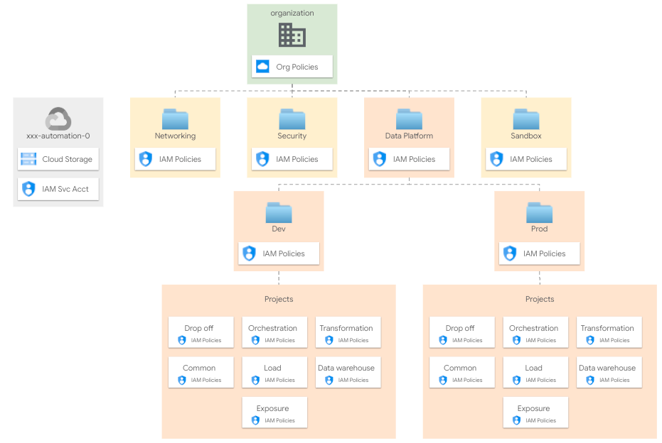

# Data Platform

The Data Platform (DP) builds on top of your foundations to create and set up projects (and related resources) to be used for your data platform.

<p align="center">
  
</p>

## Design overview and choices

The DP creates projects in a well-defined context, according to your resource management structure. Within the DP folder, resources are organized by environment.

Projects for each environment across different data layer are created to separate Service Account and Group roles. Roles are assigned at project level.

The Data Platform takes care of the following activities:

- Project creation
- API/Services enablement
- Service accounts creation
- IAM roles assignment for groups and service accounts
- KMS keys roles assignment
- Shared VPC attachment and subnets IAM binding
- Project-level org policies definition
- Billing setup (billing account attachment and budget configuration)
- Resource on each project to handle your data platform.

You can find more details on the DP implemented on the DP [README](../../../../examples/data-solutions/data-platform-foundations/).

### User Groups

The DP rely on user groups to assign roles. They provide a stable frame of reference that allows decoupling the final set of permissions for each group, from the stage where entities and resources are created and their IAM bindings defined. [Here](../../../../examples/data-solutions/data-platform-foundations/#groups) you can find more detail on  users groups used by the DP.

### Network

The DP rely on the shared VPC defined on the [`02-networking`](../../02-networking-vpn) stage.

### Encryption

The DP may rely on Cloud KMS crypto keys created by the `[02-security](../../../02-security)` stage.

## How to run this stage

This stage is meant to be executed after "foundational stages" (i.e., stages [`00-bootstrap`](../../00-bootstrap), [`01-resman`](../../01-resman), [`02-networking`](../../02-networking-vpn) and [`02-security`](../../02-security)) have been run.

It's of course possible to run this stage in isolation, by making sure the architectural prerequisites are satisfied (e.g., networking), and that the Service Account running the stage is granted the roles/permissions below:

- One service account per environment, each with appropriate permissions
  - at the organization level a custom role for networking operations including the following permissions
    - `"compute.organizations.enableXpnResource"`,
    - `"compute.organizations.disableXpnResource"`,
    - `"compute.subnetworks.setIamPolicy"`,
    - and role `"roles/orgpolicy.policyAdmin"`
  - on each folder where projects are created
    - `"roles/logging.admin"`
    - `"roles/owner"`
    - `"roles/resourcemanager.folderAdmin"`
    - `"roles/resourcemanager.projectCreator"`
  - on the host project for the Shared VPC
    - `"roles/browser"`
    - `"roles/compute.viewer"`
- VPC Host projects and their subnets should exist when creating projects

### Providers configuration

If you're running this on top of Fast, you should run the following commands to create the providers file, and populate the required variables from the previous stage.

```bash
# Variable `outputs_location` is set to `../../../config` in stage 01-resman
$ cd fabric-fast/stages/03-data-platform/dev
ln -s ../../../config/03-data-platform-dev/providers.tf
```

### Variable configuration

There are two broad sets of variables you will need to fill in:

- variables shared by other stages (org id, billing account id, etc.), or derived from a resource managed by a different stage (folder id, automation project id, etc.)
- variables specific to resources managed by this stage

To avoid the tedious job of filling in the first group of variables with values derived from other stages' outputs, the same mechanism used above for the provider configuration can be used to leverage pre-configured `.tfvars` files.

If you configured a valid path for `outputs_location` in the bootstrap and networking stage, simply link the relevant `terraform-*.auto.tfvars.json` files from this stage's outputs folder (under the path you specified), where the `*` above is set to the name of the stage that produced it. For this stage, a single `.tfvars` file is available:

```bash
# Variable `outputs_location` is set to `../../../config` in stages 01-bootstrap and 02-networking
ln -s ../../../config/03-data-platform-prod/terraform-bootstrap.auto.tfvars.json
ln -s ../../../config/03-data-platform-prod/terraform-networking.auto.tfvars.json
```

If you're not using Fast, refer to the [Variables](#variables) table at the bottom of this document for a full list of variables, their origin (e.g., a stage or specific to this one), and descriptions explaining their meaning.

Once the configuration is complete, run the project factory by running

```bash
terraform init
terraform apply
```

<!-- TFDOC OPTS files:1 show_extra:1 -->
<!-- BEGIN TFDOC -->

## Files

| name | description | modules | resources |
|---|---|---|---|
| [main.tf](./main.tf) | Data Platformy. | <code>data-platform-foundations</code> |  |
| [outputs.tf](./outputs.tf) | Output variables. |  | <code>local_file</code> |
| [variables.tf](./variables.tf) | Terraform Variables. |  |  |

## Variables

| name | description | type | required | default | producer |
|---|---|:---:|:---:|:---:|:---:|
| [billing_account_id](variables.tf#L17) | Billing account id. | <code>string</code> | ✓ |  | <code>00-bootstrap</code> |
| [folder_id](variables.tf#L42) | Folder to be used for the networking resources in folders/nnnn format. | <code>string</code> | ✓ |  | <code>resman</code> |
| [network_config](variables.tf#L58) | Network configurations to use. Specify a shared VPC to use, if null networks will be created in projects. | <code title="object&#40;&#123;&#10;  host_project      &#61; string&#10;  network_self_link &#61; string&#10;  subnet_self_links &#61; object&#40;&#123;&#10;    load           &#61; string&#10;    transformation &#61; string&#10;    orchestration  &#61; string&#10;  &#125;&#41;&#10;&#125;&#41;">object&#40;&#123;&#8230;&#125;&#41;</code> | ✓ |  |  |
| [organization_domain](variables.tf#L97) | Organization domain. | <code>string</code> | ✓ |  |  |
| [prefix](variables.tf#L108) | Unique prefix used for resource names. Not used for projects if 'project_create' is null. | <code>string</code> | ✓ |  | <code>00-bootstrap</code> |
| [composer_config](variables.tf#L23) |  | <code title="object&#40;&#123;&#10;  node_count      &#61; number&#10;  airflow_version &#61; string&#10;  env_variables   &#61; map&#40;string&#41;&#10;&#125;&#41;">object&#40;&#123;&#8230;&#125;&#41;</code> |  | <code title="&#123;&#10;  node_count      &#61; 3&#10;  airflow_version &#61; &#34;composer-1.17.5-airflow-2.1.4&#34;&#10;  env_variables   &#61; &#123;&#125;&#10;&#125;">&#123;&#8230;&#125;</code> |  |
| [data_force_destroy](variables.tf#L36) | Flag to set 'force_destroy' on data services like BiguQery or Cloud Storage. | <code>bool</code> |  | <code>false</code> |  |
| [groups](variables.tf#L48) | Groups. | <code>map&#40;string&#41;</code> |  | <code title="&#123;&#10;  data-analysts  &#61; &#34;gcp-data-analysts&#34;&#10;  data-engineers &#61; &#34;gcp-data-engineers&#34;&#10;  data-security  &#61; &#34;gcp-data-security&#34;&#10;&#125;">&#123;&#8230;&#125;</code> |  |
| [network_config_composer](variables.tf#L71) | Network configurations to use for Composer. | <code title="object&#40;&#123;&#10;  composer_ip_ranges &#61; object&#40;&#123;&#10;    cloudsql   &#61; string&#10;    gke_master &#61; string&#10;    web_server &#61; string&#10;  &#125;&#41;&#10;  composer_secondary_ranges &#61; object&#40;&#123;&#10;    pods     &#61; string&#10;    services &#61; string&#10;  &#125;&#41;&#10;&#125;&#41;">object&#40;&#123;&#8230;&#125;&#41;</code> |  | <code title="&#123;&#10;  composer_ip_ranges &#61; &#123;&#10;    cloudsql   &#61; &#34;172.18.29.0&#47;24&#34;&#10;    gke_master &#61; &#34;172.18.30.0&#47;28&#34;&#10;    web_server &#61; &#34;172.18.30.16&#47;28&#34;&#10;  &#125;&#10;  composer_secondary_ranges &#61; &#123;&#10;    pods     &#61; &#34;pods&#34;&#10;    services &#61; &#34;services&#34;&#10;  &#125;&#10;&#125;">&#123;&#8230;&#125;</code> |  |
| [outputs_location](variables.tf#L102) | Path where providers, tfvars files, and lists for the following stages are written. Leave empty to disable. | <code>string</code> |  | <code>null</code> |  |
| [project_services](variables.tf#L114) | List of core services enabled on all projects. | <code>list&#40;string&#41;</code> |  | <code title="&#91;&#10;  &#34;cloudresourcemanager.googleapis.com&#34;,&#10;  &#34;iam.googleapis.com&#34;,&#10;  &#34;serviceusage.googleapis.com&#34;,&#10;  &#34;stackdriver.googleapis.com&#34;&#10;&#93;">&#91;&#8230;&#93;</code> |  |
| [region](variables.tf#L125) | Region used for regional resources. | <code>string</code> |  | <code>&#34;europe-west1&#34;</code> |  |

## Outputs

| name | description | sensitive | consumers |
|---|---|:---:|---|
| [bigquery_datasets](outputs.tf#L28) | BigQuery datasets. |  |  |
| [demo_commands](outputs.tf#L58) | Demo commands. |  |  |
| [gcs_buckets](outputs.tf#L33) | GCS buckets. |  |  |
| [kms_keys](outputs.tf#L38) | Cloud MKS keys. |  |  |
| [projects](outputs.tf#L43) | GCP Projects informations. |  |  |
| [vpc_network](outputs.tf#L48) | VPC network. |  |  |
| [vpc_subnet](outputs.tf#L53) | VPC subnetworks. |  |  |

<!-- END TFDOC -->
