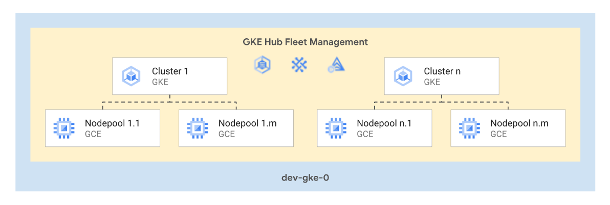

# GKE Multitenant

This stage allows creation and management of a fleet of GKE multitenant clusters, optionally leveraging GKE Hub to configure additional features. It's designed to be replicated once for every homogeneous set of clusters, either per environment or with more granularity as needed (e.g. teams or sets of teams sharing similar requirements).

The following diagram illustrates the high-level design of created resources, which can be adapted to specific requirements via variables:

<p align="center">
  
</p>

## Design overview and choices

> The detailed architecture of the underlying resources is explained in the documentation of [GKE multitenant module](../../../../blueprints/gke/multitenant-fleet/README.md).

This stage creates a project containing and as many clusters and node pools as requested by the user through the [variables](#variables) explained below. The GKE clusters are created with the with the following setup:

- All clusters are assumed to be [private](https://cloud.google.com/kubernetes-engine/docs/how-to/private-clusters), therefore only [VPC-native clusters](https://cloud.google.com/kubernetes-engine/docs/concepts/alias-ips) are supported.
- Logging and monitoring configured to use Cloud Operations for system components and user workloads.
- [GKE metering](https://cloud.google.com/kubernetes-engine/docs/how-to/cluster-usage-metering) enabled by default and stored in a bigquery dataset created within the project.
- Optional [GKE Fleet](https://cloud.google.com/kubernetes-engine/docs/fleets-overview) support with the possibility to enable any of the following features:
  - [Fleet workload identity](https://cloud.google.com/anthos/fleet-management/docs/use-workload-identity)
  - [Anthos Config Management](https://cloud.google.com/anthos-config-management/docs/overview)
  - [Anthos Service Mesh](https://cloud.google.com/service-mesh/docs/overview)
  - [Anthos Identity Service](https://cloud.google.com/anthos/identity/setup/fleet)
  - [Multi-cluster services](https://cloud.google.com/kubernetes-engine/docs/concepts/multi-cluster-services)
  - [Multi-cluster ingress](https://cloud.google.com/kubernetes-engine/docs/concepts/multi-cluster-ingress).
- Support for [Config Sync](https://cloud.google.com/anthos-config-management/docs/config-sync-overview), [Hierarchy Controller](https://cloud.google.com/anthos-config-management/docs/concepts/hierarchy-controller), and [Policy Controller](https://cloud.google.com/anthos-config-management/docs/concepts/policy-controller) when using Anthos Config Management.
- [Groups for GKE](https://cloud.google.com/kubernetes-engine/docs/how-to/google-groups-rbac) can be enabled to facilitate the creation of flexible RBAC policies referencing group principals.
- Support for [application layer secret encryption](https://cloud.google.com/kubernetes-engine/docs/how-to/encrypting-secrets).
- Support to customize peering configuration of the control plane VPC (e.g. to import/export routes to the peered network)
- Some features are enabled by default in all clusters:
  - [Intranode visibility](https://cloud.google.com/kubernetes-engine/docs/how-to/intranode-visibility)
  - [Dataplane v2](https://cloud.google.com/kubernetes-engine/docs/concepts/dataplane-v2)
  - [Shielded GKE nodes](https://cloud.google.com/kubernetes-engine/docs/how-to/shielded-gke-nodes)
  - [Workload identity](https://cloud.google.com/kubernetes-engine/docs/how-to/workload-identity)
  - [Node local DNS cache](https://cloud.google.com/kubernetes-engine/docs/how-to/nodelocal-dns-cache)
  - [Use of the GCE persistent disk CSI driver](https://cloud.google.com/kubernetes-engine/docs/how-to/persistent-volumes/gce-pd-csi-driver)
  - Node [auto-upgrade](https://cloud.google.com/kubernetes-engine/docs/how-to/node-auto-upgrades) and [auto-repair](https://cloud.google.com/kubernetes-engine/docs/how-to/node-auto-repair) for all node pools

## How to run this stage

This stage is meant to be executed after "foundational stages" (i.e., stages [`00-bootstrap`](../../00-bootstrap), [`01-resman`](../../01-resman), 02-networking (either [VPN](../../02-networking-vpn) or [NVA](../../02-networking-nva)) and [`02-security`](../../02-security)) have been run.

It's of course possible to run this stage in isolation, by making sure the architectural prerequisites are satisfied (e.g., networking), and that the Service Account running the stage is granted the roles/permissions below:

- on the organization or network folder level
  - `roles/xpnAdmin` or a custom role which includes the following permissions
    - `compute.organizations.enableXpnResource`,
    - `compute.organizations.disableXpnResource`,
    - `compute.subnetworks.setIamPolicy`,
- on each folder where projects are created
  - `roles/logging.admin`
  - `roles/owner`
  - `roles/resourcemanager.folderAdmin`
  - `roles/resourcemanager.projectCreator`
  - `roles/xpnAdmin`
- on the host project for the Shared VPC
  - `roles/browser`
  - `roles/compute.viewer`
- on the organization or billing account
  - `roles/billing.admin`

The VPC host project, VPC and subnets should already exist.

### Providers configuration

If you're running this on top of FAST, you should run the following commands to create the providers file, and populate the required variables from the previous stage.

```bash
# Variable `outputs_location` is set to `~/fast-config` in stage 01-resman
$ cd fabric-fast/stages/03-gke-multitenant/dev
ln -s ~/fast-config/providers/03-gke-dev-providers.tf .
```

### Variable configuration

There are two broad sets of variables you will need to fill in:

- variables shared by other stages (organization id, billing account id, etc.), or derived from a resource managed by a different stage (folder id, automation project id, etc.)
- variables specific to resources managed by this stage

#### Variables passed in from other stages

To avoid the tedious job of filling in the first group of variables with values derived from other stages' outputs, the same mechanism used above for the provider configuration can be used to leverage pre-configured `.tfvars` files.

If you configured a valid path for `outputs_location` in the bootstrap and networking stage, simply link the relevant `terraform-*.auto.tfvars.json` files from this stage's outputs folder (under the path you specified), where the `*` above is set to the name of the stage that produced it. For this stage, a single `.tfvars` file is available:

```bash
# Variable `outputs_location` is set to `~/fast-config`
ln -s ~/fast-config/tfvars/00-bootstrap.auto.tfvars.json .
ln -s ~/fast-config/tfvars/01-resman.auto.tfvars.json . 
ln -s ~/fast-config/tfvars/02-networking.auto.tfvars.json .
```

If you're not using FAST, refer to the [Variables](#variables) table at the bottom of this document for a full list of variables, their origin (e.g., a stage or specific to this one), and descriptions explaining their meaning.

#### Cluster and node pools

This stage is designed with multi-tenancy in mind, and the expectation is that  GKE clusters will mostly share a common set of defaults. Variables are designed to support this approach for both clusters and node pools:

- the `cluster_default` variable allows defining common defaults for all clusters
- the `clusters` variable is used to declare the actual GKE clusters and allows overriding defaults on a per-cluster basis
- the `nodepool_defaults` variable allows definining common defaults for all node pools
- the `nodepools` variable is used to declare cluster node pools and allows overriding defaults on a per-cluster basis

There are two additional variables that influence cluster configuration: `authenticator_security_group` to configure [Google Groups for RBAC](https://cloud.google.com/kubernetes-engine/docs/how-to/google-groups-rbac), `dns_domain` to configure [Cloud DNS for GKE](https://cloud.google.com/kubernetes-engine/docs/how-to/cloud-dns).

#### Fleet management

Fleet management is entirely optional, and uses three separate variables:

- `fleet_features`: specifies the [GKE fleet](https://cloud.google.com/anthos/fleet-management/docs/fleet-concepts#fleet-enabled-components) features you want activate
- `fleet_configmanagement_templates`: defines configuration templates for specific sets of features ([Config Management](https://cloud.google.com/anthos-config-management/docs/how-to/install-anthos-config-management) currently)
- `fleet_configmanagement_clusters`: specifies which clusters are managed by fleet features, and the optional Config Management template for each cluster
- `fleet_workload_identity`: to enables optional centralized [Workload Identity](https://cloud.google.com/anthos/fleet-management/docs/use-workload-identity)

Leave all these variables unset (or set to `null`) to disable fleet management.

## Running Terraform

Once the [provider](#providers-configuration) and [variable](#variable-configuration) configuration is complete, you can apply this stage:

```bash
terraform init
terraform apply
```

<!-- TFDOC OPTS files:1 show_extra:1 -->
<!-- BEGIN TFDOC -->

## Files

| name | description | modules | resources |
|---|---|---|---|
| [main.tf](./main.tf) | GKE multitenant for development environment. | <code>multitenant-fleet</code> |  |
| [outputs.tf](./outputs.tf) | Output variables. |  | <code>google_storage_bucket_object</code> · <code>local_file</code> |
| [variables.tf](./variables.tf) | Module variables. |  |  |

## Variables

| name | description | type | required | default | producer |
|---|---|:---:|:---:|:---:|:---:|
| [automation](variables.tf#L21) | Automation resources created by the bootstrap stage. | <code title="object&#40;&#123;&#10;  outputs_bucket &#61; string&#10;&#125;&#41;">object&#40;&#123;&#8230;&#125;&#41;</code> | ✓ |  | <code>00-bootstrap</code> |
| [billing_account](variables.tf#L29) | Billing account id and organization id ('nnnnnnnn' or null). | <code title="object&#40;&#123;&#10;  id              &#61; string&#10;  organization_id &#61; number&#10;&#125;&#41;">object&#40;&#123;&#8230;&#125;&#41;</code> | ✓ |  | <code>00-bootstrap</code> |
| [folder_ids](variables.tf#L149) | Folders to be used for the networking resources in folders/nnnnnnnnnnn format. If null, folder will be created. | <code title="object&#40;&#123;&#10;  gke-dev &#61; string&#10;&#125;&#41;">object&#40;&#123;&#8230;&#125;&#41;</code> | ✓ |  | <code>01-resman</code> |
| [host_project_ids](variables.tf#L164) | Host project for the shared VPC. | <code title="object&#40;&#123;&#10;  dev-spoke-0 &#61; string&#10;&#125;&#41;">object&#40;&#123;&#8230;&#125;&#41;</code> | ✓ |  | <code>02-networking</code> |
| [prefix](variables.tf#L213) | Prefix used for resources that need unique names. | <code>string</code> | ✓ |  |  |
| [vpc_self_links](variables.tf#L225) | Self link for the shared VPC. | <code title="object&#40;&#123;&#10;  dev-spoke-0 &#61; string&#10;&#125;&#41;">object&#40;&#123;&#8230;&#125;&#41;</code> | ✓ |  | <code>02-networking</code> |
| [clusters](variables.tf#L38) | Clusters configuration. Refer to the gke-cluster module for type details. | <code title="map&#40;object&#40;&#123;&#10;  cluster_autoscaling &#61; optional&#40;any&#41;&#10;  description         &#61; optional&#40;string&#41;&#10;  enable_addons &#61; optional&#40;any, &#123;&#10;    horizontal_pod_autoscaling &#61; true, http_load_balancing &#61; true&#10;  &#125;&#41;&#10;  enable_features &#61; optional&#40;any, &#123;&#10;    workload_identity &#61; true&#10;  &#125;&#41;&#10;  issue_client_certificate &#61; optional&#40;bool, false&#41;&#10;  labels                   &#61; optional&#40;map&#40;string&#41;&#41;&#10;  location                 &#61; string&#10;  logging_config           &#61; optional&#40;list&#40;string&#41;, &#91;&#34;SYSTEM_COMPONENTS&#34;&#93;&#41;&#10;  maintenance_config &#61; optional&#40;any, &#123;&#10;    daily_window_start_time &#61; &#34;03:00&#34;&#10;    recurring_window        &#61; null&#10;    maintenance_exclusion   &#61; &#91;&#93;&#10;  &#125;&#41;&#10;  max_pods_per_node  &#61; optional&#40;number, 110&#41;&#10;  min_master_version &#61; optional&#40;string&#41;&#10;  monitoring_config &#61; optional&#40;object&#40;&#123;&#10;    enable_components  &#61; optional&#40;list&#40;string&#41;, &#91;&#34;SYSTEM_COMPONENTS&#34;&#93;&#41;&#10;    managed_prometheus &#61; optional&#40;bool&#41;&#10;  &#125;&#41;&#41;&#10;  node_locations         &#61; optional&#40;list&#40;string&#41;&#41;&#10;  private_cluster_config &#61; optional&#40;any&#41;&#10;  release_channel        &#61; optional&#40;string&#41;&#10;  vpc_config &#61; object&#40;&#123;&#10;    subnetwork &#61; string&#10;    network    &#61; optional&#40;string&#41;&#10;    secondary_range_blocks &#61; optional&#40;object&#40;&#123;&#10;      pods     &#61; string&#10;      services &#61; string&#10;    &#125;&#41;&#41;&#10;    secondary_range_names &#61; optional&#40;object&#40;&#123;&#10;      pods     &#61; string&#10;      services &#61; string&#10;    &#125;&#41;, &#123; pods &#61; &#34;pods&#34;, services &#61; &#34;services&#34; &#125;&#41;&#10;    master_authorized_ranges &#61; optional&#40;map&#40;string&#41;&#41;&#10;    master_ipv4_cidr_block   &#61; optional&#40;string&#41;&#10;  &#125;&#41;&#10;&#125;&#41;&#41;">map&#40;object&#40;&#123;&#8230;&#125;&#41;&#41;</code> |  | <code>&#123;&#125;</code> |  |
| [fleet_configmanagement_clusters](variables.tf#L86) | Config management features enabled on specific sets of member clusters, in config name => [cluster name] format. | <code>map&#40;list&#40;string&#41;&#41;</code> |  | <code>&#123;&#125;</code> |  |
| [fleet_configmanagement_templates](variables.tf#L94) | Sets of config management configurations that can be applied to member clusters, in config name => {options} format. | <code title="map&#40;object&#40;&#123;&#10;  binauthz &#61; bool&#10;  config_sync &#61; object&#40;&#123;&#10;    git &#61; object&#40;&#123;&#10;      gcp_service_account_email &#61; string&#10;      https_proxy               &#61; string&#10;      policy_dir                &#61; string&#10;      secret_type               &#61; string&#10;      sync_branch               &#61; string&#10;      sync_repo                 &#61; string&#10;      sync_rev                  &#61; string&#10;      sync_wait_secs            &#61; number&#10;    &#125;&#41;&#10;    prevent_drift &#61; string&#10;    source_format &#61; string&#10;  &#125;&#41;&#10;  hierarchy_controller &#61; object&#40;&#123;&#10;    enable_hierarchical_resource_quota &#61; bool&#10;    enable_pod_tree_labels             &#61; bool&#10;  &#125;&#41;&#10;  policy_controller &#61; object&#40;&#123;&#10;    audit_interval_seconds     &#61; number&#10;    exemptable_namespaces      &#61; list&#40;string&#41;&#10;    log_denies_enabled         &#61; bool&#10;    referential_rules_enabled  &#61; bool&#10;    template_library_installed &#61; bool&#10;  &#125;&#41;&#10;  version &#61; string&#10;&#125;&#41;&#41;">map&#40;object&#40;&#123;&#8230;&#125;&#41;&#41;</code> |  | <code>&#123;&#125;</code> |  |
| [fleet_features](variables.tf#L129) | Enable and configue fleet features. Set to null to disable GKE Hub if fleet workload identity is not used. | <code title="object&#40;&#123;&#10;  appdevexperience             &#61; bool&#10;  configmanagement             &#61; bool&#10;  identityservice              &#61; bool&#10;  multiclusteringress          &#61; string&#10;  multiclusterservicediscovery &#61; bool&#10;  servicemesh                  &#61; bool&#10;&#125;&#41;">object&#40;&#123;&#8230;&#125;&#41;</code> |  | <code>null</code> |  |
| [fleet_workload_identity](variables.tf#L142) | Use Fleet Workload Identity for clusters. Enables GKE Hub if set to true. | <code>bool</code> |  | <code>false</code> |  |
| [group_iam](variables.tf#L157) | Project-level authoritative IAM bindings for groups in {GROUP_EMAIL => [ROLES]} format. Use group emails as keys, list of roles as values. | <code>map&#40;list&#40;string&#41;&#41;</code> |  | <code>&#123;&#125;</code> |  |
| [iam](variables.tf#L172) | Project-level authoritative IAM bindings for users and service accounts in  {ROLE => [MEMBERS]} format. | <code>map&#40;list&#40;string&#41;&#41;</code> |  | <code>&#123;&#125;</code> |  |
| [labels](variables.tf#L179) | Project-level labels. | <code>map&#40;string&#41;</code> |  | <code>&#123;&#125;</code> |  |
| [nodepools](variables.tf#L185) | Nodepools configuration. Refer to the gke-nodepool module for type details. | <code title="map&#40;map&#40;object&#40;&#123;&#10;  gke_version           &#61; optional&#40;string&#41;&#10;  labels                &#61; optional&#40;map&#40;string&#41;, &#123;&#125;&#41;&#10;  max_pods_per_node     &#61; optional&#40;number&#41;&#10;  name                  &#61; optional&#40;string&#41;&#10;  node_config           &#61; optional&#40;any, &#123; disk_type &#61; &#34;pd-balanced&#34; &#125;&#41;&#10;  node_count            &#61; optional&#40;map&#40;number&#41;, &#123; initial &#61; 1 &#125;&#41;&#10;  node_locations        &#61; optional&#40;list&#40;string&#41;&#41;&#10;  nodepool_config       &#61; optional&#40;any&#41;&#10;  pod_range             &#61; optional&#40;any&#41;&#10;  reservation_affinity  &#61; optional&#40;any&#41;&#10;  service_account       &#61; optional&#40;any&#41;&#10;  sole_tenant_nodegroup &#61; optional&#40;string&#41;&#10;  tags                  &#61; optional&#40;list&#40;string&#41;&#41;&#10;  taints                &#61; optional&#40;list&#40;any&#41;&#41;&#10;&#125;&#41;&#41;&#41;">map&#40;map&#40;object&#40;&#123;&#8230;&#125;&#41;&#41;&#41;</code> |  | <code>&#123;&#125;</code> |  |
| [outputs_location](variables.tf#L207) | Path where providers, tfvars files, and lists for the following stages are written. Leave empty to disable. | <code>string</code> |  | <code>null</code> |  |
| [project_services](variables.tf#L218) | Additional project services to enable. | <code>list&#40;string&#41;</code> |  | <code>&#91;&#93;</code> |  |

## Outputs

| name | description | sensitive | consumers |
|---|---|:---:|---|
| [cluster_ids](outputs.tf#L57) | Cluster ids. |  |  |
| [clusters](outputs.tf#L62) | Cluster resources. | ✓ |  |
| [project_id](outputs.tf#L68) | GKE project id. |  |  |

<!-- END TFDOC -->
