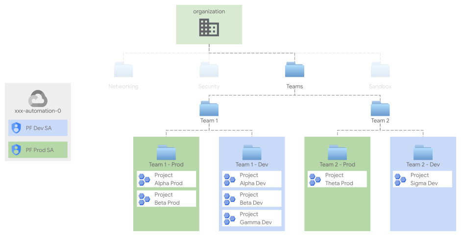

# Project factory

The Project Factory (or PF) builds on top of your foundations to create and set up projects (and related resources) to be used for your workloads.
<<<<<<< HEAD
It is organized in folders representing environments (e.g. "dev", "prod"), each implemented by a stand-alone terraform [resource factory](https://medium.com/google-cloud/resource-factories-a-descriptive-approach-to-terraform-581b3ebb59c).

## Design overview and choices


A single factory creates projects in a well-defined context, according to your resource management structure. In the diagram above, each Team is structured to have specific folders projects for a given environment, such as Production and Development, per the resource management structure configured in stage `01-resman`.

Projects for each environment across different teams are created by dedicated service accounts, as exemplified in the diagram above. While there's no intrinsic limitation regarding where the project factory can create a given project, the IAM bindings for the service account effectively enforce boundaries (e.g. the production service account shouldn't be able to create or have any access to the development projects, and vice versa).
=======
It is organized in folders representing environments (e.g., "dev", "prod"), each implemented by a stand-alone terraform [resource factory](https://medium.com/google-cloud/resource-factories-a-descriptive-approach-to-terraform-581b3ebb59c).

## Design overview and choices

<p align="center">
  
</p>

A single factory creates projects in a well-defined context, according to your resource management structure. For example, in the diagram above, each Team is structured to have specific folders projects for a given environment, such as Production and Development, per the resource management structure configured in stage `01-resman`.

Projects for each environment across different teams are created by dedicated service accounts, as exemplified in the diagram above. While there's no intrinsic limitation regarding where the project factory can create a projects, the IAM bindings for the service account effectively enforce boundaries (e.g., the production service account shouldn't be able to create or have any access to the development projects, and vice versa).
>>>>>>> master

The project factory takes care of the following activities:

* Project creation
* API/Services enablement
* Service accounts creation
* IAM roles assignment for groups and service accounts
* KMS keys roles assignment
* Shared VPC attachment and subnets IAM binding
* DNS zones creation and visibility configuration
* Project-level org policies definition
* Billing setup (billing account attachment and budget configuration)
* Essential contacts definition (for [budget alerts](https://cloud.google.com/billing/docs/how-to/budgets) and [important notifications](https://cloud.google.com/resource-manager/docs/managing-notification-contacts?hl=en))
  

## How to run this stage

<<<<<<< HEAD
This stage is meant to be executed after "foundational stages" (i.e. stages [`00-bootstrap`](../../00-bootstrap), [`01-resman`](../../01-resman), [`02-networking`](../../02-networking) and [`02-security`](../../02-security)) have been run.

It's of course possible to run this stage in isolation, by making sure the architectural prerequisites are satisfied (e.g. networking), and that the Service Account running the stage is granted the roles/permissions below:
=======
This stage is meant to be executed after "foundational stages" (i.e., stages [`00-bootstrap`](../../00-bootstrap), [`01-resman`](../../01-resman), [`02-networking`](../../02-networking) and [`02-security`](../../02-security)) have been run.

It's of course possible to run this stage in isolation, by making sure the architectural prerequisites are satisfied (e.g., networking), and that the Service Account running the stage is granted the roles/permissions below:
>>>>>>> master

* One service account per environment, each with appropriate permissions
  * at the organization level a custom role for networking operations including the following permissions
    * `"compute.organizations.enableXpnResource"`,
    * `"compute.organizations.disableXpnResource"`,
    * `"compute.subnetworks.setIamPolicy"`,
    * `"dns.networks.bindPrivateDNSZone"`
    * and role `"roles/orgpolicy.policyAdmin"`
<<<<<<< HEAD
  * on each folder where projects will be created
=======
  * on each folder where projects are created
>>>>>>> master
    * `"roles/logging.admin"` 
    * `"roles/owner"` 
    * `"roles/resourcemanager.folderAdmin"` 
    * `"roles/resourcemanager.projectCreator"`
  * on the host project for the Shared VPC
    * `"roles/browser"`       
    * `"roles/compute.viewer"`
    * `"roles/dns.admin"`     
<<<<<<< HEAD
* If networking is to be used (e.g. for VMs, GKE Clusters or AppEngine flex), VPC Host projects and their subnets should exist when creating projects
* If per-environment DNS sub-zones are required, one "root" zone per environment should exist when creating projects (e.g. prod.gcp.example.com.)

### Providers configuration

If you're running this on top of FAST, you should run the following commands to create the provider file, and populate the required variables from the previous stage.
=======
* If networking is used (e.g., for VMs, GKE Clusters or AppEngine flex), VPC Host projects and their subnets should exist when creating projects
* If per-environment DNS sub-zones are required, one "root" zone per environment should exist when creating projects (e.g., prod.gcp.example.com.)

### Providers configuration

If you're running this on top of Fast, you should run the following commands to create the providers file, and populate the required variables from the previous stage.
>>>>>>> master

```bash
# Variable `outputs_location` is set to `../../configs/example` in stage 01-resman
$ cd fabric-fast/stages/03-project-factory/prod
ln -s ../../../configs/example/03-project-factory-prod/providers.tf
```

### Variable configuration

There are two broad sets of variables you will need to fill in:

- variables shared by other stages (org id, billing account id, etc.), or derived from a resource managed by a different stage (folder id, automation project id, etc.)
- variables specific to resources managed by this stage

To avoid the tedious job of filling in the first group of variables with values derived from other stages' outputs, the same mechanism used above for the provider configuration can be used to leverage pre-configured `.tfvars` files.

If you configured a valid path for `outputs_location` in the bootstrap and networking stage, simply link the relevant `terraform-*.auto.tfvars.json` files from this stage's outputs folder (under the path you specified), where the `*` above is set to the name of the stage that produced it. For this stage, a single `.tfvars` file is available:

```bash
# Variable `outputs_location` is set to `../../configs/example` in stages 01-bootstrap and 02-networking
ln -s ../../../configs/example/03-project-factory-prod/terraform-bootstrap.auto.tfvars.json
ln -s ../../../configs/example/03-project-factory-prod/terraform-networking.auto.tfvars.json
```

<<<<<<< HEAD
If you're not running on top of fast, refer to the [Variables](#variables) table at the bottom of this document for a full list of variables, their origin (e.g. a stage or specific to this one), and descriptions explaining their meaning.


Besides the values above, a project factory takes 2 additional inputs: 


* `data/defaults.yaml`, manually configured by adapting the [`prod/data/defaults.yaml.sample`](./prod/data/defaults.yaml.sample), which defines per-environment default values e.g. for billing alerts and labels. 

* `data/projects/*.yaml`, one file per project (optionally grouped in folders), which configures each project. A [`prod/data/projects/project.yaml.sample`](./prod/data/projects/project.yaml.sample) is provided as reference and documentation for the schema. Projects will be named after the filename, e.g. `fast-prod-lab0.yaml` will generate project `fast-prod-lab0`.

Once the configuration is complete, the project factory can be run with the usual
=======
If you're not using Fast, refer to the [Variables](#variables) table at the bottom of this document for a full list of variables, their origin (e.g., a stage or specific to this one), and descriptions explaining their meaning.

Besides the values above, a project factory takes 2 additional inputs: 

* `data/defaults.yaml`, manually configured by adapting the [`prod/data/defaults.yaml.sample`](./prod/data/defaults.yaml.sample), which defines per-environment default values e.g., for billing alerts and labels. 

* `data/projects/*.yaml`, one file per project (optionally grouped in folders), which configures each project. A [`prod/data/projects/project.yaml.sample`](./prod/data/projects/project.yaml.sample) is provided as reference and documentation for the schema. Projects will be named after the filename, e.g., `fast-prod-lab0.yaml` will create project `fast-prod-lab0`.

Once the configuration is complete, run the project factory by running
>>>>>>> master

```bash
terraform init
terraform apply
```

<<<<<<< HEAD


=======
<!-- TFDOC OPTS files:1 show_extra:1 -->
>>>>>>> master
<!-- BEGIN TFDOC -->

## Files

<<<<<<< HEAD
| name | description | modules | resources |
|---|---|---|---|
| [main.tf](./main.tf) | Project factory. | <code>project-factory</code> |  |
| [outputs.tf](./outputs.tf) | Module outputs. |  |  |
| [variables.tf](./variables.tf) | Module variables. |  |  |
=======
| name | description | modules |
|---|---|---|
| [main.tf](./main.tf) | Project factory. | <code>project-factory</code> |
| [outputs.tf](./outputs.tf) | Module outputs. |  |
| [variables.tf](./variables.tf) | Module variables. |  |
>>>>>>> master

## Variables

| name | description | type | required | default | producer |
|---|---|:---:|:---:|:---:|:---:|
<<<<<<< HEAD
| billing_account_id | Billing account id. | <code>string</code> | ✓ |  | <code>00-bootstrap</code> |
| shared_vpc_self_link | Self link for the shared VPC. | <code>string</code> | ✓ |  | <code>02-networking</code> |
| vpc_host_project | Host project for the shared VPC. | <code>string</code> | ✓ |  | <code>02-networking</code> |
| data_dir | Relative path for the folder storing configuration data. | <code>string</code> |  | <code>&#34;data&#47;projects&#34;</code> |  |
| defaults_file | Relative path for the file storing the project factory configuration. | <code>string</code> |  | <code>&#34;data&#47;defaults.yaml&#34;</code> |  |
| environment_dns_zone | DNS zone suffix for environment. | <code>string</code> |  | <code>null</code> | <code>02-networking</code> |
=======
| [billing_account_id](variables.tf#L19) | Billing account id. | <code>string</code> | ✓ |  | <code>00-bootstrap</code> |
| [shared_vpc_self_link](variables.tf#L44) | Self link for the shared VPC. | <code>string</code> | ✓ |  | <code>02-networking</code> |
| [vpc_host_project](variables.tf#L50) | Host project for the shared VPC. | <code>string</code> | ✓ |  | <code>02-networking</code> |
| [data_dir](variables.tf#L25) | Relative path for the folder storing configuration data. | <code>string</code> |  | <code>&#34;data&#47;projects&#34;</code> |  |
| [defaults_file](variables.tf#L38) | Relative path for the file storing the project factory configuration. | <code>string</code> |  | <code>&#34;data&#47;defaults.yaml&#34;</code> |  |
| [environment_dns_zone](variables.tf#L31) | DNS zone suffix for environment. | <code>string</code> |  | <code>null</code> | <code>02-networking</code> |
>>>>>>> master

## Outputs

| name | description | sensitive | consumers |
|---|---|:---:|---|
<<<<<<< HEAD
| projects | Created projects and service accounts. |  |  |

<!-- END TFDOC -->


=======
| [projects](outputs.tf#L17) | Created projects and service accounts. |  |  |

<!-- END TFDOC -->
>>>>>>> master
