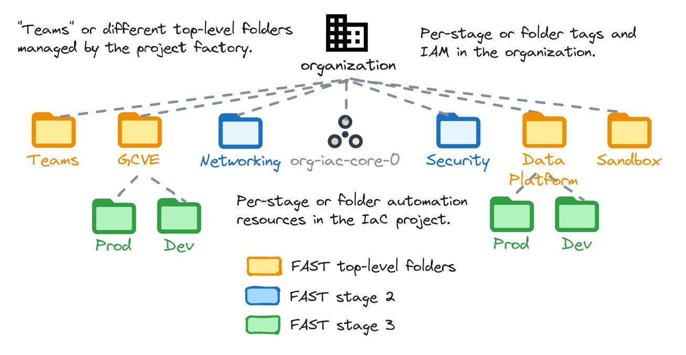

# Resource hierarchy

This stage performs two important tasks:

- create the top-level hierarchy of folders, and the associated resources used later on to automate each part of the hierarchy (eg. Networking)
- configure resource management tags used in scoping specific IAM roles on the resource hierarchy

The code is intentionally simple, as it's intended to provide a generic initial setup (Networking, Security, etc.), and then allow easy customizations to complete the implementation of the intended hierarchy design.

The following diagram is a high level reference of the resources created and managed here:

<p align="center">
  
</p>

<!-- BEGIN TOC -->
- [Design overview and choices](#design-overview-and-choices)
  - [Department or team folders](#department-or-team-folders)
  - [Multitenancy](#multitenancy)
  - [Workload Identity Federation and CI/CD](#workload-identity-federation-and-cicd)
- [How to run this stage](#how-to-run-this-stage)
  - [Provider and Terraform variables](#provider-and-terraform-variables)
  - [Impersonating the automation service account](#impersonating-the-automation-service-account)
  - [Variable configuration](#variable-configuration)
  - [Running the stage](#running-the-stage)
- [Customizations](#customizations)
  - [Toggling features](#toggling-features)
  - [Top-level folders](#top-level-folders)
  - [Secure tags](#secure-tags)
  - [IAM](#iam)
- [Files](#files)
- [Variables](#variables)
- [Outputs](#outputs)
<!-- END TOC -->

## Design overview and choices

Despite its simplicity, this stage implements the basics of a design that we've seen working well for a variety of customers, where the hierarchy is laid out following two conceptually different approaches:

- core or shared resources are grouped in hierarchy branches that map to their type or purpose (e.g. Networking)
- team or application resources are grouped in lower level hierarchy branches that map to management or operational considerations (e.g. which team manages a set of applications, or owns a subset of company data, etc.)

This split approach usually represents well functional and operational patterns, where core resources are centrally managed by individual teams (e.g. networking, security, fleets of similar VMS, etc.), while teams need more granularity to access managed services used by the applications they maintain.

The approach also adapts to different high level requirements:

- it can be used either for single organizations containing multiple environments, or with multiple organizations dedicated to specific environments (e.g. prod/nonprod), as the environment split is implemented at the project or lower folder level
- it adapts to complex scenarios, with different countries or corporate entities using the same GCP organization, as core services are typically shared, and/or an extra layer on top can be used as a drop-in to implement the country/entity separation

Additionally, a few critical benefits are directly provided by this design:

- core services are clearly separated, with very few touchpoints where IAM and security policies need to be applied (typically their top-level folder)
- adding a new set of core services (e.g. shared GKE clusters) is a trivial operation that does not break the existing design
- grouping application resources and services using teams or business logic is a flexible approach, which maps well to typical operational or budget requirements
- automation stages (e.g. Networking) can be segregated in a simple and effective way, by creating the required service accounts and buckets for each stage here, and applying a handful of IAM roles to the relevant folder

For a discussion on naming, please refer to the [Bootstrap stage documentation](../0-bootstrap/README.md#naming), as the same approach is shared by all stages.

### Department or team folders

Top-level folders for teams or departments can be easily created via the `top_level_folders` variable or the associated factory, which expose the full power of the underlying [folder module](../../../modules/folder/).

The suggestion is to use this feature sparingly so as to keep the top level of the hierarchy simple, and minimize changes to this stage due to its security implications. One approach is to create a grouping folder (e.g. `Departments` or `Teams`) here, and delegate management of lower level folders to the [project factory](../2-project-factory/) stage.

Top-level folders also support defining associated resources for automation, and auto-created provider files to bootstrap Infrastructure and Code. An example is provided below.

### Multitenancy

Multitenancy is supported via a [separate stage](../1-tenant-factory/), which is entirely optional and can be applied after resource management has been deployed. For simpler use cases that do not require complex organization-level multitenancy, [top-level folders](#top-level-folders) can be used in combination with the [project factory stage](../2-project-factory/) support for folder and project management.

### Workload Identity Federation and CI/CD

This stage also implements optional support for CI/CD, much in the same way as the bootstrap stage. The only difference is on Workload Identity Federation, which is only configured in bootstrap and made available here via stage interface variables (the automatically generated `.tfvars` files).

For details on how to configure CI/CD please refer to the [relevant section in the bootstrap stage documentation](../0-bootstrap/README.md#cicd-repositories).

## How to run this stage

This stage is meant to be executed after the [bootstrap](../0-bootstrap) stage has run, as it leverages the automation service account and bucket created there. The relevant user groups must also exist, but that's one of the requirements for the previous stage too, so if you ran that successfully, you're good to go.

It's of course possible to run this stage in isolation, but that's outside the scope of this document, and you would need to refer to the code for the bootstrap stage for the actual roles needed.

Before running this stage, you need to make sure you have the correct credentials and permissions, and localize variables by assigning values that match your configuration.

### Provider and Terraform variables

As all other FAST stages, the [mechanism used to pass variable values and pre-built provider files from one stage to the next](../0-bootstrap/README.md#output-files-and-cross-stage-variables) is also leveraged here.

The commands to link or copy the provider and terraform variable files can be easily derived from the `stage-links.sh` script in the FAST root folder, passing it a single argument with the local output files folder (if configured) or the GCS output bucket in the automation project (derived from stage 0 outputs). The following examples demonstrate both cases, and the resulting commands that then need to be copy/pasted and run.

```bash
../../stage-links.sh ~/fast-config

# copy and paste the following commands for '1-resman'

ln -s ~/fast-config/providers/1-resman-providers.tf ./
ln -s ~/fast-config/tfvars/0-globals.auto.tfvars.json ./
ln -s ~/fast-config/tfvars/0-bootstrap.auto.tfvars.json ./
```

```bash
../../stage-links.sh gs://xxx-prod-iac-core-outputs-0

# copy and paste the following commands for '1-resman'

gcloud storage cp gs://xxx-prod-iac-core-outputs-0/providers/1-resman-providers.tf ./
gcloud storage cp gs://xxx-prod-iac-core-outputs-0/tfvars/0-globals.auto.tfvars.json ./
gcloud storage cp gs://xxx-prod-iac-core-outputs-0/tfvars/0-bootstrap.auto.tfvars.json ./
```

### Impersonating the automation service account

The preconfigured provider file uses impersonation to run with this stage's automation service account's credentials. The `gcp-devops` and `organization-admins` groups have the necessary IAM bindings in place to do that, so make sure the current user is a member of one of those groups.

### Variable configuration

Variables in this stage -- like most other FAST stages -- are broadly divided into three separate sets:

- variables which refer to global values for the whole organization (org id, billing account id, prefix, etc.), which are pre-populated via the `0-globals.auto.tfvars.json` file linked or copied above
- variables which refer to resources managed by previous stage, which are prepopulated here via the `0-bootstrap.auto.tfvars.json` file linked or copied above
- and finally variables that optionally control this stage's behaviour and customizations, and can to be set in a custom `terraform.tfvars` file

The latter set is explained in the [Customization](#customizations) sections below, and the full list can be found in the [Variables](#variables) table at the bottom of this document.

Note that the `outputs_location` variable is disabled by default, you need to explicitly set it in your `terraform.tfvars` file if you want output files to be generated by this stage. This is a sample `terraform.tfvars` that configures it, refer to the [bootstrap stage documentation](../0-bootstrap/README.md#output-files-and-cross-stage-variables) for more details:

```tfvars
outputs_location = "~/fast-config"
```

### Running the stage

Once provider and variable values are in place and the correct user is configured, the stage can be run:

```bash
terraform init
terraform apply
```

## Customizations

### Toggling features

Some FAST features used here and by the following stages can be enabled or disabled using the `fast_features` variables.

The `fast_features` variable consists of 5 toggles:

- **`data_platform`** controls the creation of required resources (folders, service accounts, buckets, IAM bindings) to deploy the [3-data-platform](https://github.com/GoogleCloudPlatform/cloud-foundation-fabric/tree/master/fast/stages/3-data-platform) stage
- **`gcve`** controls the creation of required resources (folders, service accounts, buckets, IAM bindings) to deploy the [3-gcve](https://github.com/GoogleCloudPlatform/cloud-foundation-fabric/tree/master/fast/stages/3-gcve) stage
- **`gke`** controls the creation of required resources (folders, service accounts, buckets, IAM bindings) to deploy the [3-gke-multitenant](https://github.com/GoogleCloudPlatform/cloud-foundation-fabric/tree/master/fast/stages/3-gke-multitenant) stage
- **`project_factory`** controls the creation of required resources (folders, service accounts, buckets, IAM bindings) to deploy the [2-project-factory](https://github.com/GoogleCloudPlatform/cloud-foundation-fabric/tree/master/fast/stages/2-project-factory) stage
- **`sandbox`** controls the creation of a "Sandbox" top level folder with relaxed policies, intended for sandbox environments where users can experiment
- **`teams`** controls the creation of the top level "Teams" folder used by the [teams feature in resman](https://github.com/GoogleCloudPlatform/cloud-foundation-fabric/tree/master/fast/stages/1-resman#team-folders).

### Top-level folders

The `top_level_folders` variable and associated factory allow simple definition of additional top-level folders, and associated configurations.

The following is an example that creates two folders via tfvars, and also configures the factory to define additional folders via YAML. Folders defined via the variable or factory files support the same interface of the [folder module](../../../modules/folder/).

```tfvars
factories_config = {
  top_level_folders = "~/fast-config/data/1-resman/folders"
}
top_level_folders = {
  test-1 = {
    name = "Test 1"
    iam = {
      "roles/viewer" = [
        "group:test-1-viewers@example.org"
      ]
    }
  }
  test-2 = {
    # disable creation of the automation SA and bucket
    automation = {
      enable = false
    }
    name = "Test 2"
  }
}
```

```yaml
# ~/fast-config/data/1-resman/folders/test-4.yaml
name: Test 4
automation: null
iam:
  roles/browser:
    - domain:example.org
```

### Secure tags

This stage manages [Secure Tags](https://cloud.google.com/resource-manager/docs/tags/tags-creating-and-managing) at the organization level, via two sets of keys and values:

- a default set of tags used by FAST itself in specific IAM conditions that allow automation service accounts to gain organization-level privileges or specific access to parts of the resource management hierarchy
- an optional set of user-defined tags that can be used in organization policy or IAM conditions

The first set of default tags cannot be overridden and defines the following keys and values (key names can be changed via the `tag_names` variable):

- `context` to identify parts of the resource hierarchy, with `data`, `gke`, `networking`, `sandbox`, `security` and `teams` values
- `environment` to identify folders and projects belonging to specific environments, with `development` and `production` values

The second set is optional and allows defining a custom tag hierarchy, including IAM bindings that can refer to specific identities, or to the internally defined automation service accounts via their names, like in the following example:

```tfvars
tags = {
  my-custom-tag = {
    values = {
      eggs = {}
      spam = {
        description = "Example tag value."
        iam = {
          "roles/resourcemanager.tagUser" = ["sandbox"]
        }
      }
    }
  }
}
```

### IAM

The `folder_iam` variable can be used to manage authoritative bindings for all top-level folders. For additional control, IAM roles can be easily edited in the relevant `branch-xxx.tf` file, following the best practice outlined in the [bootstrap stage](../0-bootstrap#customizations) documentation of separating user-level and service-account level IAM policies through the IAM-related variables (`iam`, `iam_bindings`, `iam_bindings_additive`) of the relevant modules.

A full reference of IAM roles managed by this stage [is available here](./IAM.md).

<!-- TFDOC OPTS files:1 show_extra:1 -->
<!-- BEGIN TFDOC -->
## Files

| name | description | modules | resources |
|---|---|---|---|
| [billing.tf](./billing.tf) | Billing resources for external billing use cases. |  | <code>google_billing_account_iam_member</code> |
| [branch-data-platform.tf](./branch-data-platform.tf) | Data Platform stages resources. | <code>folder</code> · <code>gcs</code> · <code>iam-service-account</code> |  |
| [branch-gcve.tf](./branch-gcve.tf) | GCVE stage resources. | <code>folder</code> · <code>gcs</code> · <code>iam-service-account</code> |  |
| [branch-gke.tf](./branch-gke.tf) | GKE multitenant stage resources. | <code>folder</code> · <code>gcs</code> · <code>iam-service-account</code> |  |
| [branch-networking.tf](./branch-networking.tf) | Networking stage resources. | <code>folder</code> · <code>gcs</code> · <code>iam-service-account</code> |  |
| [branch-nsec.tf](./branch-nsec.tf) | Network security stage resources. | <code>gcs</code> · <code>iam-service-account</code> |  |
| [branch-project-factory.tf](./branch-project-factory.tf) | Project factory stage resources. | <code>gcs</code> · <code>iam-service-account</code> |  |
| [branch-sandbox.tf](./branch-sandbox.tf) | Sandbox stage resources. | <code>folder</code> · <code>gcs</code> · <code>iam-service-account</code> |  |
| [branch-security.tf](./branch-security.tf) | Security stage resources. | <code>folder</code> · <code>gcs</code> · <code>iam-service-account</code> |  |
| [checklist.tf](./checklist.tf) | None | <code>folder</code> |  |
| [cicd-data-platform.tf](./cicd-data-platform.tf) | CI/CD resources for the data platform branch. | <code>iam-service-account</code> |  |
| [cicd-gcve.tf](./cicd-gcve.tf) | CI/CD resources for the GCVE branch. | <code>iam-service-account</code> |  |
| [cicd-gke.tf](./cicd-gke.tf) | CI/CD resources for the GKE multitenant branch. | <code>iam-service-account</code> |  |
| [cicd-netsec.tf](./cicd-netsec.tf) | CI/CD resources for the networking branch. | <code>iam-service-account</code> |  |
| [cicd-networking.tf](./cicd-networking.tf) | CI/CD resources for the networking branch. | <code>iam-service-account</code> |  |
| [cicd-project-factory.tf](./cicd-project-factory.tf) | CI/CD resources for the project factories. | <code>iam-service-account</code> |  |
| [cicd-security.tf](./cicd-security.tf) | CI/CD resources for the security branch. | <code>iam-service-account</code> |  |
| [iam.tf](./iam.tf) | Organization or root node-level IAM bindings. |  |  |
| [main.tf](./main.tf) | Module-level locals and resources. |  |  |
| [organization.tf](./organization.tf) | Organization policies. | <code>organization</code> |  |
| [outputs-files.tf](./outputs-files.tf) | Output files persistence to local filesystem. |  | <code>local_file</code> |
| [outputs-gcs.tf](./outputs-gcs.tf) | Output files persistence to automation GCS bucket. |  | <code>google_storage_bucket_object</code> |
| [outputs.tf](./outputs.tf) | Module outputs. |  |  |
| [tenant-logging.tf](./tenant-logging.tf) | Audit log project and sink for tenant root folder. | <code>bigquery-dataset</code> · <code>gcs</code> · <code>logging-bucket</code> · <code>pubsub</code> |  |
| [tenant-root.tf](./tenant-root.tf) | None | <code>folder</code> · <code>project</code> |  |
| [top-level-folders.tf](./top-level-folders.tf) | None | <code>folder</code> · <code>gcs</code> · <code>iam-service-account</code> |  |
| [variables-fast.tf](./variables-fast.tf) | FAST stage interface. |  |  |
| [variables.tf](./variables.tf) | Module variables. |  |  |

## Variables

| name | description | type | required | default | producer |
|---|---|:---:|:---:|:---:|:---:|
| [automation](variables-fast.tf#L19) | Automation resources created by the bootstrap stage. | <code title="object&#40;&#123;&#10;  outputs_bucket          &#61; string&#10;  project_id              &#61; string&#10;  project_number          &#61; string&#10;  federated_identity_pool &#61; string&#10;  federated_identity_providers &#61; map&#40;object&#40;&#123;&#10;    audiences        &#61; list&#40;string&#41;&#10;    issuer           &#61; string&#10;    issuer_uri       &#61; string&#10;    name             &#61; string&#10;    principal_branch &#61; string&#10;    principal_repo   &#61; string&#10;  &#125;&#41;&#41;&#10;  cicd_backends &#61; object&#40;&#123;&#10;    terraform &#61; object&#40;&#123;&#10;      organization &#61; string&#10;      workspaces &#61; map&#40;object&#40;&#123;&#10;        tags    &#61; list&#40;string&#41;&#10;        name    &#61; string&#10;        project &#61; string&#10;      &#125;&#41;&#41;&#10;      hostname &#61; string&#10;    &#125;&#41;&#10;  &#125;&#41;&#10;  service_accounts &#61; object&#40;&#123;&#10;    resman-r &#61; string&#10;  &#125;&#41;&#10;&#125;&#41;">object&#40;&#123;&#8230;&#125;&#41;</code> | ✓ |  | <code>0-bootstrap</code> |
| [billing_account](variables-fast.tf#L53) | Billing account id. If billing account is not part of the same org set `is_org_level` to `false`. To disable handling of billing IAM roles set `no_iam` to `true`. | <code title="object&#40;&#123;&#10;  id           &#61; string&#10;  is_org_level &#61; optional&#40;bool, true&#41;&#10;  no_iam       &#61; optional&#40;bool, false&#41;&#10;&#125;&#41;">object&#40;&#123;&#8230;&#125;&#41;</code> | ✓ |  | <code>0-bootstrap</code> |
| [logging](variables-fast.tf#L109) | Logging configuration for tenants. | <code title="object&#40;&#123;&#10;  project_id &#61; string&#10;  log_sinks &#61; optional&#40;map&#40;object&#40;&#123;&#10;    filter &#61; string&#10;    type   &#61; string&#10;  &#125;&#41;&#41;, &#123;&#125;&#41;&#10;&#125;&#41;">object&#40;&#123;&#8230;&#125;&#41;</code> | ✓ |  | <code>1-tenant-factory</code> |
| [organization](variables-fast.tf#L122) | Organization details. | <code title="object&#40;&#123;&#10;  domain      &#61; string&#10;  id          &#61; number&#10;  customer_id &#61; string&#10;&#125;&#41;">object&#40;&#123;&#8230;&#125;&#41;</code> | ✓ |  | <code>0-bootstrap</code> |
| [prefix](variables-fast.tf#L140) | Prefix used for resources that need unique names. Use 9 characters or less. | <code>string</code> | ✓ |  | <code>0-bootstrap</code> |
| [cicd_repositories](variables.tf#L20) | CI/CD repository configuration. Identity providers reference keys in the `automation.federated_identity_providers` variable. Set to null to disable, or set individual repositories to null if not needed. | <code title="object&#40;&#123;&#10;  data_platform_dev &#61; optional&#40;object&#40;&#123;&#10;    name              &#61; string&#10;    type              &#61; string&#10;    branch            &#61; optional&#40;string&#41;&#10;    identity_provider &#61; optional&#40;string&#41;&#10;  &#125;&#41;&#41;&#10;  data_platform_prod &#61; optional&#40;object&#40;&#123;&#10;    name              &#61; string&#10;    type              &#61; string&#10;    branch            &#61; optional&#40;string&#41;&#10;    identity_provider &#61; optional&#40;string&#41;&#10;  &#125;&#41;&#41;&#10;  gke_dev &#61; optional&#40;object&#40;&#123;&#10;    name              &#61; string&#10;    type              &#61; string&#10;    branch            &#61; optional&#40;string&#41;&#10;    identity_provider &#61; optional&#40;string&#41;&#10;  &#125;&#41;&#41;&#10;  gke_prod &#61; optional&#40;object&#40;&#123;&#10;    name              &#61; string&#10;    type              &#61; string&#10;    branch            &#61; optional&#40;string&#41;&#10;    identity_provider &#61; optional&#40;string&#41;&#10;  &#125;&#41;&#41;&#10;  gcve_dev &#61; optional&#40;object&#40;&#123;&#10;    name              &#61; string&#10;    type              &#61; string&#10;    branch            &#61; optional&#40;string&#41;&#10;    identity_provider &#61; optional&#40;string&#41;&#10;  &#125;&#41;&#41;&#10;  gcve_prod &#61; optional&#40;object&#40;&#123;&#10;    name              &#61; string&#10;    type              &#61; string&#10;    branch            &#61; optional&#40;string&#41;&#10;    identity_provider &#61; optional&#40;string&#41;&#10;  &#125;&#41;&#41;&#10;  nsec &#61; optional&#40;object&#40;&#123;&#10;    name              &#61; string&#10;    type              &#61; string&#10;    branch            &#61; optional&#40;string&#41;&#10;    identity_provider &#61; optional&#40;string&#41;&#10;  &#125;&#41;&#41;&#10;  networking &#61; optional&#40;object&#40;&#123;&#10;    name              &#61; string&#10;    type              &#61; string&#10;    branch            &#61; optional&#40;string&#41;&#10;    identity_provider &#61; optional&#40;string&#41;&#10;  &#125;&#41;&#41;&#10;  project_factory &#61; optional&#40;object&#40;&#123;&#10;    name              &#61; string&#10;    type              &#61; string&#10;    branch            &#61; optional&#40;string&#41;&#10;    identity_provider &#61; optional&#40;string&#41;&#10;  &#125;&#41;&#41;&#10;  project_factory_dev &#61; optional&#40;object&#40;&#123;&#10;    name              &#61; string&#10;    type              &#61; string&#10;    branch            &#61; optional&#40;string&#41;&#10;    identity_provider &#61; optional&#40;string&#41;&#10;  &#125;&#41;&#41;&#10;  project_factory_prod &#61; optional&#40;object&#40;&#123;&#10;    name              &#61; string&#10;    type              &#61; string&#10;    branch            &#61; optional&#40;string&#41;&#10;    identity_provider &#61; optional&#40;string&#41;&#10;  &#125;&#41;&#41;&#10;  security &#61; optional&#40;object&#40;&#123;&#10;    name              &#61; string&#10;    type              &#61; string&#10;    branch            &#61; optional&#40;string&#41;&#10;    identity_provider &#61; optional&#40;string&#41;&#10;  &#125;&#41;&#41;&#10;&#125;&#41;">object&#40;&#123;&#8230;&#125;&#41;</code> |  | <code>null</code> |  |
| [custom_roles](variables-fast.tf#L64) | Custom roles defined at the org level, in key => id format. | <code title="object&#40;&#123;&#10;  gcve_network_admin              &#61; string&#10;  network_firewall_policies_admin &#61; string&#10;  network_firewall_policies_viewer &#61; optional&#40;string&#41;&#10;  ngfw_enterprise_admin            &#61; string&#10;  ngfw_enterprise_viewer           &#61; string&#10;  organization_admin_viewer        &#61; string&#10;  service_project_network_admin    &#61; string&#10;  storage_viewer                   &#61; string&#10;&#125;&#41;">object&#40;&#123;&#8230;&#125;&#41;</code> |  | <code>null</code> | <code>0-bootstrap</code> |
| [factories_config](variables.tf#L122) | Configuration for the resource factories or external data. | <code title="object&#40;&#123;&#10;  checklist_data    &#61; optional&#40;string&#41;&#10;  org_policies      &#61; optional&#40;string, &#34;data&#47;org-policies&#34;&#41;&#10;  top_level_folders &#61; optional&#40;string, &#34;data&#47;top-level-folders&#34;&#41;&#10;&#125;&#41;">object&#40;&#123;&#8230;&#125;&#41;</code> |  | <code>&#123;&#125;</code> |  |
| [fast_features](variables.tf#L133) | Selective control for top-level FAST features. | <code title="object&#40;&#123;&#10;  data_platform &#61; optional&#40;bool, false&#41;&#10;  gke           &#61; optional&#40;bool, false&#41;&#10;  gcve          &#61; optional&#40;bool, false&#41;&#10;  nsec          &#61; optional&#40;bool, false&#41;&#10;  sandbox       &#61; optional&#40;bool, false&#41;&#10;&#125;&#41;">object&#40;&#123;&#8230;&#125;&#41;</code> |  | <code>&#123;&#125;</code> |  |
| [folder_iam](variables.tf#L146) | Authoritative IAM for top-level folders. | <code title="object&#40;&#123;&#10;  data_platform &#61; optional&#40;map&#40;list&#40;string&#41;&#41;, &#123;&#125;&#41;&#10;  gcve          &#61; optional&#40;map&#40;list&#40;string&#41;&#41;, &#123;&#125;&#41;&#10;  gke           &#61; optional&#40;map&#40;list&#40;string&#41;&#41;, &#123;&#125;&#41;&#10;  sandbox       &#61; optional&#40;map&#40;list&#40;string&#41;&#41;, &#123;&#125;&#41;&#10;  security      &#61; optional&#40;map&#40;list&#40;string&#41;&#41;, &#123;&#125;&#41;&#10;  network       &#61; optional&#40;map&#40;list&#40;string&#41;&#41;, &#123;&#125;&#41;&#10;&#125;&#41;">object&#40;&#123;&#8230;&#125;&#41;</code> |  | <code>&#123;&#125;</code> |  |
| [groups](variables-fast.tf#L81) | Group names or IAM-format principals to grant organization-level permissions. If just the name is provided, the 'group:' principal and organization domain are interpolated. | <code title="object&#40;&#123;&#10;  gcp-billing-admins      &#61; optional&#40;string, &#34;gcp-billing-admins&#34;&#41;&#10;  gcp-devops              &#61; optional&#40;string, &#34;gcp-devops&#34;&#41;&#10;  gcp-network-admins      &#61; optional&#40;string, &#34;gcp-vpc-network-admins&#34;&#41;&#10;  gcp-organization-admins &#61; optional&#40;string, &#34;gcp-organization-admins&#34;&#41;&#10;  gcp-security-admins     &#61; optional&#40;string, &#34;gcp-security-admins&#34;&#41;&#10;&#125;&#41;">object&#40;&#123;&#8230;&#125;&#41;</code> |  | <code>&#123;&#125;</code> | <code>0-bootstrap</code> |
| [locations](variables-fast.tf#L96) | Optional locations for GCS, BigQuery, and logging buckets created here. | <code title="object&#40;&#123;&#10;  bq      &#61; optional&#40;string, &#34;EU&#34;&#41;&#10;  gcs     &#61; optional&#40;string, &#34;EU&#34;&#41;&#10;  logging &#61; optional&#40;string, &#34;global&#34;&#41;&#10;  pubsub  &#61; optional&#40;list&#40;string&#41;, &#91;&#93;&#41;&#10;&#125;&#41;">object&#40;&#123;&#8230;&#125;&#41;</code> |  | <code>&#123;&#125;</code> | <code>0-bootstrap</code> |
| [outputs_location](variables.tf#L160) | Enable writing provider, tfvars and CI/CD workflow files to local filesystem. Leave null to disable. | <code>string</code> |  | <code>null</code> |  |
| [root_node](variables-fast.tf#L146) | Root node for the hierarchy, if running in tenant mode. | <code>string</code> |  | <code>null</code> | <code>0-bootstrap</code> |
| [tag_names](variables.tf#L166) | Customized names for resource management tags. | <code title="object&#40;&#123;&#10;  context     &#61; optional&#40;string, &#34;context&#34;&#41;&#10;  environment &#61; optional&#40;string, &#34;environment&#34;&#41;&#10;&#125;&#41;">object&#40;&#123;&#8230;&#125;&#41;</code> |  | <code>&#123;&#125;</code> |  |
| [tags](variables.tf#L180) | Custom secure tags by key name. The `iam` attribute behaves like the similarly named one at module level. | <code title="map&#40;object&#40;&#123;&#10;  description &#61; optional&#40;string, &#34;Managed by the Terraform organization module.&#34;&#41;&#10;  iam         &#61; optional&#40;map&#40;list&#40;string&#41;&#41;, &#123;&#125;&#41;&#10;  values &#61; optional&#40;map&#40;object&#40;&#123;&#10;    description &#61; optional&#40;string, &#34;Managed by the Terraform organization module.&#34;&#41;&#10;    iam         &#61; optional&#40;map&#40;list&#40;string&#41;&#41;, &#123;&#125;&#41;&#10;    id          &#61; optional&#40;string&#41;&#10;  &#125;&#41;&#41;, &#123;&#125;&#41;&#10;&#125;&#41;&#41;">map&#40;object&#40;&#123;&#8230;&#125;&#41;&#41;</code> |  | <code>&#123;&#125;</code> |  |
| [top_level_folders](variables.tf#L201) | Additional top-level folders. Keys are used for service account and bucket names, values implement the folders module interface with the addition of the 'automation' attribute. | <code title="map&#40;object&#40;&#123;&#10;  name &#61; string&#10;  automation &#61; optional&#40;object&#40;&#123;&#10;    enable                      &#61; optional&#40;bool, true&#41;&#10;    sa_impersonation_principals &#61; optional&#40;list&#40;string&#41;, &#91;&#93;&#41;&#10;  &#125;&#41;, &#123;&#125;&#41;&#10;  contacts &#61; optional&#40;map&#40;list&#40;string&#41;&#41;, &#123;&#125;&#41;&#10;  firewall_policy &#61; optional&#40;object&#40;&#123;&#10;    name   &#61; string&#10;    policy &#61; string&#10;  &#125;&#41;&#41;&#10;  logging_data_access &#61; optional&#40;map&#40;map&#40;list&#40;string&#41;&#41;&#41;, &#123;&#125;&#41;&#10;  logging_exclusions  &#61; optional&#40;map&#40;string&#41;, &#123;&#125;&#41;&#10;  logging_settings &#61; optional&#40;object&#40;&#123;&#10;    disable_default_sink &#61; optional&#40;bool&#41;&#10;    storage_location     &#61; optional&#40;string&#41;&#10;  &#125;&#41;&#41;&#10;  logging_sinks &#61; optional&#40;map&#40;object&#40;&#123;&#10;    bq_partitioned_table &#61; optional&#40;bool, false&#41;&#10;    description          &#61; optional&#40;string&#41;&#10;    destination          &#61; string&#10;    disabled             &#61; optional&#40;bool, false&#41;&#10;    exclusions           &#61; optional&#40;map&#40;string&#41;, &#123;&#125;&#41;&#10;    filter               &#61; optional&#40;string&#41;&#10;    iam                  &#61; optional&#40;bool, true&#41;&#10;    include_children     &#61; optional&#40;bool, true&#41;&#10;    type                 &#61; string&#10;  &#125;&#41;&#41;, &#123;&#125;&#41;&#10;  iam &#61; optional&#40;map&#40;list&#40;string&#41;&#41;, &#123;&#125;&#41;&#10;  iam_bindings &#61; optional&#40;map&#40;object&#40;&#123;&#10;    members &#61; list&#40;string&#41;&#10;    role    &#61; string&#10;    condition &#61; optional&#40;object&#40;&#123;&#10;      expression  &#61; string&#10;      title       &#61; string&#10;      description &#61; optional&#40;string&#41;&#10;    &#125;&#41;&#41;&#10;  &#125;&#41;&#41;, &#123;&#125;&#41;&#10;  iam_bindings_additive &#61; optional&#40;map&#40;object&#40;&#123;&#10;    member &#61; string&#10;    role   &#61; string&#10;    condition &#61; optional&#40;object&#40;&#123;&#10;      expression  &#61; string&#10;      title       &#61; string&#10;      description &#61; optional&#40;string&#41;&#10;    &#125;&#41;&#41;&#10;  &#125;&#41;&#41;, &#123;&#125;&#41;&#10;  iam_by_principals &#61; optional&#40;map&#40;list&#40;string&#41;&#41;, &#123;&#125;&#41;&#10;  org_policies &#61; optional&#40;map&#40;object&#40;&#123;&#10;    inherit_from_parent &#61; optional&#40;bool&#41; &#35; for list policies only.&#10;    reset               &#61; optional&#40;bool&#41;&#10;    rules &#61; optional&#40;list&#40;object&#40;&#123;&#10;      allow &#61; optional&#40;object&#40;&#123;&#10;        all    &#61; optional&#40;bool&#41;&#10;        values &#61; optional&#40;list&#40;string&#41;&#41;&#10;      &#125;&#41;&#41;&#10;      deny &#61; optional&#40;object&#40;&#123;&#10;        all    &#61; optional&#40;bool&#41;&#10;        values &#61; optional&#40;list&#40;string&#41;&#41;&#10;      &#125;&#41;&#41;&#10;      enforce &#61; optional&#40;bool&#41; &#35; for boolean policies only.&#10;      condition &#61; optional&#40;object&#40;&#123;&#10;        description &#61; optional&#40;string&#41;&#10;        expression  &#61; optional&#40;string&#41;&#10;        location    &#61; optional&#40;string&#41;&#10;        title       &#61; optional&#40;string&#41;&#10;      &#125;&#41;, &#123;&#125;&#41;&#10;    &#125;&#41;&#41;, &#91;&#93;&#41;&#10;  &#125;&#41;&#41;, &#123;&#125;&#41;&#10;  tag_bindings &#61; optional&#40;map&#40;string&#41;, &#123;&#125;&#41;&#10;&#125;&#41;&#41;">map&#40;object&#40;&#123;&#8230;&#125;&#41;&#41;</code> |  | <code>&#123;&#125;</code> |  |

## Outputs

| name | description | sensitive | consumers |
|---|---|:---:|---|
| [cicd_repositories](outputs.tf#L413) | WIF configuration for CI/CD repositories. |  |  |
| [dataplatform](outputs.tf#L427) | Data for the Data Platform stage. |  |  |
| [folder_ids](outputs.tf#L443) | Folder ids. |  |  |
| [gcve](outputs.tf#L448) | Data for the GCVE stage. |  | <code>03-gcve</code> |
| [gke_multitenant](outputs.tf#L469) | Data for the GKE multitenant stage. |  | <code>03-gke-multitenant</code> |
| [networking](outputs.tf#L490) | Data for the networking stage. |  |  |
| [project_factories](outputs.tf#L499) | Data for the project factories stage. |  |  |
| [providers](outputs.tf#L518) | Terraform provider files for this stage and dependent stages. | ✓ | <code>02-networking</code> · <code>02-security</code> · <code>03-dataplatform</code> · <code>03-network-security</code> |
| [sandbox](outputs.tf#L525) | Data for the sandbox stage. |  | <code>xx-sandbox</code> |
| [security](outputs.tf#L539) | Data for the networking stage. |  | <code>02-security</code> |
| [tfvars](outputs.tf#L550) | Terraform variable files for the following stages. | ✓ |  |
<!-- END TFDOC -->
