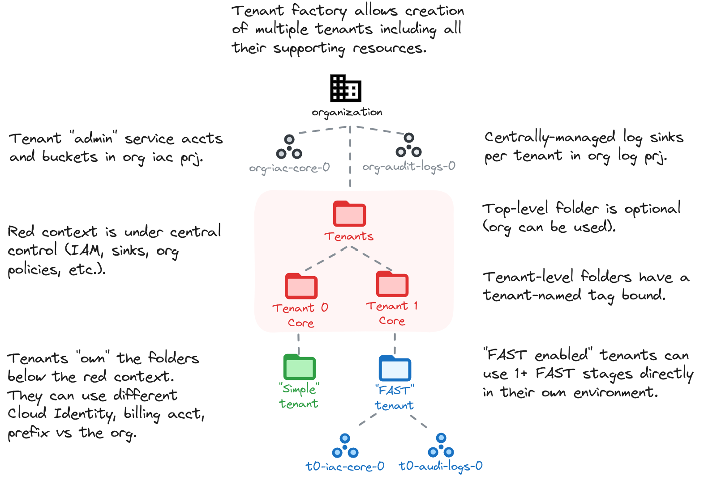
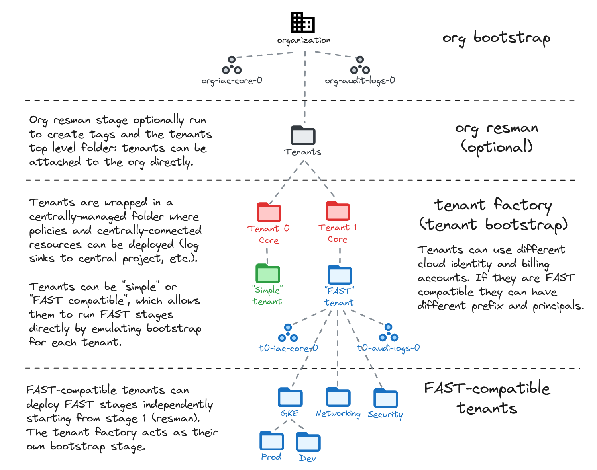

# Tenant Factory

This optional stage implements multitenancy, where a limited number of tenants need a high degree of autonomy over their slice of the shared organization, while still being subject to a measure of central control.

Typical use cases include large organizations managing a single Cloud subscription for multiple semi-independent entities (governments, state-wide associations), multinational groups with different local subsidiaries, or even business units who own their cloud presence while still consuming centralized resources or services.

<!-- BEGIN TOC -->
- [Design overview and choices](#design-overview-and-choices)
  - [Regular tenants](#regular-tenants)
  - [FAST-compatible tenants](#fast-compatible-tenants)
- [How to run this stage](#how-to-run-this-stage)
  - [Provider and Terraform variables](#provider-and-terraform-variables)
  - [Impersonating the automation service account](#impersonating-the-automation-service-account)
  - [Variable configuration](#variable-configuration)
  - [Running the stage](#running-the-stage)
- [Tenant configuration](#tenant-configuration)
  - [Configurations for both simple and FAST tenants](#configurations-for-both-simple-and-fast-tenants)
  - [Configurations for FAST tenants](#configurations-for-fast-tenants)
    - [Deploying FAST stages](#deploying-fast-stages)
- [Files](#files)
- [Variables](#variables)
- [Outputs](#outputs)
<!-- END TOC -->

## Design overview and choices

Our tenant design creates two folders per tenant:

- a higher level folder under central control, where services specific for the tenant but not controlled by them can be created (log sinks, shared networking connections)
- a lower level folder under tenant control, where their projects and services can be created

Each tenant can optionally:

- use a separate billing account
- use a separate Cloud Identity / Workspace
- be configured for full FAST compatibility, to allow independent deployment of a FAST Landing Zone in their environment

This stage is configured as a factory and allows managing multiple tenants together. When a tenant is configured in FAST compatible mode, this stage effectively acts as its bootstrap stage.

The following is a high level diagram of this stage design.



<!--
And the flow through stages when using multitenancy.


-->

### Regular tenants

Where FAST compatibility is not needed this stage creates minimal tenant environments, configuring the minimum amount of resources to allow them to operate independently:

- a centrally-managed folder with
  - one log sink to export audit-related tenant events
  - DRS organization policy configuration to allow the tenants's own Cloud Identity in IAM policies (if one is used)
- a minimal set of automation resources (service account, bucket) in the organization-level IaC project
- a tenant-managed folder with IAM roles assigned to the tenant administrators principal and the automation service account
- an optional VPC-SC policy scoped to the tenant folder and managed by the tenant

This allows quick bootstrapping of a large number of tenants which are either self-managed or which use customized IaC code.

Tenants of this type can be "upgraded" at any time to FAST compatibility by simply extending their configuration.

### FAST-compatible tenants

Tenants can also be configured for FAST compatibility. This approach effectively emulates the org-level bootstrap stage, allowing tenants to independently bring up a complete Landing Zone in their environment using FAST.

The main differences compared to organization-level FAST are:

- no bootstrap service account is created for tenants, as this stage is their effective bootstrap
- tenant-mamaged log sinks are configured in stage 1, since their bootstrap stage (this one) is under central control
- secure tags are created in the tenant automation project since tenants cannot operate at the organization level
- tenants cannot self-manage organization policies on their folder (this might change in a future release)

While this stage's approach to organization policies is to keep them under centralized management, it's still possible to allow tenants limited or full control over organization policies by either

- assigning them permissions on secure tags used in policy conditions, or
- assignign them organization policy admin permissions on the organization, with a condition based on the secure tag value bound to their folder

Once a FAST-enabled tenant is created, the admin principal for the tenant has access to a dedicated resource management service account and set of input files (provider, tfvars) and can then proceed to setup FAST using the regular stage 1.

## How to run this stage

This stage uses a similar configuration to the [resource management](../1-resman/README.md) stage, with the only differences being the backend used, and the configuration of the specific variables that drive tenant creation.

The only real prerequisite is having fully deployed the [bootstrap](../0-bootstrap) stage, but there's no need to run [resource management](../1-resman/) before creating tenants unless a top-level "Tenants" folder is needed (and even that can be created by hand removing the dependency on stage 1).

### Provider and Terraform variables

As all other FAST stages, the [mechanism used to pass variable values and pre-built provider files from one stage to the next](../0-bootstrap/README.md#output-files-and-cross-stage-variables) is also leveraged here.

The commands to link or copy the provider and terraform variable files can be easily derived from the `stage-links.sh` script in the FAST root folder, passing it a single argument with the local output files folder (if configured) or the GCS output bucket in the automation project (derived from stage 0 outputs). The following examples demonstrate both cases, and the resulting commands that then need to be copy/pasted and run.

```bash
../../stage-links.sh ~/fast-config

# copy and paste the following commands for '1-tenant-factory'

ln -s ~/fast-config/providers/1-tenant-factory-providers.tf ./
ln -s ~/fast-config/tfvars/0-globals.auto.tfvars.json ./
ln -s ~/fast-config/tfvars/0-bootstrap.auto.tfvars.json ./
```

```bash
../../stage-links.sh gs://xxx-prod-iac-core-outputs-0

# copy and paste the following commands for '1-tenant-factory'

gcloud storage cp gs://xxx-prod-iac-core-outputs-0/providers/1-tenant-factory-providers.tf ./
gcloud storage cp gs://xxx-prod-iac-core-outputs-0/tfvars/0-globals.auto.tfvars.json ./
gcloud storage cp gs://xxx-prod-iac-core-outputs-0/tfvars/0-bootstrap.auto.tfvars.json ./
```

### Impersonating the automation service account

The preconfigured provider file uses impersonation to run with this stage's automation service account's credentials. The `gcp-devops` and `organization-admins` groups have the necessary IAM bindings in place to do that, so make sure the current user is a member of one of those groups.

### Variable configuration

Variables in this stage -- like most other FAST stages -- are broadly divided into three separate sets:

- variables which refer to global values for the whole organization (org id, billing account id, prefix, etc.), which are pre-populated via the `0-globals.auto.tfvars.json` file linked or copied above
- variables which refer to resources managed by previous stages, which are prepopulated here via the `0-bootstrap.auto.tfvars.json` file linked or copied above
- and finally variables that optionally control this stage's behaviour and customizations, and should be defined in a custom `1-tenant-factory.auto.tfvars` file

The latter set is explained in the [Tenant configuration](#tenant-configuration) section below, and the full list can be found in the [Variables](#variables) table at the bottom of this document.

Note that the `outputs_location` variable is disabled by default, if you want output files to be generated by this stage you need to explicitly set it in your `tfvars` file like this:

```tfvars
outputs_location = "~/fast-config"
```

For additional details on output files and how they are used, refer to the [bootstrap stage documentation](../0-bootstrap/README.md#output-files-and-cross-stage-variables).

### Running the stage

Once provider and variable values are in place and the correct user is configured, the stage can be run:

```bash
terraform init
terraform apply
```

## Tenant configuration

This stage has only three variables that can be customized:

- `root_node` specifies the top-level folder under which all tenant folders are created; if it's not specified (the default) tenants are created directly under the organization
- `tag_names.tenant` defines the name of the tag key used to hold one tag value per tenant, and defaults to `"tenant"`
- `tenant_configs` is a map containing the configuration for each tenant, and is explained below

### Configurations for both simple and FAST tenants

A small number of attributes can be configured for each tenant in `tenant_configs` regardless of its type (simple or FAST-enabled).

The key in the tenant map is used as the tenant shortname, and should be selected with care as it becomes part of resource names. If the tenant plans on using FAST stages, the total combined length of string `{fast-prefix}-{tenant-shortname}` should not exceed 11 characters combined, unless a custom prefix is also defined for the tenant.

`admin_principal` is a IAM-format principal (e.g. `"group:tenant-admins@example.org"`) which is assigned administrative permissions on the tenant environment, and impersonation permissions on the automation service account.

`descriptive_name` is the name used for the tenant folder, and in some resource descriptions.

`billing_account` is optional and defaults to the organization billing account if not specified. If a custom billing account is used by the tenant, set its id in `billing_account.id`. When a custom billing account is used, this stage can optionally manage billing account permissions for tenant principals and service accounts by setting `billing_account.no_iam` to `false`. By default IAM is not managed for external billing accounts.

`cloud_identity` is optional and defaults to the organization Cloud Identity instance if not specified. If the tenant manages users and group via a separate Cloud Identity, set its configuration in this attribute.

`locations` is optional and allows overriding the organization-level locations. It is only really meaningful for FAST-enabled tenants, where this field is used for the locations of automation and log-related resources (GCS, log buckets, etc.).

`vpc_sc_policy_create` is optional and when `true` creates a VPC-SC policy for the tenant scoped to its folder, assigning administrative permissions on it to the tenant's admin principal and service account.

This is an example of two simple non-FAST enabled tenants:

```hcl
root_node = "folders/1234567890"
tenant_configs = {
  s0 = {
    admin_principal = "group:gcp-admins@s0.example.org"
    billing_account = {
      id     = "0123456-0123456-0123456"
      no_iam = false
    }
    descriptive_name = "Simple 0"
    cloud_identity = {
      customer_id = "CCC000CCC"
      domain      = "s0.example.org"
      id          = 1234567890
    }
    vpc_sc_policy_create = true
  }
  s1 = {
    admin_principal = "group:s1-admins@example.org"
    descriptive_name = "Simple 1"
  }
}
```

### Configurations for FAST tenants

FAST compatibility is enabled for a tenant by defining the `fast_config` attribute in their configuration, in addition to the attributes outlined above.

The `fast_config` attributes control the FAST bootstrap emulation for a tenant, and behave in a similar way to the corresponding variables that control the [bootstrap stage](../0-bootstrap/README.md#variables). They are all optional, and their behaviour is explained in the bootstrap stage documentation.

This is an example of two FAST-enabled tenants:

```hcl
tenant_configs = {
  f0 = {
    admin_principal = "group:gcp-admins@f0.example.org"
    billing_account = {
      # implicit use of org-level BA with IAM roles
      no_iam = false
    }
    descriptive_name = "Fast 0"
    cloud_identity = {
      customer_id = "CdCdCdCd"
      domain      = "f0.example.org"
      id          = 1234567890
    }
    fast_config = {
      groups = {
        gcp-network-admins = "gcp-network-admins"
      }
      cicd_config = {
        identity_provider = "github"
        name              = "ExampleF0/resman"
        type              = "github"
        branch            = "main"
      }
      workload_identity_providers = {
        github = {
          attribute_condition = "attribute.repository_owner==\"foobar\""
          issuer              = "github"
        }
      }
    }
    vpc_sc_policy_create = true
  }
  f1 = {
    admin_principal = "group:f1-admins@example.org"
    # implicit use of org-level BA without IAM roles
    descriptive_name = "Fast 1"
    # implicit use of org-level Cloud Identity
    groups = {
      gcp-billing-admins      ="f1-gcp-billing-admins"
      gcp-devops              ="f1-gcp-devops"
      gcp-network-admins      ="f1-gcp-vpc-network-admins"
      gcp-organization-admins ="f1-gcp-organization-admins"
      gcp-security-admins     ="f1-gcp-security-admins"
      gcp-support             ="f1-gcp-devops"
    }
  }
}
```

#### Deploying FAST stages

Mirroring the regular FAST behavior, the provider and variable files for a bootstrapped tenant will be generated on a tenant-specific storage bucket named `{prefix}-{tenant-shortname}-prod-iac-core-outputs-0` in (also tenant-specific) project `{prefix}-{tenant-shortname}-prod-iac-core-0`.

Since the tenant is already bootstrapped, a FAST deployment for tenants start from stage `1-resman`, which can be configured as usual, leveraging `stage-links.sh`, which should point to either the tenant-specific `var.outputs_location`, or to the tenant-specific GCS bucket.

For example:

```bash
/path/to/stage-links.sh ~/fast-config/tenants/tenant-a

# copy and paste the following commands for 'tenant-a/1-resman'

ln -s ~/fast-config/tenants/tenant-a/providers/1-tenant-factory-providers.tf ./
ln -s ~/fast-config/tenants/tenant-a/tfvars/0-globals.auto.tfvars.json ./
ln -s ~/fast-config/tenants/tenant-a/tfvars/0-bootstrap.auto.tfvars.json ./
```

```bash
/path/to/stage-links.sh gs://{prefix}-{tenant-shortname}-prod-iac-core-0

# copy and paste the following commands for 'tenant-a/1-resman'

gcloud storage cp gs://{prefix}-{tenant-shortname}-prod-iac-core-0/providers/1-tenant-factory-providers.tf ./
gcloud storage cp gs://{prefix}-{tenant-shortname}-prod-iac-core-0/tfvars/0-globals.auto.tfvars.json ./
gcloud storage cp gs://{prefix}-{tenant-shortname}-prod-iac-core-0/tfvars/0-bootstrap.auto.tfvars.json ./
```

<!-- TFDOC OPTS files:1 show_extra:1 -->
<!-- BEGIN TFDOC -->
## Files

| name | description | modules | resources |
|---|---|---|---|
| [identity-providers-defs.tf](./identity-providers-defs.tf) | Identity provider definitions. |  |  |
| [main.tf](./main.tf) | Module-level locals and resources. | <code>organization</code> |  |
| [outputs-files.tf](./outputs-files.tf) | Output files persistence to local filesystem. |  | <code>local_file</code> |
| [outputs-gcs.tf](./outputs-gcs.tf) | Output files persistence to automation GCS bucket. |  | <code>google_storage_bucket_object</code> |
| [outputs.tf](./outputs.tf) | Module outputs. |  |  |
| [tenant-billing-iam.tf](./tenant-billing-iam.tf) | Per-tenant billing IAM. | <code>billing-account</code> · <code>organization</code> |  |
| [tenant-core.tf](./tenant-core.tf) | Per-tenant centrally managed resources. | <code>folder</code> · <code>logging-bucket</code> |  |
| [tenant-fast-automation.tf](./tenant-fast-automation.tf) | Per-tenant FAST bootstrap emulation (automation). | <code>gcs</code> · <code>iam-service-account</code> · <code>project</code> |  |
| [tenant-fast-cicd.tf](./tenant-fast-cicd.tf) | Per-tenant CI/CD resources. | <code>iam-service-account</code> |  |
| [tenant-fast-identity-providers.tf](./tenant-fast-identity-providers.tf) | Per-tenant Workload Identity Federation providers. |  | <code>google_iam_workload_identity_pool</code> · <code>google_iam_workload_identity_pool_provider</code> |
| [tenant-fast-logging.tf](./tenant-fast-logging.tf) | Per-tenant FAST bootstrap emulation (logging). | <code>project</code> |  |
| [tenant-fast-vpcsc.tf](./tenant-fast-vpcsc.tf) | Per-tenant VPC-SC resources. | <code>vpc-sc</code> |  |
| [tenant.tf](./tenant.tf) | Per-tenant resources. | <code>folder</code> · <code>gcs</code> · <code>iam-service-account</code> |  |
| [variables-fast.tf](./variables-fast.tf) | FAST stage interface. |  |  |
| [variables.tf](./variables.tf) | Module variables. |  |  |

## Variables

| name | description | type | required | default | producer |
|---|---|:---:|:---:|:---:|:---:|
| [automation](variables-fast.tf#L19) | Automation resources created by the bootstrap stage. | <code title="object&#40;&#123;&#10;  outputs_bucket          &#61; string&#10;  project_id              &#61; string&#10;  project_number          &#61; string&#10;  federated_identity_pool &#61; string&#10;  federated_identity_providers &#61; map&#40;object&#40;&#123;&#10;    audiences        &#61; list&#40;string&#41;&#10;    issuer           &#61; string&#10;    issuer_uri       &#61; string&#10;    name             &#61; string&#10;    principal_branch &#61; string&#10;    principal_repo   &#61; string&#10;  &#125;&#41;&#41;&#10;  cicd_backends &#61; object&#40;&#123;&#10;    terraform &#61; object&#40;&#123;&#10;      organization &#61; string&#10;      workspaces &#61; map&#40;object&#40;&#123;&#10;        tags    &#61; list&#40;string&#41;&#10;        name    &#61; string&#10;        project &#61; string&#10;      &#125;&#41;&#41;&#10;      hostname &#61; string&#10;    &#125;&#41;&#10;  &#125;&#41;&#10;  service_accounts &#61; object&#40;&#123;&#10;    resman   &#61; string&#10;    resman-r &#61; string&#10;  &#125;&#41;&#10;&#125;&#41;">object&#40;&#123;&#8230;&#125;&#41;</code> | ✓ |  | <code>0-bootstrap</code> |
| [billing_account](variables-fast.tf#L53) | Billing account id. If billing account is not part of the same org set `is_org_level` to `false`. To disable handling of billing IAM roles set `no_iam` to `true`. | <code title="object&#40;&#123;&#10;  id           &#61; string&#10;  is_org_level &#61; optional&#40;bool, true&#41;&#10;  no_iam       &#61; optional&#40;bool, false&#41;&#10;&#125;&#41;">object&#40;&#123;&#8230;&#125;&#41;</code> | ✓ |  | <code>0-bootstrap</code> |
| [logging](variables-fast.tf#L110) | Logging resources created by the bootstrap stage. | <code title="object&#40;&#123;&#10;  project_id &#61; string&#10;&#125;&#41;">object&#40;&#123;&#8230;&#125;&#41;</code> | ✓ |  | <code>0-bootstrap</code> |
| [org_policy_tags](variables-fast.tf#L129) | Organization policy tags. | <code title="object&#40;&#123;&#10;  key_id   &#61; string&#10;  key_name &#61; string&#10;  values   &#61; map&#40;string&#41;&#10;&#125;&#41;">object&#40;&#123;&#8230;&#125;&#41;</code> | ✓ |  | <code>0-bootstrap</code> |
| [organization](variables-fast.tf#L119) | Organization details. | <code title="object&#40;&#123;&#10;  domain      &#61; string&#10;  id          &#61; number&#10;  customer_id &#61; string&#10;&#125;&#41;">object&#40;&#123;&#8230;&#125;&#41;</code> | ✓ |  | <code>0-bootstrap</code> |
| [prefix](variables-fast.tf#L146) | Prefix used for resources that need unique names. Use 9 characters or less. | <code>string</code> | ✓ |  | <code>0-bootstrap</code> |
| [custom_roles](variables-fast.tf#L64) | Custom roles defined at the org level, in key => id format. | <code title="object&#40;&#123;&#10;  gcve_network_admin              &#61; string&#10;  network_firewall_policies_admin &#61; string&#10;  network_firewall_policies_viewer &#61; optional&#40;string&#41;&#10;  ngfw_enterprise_admin            &#61; optional&#40;string&#41;&#10;  ngfw_enterprise_viewer           &#61; optional&#40;string&#41;&#10;  organization_admin_viewer        &#61; string&#10;  service_project_network_admin    &#61; string&#10;  storage_viewer                   &#61; string&#10;  tenant_network_admin             &#61; string&#10;&#125;&#41;">object&#40;&#123;&#8230;&#125;&#41;</code> |  | <code>null</code> | <code>0-bootstrap</code> |
| [groups](variables-fast.tf#L82) | Group names or IAM-format principals to grant organization-level permissions. If just the name is provided, the 'group:' principal and organization domain are interpolated. | <code title="object&#40;&#123;&#10;  gcp-billing-admins      &#61; optional&#40;string, &#34;gcp-billing-admins&#34;&#41;&#10;  gcp-devops              &#61; optional&#40;string, &#34;gcp-devops&#34;&#41;&#10;  gcp-network-admins      &#61; optional&#40;string, &#34;gcp-vpc-network-admins&#34;&#41;&#10;  gcp-organization-admins &#61; optional&#40;string, &#34;gcp-organization-admins&#34;&#41;&#10;  gcp-security-admins     &#61; optional&#40;string, &#34;gcp-security-admins&#34;&#41;&#10;&#125;&#41;">object&#40;&#123;&#8230;&#125;&#41;</code> |  | <code>&#123;&#125;</code> | <code>0-bootstrap</code> |
| [locations](variables-fast.tf#L97) | Optional locations for GCS, BigQuery, and logging buckets created here. | <code title="object&#40;&#123;&#10;  bq      &#61; optional&#40;string, &#34;EU&#34;&#41;&#10;  gcs     &#61; optional&#40;string, &#34;EU&#34;&#41;&#10;  logging &#61; optional&#40;string, &#34;global&#34;&#41;&#10;  pubsub  &#61; optional&#40;list&#40;string&#41;, &#91;&#93;&#41;&#10;&#125;&#41;">object&#40;&#123;&#8230;&#125;&#41;</code> |  | <code>&#123;&#125;</code> | <code>0-bootstrap</code> |
| [outputs_location](variables.tf#L17) | Path where providers and tfvars files for the following stages are written. Leave empty to disable. | <code>string</code> |  | <code>null</code> |  |
| [root_node](variables.tf#L23) | Root folder under which tenants are created, in folders/nnnn format. Defaults to the organization if null. | <code>string</code> |  | <code>null</code> |  |
| [tag_names](variables.tf#L36) | Customized names for resource management tags. | <code title="object&#40;&#123;&#10;  tenant &#61; optional&#40;string, &#34;tenant&#34;&#41;&#10;&#125;&#41;">object&#40;&#123;&#8230;&#125;&#41;</code> |  | <code>&#123;&#125;</code> |  |
| [tenant_configs](variables.tf#L49) | Tenant configurations. Keys are the short names used for naming resources and should not be changed once defined. | <code title="map&#40;object&#40;&#123;&#10;  admin_principal  &#61; string&#10;  descriptive_name &#61; string&#10;  billing_account &#61; optional&#40;object&#40;&#123;&#10;    id &#61; optional&#40;string&#41;&#10;    no_iam &#61; optional&#40;bool, true&#41;&#10;  &#125;&#41;, &#123;&#125;&#41;&#10;  cloud_identity &#61; optional&#40;object&#40;&#123;&#10;    customer_id &#61; string&#10;    domain      &#61; string&#10;    id          &#61; string&#10;  &#125;&#41;&#41;&#10;  locations &#61; optional&#40;object&#40;&#123;&#10;    bq      &#61; optional&#40;string, &#34;EU&#34;&#41;&#10;    gcs     &#61; optional&#40;string, &#34;EU&#34;&#41;&#10;    logging &#61; optional&#40;string, &#34;global&#34;&#41;&#10;    pubsub  &#61; optional&#40;list&#40;string&#41;, &#91;&#93;&#41;&#10;  &#125;&#41;&#41;&#10;  fast_config &#61; optional&#40;object&#40;&#123;&#10;    cicd_config &#61; optional&#40;object&#40;&#123;&#10;      name              &#61; string&#10;      type              &#61; string&#10;      branch            &#61; optional&#40;string&#41;&#10;      identity_provider &#61; optional&#40;string&#41;&#10;    &#125;&#41;&#41;&#10;    groups &#61; optional&#40;object&#40;&#123;&#10;      gcp-billing-admins      &#61; optional&#40;string, &#34;gcp-billing-admins&#34;&#41;&#10;      gcp-devops              &#61; optional&#40;string, &#34;gcp-devops&#34;&#41;&#10;      gcp-network-admins      &#61; optional&#40;string, &#34;gcp-vpc-network-admins&#34;&#41;&#10;      gcp-organization-admins &#61; optional&#40;string, &#34;gcp-organization-admins&#34;&#41;&#10;      gcp-security-admins     &#61; optional&#40;string, &#34;gcp-security-admins&#34;&#41;&#10;      gcp-support             &#61; optional&#40;string, &#34;gcp-devops&#34;&#41;&#10;    &#125;&#41;&#41;&#10;    prefix &#61; optional&#40;string&#41;&#10;    workload_identity_providers &#61; optional&#40;map&#40;object&#40;&#123;&#10;      attribute_condition &#61; optional&#40;string&#41;&#10;      issuer              &#61; string&#10;      custom_settings &#61; optional&#40;object&#40;&#123;&#10;        issuer_uri &#61; optional&#40;string&#41;&#10;        audiences  &#61; optional&#40;list&#40;string&#41;, &#91;&#93;&#41;&#10;        jwks_json  &#61; optional&#40;string&#41;&#10;      &#125;&#41;, &#123;&#125;&#41;&#10;    &#125;&#41;&#41;, &#123;&#125;&#41;&#10;  &#125;&#41;&#41;&#10;  vpc_sc_policy_create &#61; optional&#40;bool, false&#41;&#10;&#125;&#41;&#41;">map&#40;object&#40;&#123;&#8230;&#125;&#41;&#41;</code> |  | <code>&#123;&#125;</code> |  |

## Outputs

| name | description | sensitive | consumers |
|---|---|:---:|---|
| [tenants](outputs.tf#L202) | Tenant base configuration. |  |  |
<!-- END TFDOC -->
