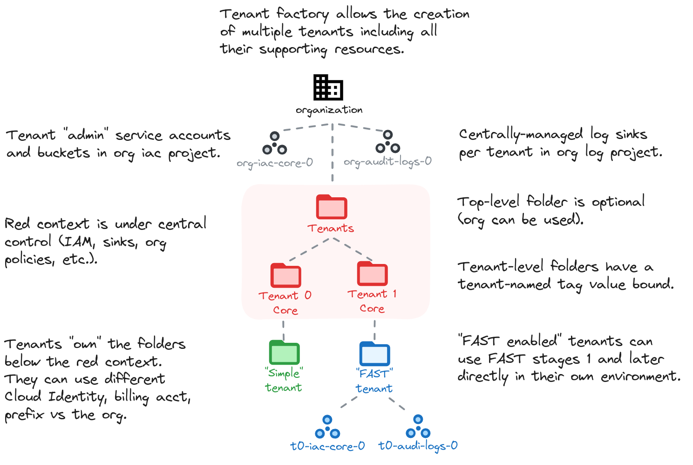

# Tenant Factory

This optional stage implements multitenancy for cases where a high degree of autonomy is needed for each tenant. Typical use cases are different legal entities in a larger group, or business units who own their cloud presence while still consuming shared resources like networking, and which are subject to some degree of central control.

Tenants can:

- leverage their own billing account
- leverage their own Cloud Identity / Workspace
- have FAST compatibility so that they can deploy stages 1+ in their own context

Our tenant design wraps each tenant's folder into an additional folder owned by the central cloud team, where organization policies and log sinks can be defined without the tenant being able to modify or remove them.

Inside each tenant's folder, the FAST prerequisites needed for the tenant to independently run stages 1+ can be created. These are optional, so that they can be skipped when FAST compatibility is not needed.

The following is a high level diagram of this stage design.

<!-- BEGIN TOC -->
- [Design overview and choices](#design-overview-and-choices)
  - [FAST-compatible tenants](#fast-compatible-tenants)
  - [Autonomous tenants](#autonomous-tenants)
- [How to run this stage](#how-to-run-this-stage)
  - [Provider and Terraform variables](#provider-and-terraform-variables)
  - [Impersonating the automation service account](#impersonating-the-automation-service-account)
  - [Variable configuration](#variable-configuration)
  - [Running the stage](#running-the-stage)
- [Tenant configuration](#tenant-configuration)
- [Files](#files)
- [Variables](#variables)
- [Outputs](#outputs)
<!-- END TOC -->

## Design overview and choices

### FAST-compatible tenants

### Autonomous tenants

## How to run this stage

### Provider and Terraform variables

### Impersonating the automation service account

### Variable configuration

### Running the stage

## Tenant configuration

<!-- TFDOC OPTS files:1 show_extra:1 -->
<!-- BEGIN TFDOC -->
## Files

| name | description | modules | resources |
|---|---|---|---|
| [identity-providers-defs.tf](./identity-providers-defs.tf) | Identity provider definitions. |  |  |
| [main.tf](./main.tf) | Module-level locals and resources. | <code>organization</code> |  |
| [outputs-files.tf](./outputs-files.tf) | Output files persistence to local filesystem. |  | <code>local_file</code> |
| [outputs-gcs.tf](./outputs-gcs.tf) | Output files persistence to automation GCS bucket. |  | <code>google_storage_bucket_object</code> |
| [outputs.tf](./outputs.tf) | Module outputs. |  |  |
| [tenant-billing-iam.tf](./tenant-billing-iam.tf) | Per-tenant billing IAM. | <code>billing-account</code> · <code>organization</code> |  |
| [tenant-core.tf](./tenant-core.tf) | Per-tenant centrally managed resources. | <code>folder</code> · <code>logging-bucket</code> |  |
| [tenant-fast-automation.tf](./tenant-fast-automation.tf) | Per-tenant FAST bootstrap emulation (automation). | <code>gcs</code> · <code>iam-service-account</code> · <code>project</code> |  |
| [tenant-fast-cicd.tf](./tenant-fast-cicd.tf) | Per-tenant CI/CD resources. | <code>iam-service-account</code> · <code>source-repository</code> |  |
| [tenant-fast-identity-providers.tf](./tenant-fast-identity-providers.tf) | Per-tenant Workload Identity Federation providers. |  | <code>google_iam_workload_identity_pool</code> · <code>google_iam_workload_identity_pool_provider</code> |
| [tenant-fast-logging.tf](./tenant-fast-logging.tf) | Per-tenant FAST bootstrap emulation (logging). | <code>project</code> |  |
| [tenant-fast-vpcsc.tf](./tenant-fast-vpcsc.tf) | Per-tenant VPC-SC resources. | <code>vpc-sc</code> |  |
| [tenant.tf](./tenant.tf) | Per-tenant resources. | <code>folder</code> · <code>gcs</code> · <code>iam-service-account</code> |  |
| [variables-fast.tf](./variables-fast.tf) | FAST stage interface. |  |  |
| [variables.tf](./variables.tf) | Module variables. |  |  |

## Variables

| name | description | type | required | default | producer |
|---|---|:---:|:---:|:---:|:---:|
| [automation](variables-fast.tf#L19) | Automation resources created by the bootstrap stage. | <code title="object&#40;&#123;&#10;  outputs_bucket          &#61; string&#10;  project_id              &#61; string&#10;  project_number          &#61; string&#10;  federated_identity_pool &#61; string&#10;  federated_identity_providers &#61; map&#40;object&#40;&#123;&#10;    audiences        &#61; list&#40;string&#41;&#10;    issuer           &#61; string&#10;    issuer_uri       &#61; string&#10;    name             &#61; string&#10;    principal_branch &#61; string&#10;    principal_repo   &#61; string&#10;  &#125;&#41;&#41;&#10;  service_accounts &#61; object&#40;&#123;&#10;    resman   &#61; string&#10;    resman-r &#61; string&#10;  &#125;&#41;&#10;&#125;&#41;">object&#40;&#123;&#8230;&#125;&#41;</code> | ✓ |  | <code>0-bootstrap</code> |
| [billing_account](variables-fast.tf#L42) | Billing account id. If billing account is not part of the same org set `is_org_level` to `false`. To disable handling of billing IAM roles set `no_iam` to `true`. | <code title="object&#40;&#123;&#10;  id           &#61; string&#10;  is_org_level &#61; optional&#40;bool, true&#41;&#10;  no_iam       &#61; optional&#40;bool, false&#41;&#10;&#125;&#41;">object&#40;&#123;&#8230;&#125;&#41;</code> | ✓ |  | <code>0-bootstrap</code> |
| [org_policy_tags](variables-fast.tf#L104) | Organization policy tags. | <code title="object&#40;&#123;&#10;  key_id   &#61; string&#10;  key_name &#61; string&#10;  values   &#61; map&#40;string&#41;&#10;&#125;&#41;">object&#40;&#123;&#8230;&#125;&#41;</code> | ✓ |  | <code>0-bootstrap</code> |
| [organization](variables-fast.tf#L94) | Organization details. | <code title="object&#40;&#123;&#10;  domain      &#61; string&#10;  id          &#61; number&#10;  customer_id &#61; string&#10;&#125;&#41;">object&#40;&#123;&#8230;&#125;&#41;</code> | ✓ |  | <code>0-bootstrap</code> |
| [prefix](variables-fast.tf#L114) | Prefix used for resources that need unique names. Use 9 characters or less. | <code>string</code> | ✓ |  | <code>0-bootstrap</code> |
| [custom_roles](variables-fast.tf#L53) | Custom roles defined at the org level, in key => id format. | <code title="object&#40;&#123;&#10;  gcve_network_admin            &#61; string&#10;  organization_admin_viewer     &#61; string&#10;  service_project_network_admin &#61; string&#10;  storage_viewer                &#61; string&#10;  tenant_network_admin          &#61; string&#10;&#125;&#41;">object&#40;&#123;&#8230;&#125;&#41;</code> |  | <code>null</code> | <code>0-bootstrap</code> |
| [groups](variables-fast.tf#L66) | Group names or IAM-format principals to grant organization-level permissions. If just the name is provided, the 'group:' principal and organization domain are interpolated. | <code title="object&#40;&#123;&#10;  gcp-billing-admins      &#61; optional&#40;string, &#34;gcp-billing-admins&#34;&#41;&#10;  gcp-devops              &#61; optional&#40;string, &#34;gcp-devops&#34;&#41;&#10;  gcp-network-admins      &#61; optional&#40;string, &#34;gcp-vpc-network-admins&#34;&#41;&#10;  gcp-organization-admins &#61; optional&#40;string, &#34;gcp-organization-admins&#34;&#41;&#10;  gcp-security-admins     &#61; optional&#40;string, &#34;gcp-security-admins&#34;&#41;&#10;&#125;&#41;">object&#40;&#123;&#8230;&#125;&#41;</code> |  | <code>&#123;&#125;</code> | <code>0-bootstrap</code> |
| [locations](variables-fast.tf#L81) | Optional locations for GCS, BigQuery, and logging buckets created here. | <code title="object&#40;&#123;&#10;  bq      &#61; optional&#40;string, &#34;EU&#34;&#41;&#10;  gcs     &#61; optional&#40;string, &#34;EU&#34;&#41;&#10;  logging &#61; optional&#40;string, &#34;global&#34;&#41;&#10;  pubsub  &#61; optional&#40;list&#40;string&#41;, &#91;&#93;&#41;&#10;&#125;&#41;">object&#40;&#123;&#8230;&#125;&#41;</code> |  | <code>&#123;&#125;</code> | <code>0-bootstrap</code> |
| [outputs_location](variables.tf#L17) | Path where providers and tfvars files for the following stages are written. Leave empty to disable. | <code>string</code> |  | <code>null</code> |  |
| [root_node](variables.tf#L23) | Root folder under which tenants are created, in folders/nnnn format. Defaults to the organization if null. | <code>string</code> |  | <code>null</code> |  |
| [tag_names](variables.tf#L36) | Customized names for resource management tags. | <code title="object&#40;&#123;&#10;  tenant &#61; optional&#40;string, &#34;tenant&#34;&#41;&#10;&#125;&#41;">object&#40;&#123;&#8230;&#125;&#41;</code> |  | <code>&#123;&#125;</code> |  |
| [tenant_configs](variables.tf#L49) | Tenant configurations. Keys are the short names used for naming resources and should not be changed once defined. | <code title="map&#40;object&#40;&#123;&#10;  admin_principal  &#61; string&#10;  descriptive_name &#61; string&#10;  billing_account &#61; optional&#40;object&#40;&#123;&#10;    id &#61; optional&#40;string&#41;&#10;    no_iam &#61; optional&#40;bool, true&#41;&#10;  &#125;&#41;, &#123;&#125;&#41;&#10;  cloud_identity &#61; optional&#40;object&#40;&#123;&#10;    customer_id &#61; string&#10;    domain      &#61; string&#10;    id          &#61; string&#10;  &#125;&#41;&#41;&#10;  locations &#61; optional&#40;object&#40;&#123;&#10;    bq      &#61; optional&#40;string, &#34;EU&#34;&#41;&#10;    gcs     &#61; optional&#40;string, &#34;EU&#34;&#41;&#10;    logging &#61; optional&#40;string, &#34;global&#34;&#41;&#10;    pubsub  &#61; optional&#40;list&#40;string&#41;, &#91;&#93;&#41;&#10;  &#125;&#41;&#41;&#10;  fast_config &#61; optional&#40;object&#40;&#123;&#10;    cicd_config &#61; optional&#40;object&#40;&#123;&#10;      name              &#61; string&#10;      type              &#61; string&#10;      branch            &#61; optional&#40;string&#41;&#10;      identity_provider &#61; optional&#40;string&#41;&#10;    &#125;&#41;&#41;&#10;    groups &#61; optional&#40;object&#40;&#123;&#10;      gcp-billing-admins      &#61; optional&#40;string, &#34;gcp-billing-admins&#34;&#41;&#10;      gcp-devops              &#61; optional&#40;string, &#34;gcp-devops&#34;&#41;&#10;      gcp-network-admins      &#61; optional&#40;string, &#34;gcp-vpc-network-admins&#34;&#41;&#10;      gcp-organization-admins &#61; optional&#40;string, &#34;gcp-organization-admins&#34;&#41;&#10;      gcp-security-admins     &#61; optional&#40;string, &#34;gcp-security-admins&#34;&#41;&#10;      gcp-support             &#61; optional&#40;string, &#34;gcp-devops&#34;&#41;&#10;    &#125;&#41;&#41;&#10;    prefix &#61; optional&#40;string&#41;&#10;    workload_identity_providers &#61; optional&#40;map&#40;object&#40;&#123;&#10;      attribute_condition &#61; optional&#40;string&#41;&#10;      issuer              &#61; string&#10;      custom_settings &#61; optional&#40;object&#40;&#123;&#10;        issuer_uri &#61; optional&#40;string&#41;&#10;        audiences  &#61; optional&#40;list&#40;string&#41;, &#91;&#93;&#41;&#10;        jwks_json  &#61; optional&#40;string&#41;&#10;      &#125;&#41;, &#123;&#125;&#41;&#10;    &#125;&#41;&#41;, &#123;&#125;&#41;&#10;  &#125;&#41;&#41;&#10;  vpc_sc_policy_create &#61; optional&#40;bool, false&#41;&#10;&#125;&#41;&#41;">map&#40;object&#40;&#123;&#8230;&#125;&#41;&#41;</code> |  | <code>&#123;&#125;</code> |  |

## Outputs

| name | description | sensitive | consumers |
|---|---|:---:|---|
| [tenants](outputs.tf#L125) | Tenant base configuration. |  |  |
<!-- END TFDOC -->
