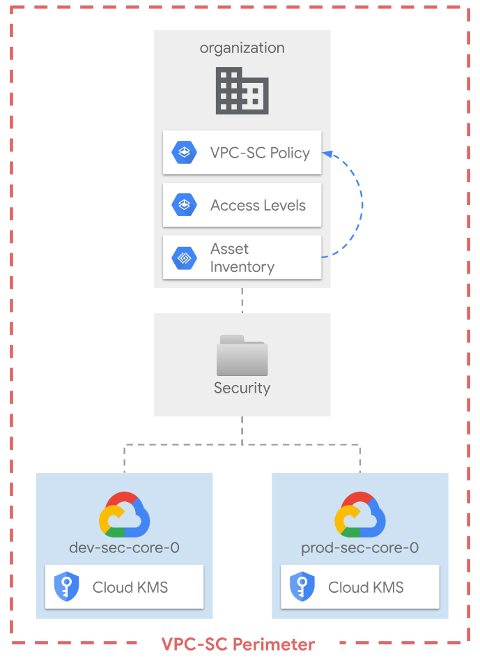

# VPC Service Controls

This stage sets up VPC Service Controls (VPC-SC) for the whole organization and is a thing FAST-compliant wrapper on the [VPC-SC module](../../../modules/vpc-sc/), with some minimal defaults.

<p align="center">
  
</p>

<!-- BEGIN TOC -->
- [Design overview and choices](#design-overview-and-choices)
  - [Cloud KMS](#cloud-kms)
  - [VPC Service Controls](#vpc-service-controls)
- [How to run this stage](#how-to-run-this-stage)
  - [Provider and Terraform variables](#provider-and-terraform-variables)
  - [Impersonating the automation service account](#impersonating-the-automation-service-account)
  - [Variable configuration](#variable-configuration)
  - [Using delayed billing association for projects](#using-delayed-billing-association-for-projects)
  - [Running the stage](#running-the-stage)
- [Customizations](#customizations)
  - [KMS keys](#kms-keys)
  - [VPC Service Controls configuration](#vpc-service-controls-configuration)
- [Notes](#notes)
- [Files](#files)
- [Variables](#variables)
- [Outputs](#outputs)
<!-- END TOC -->

## Design overview and choices

The approach to VPC-SC design implemented in this stage aims at providing the simplest possible configuration that can be set to enforced mode, so as to provide immediate protection while minimizing operational complexity (which can be very high for VPC-SC).

### Single perimeter

This stage uses a single VPC-SC perimeter, which provides protection against data exfiltration and use of credentials from outside of established boundaries, but minimizes operational toil by eliminating the need of setting up bridges between different perimeters, and by reducing the amount of ingress/egress policies needed.

The perimeter is set to enforced mode by default, to prevent the common situation where a complex design is deployed in dry-run mode, and then never enforced as the burden of addressing all violations is too high. A simpler design with very coarse access levels can be enforced quickly, and then refined iteratively as operations are streamlined and familiarity with VPC-SC quirks increases.

### Factories for VPC-SC configuration

Restricted services, access levels, ingress and egress policies can all be configured via YAML-based files, which allow intuitive editing and minimize the complexity of running operations.

The default setup only contains a single access level and an initial list of restricted services in the `data/access-levels` folder and the `data/restricted-services.yaml` file.

To configure ingress and egress policies simply add `ingress_policies` and/or `egress_policies` folders under `data`, or point the factories to your own folders by changing the `factories_config` variable values.

Examples on how to write access level and policy YAML files are provided further down in this document.

### Default geo-based access level

The way we set up the perimeter for broad access is via a single geo-based access level, which is configured to allow access from one or more countries and deny all other traffic coming from outside the perimeter.

The [`data/access-levels/geo.yaml`](data/access-levels/geo.yaml) file serves as an example and should be edited to contain the countries you need (or replaced/removed for more granular configuration).

```yaml
conditions:
  - regions:
      # replace the following country codes with those you need
      - ES
      - IT
```

More access levels can be of course added to better tailor the configuration to specific needs. Some use cases are address further down in this document.

### Ingress policy for organization-level log sinks

An ingress policy that allows ingress to the perimeter for identities used in organization-level sinks is automatically injected in the perimeter.

This only supports sinks defined in the bootstrap stage, but it can easily be used as a reference for different, specific needs (or replaced with a policy leveraging Asset Inventory for automatic inclusion of folder-level sinks).

### Asset Inventory for perimeter membership

One more feature this setup provides out of the box to reduce toil, is semi-automatic resource discovery and management of perimeter membership via Cloud Asset Inventory.

The feature requires this stage to be run every time new projects are created, so it is mainly meant for simple installation where project churn is low and the organization is fairly stable. For large installations direct perimeter inclusion at creation via the project factory is probably a better choice.

Resource discovery can be configured (or turned off if needed) via the `resource_discovery` variable.

## How to run this stage

This stage is meant to be executed after the [bootstrap](../0-bootstrap) stage has run, as it leverages the automation service account and bucket created there. It does not depend from any other stage and no other stage requires it, so it can run in any order or even skipped entirely.

It's of course possible to run this stage in isolation, but that's outside the scope of this document, and you would need to refer to the code for the previous stage for the environment requirements.

Before running this stage, you need to make sure you have the correct credentials and permissions, and localize variables by assigning values that match your configuration.

### Provider and Terraform variables

As all other FAST stages, the [mechanism used to pass variable values and pre-built provider files from one stage to the next](../0-bootstrap/README.md#output-files-and-cross-stage-variables) is also leveraged here.

The commands to link or copy the provider and terraform variable files can be easily derived from the `stage-links.sh` script in the FAST root folder, passing it a single argument with the local output files folder (if configured) or the GCS output bucket in the automation project (derived from stage 0 outputs). The following examples demonstrate both cases, and the resulting commands that then need to be copy/pasted and run.

```bash
../../stage-links.sh ~/fast-config

# copy and paste the following commands for '1-vpc-sc'

ln -s ~/fast-config/tfvars/0-globals.auto.tfvars.json ./
ln -s ~/fast-config/tfvars/0-bootstrap.auto.tfvars.json ./
ln -s ~/fast-config/tfvars/1-resman.auto.tfvars.json ./
```

```bash
../../stage-links.sh gs://xxx-prod-iac-core-outputs-0

# copy and paste the following commands for '2-security'

gcloud alpha storage cp gs://xxx-prod-iac-core-outputs-0/tfvars/0-globals.auto.tfvars.json ./
gcloud alpha storage cp gs://xxx-prod-iac-core-outputs-0/tfvars/0-bootstrap.auto.tfvars.json ./
gcloud alpha storage cp gs://xxx-prod-iac-core-outputs-0/tfvars/1-resman.auto.tfvars.json ./
```

### Impersonating the automation service account

The preconfigured provider file uses impersonation to run with this stage's automation service account's credentials. The `gcp-devops` and `organization-admins` groups have the necessary IAM bindings in place to do that, so make sure the current user is a member of one of those groups.

### Variable configuration

Variables in this stage -- like most other FAST stages -- are broadly divided into three separate sets:

- variables which refer to global values for the whole organization (org id, billing account id, prefix, etc.), which are pre-populated via the `0-globals.auto.tfvars.json` file linked or copied above
- variables which refer to resources managed by previous stages, which are prepopulated here via the `0-bootstrap.auto.tfvars.json` file linked or copied above
- and finally variables that optionally control this stage's behaviour and customizations, and can to be set in a custom `terraform.tfvars` file

The latter set is explained in the [Customization](#customizations) sections below, and the full list can be found in the [Variables](#variables) table at the bottom of this document.

Note that the `outputs_location` variable is disabled by default, you need to explicitly set it in your `terraform.tfvars` file if you want output files to be generated by this stage. This is a sample `terraform.tfvars` that configures it, refer to the [bootstrap stage documentation](../0-bootstrap/README.md#output-files-and-cross-stage-variables) for more details:

```tfvars
outputs_location = "~/fast-config"
```

### Running the stage

Once provider and variable values are in place and the correct user is configured, the stage can be run:

```bash
terraform init
terraform apply
```

## Customizations

The stage is a thin wrapper that implements a single-perimeter design via the [`vpc-sc` module](../../../modules/vpc-sc/), and most of the customizations available in the module are also available here. A few examples are provided below for ease of reference.

### Access policy

The stage creates the org-level access policy by default. A pre-existing policy can instead be used by populating the `access_policy` variable with the policy id. In tenant-level mode this is done automatically by the FAST input/output files mechanism.

### Default perimeter

The default perimeter is exposed via the `perimeters.default` variable which allows customizing most of its features.

The only exception is the list of restricted services, which is configured via a YAML file with a list of services. To configure restricted services edit the list in `data/restricted-services.yaml`, or point the stage to your own file via the `factories_config.

The following is an example `.tfvars` file showing how to configure the perimeter via variables.

```tfvars
perimeters = {
  default = {
    # enable access levels defined in YAML and/or variables
    access_levels    = ["geo"]
    # switch to dry-run mode (defaults to false)
    dry_run          = true
    # enable egress policies defined in YAML and/or variables
    egress_policies  = []
    # enable ingress policies defined in YAML and/or variables
    ingress_policies = []
    # list resources part of this perimeter
    resources        = []
    # turn on VPC accessible services
    vpc_accessible_services = {
      allowed_services   = []
      enable_restriction = false
    }
  }
}
```

### Access levels

### Ingress policies

### Egress policies

## Notes

Some references that might be useful in setting up this stage:

- [VPC SC CSCC requirements](https://cloud.google.com/security-command-center/docs/troubleshooting).

<!-- TFDOC OPTS files:1 show_extra:1 -->
<!-- BEGIN TFDOC -->
## Files

| name | description | modules | resources |
|---|---|---|---|
| [core-dev.tf](./core-dev.tf) | None | <code>kms</code> · <code>project</code> |  |
| [core-prod.tf](./core-prod.tf) | None | <code>kms</code> · <code>project</code> |  |
| [main.tf](./main.tf) | Module-level locals and resources. | <code>folder</code> |  |
| [outputs.tf](./outputs.tf) | Module outputs. |  | <code>google_storage_bucket_object</code> · <code>local_file</code> |
| [variables-fast.tf](./variables-fast.tf) | None |  |  |
| [variables.tf](./variables.tf) | Module variables. |  |  |
| [vpc-sc.tf](./vpc-sc.tf) | None | <code>projects-data-source</code> · <code>vpc-sc</code> |  |

## Variables

| name | description | type | required | default | producer |
|---|---|:---:|:---:|:---:|:---:|
| [automation](variables-fast.tf#L24) | Automation resources created by the bootstrap stage. | <code title="object&#40;&#123;&#10;  outputs_bucket &#61; string&#10;&#125;&#41;">object&#40;&#123;&#8230;&#125;&#41;</code> | ✓ |  | <code>0-bootstrap</code> |
| [billing_account](variables-fast.tf#L32) | Billing account id. If billing account is not part of the same org set `is_org_level` to false. | <code title="object&#40;&#123;&#10;  id           &#61; string&#10;  is_org_level &#61; optional&#40;bool, true&#41;&#10;&#125;&#41;">object&#40;&#123;&#8230;&#125;&#41;</code> | ✓ |  | <code>0-bootstrap</code> |
| [folder_ids](variables-fast.tf#L45) | Folder name => id mappings, the 'security' folder name must exist. | <code title="object&#40;&#123;&#10;  security &#61; string&#10;&#125;&#41;">object&#40;&#123;&#8230;&#125;&#41;</code> | ✓ |  | <code>1-resman</code> |
| [organization](variables-fast.tf#L63) | Organization details. | <code title="object&#40;&#123;&#10;  domain      &#61; string&#10;  id          &#61; number&#10;  customer_id &#61; string&#10;&#125;&#41;">object&#40;&#123;&#8230;&#125;&#41;</code> | ✓ |  | <code>0-bootstrap</code> |
| [prefix](variables-fast.tf#L73) | Prefix used for resources that need unique names. Use a maximum of 9 chars for organizations, and 11 chars for tenants. | <code>string</code> | ✓ |  | <code>0-bootstrap</code> |
| [service_accounts](variables-fast.tf#L97) | Automation service accounts that can assign the encrypt/decrypt roles on keys. | <code title="object&#40;&#123;&#10;  data-platform-dev    &#61; string&#10;  data-platform-prod   &#61; string&#10;  project-factory      &#61; string&#10;  project-factory-dev  &#61; string&#10;  project-factory-prod &#61; string&#10;&#125;&#41;">object&#40;&#123;&#8230;&#125;&#41;</code> | ✓ |  | <code>1-resman</code> |
| [access_policy](variables-fast.tf#L17) | Access policy id for tenant-level VPC-SC configurations. | <code>number</code> |  | <code>null</code> | <code>0-bootstrap</code> |
| [essential_contacts](variables.tf#L17) | Email used for essential contacts, unset if null. | <code>string</code> |  | <code>null</code> |  |
| [factories_config](variables.tf#L23) | Paths to folders that enable factory functionality. | <code title="object&#40;&#123;&#10;  vpc_sc &#61; optional&#40;object&#40;&#123;&#10;    access_levels       &#61; optional&#40;string, &#34;data&#47;vpc-sc&#47;access-levels&#34;&#41;&#10;    egress_policies     &#61; optional&#40;string, &#34;data&#47;vpc-sc&#47;egress-policies&#34;&#41;&#10;    ingress_policies    &#61; optional&#40;string, &#34;data&#47;vpc-sc&#47;ingress-policies&#34;&#41;&#10;    restricted_services &#61; optional&#40;string, &#34;data&#47;vpc-sc&#47;restricted-services.yaml&#34;&#41;&#10;  &#125;&#41;, &#123;&#125;&#41;&#10;&#125;&#41;">object&#40;&#123;&#8230;&#125;&#41;</code> |  | <code>&#123;&#125;</code> |  |
| [kms_keys](variables.tf#L37) | KMS keys to create, keyed by name. | <code title="map&#40;object&#40;&#123;&#10;  rotation_period &#61; optional&#40;string, &#34;7776000s&#34;&#41;&#10;  labels          &#61; optional&#40;map&#40;string&#41;&#41;&#10;  locations &#61; optional&#40;list&#40;string&#41;, &#91;&#10;    &#34;europe&#34;, &#34;europe-west1&#34;, &#34;europe-west3&#34;, &#34;global&#34;&#10;  &#93;&#41;&#10;  purpose                       &#61; optional&#40;string, &#34;ENCRYPT_DECRYPT&#34;&#41;&#10;  skip_initial_version_creation &#61; optional&#40;bool, false&#41;&#10;  version_template &#61; optional&#40;object&#40;&#123;&#10;    algorithm        &#61; string&#10;    protection_level &#61; optional&#40;string, &#34;SOFTWARE&#34;&#41;&#10;  &#125;&#41;&#41;&#10;&#10;&#10;  iam &#61; optional&#40;map&#40;list&#40;string&#41;&#41;, &#123;&#125;&#41;&#10;  iam_bindings &#61; optional&#40;map&#40;object&#40;&#123;&#10;    members &#61; list&#40;string&#41;&#10;    role    &#61; string&#10;    condition &#61; optional&#40;object&#40;&#123;&#10;      expression  &#61; string&#10;      title       &#61; string&#10;      description &#61; optional&#40;string&#41;&#10;    &#125;&#41;&#41;&#10;  &#125;&#41;&#41;, &#123;&#125;&#41;&#10;  iam_bindings_additive &#61; optional&#40;map&#40;object&#40;&#123;&#10;    member &#61; string&#10;    role   &#61; string&#10;    condition &#61; optional&#40;object&#40;&#123;&#10;      expression  &#61; string&#10;      title       &#61; string&#10;      description &#61; optional&#40;string&#41;&#10;    &#125;&#41;&#41;&#10;  &#125;&#41;&#41;, &#123;&#125;&#41;&#10;&#125;&#41;&#41;">map&#40;object&#40;&#123;&#8230;&#125;&#41;&#41;</code> |  | <code>&#123;&#125;</code> |  |
| [logging](variables-fast.tf#L53) | Log writer identities for organization / folders. | <code title="object&#40;&#123;&#10;  project_number    &#61; string&#10;  writer_identities &#61; map&#40;string&#41;&#10;&#125;&#41;">object&#40;&#123;&#8230;&#125;&#41;</code> |  | <code>null</code> | <code>0-bootstrap</code> |
| [outputs_location](variables.tf#L76) | Path where providers, tfvars files, and lists for the following stages are written. Leave empty to disable. | <code>string</code> |  | <code>null</code> |  |
| [root_node](variables-fast.tf#L83) | Root node for the hierarchy, if running in tenant mode. | <code>string</code> |  | <code>null</code> | <code>0-bootstrap</code> |
| [vpc_sc](variables.tf#L82) | VPC SC configuration. | <code title="object&#40;&#123;&#10;  access_levels    &#61; optional&#40;map&#40;any&#41;, &#123;&#125;&#41;&#10;  egress_policies  &#61; optional&#40;map&#40;any&#41;, &#123;&#125;&#41;&#10;  ingress_policies &#61; optional&#40;map&#40;any&#41;, &#123;&#125;&#41;&#10;  perimeter_default &#61; optional&#40;object&#40;&#123;&#10;    access_levels    &#61; optional&#40;list&#40;string&#41;, &#91;&#93;&#41;&#10;    dry_run          &#61; optional&#40;bool, false&#41;&#10;    egress_policies  &#61; optional&#40;list&#40;string&#41;, &#91;&#93;&#41;&#10;    ingress_policies &#61; optional&#40;list&#40;string&#41;, &#91;&#93;&#41;&#10;    resources        &#61; optional&#40;list&#40;string&#41;, &#91;&#93;&#41;&#10;  &#125;&#41;&#41;&#10;  resource_discovery &#61; optional&#40;object&#40;&#123;&#10;    enabled          &#61; optional&#40;bool, true&#41;&#10;    ignore_folders   &#61; optional&#40;list&#40;string&#41;, &#91;&#93;&#41;&#10;    ignore_projects  &#61; optional&#40;list&#40;string&#41;, &#91;&#93;&#41;&#10;    include_projects &#61; optional&#40;list&#40;string&#41;, &#91;&#93;&#41;&#10;  &#125;&#41;, &#123;&#125;&#41;&#10;&#125;&#41;">object&#40;&#123;&#8230;&#125;&#41;</code> |  | <code>&#123;&#125;</code> |  |

## Outputs

| name | description | sensitive | consumers |
|---|---|:---:|---|
| [kms_keys](outputs.tf#L65) | KMS key ids. |  |  |
| [tfvars](outputs.tf#L70) | Terraform variable files for the following stages. | ✓ |  |
| [vpc_sc_perimeter_default](outputs.tf#L76) | Raw default perimeter resource. | ✓ |  |
<!-- END TFDOC -->
