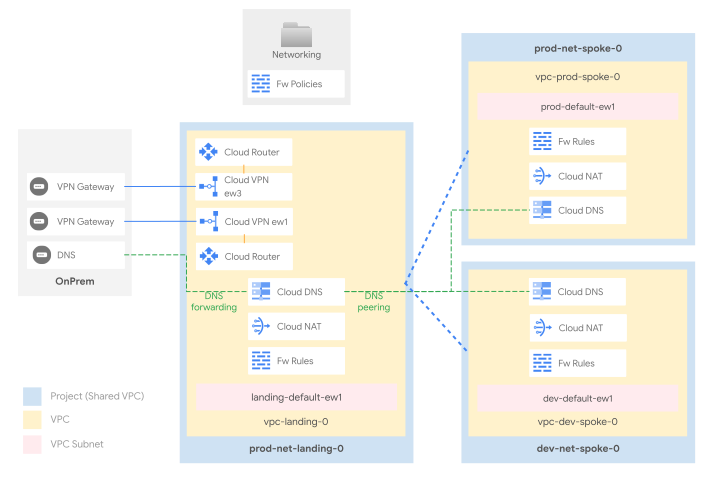

# Networking with VPC Peering

This stage sets up the shared network infrastructure for the whole organization. It adopts the common “hub and spoke” reference design, which is well suited to multiple scenarios, and offers several advantages versus other designs:

- the “hub” VPC centralizes external connectivity to on-prem or other cloud environments, and is ready to host cross-environment services like CI/CD, code repositories, and monitoring probes
- the “spoke” VPCs allow partitioning workloads (e.g. by environment like in this setup), while still retaining controlled access to central connectivity and services
- Shared VPC in both hub and spokes splits management of network resources in specific (host) projects, while still allowing them to be consumed from workload (service) projects
- the design also lends itself to easy DNS centralization, both from on-prem to cloud and from cloud to on-prem

Connectivity between hub and spokes is established here via [VPC Peering](https://cloud.google.com/vpc/docs/vpc-peering), which offers a complete isolation between environments, and no choke-points in the data plane. Different ways of implementing connectivity, and their respective pros and cons, are discussed below.

The following diagram illustrates the high-level design, and should be used as a reference for the following sections. The final number of subnets, and their IP addressing design will of course depend on customer-specific requirements, and can be easily changed via variables or external data files without having to edit the actual code.

<p align="center">
  
</p>

## Table of contents

- [Design overview and choices](#design-overview-and-choices)
  - [VPC design](#vpc-design)
  - [External connectivity](#external-connectivity)
  - [Internal connectivity](#internal-connectivity)
  - [IP ranges, subnetting, routing](#ip-ranges-subnetting-routing)
  - [Internet egress](#internet-egress)
  - [VPC and Hierarchical Firewall](#vpc-and-hierarchical-firewall)
  - [DNS](#dns)
- [Stage structure and files layout](#stage-structure-and-files-layout)
  - [VPCs](#vpcs)
  - [VPNs](#vpns)
  - [Routing and BGP](#routing-and-bgp)
  - [Firewall](#firewall)
  - [DNS architecture](#dns-architecture)
  - [Private Google Access](#private-google-access)
- [How to run this stage](#how-to-run-this-stage)
  - [Provider and Terraform variables](#provider-and-terraform-variables)
  - [Impersonating the automation service account](#impersonating-the-automation-service-account)
  - [Variable configuration](#variable-configuration)
  - [Running the stage](#running-the-stage)
  - [Post-deployment activities](#post-deployment-activities)
- [Customizations](#customizations)
  - [Changing default regions](#changing-default-regions)
  - [Configuring the VPN to on prem](#configuring-the-vpn-to-on-prem)
  - [Adding an environment](#adding-an-environment)

## Design overview and choices

### VPC design

The hub/landing VPC hosts external connectivity and shared services for spoke VPCs, which are connected to it via VPC peering. Spokes are used here to partition environments, which is a fairly common pattern:

- one spoke VPC for the production environment
- one spoke VPC for the development environment

Each VPC is created into its own project, and each project is configured as a Shared VPC host, so that network-related resources and access configurations via IAM are kept separate for each VPC.

The design easily lends itself to implementing additional environments, or adopting a different logical mapping for spokes (e.g. one spoke for each company entity, etc.). Adding spokes is a trivial operation, does not increase the design complexity, and is explained in operational terms in the following sections.

In multi-organization scenarios, where production and non-production resources use different Cloud Identity and GCP organizations, the hub/landing VPC is usually part of the production organization, and establishes connections with production spokes in its same organization, and non-production spokes in a different organization.

### External connectivity

External connectivity to on-prem is implemented here via HA VPN (two tunnels per region), as this is the minimum common denominator often used directly, or as a stop-gap solution to validate routing and transfer data, while waiting for [interconnects](https://cloud.google.com/network-connectivity/docs/interconnect) to be provisioned.

Connectivity to additional on-prem sites or other cloud providers should be implemented in a similar fashion, via VPN tunnels or interconnects in the landing VPC sharing the same regional router.

### Internal connectivity

Each environment has full line of sight with the Landing VPC, and hence with any networks interconnected with it (e.g. your onprem environment). Environments cannot communicate with each other (prod to dev and viceversa). If this is a requirement, and according to your specific needs and constraints, solutions based on full-mesh peerings, VPNs or NVA should be added to this design.

As mentioned initially, there are of course other ways to implement internal connectivity other than VPC peering. These can be easily retrofitted with minimal code changes, but introduce additional considerations for service interoperability, quotas and management.

This is a summary of the main options:

- [HA VPN](https://cloud.google.com/network-connectivity/docs/vpn/concepts/topologies) (implemented by [2-networking-b-vpn](../2-networking-b-vpn/))
  - Pros: simple compatibility with GCP services that leverage peering internally, better control on routes, avoids peering groups shared quotas and limits
  - Cons: additional cost, marginal increase in latency, requires multiple tunnels for full bandwidth
- [VPC Peering](https://cloud.google.com/vpc/docs/vpc-peering) (implemented here)
  - Pros: no additional costs, full bandwidth with no configurations, no extra latency, total environment isolation
  - Cons: no transitivity (e.g. to GKE masters, Cloud SQL, etc.), no selective exchange of routes, several quotas and limits shared between VPCs in a peering group
- [Multi-NIC appliances](https://cloud.google.com/architecture/best-practices-vpc-design#multi-nic) (implemented by [2-networking-c-nva](../2-networking-c-nva/) and [2-networking-e-nva-bgp](../2-networking-e-nva-bgp/))
  - Pros: additional security features (e.g. IPS), potentially better integration with on-prem systems by using the same vendor
  - Cons: complex HA/failover setup, limited by VM bandwidth and scale, additional costs for VMs and licenses, out of band management of a critical cloud component

### IP ranges, subnetting, routing

Minimizing the number of routes (and subnets) in use on the cloud environment is an important consideration, as it simplifies management and avoids hitting [Cloud Router](https://cloud.google.com/network-connectivity/docs/router/quotas) and [VPC](https://cloud.google.com/vpc/docs/quota) quotas and limits. For this reason, we recommend careful planning of the IP space used in your cloud environment, to be able to use large IP CIDR blocks in routes whenever possible.

This stage uses a dedicated /16 block (which should of course be sized to your needs) for each region in each VPC, and subnets created in each VPC derive their ranges from the relevant block.

Spoke VPCs also define and reserve two "special" CIDR ranges dedicated to [PSA (Private Service Access)](https://cloud.google.com/vpc/docs/private-services-access) and [Internal Application Load Balancers (L7 LBs)](https://cloud.google.com/load-balancing/docs/l7-internal).

Routes in GCP are either automatically created for VPC subnets, manually created via static routes, or dynamically programmed by [Cloud Routers](https://cloud.google.com/network-connectivity/docs/router#docs) via BGP sessions, which can be configured to advertise VPC ranges, and/or custom ranges via custom advertisements.

In this setup:

- routes between multiple subnets within the same VPC are automatically programmed by GCP
- each spoke exchanges routes with the hub/landing through VPC peering
- spokes don't exchange routes, directly or indirectly
- on-premises is connected to the landing VPC and dynamically exchanges BGP routes with GCP using HA VPN

### Internet egress

The path of least resistance for Internet egress is using Cloud NAT, and that is what's implemented in this setup, with a NAT gateway configured for each VPC.

Several other scenarios are possible of course, with varying degrees of complexity:

- a forward proxy, with optional URL filters
- a default route to on-prem to leverage existing egress infrastructure
- a full-fledged perimeter firewall to control egress and implement additional security features like IPS

Future pluggable modules will allow to easily experiment, or deploy the above scenarios.

### VPC and Hierarchical Firewall

The GCP Firewall is a stateful, distributed feature that allows the creation of L4 policies, either via VPC-level rules or more recently via hierarchical policies applied on the resource hierarchy (organization, folders).

The current setup adopts both firewall types, and uses hierarchical rules on the Networking folder for common ingress rules (egress is open by default), e.g. from health check or IAP forwarders ranges, and VPC rules for the environment or workload-level ingress.

Rules and policies are defined in simple YAML files, described below.

### DNS

DNS goes hand in hand with networking, especially on GCP where Cloud DNS zones and policies are associated at the VPC level. This setup implements both DNS flows:

- on-prem to cloud via private zones for cloud-managed domains, and an [inbound policy](https://cloud.google.com/dns/docs/server-policies-overview#dns-server-policy-in) used as forwarding target or via delegation (requires some extra configuration) from on-prem DNS resolvers
- cloud to on-prem via forwarding zones for the on-prem managed domains

DNS configuration is further centralized by leveraging peering zones, so that

- the hub/landing Cloud DNS hosts configurations for on-prem forwarding, Google API domains, and the top-level private zone/s (e.g. gcp.example.com)
- the spokes Cloud DNS host configurations for the environment-specific domains (e.g. prod.gcp.example.com), which are bound to the hub/landing leveraging [cross-project binding](https://cloud.google.com/dns/docs/zones/zones-overview#cross-project_binding); a peering zone for the `.` (root) zone is then created on each spoke, delegating all DNS resolution to hub/landing.
- Private Google Access is enabled via [DNS Response Policies](https://cloud.google.com/dns/docs/zones/manage-response-policies#create-response-policy-rule) for most of the [supported domains](https://cloud.google.com/vpc/docs/configure-private-google-access#domain-options)

To complete the configuration, the 35.199.192.0/19 range should be routed on the VPN tunnels from on-prem, and the following names configured for DNS forwarding to cloud:

- `private.googleapis.com`
- `restricted.googleapis.com`
- `gcp.example.com` (used as a placeholder)

From cloud, the `example.com` domain (used as a placeholder) is forwarded to on-prem.

This configuration is battle-tested, and flexible enough to lend itself to simple modifications without subverting its design, for example by forwarding and peering root zones to bypass Cloud DNS external resolution.

## Stage structure and files layout

### VPCs

VPCs are defined in separate files, one for `landing` and one for each of `prod` and `dev`.
Each file contains the same resources, described in the following paragraphs.

The **project** ([`project`](../../../modules/project)) contains the VPC, and enables the required APIs and sets itself as a "[host project](https://cloud.google.com/vpc/docs/shared-vpc)".

The **VPC** ([`net-vpc`](../../../modules/net-vpc)) manages the DNS inbound policy (for Landing), explicit routes for `{private,restricted}.googleapis.com`, and its **subnets**. Subnets are created leveraging a "resource factory" paradigm, where the configuration is separated from the module that implements it, and stored in a well-structured file. To add a new subnet, simply create a new file in the `data_folder` directory defined in the module, following the examples found in the [Fabric `net-vpc` documentation](../../../modules/net-vpc#subnet-factory). Sample subnets are shipped in [data/subnets](./data/subnets), and can be easily customised to fit your needs.

Subnets for [L7 ILBs](https://cloud.google.com/load-balancing/docs/l7-internal/proxy-only-subnets) are handled differently, and defined in variable `l7ilb_subnets`, while ranges for [PSA](https://cloud.google.com/vpc/docs/configure-private-services-access#allocating-range) are configured by variable `psa_ranges` - such variables are consumed by spoke VPCs.

**Cloud NAT** ([`net-cloudnat`](../../../modules/net-cloudnat)) manages the networking infrastructure required to enable internet egress.

### VPNs

Connectivity to on-prem is implemented with HA VPN ([`net-vpn`](../../../modules/net-vpn-ha)) and defined in [`vpn-onprem.tf`](./vpn-onprem.tf). The file provisionally implements a single logical connection between onprem and landing at `europe-west1`, and the relevant parameters for its configuration are found in variable `vpn_onprem_primary_configs`. An example configuration is provided [below](#configuring-the-vpn-to-on-prem).

### Routing and BGP

Each VPC network ([`net-vpc`](../../../modules/net-vpc)) manages a separate routing table, which can define static routes (e.g. to private.googleapis.com) and receives dynamic routes from BGP sessions established with neighbor networks (i.e. landing receives routes from onprem and any other interconnected network). Spokes receive dynamic routes programmed on the Landing VPC from the VPC peering.

Static routes are defined in `vpc-*.tf` files, in the `routes` section of each `net-vpc` module.

### Firewall

**VPC firewall rules** ([`net-vpc-firewall`](../../../modules/net-vpc-firewall)) are defined per-vpc on each `vpc-*.tf` file and leverage a resource factory to massively create rules.
To add a new firewall rule, create a new file or edit an existing one in the `data_folder` directory defined in the module `net-vpc-firewall`, following the examples of the "[Rules factory](../../../modules/net-vpc-firewall#rules-factory)" section of the module documentation. Sample firewall rules are shipped in [data/firewall-rules/landing](./data/firewall-rules/landing) and can be easily customised.

**Hierarchical firewall policies** ([`folder`](../../../modules/folder)) are defined in `main.tf` and managed through a policy factory implemented by the `net-firewall-policy` module, which is then applied to the `Networking` folder containing all the core networking infrastructure. Policies are defined in the `rules_file` file, to define a new one simply use the [firewall policy module documentation](../../../modules/net-firewall-policy/README.md#factory)". Sample hierarchical firewall rules are shipped in [data/hierarchical-ingress-rules.yaml](./data/hierarchical-ingress-rules.yaml) and can be easily customised.

### DNS architecture

The DNS ([`dns`](../../../modules/dns)) infrastructure is defined in the respective `dns-xxx.tf` files.

Cloud DNS manages onprem forwarding, the main GCP zone (in this example `gcp.example.com`) and environment-specific zones (i.e. `dev.gcp.example.com` and `prod.gcp.example.com`).

#### Cloud environment

Per the section above Landing acts as the source of truth for DNS within the Cloud environment. Resources defined in the spoke VPCs consume the Landing DNS infrastructure through DNS peering (e.g. `prod-landing-root-dns-peering`).
Spokes can optionally define private zones (e.g. `prod-dns-private-zone`) - granting visibility to the Landing VPC ensures that the whole cloud environment can query such zones.

#### Cloud to on-prem

Leveraging the forwarding zones defined on Landing (e.g. `onprem-example-dns-forwarding` and `reverse-10-dns-forwarding`), the cloud environment can resolve `in-addr.arpa.` and `onprem.example.com.` using the on-premises DNS infrastructure. Onprem resolvers IPs are set in variable `dns.onprem`.

DNS queries sent to the on-premises infrastructure come from the `35.199.192.0/19` source range, which is only accessible from within a VPC or networks connected to one.

#### On-prem to cloud

The [Inbound DNS Policy](https://cloud.google.com/dns/docs/server-policies-overview#dns-server-policy-in) defined in module `landing-vpc` ([`landing.tf`](./landing.tf)) automatically reserves the first available IP address on each created subnet (typically the third one in a CIDR) to expose the Cloud DNS service so that it can be consumed from outside of GCP.

## How to run this stage

This stage is meant to be executed after the [resource management](../1-resman) stage has run, as it leverages the automation service account and bucket created there, and additional resources configured in the [bootstrap](../0-bootstrap) stage.

It's of course possible to run this stage in isolation, but that's outside the scope of this document, and you would need to refer to the code for the previous stages for the environmental requirements.

Before running this stage, you need to make sure you have the correct credentials and permissions, and localize variables by assigning values that match your configuration.

### Provider and Terraform variables

As all other FAST stages, the [mechanism used to pass variable values and pre-built provider files from one stage to the next](../0-bootstrap/README.md#output-files-and-cross-stage-variables) is also leveraged here.

The commands to link or copy the provider and terraform variable files can be easily derived from the `stage-links.sh` script in the FAST root folder, passing it a single argument with the local output files folder (if configured) or the GCS output bucket in the automation project (derived from stage 0 outputs). The following examples demonstrate both cases, and the resulting commands that then need to be copy/pasted and run.

```bash
../../stage-links.sh ~/fast-config

# copy and paste the following commands for '2-networking-a-peering'

ln -s ~/fast-config/providers/2-networking-providers.tf ./
ln -s ~/fast-config/tfvars/0-globals.auto.tfvars.json ./
ln -s ~/fast-config/tfvars/0-bootstrap.auto.tfvars.json ./
ln -s ~/fast-config/tfvars/1-resman.auto.tfvars.json ./
```

```bash
../../stage-links.sh gs://xxx-prod-iac-core-outputs-0

# copy and paste the following commands for '2-networking-a-peering'

gcloud alpha storage cp gs://xxx-prod-iac-core-outputs-0/providers/2-networking-providers.tf ./
gcloud alpha storage cp gs://xxx-prod-iac-core-outputs-0/tfvars/0-globals.auto.tfvars.json ./
gcloud alpha storage cp gs://xxx-prod-iac-core-outputs-0/tfvars/0-bootstrap.auto.tfvars.json ./
gcloud alpha storage cp gs://xxx-prod-iac-core-outputs-0/tfvars/1-resman.auto.tfvars.json ./
```

### Impersonating the automation service account

The preconfigured provider file uses impersonation to run with this stage's automation service account's credentials. The `gcp-devops` and `organization-admins` groups have the necessary IAM bindings in place to do that, so make sure the current user is a member of one of those groups.

### Variable configuration

Variables in this stage -- like most other FAST stages -- are broadly divided into three separate sets:

- variables which refer to global values for the whole organization (org id, billing account id, prefix, etc.), which are pre-populated via the `0-globals.auto.tfvars.json` file linked or copied above
- variables which refer to resources managed by previous stage, which are prepopulated here via the `0-bootstrap.auto.tfvars.json` and `1-resman.auto.tfvars.json` files linked or copied above
- and finally variables that optionally control this stage's behaviour and customizations, and can to be set in a custom `terraform.tfvars` file

The latter set is explained in the [Customization](#customizations) sections below, and the full list can be found in the [Variables](#variables) table at the bottom of this document.

Note that the `outputs_location` variable is disabled by default, you need to explicitly set it in your `terraform.tfvars` file if you want output files to be generated by this stage. This is a sample `terraform.tfvars` that configures it, refer to the [bootstrap stage documentation](../0-bootstrap/README.md#output-files-and-cross-stage-variables) for more details:

```tfvars
outputs_location = "~/fast-config"
```

### Using delayed billing association for projects

This configuration is possible but unsupported and only exists for development purposes, use at your own risk:

- temporarily switch `billing_account.id` to `null` in `0-globals.auto.tfvars.json`
- for each project resources in the project modules used in this stage (`dev-spoke-project`, `landing-project`, `prod-spoke-project`)
  - apply using `-target`, for example
    `terraform apply -target 'module.landing-project.google_project.project[0]'`
  - untaint the project resource after applying, for example
    `terraform untaint 'module.landing-project.google_project.project[0]'`
- go through the process to associate the billing account with the two projects
- switch `billing_account.id` back to the real billing account id
- resume applying normally

### Running the stage

Once provider and variable values are in place and the correct user is configured, the stage can be run:

```bash
terraform init
terraform apply
```

### Post-deployment activities

- On-prem routers should be configured to advertise all relevant CIDRs to the GCP environments. To avoid hitting GCP quotas, we recommend aggregating routes as much as possible.
- On-prem routers should accept BGP sessions from their cloud peers.
- On-prem DNS servers should have forward zones for GCP-managed ones.

#### Private Google Access

[Private Google Access](https://cloud.google.com/vpc/docs/private-google-access) (or PGA) enables VMs and on-prem systems to consume Google APIs from within the Google network, and is already fully configured on this environment.

For PGA to work:

- Private Google Access should be enabled on the subnet. \
Subnets created by the `net-vpc` module are PGA-enabled by default.

- 199.36.153.4/30 (`restricted.googleapis.com`) and 199.36.153.8/30 (`private.googleapis.com`) should be routed from on-prem to VPC, and from there to the `default-internet-gateway`. \
Per variable `vpn_onprem_configs` such ranges are advertised to onprem - furthermore every VPC (e.g. see `landing-vpc` in [`landing.tf`](./landing.tf)) has explicit routes set in case the `0.0.0.0/0` route is changed.

- A private DNS zone for `googleapis.com` should be created and configured per [this article](https://cloud.google.com/vpc/docs/configure-private-google-access-hybrid#config-domain), as implemented in module `googleapis-private-zone` in [`dns-landing.tf`](./dns-landing.tf)

## Customizations

### Changing default regions

Regions are defined via the `regions` variable which sets up a mapping between the `regions.primary` and `regions.secondary` logical names and actual GCP region names. If you need to change regions from the defaults:

- change the values of the mappings in the `regions` variable to the regions you are going to use
- change the regions in the factory subnet files in the `data` folder

### Configuring the VPN to on prem

This stage includes basic support for an HA VPN connecting the landing zone in the primary region to on prem. Configuration is via the `vpn_onprem_primary_config` variable, that closely mirrors the variables defined in the [`net-vpn-ha`](../../../modules/net-vpn-ha/).

Support for the onprem VPN is disabled by default so that no resources are created, this is an example of how to configure the variable to enable the VPN:

```tfvars
vpn_onprem_primary_config = {
  peer_external_gateways = {
    default = {
      redundancy_type = "SINGLE_IP_INTERNALLY_REDUNDANT"
      interfaces      = ["8.8.8.8"]
    }
  }
  router_config = {
    asn = 65501
    custom_advertise = {
      all_subnets = false
      ip_ranges   = {
        "10.1.0.0/16"     = "gcp"
        "35.199.192.0/19" = "gcp-dns"
        "199.36.153.4/30" = "gcp-restricted"
      }
    }
  }
  tunnels = {
    "0" = {
      bgp_peer = {
        address = "169.254.1.1"
        asn     = 65500
      }
      bgp_session_range               = "169.254.1.2/30"
      peer_external_gateway_interface = 0
      shared_secret                   = "foo"
      vpn_gateway_interface           = 0
    }
    "1" = {
      bgp_peer = {
        address = "169.254.2.1"
        asn     = 64513
      }
      bgp_session_range               = "169.254.2.2/30"
      peer_external_gateway_interface = 1
      shared_secret                   = "foo"
      vpn_gateway_interface           = 1
    }
  }
}
```

### Adding an environment

To create a new environment (e.g. `staging`), a few changes are required.

Create a `spoke-staging.tf` file by copying `spoke-prod.tf` file,
and adapt the new file by replacing the value "prod" with the value "staging".
Running `diff spoke-dev.tf spoke-prod.tf` can help to see how environment files differ.

The new VPC requires a set of dedicated CIDRs, one per region, added to variable `custom_adv` (for example as `spoke_staging_primary` and `spoke_staging_secondary`).
>`custom_adv` is a map that "resolves" CIDR names to actual addresses, and will be used later to configure routing.
>
Variables managing L7 Internal Load Balancers (`l7ilb_subnets`) and Private Service Access (`psa_ranges`) should also be adapted, and subnets and firewall rules for the new spoke should be added as described above.

DNS configurations are centralised in the `dns-*.tf` files. Spokes delegate DNS resolution to Landing through DNS peering, and optionally define a private zone (e.g. `dev.gcp.example.com`) which the landing peers to. To configure DNS for a new environment, copy one of the other environments DNS files [e.g. (dns-dev.tf](dns-dev.tf)) into a new `dns-*.tf` file suffixed with the environment name (e.g. `dns-staging.tf`), and update its content accordingly. Don't forget to add a peering zone from the landing to the newly created environment private zone.

<!-- TFDOC OPTS files:1 show_extra:1 -->
<!-- BEGIN TFDOC -->
## Files

| name | description | modules | resources |
|---|---|---|---|
| [dns-dev.tf](./dns-dev.tf) | Development spoke DNS zones and peerings setup. | <code>dns</code> |  |
| [dns-landing.tf](./dns-landing.tf) | Landing DNS zones and peerings setup. | <code>dns</code> · <code>dns-response-policy</code> |  |
| [dns-prod.tf](./dns-prod.tf) | Production spoke DNS zones and peerings setup. | <code>dns</code> |  |
| [landing.tf](./landing.tf) | Landing VPC and related resources. | <code>net-cloudnat</code> · <code>net-vpc</code> · <code>net-vpc-firewall</code> · <code>project</code> |  |
| [main.tf](./main.tf) | Networking folder and hierarchical policy. | <code>folder</code> · <code>net-firewall-policy</code> |  |
| [monitoring-vpn-onprem.tf](./monitoring-vpn-onprem.tf) | VPN monitoring alerts. |  | <code>google_monitoring_alert_policy</code> |
| [monitoring.tf](./monitoring.tf) | Network monitoring dashboards. |  | <code>google_monitoring_dashboard</code> |
| [outputs.tf](./outputs.tf) | Module outputs. |  | <code>google_storage_bucket_object</code> · <code>local_file</code> |
| [peerings.tf](./peerings.tf) | None | <code>net-vpc-peering</code> |  |
| [regions.tf](./regions.tf) | Compute short names for regions. |  |  |
| [spoke-dev.tf](./spoke-dev.tf) | Dev spoke VPC and related resources. | <code>net-cloudnat</code> · <code>net-vpc</code> · <code>net-vpc-firewall</code> · <code>project</code> | <code>google_project_iam_binding</code> |
| [spoke-prod.tf](./spoke-prod.tf) | Production spoke VPC and related resources. | <code>net-cloudnat</code> · <code>net-vpc</code> · <code>net-vpc-firewall</code> · <code>project</code> | <code>google_project_iam_binding</code> |
| [test-resources.tf](./test-resources.tf) | temporary instances for testing | <code>compute-vm</code> |  |
| [variables-peerings.tf](./variables-peerings.tf) | Peering related variables. |  |  |
| [variables.tf](./variables.tf) | Module variables. |  |  |
| [vpn-onprem.tf](./vpn-onprem.tf) | VPN between landing and onprem. | <code>net-vpn-ha</code> |  |

## Variables

| name | description | type | required | default | producer |
|---|---|:---:|:---:|:---:|:---:|
| [automation](variables.tf#L42) | Automation resources created by the bootstrap stage. | <code title="object&#40;&#123;&#10;  outputs_bucket &#61; string&#10;&#125;&#41;">object&#40;&#123;&#8230;&#125;&#41;</code> | ✓ |  | <code>0-bootstrap</code> |
| [billing_account](variables.tf#L50) | Billing account id. If billing account is not part of the same org set `is_org_level` to false. | <code title="object&#40;&#123;&#10;  id           &#61; string&#10;  is_org_level &#61; optional&#40;bool, true&#41;&#10;&#125;&#41;">object&#40;&#123;&#8230;&#125;&#41;</code> | ✓ |  | <code>0-bootstrap</code> |
| [folder_ids](variables.tf#L101) | Folders to be used for the networking resources in folders/nnnnnnnnnnn format. If null, folder will be created. | <code title="object&#40;&#123;&#10;  networking      &#61; string&#10;  networking-dev  &#61; string&#10;  networking-prod &#61; string&#10;&#125;&#41;">object&#40;&#123;&#8230;&#125;&#41;</code> | ✓ |  | <code>1-resman</code> |
| [organization](variables.tf#L111) | Organization details. | <code title="object&#40;&#123;&#10;  domain      &#61; string&#10;  id          &#61; number&#10;  customer_id &#61; string&#10;&#125;&#41;">object&#40;&#123;&#8230;&#125;&#41;</code> | ✓ |  | <code>0-bootstrap</code> |
| [prefix](variables.tf#L127) | Prefix used for resources that need unique names. Use 9 characters or less. | <code>string</code> | ✓ |  | <code>0-bootstrap</code> |
| [alert_config](variables.tf#L17) | Configuration for monitoring alerts. | <code title="object&#40;&#123;&#10;  vpn_tunnel_established &#61; optional&#40;object&#40;&#123;&#10;    auto_close            &#61; optional&#40;string, null&#41;&#10;    duration              &#61; optional&#40;string, &#34;120s&#34;&#41;&#10;    enabled               &#61; optional&#40;bool, true&#41;&#10;    notification_channels &#61; optional&#40;list&#40;string&#41;, &#91;&#93;&#41;&#10;    user_labels           &#61; optional&#40;map&#40;string&#41;, &#123;&#125;&#41;&#10;  &#125;&#41;&#41;&#10;  vpn_tunnel_bandwidth &#61; optional&#40;object&#40;&#123;&#10;    auto_close            &#61; optional&#40;string, null&#41;&#10;    duration              &#61; optional&#40;string, &#34;120s&#34;&#41;&#10;    enabled               &#61; optional&#40;bool, true&#41;&#10;    notification_channels &#61; optional&#40;list&#40;string&#41;, &#91;&#93;&#41;&#10;    threshold_mbys        &#61; optional&#40;string, &#34;187.5&#34;&#41;&#10;    user_labels           &#61; optional&#40;map&#40;string&#41;, &#123;&#125;&#41;&#10;  &#125;&#41;&#41;&#10;&#125;&#41;">object&#40;&#123;&#8230;&#125;&#41;</code> |  | <code title="&#123;&#10;  vpn_tunnel_established &#61; &#123;&#125;&#10;  vpn_tunnel_bandwidth   &#61; &#123;&#125;&#10;&#125;">&#123;&#8230;&#125;</code> |  |
| [custom_roles](variables.tf#L63) | Custom roles defined at the org level, in key => id format. | <code title="object&#40;&#123;&#10;  service_project_network_admin &#61; string&#10;&#125;&#41;">object&#40;&#123;&#8230;&#125;&#41;</code> |  | <code>null</code> | <code>0-bootstrap</code> |
| [dns](variables.tf#L72) | Onprem DNS resolvers. | <code>map&#40;list&#40;string&#41;&#41;</code> |  | <code title="&#123;&#10;  onprem &#61; &#91;&#34;10.0.200.3&#34;&#93;&#10;&#125;">&#123;&#8230;&#125;</code> |  |
| [factories_config](variables.tf#L80) | Configuration for network resource factories. | <code title="object&#40;&#123;&#10;  data_dir              &#61; optional&#40;string, &#34;data&#34;&#41;&#10;  dns_policy_rules_file &#61; optional&#40;string, &#34;data&#47;dns-policy-rules.yaml&#34;&#41;&#10;  firewall_policy_name  &#61; optional&#40;string, &#34;net-default&#34;&#41;&#10;&#125;&#41;">object&#40;&#123;&#8230;&#125;&#41;</code> |  | <code title="&#123;&#10;  data_dir &#61; &#34;data&#34;&#10;&#125;">&#123;&#8230;&#125;</code> |  |
| [outputs_location](variables.tf#L121) | Path where providers and tfvars files for the following stages are written. Leave empty to disable. | <code>string</code> |  | <code>null</code> |  |
| [peering_configs](variables-peerings.tf#L19) | Peering configurations. | <code title="object&#40;&#123;&#10;  dev &#61; optional&#40;object&#40;&#123;&#10;    export        &#61; optional&#40;bool, true&#41;&#10;    import        &#61; optional&#40;bool, true&#41;&#10;    public_export &#61; optional&#40;bool&#41;&#10;    public_import &#61; optional&#40;bool&#41;&#10;  &#125;&#41;, &#123;&#125;&#41;&#10;  prod &#61; optional&#40;object&#40;&#123;&#10;    export        &#61; optional&#40;bool, true&#41;&#10;    import        &#61; optional&#40;bool, true&#41;&#10;    public_export &#61; optional&#40;bool&#41;&#10;    public_import &#61; optional&#40;bool&#41;&#10;  &#125;&#41;, &#123;&#125;&#41;&#10;&#125;&#41;">object&#40;&#123;&#8230;&#125;&#41;</code> |  | <code>&#123;&#125;</code> |  |
| [psa_ranges](variables.tf#L138) | IP ranges used for Private Service Access (CloudSQL, etc.). | <code title="object&#40;&#123;&#10;  dev &#61; object&#40;&#123;&#10;    ranges        &#61; map&#40;string&#41;&#10;    export_routes &#61; optional&#40;bool, false&#41;&#10;    import_routes &#61; optional&#40;bool, false&#41;&#10;  &#125;&#41;&#10;  prod &#61; object&#40;&#123;&#10;    ranges        &#61; map&#40;string&#41;&#10;    export_routes &#61; optional&#40;bool, false&#41;&#10;    import_routes &#61; optional&#40;bool, false&#41;&#10;  &#125;&#41;&#10;&#125;&#41;">object&#40;&#123;&#8230;&#125;&#41;</code> |  | <code>null</code> |  |
| [regions](variables.tf#L155) | Region definitions. | <code title="object&#40;&#123;&#10;  primary   &#61; string&#10;  secondary &#61; string&#10;&#125;&#41;">object&#40;&#123;&#8230;&#125;&#41;</code> |  | <code title="&#123;&#10;  primary   &#61; &#34;europe-west1&#34;&#10;  secondary &#61; &#34;europe-west4&#34;&#10;&#125;">&#123;&#8230;&#125;</code> |  |
| [service_accounts](variables.tf#L167) | Automation service accounts in name => email format. | <code title="object&#40;&#123;&#10;  data-platform-dev    &#61; string&#10;  data-platform-prod   &#61; string&#10;  gke-dev              &#61; string&#10;  gke-prod             &#61; string&#10;  project-factory-dev  &#61; string&#10;  project-factory-prod &#61; string&#10;&#125;&#41;">object&#40;&#123;&#8230;&#125;&#41;</code> |  | <code>null</code> | <code>1-resman</code> |
| [vpn_onprem_primary_config](variables.tf#L181) | VPN gateway configuration for onprem interconnection in the primary region. | <code title="object&#40;&#123;&#10;  peer_external_gateways &#61; map&#40;object&#40;&#123;&#10;    redundancy_type &#61; string&#10;    interfaces      &#61; list&#40;string&#41;&#10;  &#125;&#41;&#41;&#10;  router_config &#61; object&#40;&#123;&#10;    create    &#61; optional&#40;bool, true&#41;&#10;    asn       &#61; number&#10;    name      &#61; optional&#40;string&#41;&#10;    keepalive &#61; optional&#40;number&#41;&#10;    custom_advertise &#61; optional&#40;object&#40;&#123;&#10;      all_subnets &#61; bool&#10;      ip_ranges   &#61; map&#40;string&#41;&#10;    &#125;&#41;&#41;&#10;  &#125;&#41;&#10;  tunnels &#61; map&#40;object&#40;&#123;&#10;    bgp_peer &#61; object&#40;&#123;&#10;      address        &#61; string&#10;      asn            &#61; number&#10;      route_priority &#61; optional&#40;number, 1000&#41;&#10;      custom_advertise &#61; optional&#40;object&#40;&#123;&#10;        all_subnets          &#61; bool&#10;        all_vpc_subnets      &#61; bool&#10;        all_peer_vpc_subnets &#61; bool&#10;        ip_ranges            &#61; map&#40;string&#41;&#10;      &#125;&#41;&#41;&#10;    &#125;&#41;&#10;    bgp_session_range               &#61; string&#10;    ike_version                     &#61; optional&#40;number, 2&#41;&#10;    peer_external_gateway_interface &#61; optional&#40;number&#41;&#10;    peer_gateway                    &#61; optional&#40;string, &#34;default&#34;&#41;&#10;    router                          &#61; optional&#40;string&#41;&#10;    shared_secret                   &#61; optional&#40;string&#41;&#10;    vpn_gateway_interface           &#61; number&#10;  &#125;&#41;&#41;&#10;&#125;&#41;">object&#40;&#123;&#8230;&#125;&#41;</code> |  | <code>null</code> |  |

## Outputs

| name | description | sensitive | consumers |
|---|---|:---:|---|
| [cloud_dns_inbound_policy](outputs.tf#L63) | IP Addresses for Cloud DNS inbound policy. |  |  |
| [host_project_ids](outputs.tf#L68) | Network project ids. |  |  |
| [host_project_numbers](outputs.tf#L73) | Network project numbers. |  |  |
| [shared_vpc_self_links](outputs.tf#L78) | Shared VPC host projects. |  |  |
| [tfvars](outputs.tf#L83) | Terraform variables file for the following stages. | ✓ |  |
| [vpn_gateway_endpoints](outputs.tf#L89) | External IP Addresses for the GCP VPN gateways. |  |  |
<!-- END TFDOC -->
