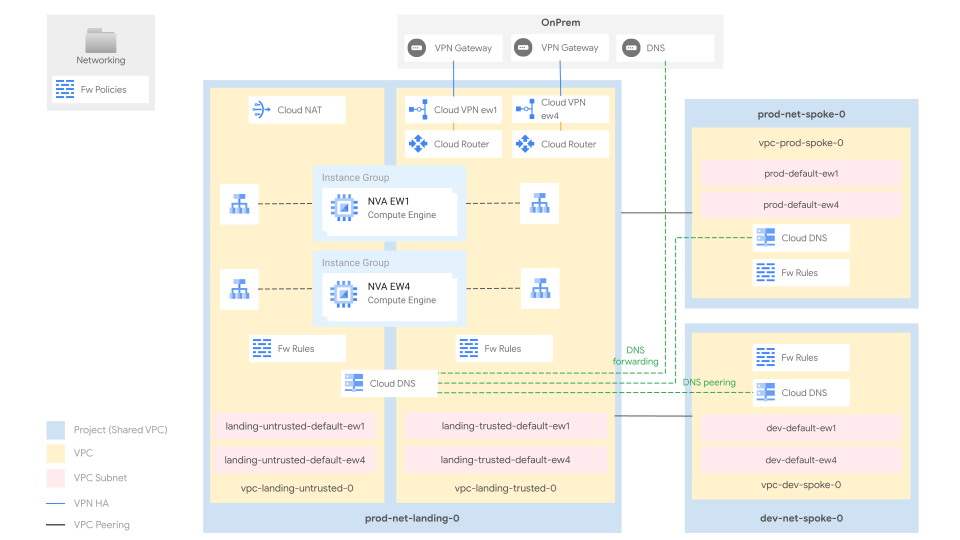
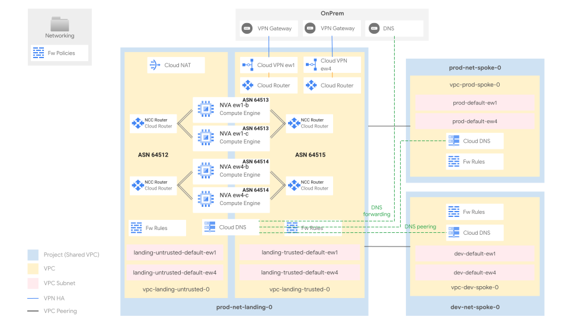

# Networking with Network Virtual Appliance

This stage sets up the shared network infrastructure for the whole organization.

It is designed for those who would like to leverage Network Virtual Appliances (NVAs) to control traffic flowing across different security contexts, for example for Intrusion Prevention System (IPS) purposes.

It adopts the common “hub and spoke” reference design, which is well suited for multiple scenarios, and it offers several advantages versus other designs:

- the "landing" or "trusted" hub VPC centralizes the external connectivity towards trusted network resources (e.g. on-prem, other cloud environments and the spokes), and it is ready to host cross-environment services like CI/CD, code repositories, and monitoring probes
- the "dmz" or "untrusted" VPC centralizes the external connectivity towards untrusted network resources, such as Internet (inbound and outbound) or 3P service providers or parties connected through VPN or Interconnect.
- the "spoke" VPCs allow partitioning workloads (e.g. by environment like in this setup), while still retaining controlled access to central connectivity and services
- Shared VPCs -both in hub and spokes- split the management of the network resources into specific (host) projects, while still allowing them to be consumed from the workload (service) projects
- the design facilitates DNS centralization

Connectivity between the hub and the spokes is established via [VPC network peerings](https://cloud.google.com/vpc/docs/vpc-peering), which offer uncapped bandwidth, lower latencies, at no additional costs and with a very low management overhead. Different ways of implementing connectivity, and related some pros and cons, are discussed below.

The diagram shows the high-level designs of the two proposed flavors ("Simple NVA" and "NCC-RA") and it should be used as a reference throughout the following sections.

The final number of subnets, and their IP addressing will depend on the user-specific requirements. It can be easily changed via variables or external data files, without any need to edit the code.

<p align="center">
  
  </br>Simple NVA diagram
</p>
<hr/>
<p align="center">
  
  </br>NCC-RA diagram
</p>

## Table of contents

<!-- BEGIN TOC -->
- [Table of contents](#table-of-contents)
- [Design overview and choices](#design-overview-and-choices)
  - [Multi-regional deployment](#multi-regional-deployment)
  - [VPC design](#vpc-design)
    - [Simple NVA](#simple-nva)
    - [NCC-RA](#ncc-ra)
  - [External connectivity](#external-connectivity)
  - [Internal connectivity](#internal-connectivity)
  - [IP ranges, subnetting, routing](#ip-ranges-subnetting-routing)
    - [Simple NVA](#simple-nva)
    - [NCC-RA](#ncc-ra)
  - [Internet egress](#internet-egress)
  - [VPC and Hierarchical Firewall](#vpc-and-hierarchical-firewall)
  - [DNS](#dns)
- [Stage structure and files layout](#stage-structure-and-files-layout)
  - [VPCs](#vpcs)
  - [VPNs](#vpns)
  - [Routing and BGP](#routing-and-bgp)
    - [Simple NVA](#simple-nva)
    - [NCC-RA](#ncc-ra)
  - [Firewall](#firewall)
  - [DNS architecture](#dns-architecture)
    - [Cloud environment](#cloud-environment)
    - [Cloud to on-prem](#cloud-to-on-prem)
    - [On-prem to cloud](#on-prem-to-cloud)
- [How to run this stage](#how-to-run-this-stage)
  - [Provider and Terraform variables](#provider-and-terraform-variables)
  - [Impersonating the automation service account](#impersonating-the-automation-service-account)
  - [Variable configuration](#variable-configuration)
  - [Using delayed billing association for projects](#using-delayed-billing-association-for-projects)
  - [Running the stage](#running-the-stage)
  - [Post-deployment activities](#post-deployment-activities)
    - [Private Google Access](#private-google-access)
- [Customizations](#customizations)
  - [Changing default regions](#changing-default-regions)
  - [Configuring the VPNs to on prem](#configuring-the-vpns-to-on-prem)
  - [Adding an environment](#adding-an-environment)
- [Files](#files)
- [Variables](#variables)
- [Outputs](#outputs)
<!-- END TOC -->

## Design overview and choices

### Multi-regional deployment

This stage deploys networking resources in two different regions, deployed and configured in order to allow for a manual ("simple" mode) or automated ("ncc-ra") failover in case of failures.
Two different architectural flavors are provided which, while similar, implement a completely different routing strategy:

- **Simple NVA**, where the network appliances are configured behind a "ILB Sandwitch" (two different network passthrough internal load balancers on each of `dmz` and `landing` VPCs), with static routes sending traffic for specific destinations to specific network appliances group through the load balancer.
- **NCC-RA**, where the network appliances establish BGP sessions with a Cloud Router on both `dmz` and `landing` VPCs, which comes with the following benefits, at the cost of additional initial setup complexity:
  - avoid using network tags to route traffic
  - automatically send all traffic through the cross-regional NVAs if the ones in-region fail
  - avoid cross-regional traffic unless absolutely necessary for disaster recovery

Switching between the two different models is controlled by `var.enable_ncc_ra`.

### VPC design

The "landing zone" is divided into two VPC networks:

- the landing VPC: the connectivity hub towards other trusted networks
- the DMZ VPC: the connectivity hub towards any other untrusted network

By default, the design assumes the following:

- on-premise networks (and related resources) are considered trusted. As such, the VPNs connecting with on-premises are terminated in GCP, in the landing VPC
- the public Internet is considered untrusted. As such [Cloud NAT](https://cloud.google.com/nat/docs/overview) is deployed in the dmz landing VPC only
- cross-environment traffic and traffic from any dmz network to any landing network (and vice versa) pass through the NVAs. For demo purposes, the current NVA performs simple routing/natting only
- any traffic from a landing network to an dmz network (e.g. Internet) is natted by the NVAs. Users can configure further exclusions

The landing VPC acts as a hub: it bridges internal resources with the outside world and it hosts the shared services consumed by the spoke VPCs, connected to the hub through VPC network peerings. Spokes are used to partition the environments. By default:

- one spoke VPC hosts the development environment resources
- one spoke VPC hosts the production environment resources

Each virtual network is a [shared VPC](https://cloud.google.com/vpc/docs/shared-vpc): shared VPCs are managed in dedicated *host projects* and shared with other *service projects* that consume the network resources.
Shared VPC lets organization administrators delegate administrative responsibilities, such as creating and managing instances, to Service Project Admins while maintaining centralized control over network resources like subnets, routes, and firewalls.

Users can easily extend the design to host additional environments, or adopt different logical mappings for the spokes (for example, in order to create a new spoke for each company entity). Adding spokes is trivial and it does not increase the design complexity. The steps to add more spokes are provided in the following sections.
In multi-organization scenarios, where production and non-production resources use different Cloud Identity and GCP organizations, the hub/landing VPC is usually part of the production organization. It establishes connections with the production spokes within the same organization, and with non-production spokes in a different organization.

#### Simple NVA

The VPCs are connected with two sets of sample NVA machines, grouped in regional (multi-zone) [Managed Instance Groups (MIGs)](https://cloud.google.com/compute/docs/instance-groups). The appliances are plain Linux machines, performing simple routing/natting, leveraging some standard Linux features, such as *ip route* or *iptables*. The appliances are suited for demo purposes only and they should be replaced with enterprise-grade solutions before moving to production.
The traffic destined to the VMs in each MIG is mediated through regional internal load balancers, both in the landing and in the dmz networks.

#### NCC-RA

The VPCs connect through two sets of sample NVA machines: one per region, each containing two instances. The appliances run [Container-Optimized OS](https://cloud.google.com/container-optimized-os/docs) and a container with [FRRouting](https://frrouting.org/).

We leverage NCC-RA to allow the NVAs to establish BGP sessions with Cloud Routers in the untrusted and in the trusted VPCs. This allows Cloud Routers to advertise routes to the NVAs, and the NVAs to announce routes to the Cloud Router, so it can program them in the VPC.

Specifically, each NVA establishes two BGP sessions (for redundancy) with the the Cloud Router deployed in the VPC and in the subnet where the interface of that VM is attached to.

**Cloud Routers in the DMZ VPC advertise the default route (0.0.0.0/0) to the NVAs**. The NVAs advertise the route to the Cloud Routers in the landing. These dynamic routes are then imported through VPC peerings in the spokes.

**Cloud Routers in the landing adverts to the NVAs** all the subnets of the trusted VPCs. This includes the regional subnets and the cross-regional subnets. The NVAs manipulate the route costs (MED) before advertising them to the Cloud Routers in the DMZ VPC. This is done to guarantee symmetric traffic paths (more [here](https://medium.com/google-cloud/gcp-routing-adventures-vol-2-enterprise-multi-regional-deployments-in-google-cloud-3968e9591d59)).

NVAs establish **extra BGP sessions with both cross-regional NVAs**. In this case, the NVAs advertise the regional trusted routes only. This allows cross-spoke (environment) traffic to remain also symmetric (more [here](https://medium.com/google-cloud/gcp-routing-adventures-vol-2-enterprise-multi-regional-deployments-in-google-cloud-3968e9591d59)). We set these routes to be exchanged at a lower cost than the one set for the other routes.

Following the majority of real-life deployments, **we assume appliances to be stateful and not able to synchronize sessions between multiple NVAs within the same regional cluster**. For this reason, within each regional cluster, NVAs announce the same routes with different MED costs (1 point of difference between the primary and the secondary). This will cause traffic to go deterministically through one applaiance at the time within each region. You can change this default behavior modifying the cost settings in the [NVAs BGP configuration file](./data/bgp-config.tftpl).

### External connectivity

External connectivity to on-prem is implemented leveraging [Cloud HA VPN](https://cloud.google.com/network-connectivity/docs/vpn/concepts/topologies) (two tunnels per region). This is what users normally deploy as a final solution, or to validate routing and to transfer data, while waiting for [interconnects](https://cloud.google.com/network-connectivity/docs/interconnect) to be provisioned.

Connectivity to additional on-prem sites or to other cloud providers should be implemented in a similar fashion, via VPN tunnels or interconnects, in the landing VPC (either landing or dmz, depending by the nature of the peers), sharing the same regional routers.

### Internal connectivity

Internal connectivity (e.g. between the trusted landing VPC and the spokes) is realized with VPC network peerings. As mentioned, there are other ways to implement connectivity. These can be easily retrofitted with minimal code changes, although they introduce additional considerations on service interoperability, quotas and management.

This is an options summary:

- [VPC Peering](https://cloud.google.com/vpc/docs/vpc-peering) (used here to connect the trusted landing VPC with the spokes, also used by [02-networking-a-simple](../2-networking-a-simple/))
  - Pros: no additional costs, full bandwidth with no configurations, no extra latency
  - Cons: no transitivity (e.g. to GKE masters, Cloud SQL, etc.), no selective exchange of routes, several quotas and limits shared between VPCs in a peering group
- [Multi-NIC appliances](https://cloud.google.com/architecture/best-practices-vpc-design#multi-nic) (used here to connect the trusted landing and DMZ)
  - Pros: provides additional security features (e.g. IPS), potentially better integration with on-prem systems by using the same vendor
  - Cons: complex HA/failover setup (for the "Simple NVA" setup), limited by VM bandwidth and scale, additional costs for VMs and licenses, out of band management of a critical cloud component
- [HA VPN](https://cloud.google.com/network-connectivity/docs/vpn/concepts/topologies) (used by [02-networking-a-simple](../2-networking-a-simple/) in VPN mode)
  - Pros: simple compatibility with GCP services that leverage peering internally, better control on routes, avoids peering groups shared quotas and limits
  - Cons: additional costs, marginal increase in latency, requires multiple tunnels for full bandwidth

### IP ranges, subnetting, routing

Minimizing the number of routes (and subnets) in the cloud environment is important, as it simplifies management and it avoids hitting [Cloud Router](https://cloud.google.com/network-connectivity/docs/router/quotas) and [VPC](https://cloud.google.com/vpc/docs/quota) quotas and limits. For this reason, we recommend to carefully plan the IP space used in your cloud environment. This allows the use of larger IP CIDR blocks in routes, whenever possible.

This stage uses a dedicated /11 block (10.64.0.0/11), which should be sized to the own needs. The subnets created in each VPC derive from this range.

The /11 block is evenly split in eight, smaller /16 blocks, assigned to different areas of the GCP network: *landing untrusted europe-west1*, *landing untrusted europe-west4*, *landing trusted europe-west1*, *landing untrusted europe-west4*, *development europe-west1*, *development europe-west4*, *production europe-west1*, *production europe-west4*.

The first /24 range in every area is allocated for a default subnet, which can be removed or modified as needed. The last three /24 ranges can be used for [PSA (Private Service Access)](https://cloud.google.com/vpc/docs/private-services-access)via the `psa_ranges` variable, or for [Internal Application Load Balancers (L7 LBs)](https://cloud.google.com/load-balancing/docs/l7-internal) subnets via the factory.

This is a summary of the subnets allocated by default in this setup:

| name                | description                             | CIDR           |
| ------------------- | --------------------------------------- | -------------- |
| landing-default-ew1 | Trusted landing subnet - europe-west1   | 10.128.64.0/24 |
| landing-default-ew4 | Trusted landing subnet - europe-west4   | 10.128.96.0/24 |
| dmz-default-ew1     | Untrusted landing subnet - europe-west1 | 10.128.0.0/24  |
| dmz-default-ew4     | Untrusted landing subnet - europe-west4 | 10.128.32.0/24 |
| dev-default-ew1     | Dev spoke subnet - europe-west1         | 10.68.0.0/24   |
| dev-default-ew1     | Free (PSA) - europe-west1               | 10.68.253.0/24 |
| dev-default-ew1     | Free (PSA) - europe-west1               | 10.68.254.0/24 |
| dev-default-ew1     | Free (L7 ILB) - europe-west1            | 10.68.255.0/24 |
| dev-default-ew4     | Dev spoke subnet - europe-west4         | 10.84.0.0/24   |
| dev-default-ew4     | Free (PSA) - europe-west4               | 10.84.253.0/24 |
| dev-default-ew4     | Free (PSA) - europe-west4               | 10.84.254.0/24 |
| dev-default-ew4     | Free (L7 ILB) - europe-west4            | 10.84.255.0/24 |
| prod-default-ew1    | Prod spoke subnet - europe-west1        | 10.72.0.0/24   |
| prod-default-ew1    | Free (PSA) - europe-west1               | 10.72.253.0/24 |
| prod-default-ew1    | Free (PSA) - europe-west1               | 10.72.254.0/24 |
| prod-default-ew1    | Free (L7 ILB) - europe-west1            | 10.72.255.0/24 |
| prod-default-ew4    | Prod spoke subnet - europe-west4        | 10.88.0.0/24   |
| prod-default-ew4    | Free (PSA) - europe-west4               | 10.88.253.0/24 |
| prod-default-ew4    | Free (PSA) - europe-west4               | 10.88.254.0/24 |
| prod-default-ew4    | Free (L7 ILB) - europe-west4            | 10.88.255.0/24 |

These subnets can be advertised to on-premises as an aggregate /11 range (10.64.0.0/11). Refer to the `var.vpn_onprem_primary_config.router_config` and `var.vpn_onprem_secondary_config.router_config` variables to configure it.

Routes in GCP are either automatically created (for example, when a subnet is added to a VPC), manually created via static routes, dynamically exchanged through VPC peerings, or dynamically programmed by [Cloud Routers](https://cloud.google.com/network-connectivity/docs/router#docs) when a BGP session is established. BGP sessions can be configured to advertise VPC ranges, and/or custom ranges via custom advertisements.

The Cloud Routers (connected to the VPN gateways in the landing VPC) are configured to exclude the default advertisement of VPC ranges and they only advertise their respective aggregate ranges, via custom advertisements. This greatly simplifies the routing configuration and avoids quota or limit issues, by keeping the number of routes small, instead of making it proportional to the subnets and to the secondary ranges in the VPCs.

#### Simple NVA

- routes between multiple subnets within the same VPC are automatically exchanged by GCP
- the spokes and the trusted landing VPC exchange routes through VPC peerings
- on-premises is connected to the landing VPC and it dynamically exchanges BGP routes with GCP (with the landing VPC) using HA VPN
- for cross-environment (spokes) communications, and for connections to on-premises and to the Internet, the spokes leverage some default tagged routes that send the traffic of each region (whose machines are identified by a dedicated network tag, e.g. *ew1*) to a corresponding regional NVA in the landing VPC, through an ILB (whose VIP is set as the route next-hop)
- the spokes are configured with backup default routes, so if the NVAs in the same region become unavailable, more routes to the NVAs in the other region are already available. Current routes are not able to understand if the next-hop ILBs become unhealthy. As such, in case of a regional failure, users will need to manually withdraw the primary default routes, so the secondaries will take over
- the NVAs are configured with static routes that allow the communication with on-premises and between the GCP resources (including the cross-environment communication)

#### NCC-RA

- routes between multiple subnets within the same VPC are automatically exchanged by GCP
- the spokes and the trusted landing VPC exchange dynamic routes through VPC peerings
- on-premises is connected to the trusted landing VPC and it dynamically exchanges BGP routes with GCP (with the landing) using HA VPN
- the NVAs exchange dynamic routes using BGP with Cloud Routers in the DMZ, Cloud Routers in the landing and cross-regional NVAs. This allows VMs in different environments and different regions to communicate.

### Internet egress

In this setup, Internet egress is realized through [Cloud NAT](https://cloud.google.com/nat/docs/overview), deployed in the dmz landing VPC. This allows instances in all other VPCs to reach the Internet, passing through the NVAs (being the public Internet considered dmz). Cloud NAT is disabled by default; enable it by setting the `enable_cloud_nat` variable

Several other scenarios are possible, with various degrees of complexity:

- deploy Cloud NAT in every VPC
- add forwarding proxies, with optional URL filters
- send Internet traffic to on-premises, so the existing egress infrastructure can be leveraged

Future pluggable modules will allow users to easily experiment with the above scenarios.

### VPC and Hierarchical Firewall

The GCP Firewall is a stateful, distributed feature that allows the creation of L4 policies, either via VPC-level rules or -more recently- via hierarchical policies, applied on the resource hierarchy (organization, folders).

The current setup adopts both firewall types. Hierarchical firewall rules are applied in the networking folder for common ingress rules (egress is open by default): for example, it allows the health checks and the IAP forwarders traffic to reach the VMs.

Rules and policies are defined in simple YAML files, described below.

### DNS

DNS goes hand in hand with networking, especially on GCP where Cloud DNS zones and policies are associated at the VPC level. This setup implements both DNS flows:

- on-prem to cloud via private zones for cloud-managed domains, and an [inbound policy](https://cloud.google.com/dns/docs/server-policies-overview#dns-server-policy-in) used as forwarding target or via delegation (requires some extra configuration) from on-prem DNS resolvers
- cloud to on-prem via forwarding zones for the on-prem managed domains

DNS configuration is further centralized by leveraging peering zones, so that

- the hub/landing Cloud DNS hosts configurations for on-prem forwarding, Google API domains, and the top-level private zone/s (e.g. gcp.example.com)
- the spokes Cloud DNS host configurations for the environment-specific domains (e.g. prod.gcp.example.com), which are bound to the hub/landing leveraging [cross-project binding](https://cloud.google.com/dns/docs/zones/zones-overview#cross-project_binding); a peering zone for the `.` (root) zone is then created on each spoke, delegating all DNS resolution to hub/landing.
- Private Google Access is enabled via [DNS Response Policies](https://cloud.google.com/dns/docs/zones/manage-response-policies#create-response-policy-rule) for most of the [supported domains](https://cloud.google.com/vpc/docs/configure-private-google-access#domain-options)

To complete the configuration, the 35.199.192.0/19 range should be routed to the VPN tunnels from on-premises, and the following names should be configured for DNS forwarding to cloud:

- `private.googleapis.com`
- `restricted.googleapis.com`
- `gcp.example.com` (used as a placeholder)

In GCP, a forwarding zone in the landing project is configured to forward queries to the placeholder domain `onprem.example.com` to on-premises.

This configuration is battle-tested, and flexible enough to lend itself to simple modifications without subverting its design.

## Stage structure and files layout

### VPCs

VPCs are defined in separate files, one for `landing` (landing and dmz), one for `prod` and one for `dev`.

These files contain different resources:

- **project** ([`projects`](../../../modules/project)): the "[host projects](https://cloud.google.com/vpc/docs/shared-vpc)" containing the VPCs and enabling the required APIs.
- **VPCs** ([`net-vpc`](../../../modules/net-vpc)): manages the subnets, the explicit routes for `{private,restricted}.googleapis.com` and the DNS inbound policy for the landing (trusted) VPC. Non-infrastructural subnets are created leveraging resource factories. Sample subnets are shipped in [data/subnets](./data/subnets) and can be easily customized to fit users' needs. [PSA](https://cloud.google.com/vpc/docs/configure-private-services-access#allocating-range) are configured by the variable `psa_ranges` if managed services are needed.
- **Cloud NAT** ([`net-cloudnat`](../../../modules/net-cloudnat)) (in the dmz landing VPC only): it manages the networking infrastructure required to enable the Internet egress.

### VPNs

The connectivity between on-premises and GCP (in the landing VPC) is implemented with Cloud HA VPN ([`net-vpn`](../../../modules/net-vpn-ha)) and defined in [`vpn-onprem.tf`](./vpn-onprem.tf). The file implements a single logical connection between on-premises and the landing VPC, both in `europe-west1` and `europe-west4`. The relevant parameters for its configuration are found in the variables `vpn_onprem_primary_config` and `vpn_onprem_secondary_config`.

### Routing and BGP

Each VPC network ([`net-vpc`](../../../modules/net-vpc)) manages a separate routing table, which can define static routes (e.g. to private.googleapis.com) and receives dynamic routes through VPC peering and BGP sessions established with the neighbor networks (e.g. the landing VPC receives routes from on-premises, and the spokes receive RFC1918 from the landing VPC).
BGP sessions for landing to on-premises are configured through the variable `vpn_onprem_configs`.

#### Simple NVA

Static routes are defined in `vpc-*.tf` files in the `routes` section of each `net-vpc` module.

#### NCC-RA

NCC/Cloud Router BGP settings are defined in `ncc.tf`.
NVA BGP settings are defined in the [bpg-config.tftpl template file](./data/bgp-config.tftpl).
The local `ncc_asn` allows to change the Autonomous System Number (ASN) assigned to the DMZ Cloud Routers, to the landing VPC Cloud Routers and to the NVAs.

### Firewall

**VPC firewall rules** ([`net-vpc-firewall`](../../../modules/net-vpc-firewall)) are defined per-vpc on each `vpc-*.tf` file and leverage a resource factory to massively create rules.
To add a new firewall rule, create a new file or edit an existing one in the `data_folder` directory defined in the module `net-vpc-firewall`, following the examples of the "[Rules factory](../../../modules/net-vpc-firewall#rules-factory)" section of the module documentation. Sample firewall rules are shipped in [data/firewall-rules/dmz](./data/firewall-rules/dmz) and in [data/firewall-rules/landing](./data/firewall-rules/landing), and can be easily customized.

**Hierarchical firewall policies** ([`folder`](../../../modules/folder)) are defined in `main.tf` and managed through a policy factory implemented by the `net-firewall-policy` module, which is then applied to the `Networking` folder containing all the core networking infrastructure. Policies are defined in the `rules_file` file, to define a new one simply use the [firewall policy module documentation](../../../modules/net-firewall-policy/README.md#factory)". Sample hierarchical firewall rules are shipped in [data/hierarchical-ingress-rules.yaml](./data/hierarchical-ingress-rules.yaml) and can be easily customised.

### DNS architecture

The DNS ([`dns`](../../../modules/dns)) infrastructure is defined in [`dns-*.tf`] files.

Cloud DNS manages onprem forwarding, the main GCP zone (in this example `gcp.example.com`) and environment-specific zones (i.e. `dev.gcp.example.com` and `prod.gcp.example.com`).

#### Cloud environment

The root DNS zone defined in the landing project acts as the source of truth for DNS within the Cloud environment. The resources defined in the spoke VPCs consume the landing DNS infrastructure through DNS peering (e.g. `prod-landing-root-dns-peering`).
The spokes can optionally define private zones (e.g. `prod-dns-private-zone`). Granting visibility both to the landing and dmz VPCs ensures that the whole cloud environment can query such zones.

#### Cloud to on-prem

Leveraging the forwarding zone defined in the landing project (e.g. `onprem-example-dns-forwarding` and `reverse-10-dns-forwarding`), the cloud environment can resolve `in-addr.arpa.` and `onprem.example.com.` using the on-premise DNS infrastructure. On-premise resolver IPs are set in the variable `dns.onprem`.

DNS queries sent to the on-premise infrastructure come from the `35.199.192.0/19` source range.

#### On-prem to cloud

The [Inbound DNS Policy](https://cloud.google.com/dns/docs/server-policies-overview#dns-server-policy-in) defined in the *landing VPC module* ([`net-landing.tf`](./net-landing.tf)) automatically reserves the first available IP address on each subnet (typically the third one in a CIDR) to expose the Cloud DNS service, so that it can be consumed from outside of GCP.

## How to run this stage

This stage is meant to be executed after the [resource management](../1-resman) stage has run, as it leverages the automation service account and bucket created there, and additional resources configured in the [bootstrap](../0-bootstrap) stage.

It's of course possible to run this stage in isolation, but that's outside the scope of this document, and you would need to refer to the code for the previous stages for the environmental requirements.

Before running this stage, you need to make sure you have the correct credentials and permissions, and localize variables by assigning values that match your configuration.

Note that by default the "Simple NVA" architecture is deployed - in order to enable the "NCC-RA" features, variable `enable_ncc_ra` should be set to `true`.

### Provider and Terraform variables

As all other FAST stages, the [mechanism used to pass variable values and pre-built provider files from one stage to the next](../0-bootstrap/README.md#output-files-and-cross-stage-variables) is also leveraged here.

The commands to link or copy the provider and terraform variable files can be easily derived from the `stage-links.sh` script in the FAST root folder, passing it a single argument with the local output files folder (if configured) or the GCS output bucket in the automation project (derived from stage 0 outputs). The following examples demonstrate both cases, and the resulting commands that then need to be copy/pasted and run.

```bash
../../stage-links.sh ~/fast-config

# copy and paste the following commands for '2-networking-*'

ln -s ~/fast-config/providers/2-networking-providers.tf ./
ln -s ~/fast-config/tfvars/0-globals.auto.tfvars.json ./
ln -s ~/fast-config/tfvars/0-bootstrap.auto.tfvars.json ./
ln -s ~/fast-config/tfvars/1-resman.auto.tfvars.json ./
```

```bash
../../stage-links.sh gs://xxx-prod-iac-core-outputs-0

# copy and paste the following commands for '2-networking-*'

gcloud storage cp gs://xxx-prod-iac-core-outputs-0/providers/2-networking-providers.tf ./
gcloud storage cp gs://xxx-prod-iac-core-outputs-0/tfvars/0-globals.auto.tfvars.json ./
gcloud storage cp gs://xxx-prod-iac-core-outputs-0/tfvars/0-bootstrap.auto.tfvars.json ./
gcloud storage cp gs://xxx-prod-iac-core-outputs-0/tfvars/1-resman.auto.tfvars.json ./
```

### Impersonating the automation service account

The preconfigured provider file uses impersonation to run with this stage's automation service account's credentials. The `gcp-devops` and `organization-admins` groups have the necessary IAM bindings in place to do that, so make sure the current user is a member of one of those groups.

### Variable configuration

Variables in this stage -- like most other FAST stages -- are broadly divided into three separate sets:

- variables which refer to global values for the whole organization (org id, billing account id, prefix, etc.), which are pre-populated via the `0-globals.auto.tfvars.json` file linked or copied above
- variables which refer to resources managed by previous stage, which are prepopulated here via the `0-bootstrap.auto.tfvars.json` and `1-resman.auto.tfvars.json` files linked or copied above
- and finally variables that optionally control this stage's behaviour and customizations, and can to be set in a custom `terraform.tfvars` file

The latter set is explained in the [Customization](#customizations) sections below, and the full list can be found in the [Variables](#variables) table at the bottom of this document.

Note that the `outputs_location` variable is disabled by default, you need to explicitly set it in your `terraform.tfvars` file if you want output files to be generated by this stage. This is a sample `terraform.tfvars` that configures it, refer to the [bootstrap stage documentation](../0-bootstrap/README.md#output-files-and-cross-stage-variables) for more details:

```tfvars
outputs_location = "~/fast-config"
```

### Using delayed billing association for projects

This configuration is possible but unsupported and only exists for development purposes, use at your own risk:

- temporarily switch `billing_account.id` to `null` in `0-globals.auto.tfvars.json`
- for each project resources in the project modules used in this stage (`dev-spoke-project`, `landing-project`, `prod-spoke-project`)
  - apply using `-target`, for example
    `terraform apply -target 'module.landing-project.google_project.project[0]'`
  - untaint the project resource after applying, for example
    `terraform untaint 'module.landing-project.google_project.project[0]'`
- go through the process to associate the billing account with the three projects
- switch `billing_account.id` back to the real billing account id
- resume applying normally

### Running the stage

Once provider and variable values are in place and the correct user is configured, the stage can be run:

```bash
terraform init
terraform apply
```

### Post-deployment activities

- On-prem routers should be configured to advertise all relevant CIDRs to the GCP environments. To avoid hitting GCP quotas, we recommend aggregating routes as much as possible.
- On-prem routers should accept BGP sessions from their cloud peers.
- On-prem DNS servers should have forward zones for GCP-managed ones.

#### Private Google Access

[Private Google Access](https://cloud.google.com/vpc/docs/private-google-access) (or PGA) enables VMs and on-prem systems to consume Google APIs from within the Google network, and is already fully configured on this environment:

- DNS response policies in the landing project implement rules for all supported domains reachable via PGA
- routes for the private and restricted ranges are defined in all VPCs except dmz

To enable PGA access from on premises advertise the private/restricted ranges via the `vpn_onprem_primary_config` and `vpn_onprem_secondary_config` variables, using router or tunnel custom advertisements.

## Customizations

### Changing default regions

Regions are defined via the `regions` variable which sets up a mapping between the `regions.primary` and `regions.secondary` logical names and actual GCP region names. If you need to change regions from the defaults:

- change the values of the mappings in the `regions` variable to the regions you are going to use
- change the regions in the factory subnet files in the `data` folder

### Configuring the VPNs to on prem

This stage includes basic support for an HA VPN connecting the landing zone in the primary region to on prem. Configuration is via the `vpn_onprem_primary_config` and `vpn_onprem_secondary_config` variables, that closely mirrors the variables defined in the [`net-vpn-ha`](../../../modules/net-vpn-ha/).

Support for the onprem VPNs is disabled by default so that no resources are created, this is an example of how to configure one variable to enable the VPN in the primary region:

```tfvars
vpn_onprem_primary_config = {
  peer_external_gateways = {
    default = {
      redundancy_type = "SINGLE_IP_INTERNALLY_REDUNDANT"
      interfaces      = ["8.8.8.8"]
    }
  }
  router_config = {
    asn = 65501
    custom_advertise = {
      all_subnets = false
      ip_ranges   = {
        "10.1.0.0/16"     = "gcp"
        "35.199.192.0/19" = "gcp-dns"
        "199.36.153.4/30" = "gcp-restricted"
      }
    }
  }
  tunnels = {
    "0" = {
      bgp_peer = {
        address = "169.254.1.1"
        asn     = 65500
      }
      bgp_session_range               = "169.254.1.2/30"
      peer_external_gateway_interface = 0
      shared_secret                   = "foo"
      vpn_gateway_interface           = 0
    }
    "1" = {
      bgp_peer = {
        address = "169.254.2.1"
        asn     = 64513
      }
      bgp_session_range               = "169.254.2.2/30"
      peer_external_gateway_interface = 1
      shared_secret                   = "foo"
      vpn_gateway_interface           = 1
    }
  }
}
```

### Adding an environment

To create a new environment (e.g. `staging`), a few changes are required:

Create a `net-staging.tf` file by copying `net-prod.tf` file.
Adapt the new file by replacing the value "prod" with the value "staging".
Running `diff net-dev.tf net-prod.tf` can help to see how environment files differ.

The new VPC requires a set of dedicated CIDRs, one per region, added to variable `gcp_ranges` (for example as `spoke_staging_ew1` and `spoke_staging_ew4`).
>`gcp_ranges` is a map that "resolves" CIDR names to the actual addresses, and will be used later to configure routing.
>
Variables managing L7 Internal Load Balancers (`l7ilb_subnets`) and Private Service Access (`psa_ranges`) should also be adapted, and subnets and firewall rules for the new spoke should be added, as described above.

If NCC-RA is enabled, you can configure the NVAs deployed updating the sample BGP [config file](./data/bgp-config.tftpl).

DNS configurations are centralised in the `dns-*.tf` files. Spokes delegate DNS resolution to Landing through DNS peering, and optionally define a private zone (e.g. `dev.gcp.example.com`) which the landing peers to. To configure DNS for a new environment, copy one of the other environments DNS files [e.g. (dns-dev.tf)](dns-dev.tf) into a new `dns-*.tf` file suffixed with the environment name (e.g. `dns-staging.tf`), and update its content accordingly. Don't forget to add a peering zone from the landing to the newly created environment private zone.

<!-- TFDOC OPTS files:1 show_extra:1 -->
<!-- BEGIN TFDOC -->
## Files

| name | description | modules | resources |
|---|---|---|---|
| [dns-dev.tf](./dns-dev.tf) | Development spoke DNS zones and peerings setup. | <code>dns</code> |  |
| [dns-landing.tf](./dns-landing.tf) | Landing DNS zones and peerings setup. | <code>dns</code> · <code>dns-response-policy</code> |  |
| [dns-prod.tf](./dns-prod.tf) | Production spoke DNS zones and peerings setup. | <code>dns</code> |  |
| [main.tf](./main.tf) | Networking folder and hierarchical policy. | <code>folder</code> · <code>net-firewall-policy</code> |  |
| [monitoring-vpn-onprem.tf](./monitoring-vpn-onprem.tf) | VPN monitoring alerts. |  | <code>google_monitoring_alert_policy</code> |
| [monitoring.tf](./monitoring.tf) | Network monitoring dashboards. |  | <code>google_monitoring_dashboard</code> |
| [net-dev.tf](./net-dev.tf) | Dev spoke VPC and related resources. | <code>net-vpc</code> · <code>net-vpc-firewall</code> · <code>net-vpc-peering</code> · <code>project</code> |  |
| [net-landing.tf](./net-landing.tf) | Landing VPC and related resources. | <code>net-cloudnat</code> · <code>net-vpc</code> · <code>net-vpc-firewall</code> · <code>project</code> |  |
| [net-prod.tf](./net-prod.tf) | Production spoke VPC and related resources. | <code>net-vpc</code> · <code>net-vpc-firewall</code> · <code>net-vpc-peering</code> · <code>project</code> |  |
| [nva-bgp-ncc.tf](./nva-bgp-ncc.tf) | None |  | <code>google_network_connectivity_hub</code> |
| [nva-bgp.tf](./nva-bgp.tf) | None |  | <code>google_compute_address</code> |
| [nva-simple.tf](./nva-simple.tf) | None | <code>simple-nva</code> |  |
| [outputs.tf](./outputs.tf) | Module outputs. |  | <code>google_storage_bucket_object</code> · <code>local_file</code> |
| [regions.tf](./regions.tf) | Compute short names for regions. |  |  |
| [test-resources.tf](./test-resources.tf) | Temporary instances for testing |  |  |
| [variables-fast.tf](./variables-fast.tf) | None |  |  |
| [variables.tf](./variables.tf) | Module variables. |  |  |
| [vpn-onprem.tf](./vpn-onprem.tf) | VPN between landing and onprem. | <code>net-vpn-ha</code> |  |

## Variables

| name | description | type | required | default | producer |
|---|---|:---:|:---:|:---:|:---:|
| [automation](variables-fast.tf#L17) | Automation resources created by the bootstrap stage. | <code title="object&#40;&#123;&#10;  outputs_bucket &#61; string&#10;&#125;&#41;">object&#40;&#123;&#8230;&#125;&#41;</code> | ✓ |  | <code>0-bootstrap</code> |
| [billing_account](variables-fast.tf#L25) | Billing account id. If billing account is not part of the same org set `is_org_level` to false. | <code title="object&#40;&#123;&#10;  id           &#61; string&#10;  is_org_level &#61; optional&#40;bool, true&#41;&#10;&#125;&#41;">object&#40;&#123;&#8230;&#125;&#41;</code> | ✓ |  | <code>0-bootstrap</code> |
| [folder_ids](variables-fast.tf#L48) | Folders to be used for the networking resources in folders/nnnnnnnnnnn format. If null, folder will be created. | <code title="object&#40;&#123;&#10;  networking      &#61; string&#10;  networking-dev  &#61; string&#10;  networking-prod &#61; string&#10;&#125;&#41;">object&#40;&#123;&#8230;&#125;&#41;</code> | ✓ |  | <code>1-resman</code> |
| [organization](variables-fast.tf#L58) | Organization details. | <code title="object&#40;&#123;&#10;  domain      &#61; string&#10;  id          &#61; number&#10;  customer_id &#61; string&#10;&#125;&#41;">object&#40;&#123;&#8230;&#125;&#41;</code> | ✓ |  | <code>0-bootstrap</code> |
| [prefix](variables-fast.tf#L68) | Prefix used for resources that need unique names. Use a maximum of 9 chars for organizations, and 11 chars for tenants. | <code>string</code> | ✓ |  | <code>0-bootstrap</code> |
| [alert_config](variables.tf#L17) | Configuration for monitoring alerts. | <code title="object&#40;&#123;&#10;  vpn_tunnel_established &#61; optional&#40;object&#40;&#123;&#10;    auto_close            &#61; optional&#40;string, null&#41;&#10;    duration              &#61; optional&#40;string, &#34;120s&#34;&#41;&#10;    enabled               &#61; optional&#40;bool, true&#41;&#10;    notification_channels &#61; optional&#40;list&#40;string&#41;, &#91;&#93;&#41;&#10;    user_labels           &#61; optional&#40;map&#40;string&#41;, &#123;&#125;&#41;&#10;  &#125;&#41;&#41;&#10;  vpn_tunnel_bandwidth &#61; optional&#40;object&#40;&#123;&#10;    auto_close            &#61; optional&#40;string, null&#41;&#10;    duration              &#61; optional&#40;string, &#34;120s&#34;&#41;&#10;    enabled               &#61; optional&#40;bool, true&#41;&#10;    notification_channels &#61; optional&#40;list&#40;string&#41;, &#91;&#93;&#41;&#10;    threshold_mbys        &#61; optional&#40;string, &#34;187.5&#34;&#41;&#10;    user_labels           &#61; optional&#40;map&#40;string&#41;, &#123;&#125;&#41;&#10;  &#125;&#41;&#41;&#10;&#125;&#41;">object&#40;&#123;&#8230;&#125;&#41;</code> |  | <code title="&#123;&#10;  vpn_tunnel_established &#61; &#123;&#125;&#10;  vpn_tunnel_bandwidth   &#61; &#123;&#125;&#10;&#125;">&#123;&#8230;&#125;</code> |  |
| [create_test_instances](variables.tf#L42) | Enables the creation of test VMs in each VPC, useful to test and troubleshoot connectivity. | <code>bool</code> |  | <code>false</code> |  |
| [dns](variables.tf#L48) | DNS configuration. | <code title="object&#40;&#123;&#10;  enable_logging &#61; optional&#40;bool, true&#41;&#10;  resolvers      &#61; optional&#40;list&#40;string&#41;, &#91;&#93;&#41;&#10;&#125;&#41;">object&#40;&#123;&#8230;&#125;&#41;</code> |  | <code>&#123;&#125;</code> |  |
| [enable_cloud_nat](variables.tf#L58) | Deploy Cloud NAT. | <code>bool</code> |  | <code>false</code> |  |
| [enable_ncc_ra](variables.tf#L65) | Deploy NCC Router Appliance to create a BGP session between core VPCs and the appliances. | <code>bool</code> |  | <code>false</code> |  |
| [essential_contacts](variables.tf#L72) | Email used for essential contacts, unset if null. | <code>string</code> |  | <code>null</code> |  |
| [factories_config](variables.tf#L78) | Configuration for network resource factories. | <code title="object&#40;&#123;&#10;  data_dir              &#61; optional&#40;string, &#34;data&#34;&#41;&#10;  dns_policy_rules_file &#61; optional&#40;string, &#34;data&#47;dns-policy-rules.yaml&#34;&#41;&#10;  firewall_policy_name  &#61; optional&#40;string, &#34;net-default&#34;&#41;&#10;&#125;&#41;">object&#40;&#123;&#8230;&#125;&#41;</code> |  | <code title="&#123;&#10;  data_dir &#61; &#34;data&#34;&#10;&#125;">&#123;&#8230;&#125;</code> |  |
| [fast_features](variables-fast.tf#L38) | Selective control for top-level FAST features. | <code title="object&#40;&#123;&#10;  gcve &#61; optional&#40;bool, false&#41;&#10;&#125;&#41;">object&#40;&#123;&#8230;&#125;&#41;</code> |  | <code>&#123;&#125;</code> | <code>0-0-bootstrap</code> |
| [gcp_ranges](variables.tf#L99) | GCP address ranges in name => range format. | <code>map&#40;string&#41;</code> |  | <code title="&#123;&#10;  gcp_dev_primary       &#61; &#34;10.68.0.0&#47;16&#34;&#10;  gcp_dev_secondary     &#61; &#34;10.84.0.0&#47;16&#34;&#10;  gcp_landing_primary   &#61; &#34;10.64.0.0&#47;17&#34;&#10;  gcp_landing_secondary &#61; &#34;10.80.0.0&#47;17&#34;&#10;  gcp_dmz_primary       &#61; &#34;10.64.128.0&#47;17&#34;&#10;  gcp_dmz_secondary     &#61; &#34;10.80.128.0&#47;17&#34;&#10;  gcp_prod_primary      &#61; &#34;10.72.0.0&#47;16&#34;&#10;  gcp_prod_secondary    &#61; &#34;10.88.0.0&#47;16&#34;&#10;&#125;">&#123;&#8230;&#125;</code> |  |
| [outputs_location](variables.tf#L114) | Path where providers and tfvars files for the following stages are written. Leave empty to disable. | <code>string</code> |  | <code>null</code> |  |
| [psa_ranges](variables.tf#L120) | IP ranges used for Private Service Access (e.g. CloudSQL). Ranges is in name => range format. | <code title="object&#40;&#123;&#10;  dev &#61; optional&#40;list&#40;object&#40;&#123;&#10;    ranges         &#61; map&#40;string&#41;&#10;    export_routes  &#61; optional&#40;bool, false&#41;&#10;    import_routes  &#61; optional&#40;bool, false&#41;&#10;    peered_domains &#61; optional&#40;list&#40;string&#41;, &#91;&#93;&#41;&#10;  &#125;&#41;&#41;, &#91;&#93;&#41;&#10;  prod &#61; optional&#40;list&#40;object&#40;&#123;&#10;    ranges         &#61; map&#40;string&#41;&#10;    export_routes  &#61; optional&#40;bool, false&#41;&#10;    import_routes  &#61; optional&#40;bool, false&#41;&#10;    peered_domains &#61; optional&#40;list&#40;string&#41;, &#91;&#93;&#41;&#10;  &#125;&#41;&#41;, &#91;&#93;&#41;&#10;&#125;&#41;">object&#40;&#123;&#8230;&#125;&#41;</code> |  | <code>&#123;&#125;</code> |  |
| [regions](variables.tf#L140) | Region definitions. | <code title="object&#40;&#123;&#10;  primary   &#61; string&#10;  secondary &#61; string&#10;&#125;&#41;">object&#40;&#123;&#8230;&#125;&#41;</code> |  | <code title="&#123;&#10;  primary   &#61; &#34;europe-west1&#34;&#10;  secondary &#61; &#34;europe-west4&#34;&#10;&#125;">&#123;&#8230;&#125;</code> |  |
| [service_accounts](variables-fast.tf#L78) | Automation service accounts in name => email format. | <code title="object&#40;&#123;&#10;  data-platform-dev    &#61; string&#10;  data-platform-prod   &#61; string&#10;  gke-dev              &#61; string&#10;  gke-prod             &#61; string&#10;  project-factory      &#61; string&#10;  project-factory-dev  &#61; string&#10;  project-factory-prod &#61; string&#10;&#125;&#41;">object&#40;&#123;&#8230;&#125;&#41;</code> |  | <code>null</code> | <code>1-resman</code> |
| [vpn_onprem_primary_config](variables.tf#L152) | VPN gateway configuration for onprem interconnection in the primary region. | <code title="object&#40;&#123;&#10;  peer_external_gateways &#61; map&#40;object&#40;&#123;&#10;    redundancy_type &#61; string&#10;    interfaces      &#61; list&#40;string&#41;&#10;  &#125;&#41;&#41;&#10;  router_config &#61; object&#40;&#123;&#10;    create    &#61; optional&#40;bool, true&#41;&#10;    asn       &#61; number&#10;    name      &#61; optional&#40;string&#41;&#10;    keepalive &#61; optional&#40;number&#41;&#10;    custom_advertise &#61; optional&#40;object&#40;&#123;&#10;      all_subnets &#61; bool&#10;      ip_ranges   &#61; map&#40;string&#41;&#10;    &#125;&#41;&#41;&#10;  &#125;&#41;&#10;  tunnels &#61; map&#40;object&#40;&#123;&#10;    bgp_peer &#61; object&#40;&#123;&#10;      address        &#61; string&#10;      asn            &#61; number&#10;      route_priority &#61; optional&#40;number, 1000&#41;&#10;      custom_advertise &#61; optional&#40;object&#40;&#123;&#10;        all_subnets          &#61; bool&#10;        all_vpc_subnets      &#61; bool&#10;        all_peer_vpc_subnets &#61; bool&#10;        ip_ranges            &#61; map&#40;string&#41;&#10;      &#125;&#41;&#41;&#10;    &#125;&#41;&#10;    bgp_session_range               &#61; string&#10;    ike_version                     &#61; optional&#40;number, 2&#41;&#10;    peer_external_gateway_interface &#61; optional&#40;number&#41;&#10;    peer_gateway                    &#61; optional&#40;string, &#34;default&#34;&#41;&#10;    router                          &#61; optional&#40;string&#41;&#10;    shared_secret                   &#61; optional&#40;string&#41;&#10;    vpn_gateway_interface           &#61; number&#10;  &#125;&#41;&#41;&#10;&#125;&#41;">object&#40;&#123;&#8230;&#125;&#41;</code> |  | <code>null</code> |  |
| [vpn_onprem_secondary_config](variables.tf#L195) | VPN gateway configuration for onprem interconnection in the secondary region. | <code title="object&#40;&#123;&#10;  peer_external_gateways &#61; map&#40;object&#40;&#123;&#10;    redundancy_type &#61; string&#10;    interfaces      &#61; list&#40;string&#41;&#10;  &#125;&#41;&#41;&#10;  router_config &#61; object&#40;&#123;&#10;    create    &#61; optional&#40;bool, true&#41;&#10;    asn       &#61; number&#10;    name      &#61; optional&#40;string&#41;&#10;    keepalive &#61; optional&#40;number&#41;&#10;    custom_advertise &#61; optional&#40;object&#40;&#123;&#10;      all_subnets &#61; bool&#10;      ip_ranges   &#61; map&#40;string&#41;&#10;    &#125;&#41;&#41;&#10;  &#125;&#41;&#10;  tunnels &#61; map&#40;object&#40;&#123;&#10;    bgp_peer &#61; object&#40;&#123;&#10;      address        &#61; string&#10;      asn            &#61; number&#10;      route_priority &#61; optional&#40;number, 1000&#41;&#10;      custom_advertise &#61; optional&#40;object&#40;&#123;&#10;        all_subnets          &#61; bool&#10;        all_vpc_subnets      &#61; bool&#10;        all_peer_vpc_subnets &#61; bool&#10;        ip_ranges            &#61; map&#40;string&#41;&#10;      &#125;&#41;&#41;&#10;    &#125;&#41;&#10;    bgp_session_range               &#61; string&#10;    ike_version                     &#61; optional&#40;number, 2&#41;&#10;    peer_external_gateway_interface &#61; optional&#40;number&#41;&#10;    peer_gateway                    &#61; optional&#40;string, &#34;default&#34;&#41;&#10;    router                          &#61; optional&#40;string&#41;&#10;    shared_secret                   &#61; optional&#40;string&#41;&#10;    vpn_gateway_interface           &#61; number&#10;  &#125;&#41;&#41;&#10;&#125;&#41;">object&#40;&#123;&#8230;&#125;&#41;</code> |  | <code>null</code> |  |

## Outputs

| name | description | sensitive | consumers |
|---|---|:---:|---|
| [host_project_ids](outputs.tf#L95) | Network project ids. |  |  |
| [host_project_numbers](outputs.tf#L100) | Network project numbers. |  |  |
| [ping_commands](outputs.tf#L105) | Ping commands for test instances to be run to check VPC reachability. |  |  |
| [shared_vpc_self_links](outputs.tf#L110) | Shared VPC host projects. |  |  |
| [tfvars](outputs.tf#L115) | Terraform variables file for the following stages. | ✓ |  |
| [vpn_gateway_endpoints](outputs.tf#L121) | External IP Addresses for the GCP VPN gateways. |  |  |
<!-- END TFDOC -->
