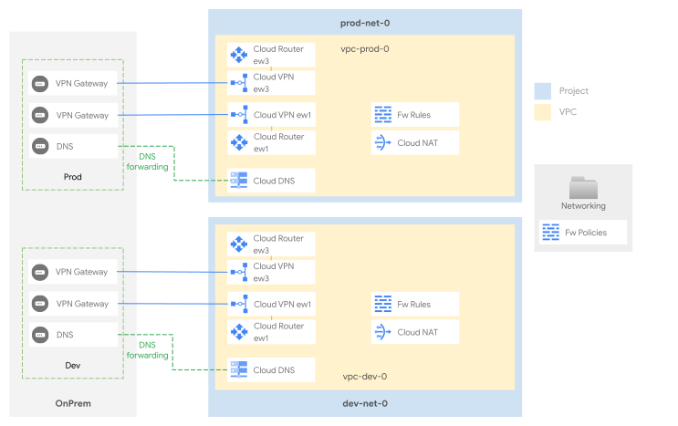

# Networking with separated single environment

This stage sets up the shared network infrastructure for the whole organization. It implements a single shared VPC per environment, where each environment is independently connected to the on-premise environment, to maintain a fully separated routing domain on GCP.

While no communication between environment is implemented on this design, that can be achieved with a number of different options:

- [VPC Peering](https://cloud.google.com/vpc/docs/vpc-peering) - which is not recommended as it would effectively create a full line of sight between workloads belonging to different environments
- [VPN HA](https://cloud.google.com/network-connectivity/docs/vpn/concepts/topologies) tunnels between environments, exchanging a subset of well-defined routes.
- [Multi-NIC appliances](https://cloud.google.com/architecture/best-practices-vpc-design#multi-nic) implemented in [2-networking-b-nva](../2-networking-b-nva) connecting the different environments, allowing the use of NVAs to enforce networking policies.

The following diagram illustrates the high-level design, and should be used as a reference for the following sections. The final number of subnets, and their IP addressing design will of course depend on customer-specific requirements, and can be easily changed via variables or external data files without having to edit the actual code.

<p align="center">
  
</p>

## Table of contents

<!-- BEGIN TOC -->
- [Table of contents](#table-of-contents)
- [Design overview and choices](#design-overview-and-choices)
  - [VPC design](#vpc-design)
  - [External connectivity](#external-connectivity)
  - [IP ranges, subnetting, routing](#ip-ranges-subnetting-routing)
  - [Internet egress](#internet-egress)
  - [VPC and Hierarchical Firewall](#vpc-and-hierarchical-firewall)
  - [DNS](#dns)
- [Stage structure and files layout](#stage-structure-and-files-layout)
  - [VPCs](#vpcs)
  - [VPNs](#vpns)
  - [Routing and BGP](#routing-and-bgp)
  - [Firewall](#firewall)
  - [DNS architecture](#dns-architecture)
    - [Cloud to on-prem](#cloud-to-on-prem)
    - [On-prem to cloud](#on-prem-to-cloud)
- [How to run this stage](#how-to-run-this-stage)
  - [Provider and Terraform variables](#provider-and-terraform-variables)
  - [Impersonating the automation service account](#impersonating-the-automation-service-account)
  - [Variable configuration](#variable-configuration)
  - [Using delayed billing association for projects](#using-delayed-billing-association-for-projects)
  - [Running the stage](#running-the-stage)
  - [Post-deployment activities](#post-deployment-activities)
    - [Private Google Access](#private-google-access)
- [Customizations](#customizations)
  - [Configuring the VPNs to on prem](#configuring-the-vpns-to-on-prem)
  - [Changing default regions](#changing-default-regions)
- [Files](#files)
- [Variables](#variables)
- [Outputs](#outputs)
<!-- END TOC -->

## Design overview and choices

### VPC design

This architecture creates one VPC for each environment, each in its respective project. Each VPC hosts external connectivity and shared services solely serving its own environment.

As each environment is fully independent, this design trivialises the creation of new environments.

### External connectivity

External connectivity to on-prem is implemented here via HA VPN (two tunnels per region), as this is the minimum common denominator often used directly, or as a stop-gap solution to validate routing and transfer data, while waiting for [interconnects](https://cloud.google.com/network-connectivity/docs/interconnect) to be provisioned.

Connectivity to additional on-prem sites or other cloud providers should be implemented in a similar fashion, via VPN tunnels or interconnects on each of the environment VPCs, sharing the same regional router.

### IP ranges, subnetting, routing

Minimizing the number of routes (and subnets) in use on the cloud environment is an important consideration, as it simplifies management and avoids hitting [Cloud Router](https://cloud.google.com/network-connectivity/docs/router/quotas) and [VPC](https://cloud.google.com/vpc/docs/quota) quotas and limits. For this reason, we recommend careful planning of the IP space used in your cloud environment, to be able to use large IP CIDR blocks in routes whenever possible.

This stage uses a dedicated /16 block (which should of course be sized to your needs) shared by all regions and environments, and subnets created in each VPC derive their ranges from their relevant block.

Each VPC also defines and reserves two "special" CIDR ranges dedicated to [PSA (Private Service Access)](https://cloud.google.com/vpc/docs/private-services-access) and [Internal Application Load Balancers (L7 LBs)](https://cloud.google.com/load-balancing/docs/l7-internal).

Routes in GCP are either automatically created for VPC subnets, manually created via static routes, or dynamically programmed by [Cloud Routers](https://cloud.google.com/network-connectivity/docs/router#docs) via BGP sessions, which can be configured to advertise VPC ranges, and/or custom ranges via custom advertisements.

In this setup:

- routes between multiple subnets within the same VPC are automatically programmed by GCP
- on-premises is connected to each environment VPC and dynamically exchanges BGP routes with GCP using HA VPN

### Internet egress

Cloud NAT provides the simplest path for internet egress. This setup uses Cloud NAT, with optional per-VPC NAT gateways. Cloud NAT is disabled by default; enable it by setting the `enable_cloud_nat` variable.

Several other scenarios are possible of course, with varying degrees of complexity:

- a forward proxy, with optional URL filters
- a default route to on-prem to leverage existing egress infrastructure
- a full-fledged perimeter firewall to control egress and implement additional security features like IPS

Future pluggable modules will allow to easily experiment, or deploy the above scenarios.

### VPC and Hierarchical Firewall

The GCP Firewall is a stateful, distributed feature that allows the creation of L4 policies, either via VPC-level rules or more recently via hierarchical policies applied on the resource hierarchy (organization, folders).

The current setup adopts both firewall types, and uses hierarchical rules on the Networking folder for common ingress rules (egress is open by default), e.g. from health check or IAP forwarders ranges, and VPC rules for the environment or workload-level ingress.

Rules and policies are defined in simple YAML files, described below.

### DNS

DNS often goes hand in hand with networking, especially on GCP where Cloud DNS zones and policies are associated at the VPC level. This setup implements both DNS flows:

- on-prem to cloud via private zones for cloud-managed domains, and an [inbound policy](https://cloud.google.com/dns/docs/server-policies-overview#dns-server-policy-in) used as forwarding target or via delegation (requires some extra configuration) from on-prem DNS resolvers
- cloud to on-prem via forwarding zones for the on-prem managed domains
- Private Google Access is enabled via [DNS Response Policies](https://cloud.google.com/dns/docs/zones/manage-response-policies#create-response-policy-rule) for most of the [supported domains](https://cloud.google.com/vpc/docs/configure-private-google-access#domain-options)

To complete the configuration, the 35.199.192.0/19 range should be routed on the VPN tunnels from on-prem, and the following names configured for DNS forwarding to cloud:

- `private.googleapis.com`
- `restricted.googleapis.com`
- `gcp.example.com` (used as a placeholder)

From cloud, the `example.com` domain (used as a placeholder) is forwarded to on-prem.

This configuration is battle-tested, and flexible enough to lend itself to simple modifications without subverting its design, for example by forwarding and peering root zones to bypass Cloud DNS external resolution.

## Stage structure and files layout

### VPCs

VPCs are defined in separate files, one for each of `prod` and `dev`.

These files contain different resources:

- **project** ([`project`](../../../modules/project)) contains the VPC, and enables the required APIs and sets itself as a "[host project](https://cloud.google.com/vpc/docs/shared-vpc)".
- **VPCs** ([`net-vpc`](../../../modules/net-vpc)): manages the subnets, the explicit routes for `{private,restricted}.googleapis.com` and the DNS inbound policy for the trusted landing VPC. Non-infrastructural subnets are created leveraging resource factories. Sample subnets are shipped in [data/subnets](./data/subnets) and can be easily customized to fit users' needs. [PSA](https://cloud.google.com/vpc/docs/configure-private-services-access#allocating-range) are configured by the variable `psa_ranges` if managed services are needed.
- **Cloud NAT** ([`net-cloudnat`](../../../modules/net-cloudnat)) manages the networking infrastructure required to enable internet egress.

### VPNs

Connectivity to on-prem is implemented with HA VPN ([`net-vpn`](../../../modules/net-vpn-ha)) and defined in `vpn-onprem.tf`. The file implements a single logical connection between each environment and onprem in the primary region, and the relevant parameters for its configuration are found in the `vpn_onprem_dev_primary_config` and `vpn_onprem_prod_primary_config` variables.

### Routing and BGP

Each VPC network ([`net-vpc`](../../../modules/net-vpc)) manages a separate routing table, which can define static routes (e.g. to private.googleapis.com) and receives dynamic routes from BGP sessions established with neighbor networks (e.g. from onprem).

Static routes are defined in `net-*.tf` files, in the `routes` section of each `net-vpc` module.

### Firewall

**VPC firewall rules** ([`net-vpc-firewall`](../../../modules/net-vpc-firewall)) are defined per-vpc on each `net-*.tf` file and leverage a resource factory to massively create rules.
To add a new firewall rule, create a new file or edit an existing one in the `data_folder` directory defined in the module `net-vpc-firewall`, following the examples of the "[Rules factory](../../../modules/net-vpc-firewall#rules-factory)" section of the module documentation. Sample firewall rules are shipped in [data/firewall-rules/dev](./data/firewall-rules/dev) and can be easily customised.

**Hierarchical firewall policies** ([`folder`](../../../modules/folder)) are defined in `main.tf` and managed through a policy factory implemented by the `net-firewall-policy` module, which is then applied to the `Networking` folder containing all the core networking infrastructure. Policies are defined in the `rules_file` file, to define a new one simply use the [firewall policy module documentation](../../../modules/net-firewall-policy/README.md#factory)". Sample hierarchical firewall rules are shipped in [data/hierarchical-ingress-rules.yaml](./data/hierarchical-ingress-rules.yaml) and can be easily customised.

### DNS architecture

The DNS ([`dns`](../../../modules/dns)) infrastructure is defined in the respective `dns-xxx.tf` files.

Cloud DNS manages onprem forwarding and environment-specific zones (i.e. `dev.gcp.example.com` and `prod.gcp.example.com`).

#### Cloud to on-prem

Leveraging the forwarding zones defined on each environment, the cloud environment can resolve `in-addr.arpa.` and `onprem.example.com.` using the on-premises DNS infrastructure. Onprem resolvers IPs are set in variable `dns`.

DNS queries sent to the on-premises infrastructure come from the `35.199.192.0/19` source range, which is only accessible from within a VPC or networks connected to one.

When implementing this architecture, make sure you'll be able to route packets coming from the /19 range to the right environment (route to prod requests coming from prod and to dev for requests coming from dev). As an alternative, consider leveraging self-managed DNS resolvers (e.g. CoreDNS forwarders) on each environment.

#### On-prem to cloud

The [Inbound DNS Policy](https://cloud.google.com/dns/docs/server-policies-overview#dns-server-policy-in) defined on eachVPC automatically reserves the first available IP address on each created subnet (typically the third one in a CIDR) to expose the Cloud DNS service so that it can be consumed from outside of GCP.

## How to run this stage

This stage is meant to be executed after the [resource management](../1-resman) stage has run, as it leverages the automation service account and bucket created there, and additional resources configured in the [bootstrap](../0-bootstrap) stage.

It's of course possible to run this stage in isolation, but that's outside the scope of this document, and you would need to refer to the code for the previous stages for the environmental requirements.

Before running this stage, you need to make sure you have the correct credentials and permissions, and localize variables by assigning values that match your configuration.

### Provider and Terraform variables

As all other FAST stages, the [mechanism used to pass variable values and pre-built provider files from one stage to the next](../0-bootstrap/README.md#output-files-and-cross-stage-variables) is also leveraged here.

The commands to link or copy the provider and terraform variable files can be easily derived from the `stage-links.sh` script in the FAST root folder, passing it a single argument with the local output files folder (if configured) or the GCS output bucket in the automation project (derived from stage 0 outputs). The following examples demonstrate both cases, and the resulting commands that then need to be copy/pasted and run.

```bash
../../stage-links.sh ~/fast-config

# copy and paste the following commands for '2-networking-*'

ln -s ~/fast-config/providers/2-networking-providers.tf ./
ln -s ~/fast-config/tfvars/0-globals.auto.tfvars.json ./
ln -s ~/fast-config/tfvars/0-bootstrap.auto.tfvars.json ./
ln -s ~/fast-config/tfvars/1-resman.auto.tfvars.json ./
```

```bash
../../stage-links.sh gs://xxx-prod-iac-core-outputs-0

# copy and paste the following commands for '2-networking-*'

gcloud storage cp gs://xxx-prod-iac-core-outputs-0/providers/2-networking-providers.tf ./
gcloud storage cp gs://xxx-prod-iac-core-outputs-0/tfvars/0-globals.auto.tfvars.json ./
gcloud storage cp gs://xxx-prod-iac-core-outputs-0/tfvars/0-bootstrap.auto.tfvars.json ./
gcloud storage cp gs://xxx-prod-iac-core-outputs-0/tfvars/1-resman.auto.tfvars.json ./
```

### Impersonating the automation service account

The preconfigured provider file uses impersonation to run with this stage's automation service account's credentials. The `gcp-devops` and `organization-admins` groups have the necessary IAM bindings in place to do that, so make sure the current user is a member of one of those groups.

### Variable configuration

Variables in this stage -- like most other FAST stages -- are broadly divided into three separate sets:

- variables which refer to global values for the whole organization (org id, billing account id, prefix, etc.), which are pre-populated via the `0-globals.auto.tfvars.json` file linked or copied above
- variables which refer to resources managed by previous stage, which are prepopulated here via the `0-bootstrap.auto.tfvars.json` and `1-resman.auto.tfvars.json` files linked or copied above
- and finally variables that optionally control this stage's behaviour and customizations, and can to be set in a custom `terraform.tfvars` file

The latter set is explained in the [Customization](#customizations) sections below, and the full list can be found in the [Variables](#variables) table at the bottom of this document.

Note that the `outputs_location` variable is disabled by default, you need to explicitly set it in your `terraform.tfvars` file if you want output files to be generated by this stage. This is a sample `terraform.tfvars` that configures it, refer to the [bootstrap stage documentation](../0-bootstrap/README.md#output-files-and-cross-stage-variables) for more details:

```tfvars
outputs_location = "~/fast-config"
```

### Using delayed billing association for projects

This configuration is possible but unsupported and only exists for development purposes, use at your own risk:

- temporarily switch `billing_account.id` to `null` in `0-globals.auto.tfvars.json`
- for each project resources in the project modules used in this stage (`dev-spoke-project`, `prod-spoke-project`)
  - apply using `-target`, for example
    `terraform apply -target 'module.prod-spoke-project.google_project.project[0]'`
  - untaint the project resource after applying, for example
    `terraform untaint 'module.prod-spoke-project.google_project.project[0]'`
- go through the process to associate the billing account with the two projects
- switch `billing_account.id` back to the real billing account id
- resume applying normally

### Running the stage

Once provider and variable values are in place and the correct user is configured, the stage can be run:

```bash
terraform init
terraform apply
```

### Post-deployment activities

- On-prem routers should be configured to advertise all relevant CIDRs to the GCP environments. To avoid hitting GCP quotas, we recommend aggregating routes as much as possible.
- On-prem routers should accept BGP sessions from their cloud peers.
- On-prem DNS servers should have forward zones for GCP-managed ones.

#### Private Google Access

[Private Google Access](https://cloud.google.com/vpc/docs/private-google-access) (or PGA) enables VMs and on-prem systems to consume Google APIs from within the Google network, and is already fully configured on this environment:

- DNS response policies in the landing project implement rules for all supported domains reachable via PGA
- routes for the private and restricted ranges are defined in all VPCs

To enable PGA access from on premises advertise the private/restricted ranges via the `vpn_onprem_dev_primary_config` and `vpn_onprem_prod_primary_config` variables, using router or tunnel custom advertisements.

## Customizations

### Configuring the VPNs to on prem

This stage includes basic support for an HA VPN connecting each environment landing zone in the primary region to on prem. Configuration is via the `vpn_onprem_dev_primary_config` and `vpn_onprem_prod_primary_config` variables, that closely mirrors the variables defined in the [`net-vpn-ha`](../../../modules/net-vpn-ha/).

Support for the onprem VPNs is disabled by default so that no resources are created, this is an example of how to configure one variable to enable the VPN for dev in the primary region:

```tfvars
vpn_onprem_dev_primary_config = {
  peer_external_gateways = {
    default = {
      redundancy_type = "SINGLE_IP_INTERNALLY_REDUNDANT"
      interfaces      = ["8.8.8.8"]
    }
  }
  router_config = {
    asn = 65501
    custom_advertise = {
      all_subnets = false
      ip_ranges   = {
        "10.1.0.0/16"     = "gcp"
        "35.199.192.0/19" = "gcp-dns"
        "199.36.153.4/30" = "gcp-restricted"
      }
    }
  }
  tunnels = {
    "0" = {
      bgp_peer = {
        address = "169.254.1.1"
        asn     = 65500
      }
      bgp_session_range               = "169.254.1.2/30"
      peer_external_gateway_interface = 0
      shared_secret                   = "foo"
      vpn_gateway_interface           = 0
    }
    "1" = {
      bgp_peer = {
        address = "169.254.2.1"
        asn     = 64513
      }
      bgp_session_range               = "169.254.2.2/30"
      peer_external_gateway_interface = 1
      shared_secret                   = "foo"
      vpn_gateway_interface           = 1
    }
  }
}
```

### Changing default regions

Regions are defined via the `regions` variable which sets up a mapping between the `regions.primary` and `regions.secondary` logical names and actual GCP region names. If you need to change regions from the defaults:

- change the values of the mappings in the `regions` variable to the regions you are going to use
- change the regions in the factory subnet files in the `data` folder

<!-- TFDOC OPTS files:1 show_extra:1 -->
<!-- BEGIN TFDOC -->
## Files

| name | description | modules | resources |
|---|---|---|---|
| [dns-dev.tf](./dns-dev.tf) | Development spoke DNS zones and peerings setup. | <code>dns</code> · <code>dns-response-policy</code> |  |
| [dns-prod.tf](./dns-prod.tf) | Production spoke DNS zones and peerings setup. | <code>dns</code> · <code>dns-response-policy</code> |  |
| [main.tf](./main.tf) | Networking folder and hierarchical policy. | <code>folder</code> · <code>net-firewall-policy</code> |  |
| [monitoring-vpn-onprem.tf](./monitoring-vpn-onprem.tf) | VPN monitoring alerts. |  | <code>google_monitoring_alert_policy</code> |
| [monitoring.tf](./monitoring.tf) | Network monitoring dashboards. |  | <code>google_monitoring_dashboard</code> |
| [net-dev.tf](./net-dev.tf) | Dev spoke VPC and related resources. | <code>net-cloudnat</code> · <code>net-vpc</code> · <code>net-vpc-firewall</code> · <code>project</code> |  |
| [net-prod.tf](./net-prod.tf) | Production spoke VPC and related resources. | <code>net-cloudnat</code> · <code>net-vpc</code> · <code>net-vpc-firewall</code> · <code>project</code> |  |
| [outputs.tf](./outputs.tf) | Module outputs. |  | <code>google_storage_bucket_object</code> · <code>local_file</code> |
| [regions.tf](./regions.tf) | Compute short names for regions. |  |  |
| [test-resources.tf](./test-resources.tf) | Temporary instances for testing | <code>compute-vm</code> |  |
| [variables-fast.tf](./variables-fast.tf) | None |  |  |
| [variables.tf](./variables.tf) | Module variables. |  |  |
| [vpn-onprem.tf](./vpn-onprem.tf) | VPN between landing and onprem. | <code>net-vpn-ha</code> |  |

## Variables

| name | description | type | required | default | producer |
|---|---|:---:|:---:|:---:|:---:|
| [automation](variables-fast.tf#L17) | Automation resources created by the bootstrap stage. | <code title="object&#40;&#123;&#10;  outputs_bucket &#61; string&#10;&#125;&#41;">object&#40;&#123;&#8230;&#125;&#41;</code> | ✓ |  | <code>0-bootstrap</code> |
| [billing_account](variables-fast.tf#L25) | Billing account id. If billing account is not part of the same org set `is_org_level` to false. | <code title="object&#40;&#123;&#10;  id           &#61; string&#10;  is_org_level &#61; optional&#40;bool, true&#41;&#10;&#125;&#41;">object&#40;&#123;&#8230;&#125;&#41;</code> | ✓ |  | <code>0-bootstrap</code> |
| [folder_ids](variables-fast.tf#L48) | Folders to be used for the networking resources in folders/nnnnnnnnnnn format. If null, folder will be created. | <code title="object&#40;&#123;&#10;  networking      &#61; string&#10;  networking-dev  &#61; string&#10;  networking-prod &#61; string&#10;&#125;&#41;">object&#40;&#123;&#8230;&#125;&#41;</code> | ✓ |  | <code>1-resman</code> |
| [organization](variables-fast.tf#L58) | Organization details. | <code title="object&#40;&#123;&#10;  domain      &#61; string&#10;  id          &#61; number&#10;  customer_id &#61; string&#10;&#125;&#41;">object&#40;&#123;&#8230;&#125;&#41;</code> | ✓ |  | <code>0-bootstrap</code> |
| [prefix](variables-fast.tf#L68) | Prefix used for resources that need unique names. Use a maximum of 9 chars for organizations, and 11 chars for tenants. | <code>string</code> | ✓ |  | <code>0-bootstrap</code> |
| [alert_config](variables.tf#L17) | Configuration for monitoring alerts. | <code title="object&#40;&#123;&#10;  vpn_tunnel_established &#61; optional&#40;object&#40;&#123;&#10;    auto_close            &#61; optional&#40;string, null&#41;&#10;    duration              &#61; optional&#40;string, &#34;120s&#34;&#41;&#10;    enabled               &#61; optional&#40;bool, true&#41;&#10;    notification_channels &#61; optional&#40;list&#40;string&#41;, &#91;&#93;&#41;&#10;    user_labels           &#61; optional&#40;map&#40;string&#41;, &#123;&#125;&#41;&#10;  &#125;&#41;&#41;&#10;  vpn_tunnel_bandwidth &#61; optional&#40;object&#40;&#123;&#10;    auto_close            &#61; optional&#40;string, null&#41;&#10;    duration              &#61; optional&#40;string, &#34;120s&#34;&#41;&#10;    enabled               &#61; optional&#40;bool, true&#41;&#10;    notification_channels &#61; optional&#40;list&#40;string&#41;, &#91;&#93;&#41;&#10;    threshold_mbys        &#61; optional&#40;string, &#34;187.5&#34;&#41;&#10;    user_labels           &#61; optional&#40;map&#40;string&#41;, &#123;&#125;&#41;&#10;  &#125;&#41;&#41;&#10;&#125;&#41;">object&#40;&#123;&#8230;&#125;&#41;</code> |  | <code title="&#123;&#10;  vpn_tunnel_established &#61; &#123;&#125;&#10;  vpn_tunnel_bandwidth   &#61; &#123;&#125;&#10;&#125;">&#123;&#8230;&#125;</code> |  |
| [dns](variables.tf#L42) | DNS configuration. | <code title="object&#40;&#123;&#10;  dev_resolvers  &#61; optional&#40;list&#40;string&#41;, &#91;&#93;&#41;&#10;  enable_logging &#61; optional&#40;bool, true&#41;&#10;  prod_resolvers &#61; optional&#40;list&#40;string&#41;, &#91;&#93;&#41;&#10;&#125;&#41;">object&#40;&#123;&#8230;&#125;&#41;</code> |  | <code>&#123;&#125;</code> |  |
| [enable_cloud_nat](variables.tf#L53) | Deploy Cloud NAT. | <code>bool</code> |  | <code>false</code> |  |
| [essential_contacts](variables.tf#L60) | Email used for essential contacts, unset if null. | <code>string</code> |  | <code>null</code> |  |
| [factories_config](variables.tf#L66) | Configuration for network resource factories. | <code title="object&#40;&#123;&#10;  data_dir              &#61; optional&#40;string, &#34;data&#34;&#41;&#10;  dns_policy_rules_file &#61; optional&#40;string, &#34;data&#47;dns-policy-rules.yaml&#34;&#41;&#10;  firewall_policy_name  &#61; optional&#40;string, &#34;net-default&#34;&#41;&#10;&#125;&#41;">object&#40;&#123;&#8230;&#125;&#41;</code> |  | <code title="&#123;&#10;  data_dir &#61; &#34;data&#34;&#10;&#125;">&#123;&#8230;&#125;</code> |  |
| [fast_features](variables-fast.tf#L38) | Selective control for top-level FAST features. | <code title="object&#40;&#123;&#10;  gcve &#61; optional&#40;bool, false&#41;&#10;&#125;&#41;">object&#40;&#123;&#8230;&#125;&#41;</code> |  | <code>&#123;&#125;</code> | <code>0-0-bootstrap</code> |
| [outputs_location](variables.tf#L87) | Path where providers and tfvars files for the following stages are written. Leave empty to disable. | <code>string</code> |  | <code>null</code> |  |
| [psa_ranges](variables.tf#L93) | IP ranges used for Private Service Access (e.g. CloudSQL). | <code title="object&#40;&#123;&#10;  dev &#61; optional&#40;list&#40;object&#40;&#123;&#10;    ranges         &#61; map&#40;string&#41;&#10;    export_routes  &#61; optional&#40;bool, false&#41;&#10;    import_routes  &#61; optional&#40;bool, false&#41;&#10;    peered_domains &#61; optional&#40;list&#40;string&#41;, &#91;&#93;&#41;&#10;  &#125;&#41;&#41;, &#91;&#93;&#41;&#10;  prod &#61; optional&#40;list&#40;object&#40;&#123;&#10;    ranges         &#61; map&#40;string&#41;&#10;    export_routes  &#61; optional&#40;bool, false&#41;&#10;    import_routes  &#61; optional&#40;bool, false&#41;&#10;    peered_domains &#61; optional&#40;list&#40;string&#41;, &#91;&#93;&#41;&#10;  &#125;&#41;&#41;, &#91;&#93;&#41;&#10;&#125;&#41;">object&#40;&#123;&#8230;&#125;&#41;</code> |  | <code>&#123;&#125;</code> |  |
| [regions](variables.tf#L113) | Region definitions. | <code title="object&#40;&#123;&#10;  primary &#61; string&#10;&#125;&#41;">object&#40;&#123;&#8230;&#125;&#41;</code> |  | <code title="&#123;&#10;  primary &#61; &#34;europe-west1&#34;&#10;&#125;">&#123;&#8230;&#125;</code> |  |
| [service_accounts](variables-fast.tf#L78) | Automation service accounts in name => email format. | <code title="object&#40;&#123;&#10;  data-platform-dev    &#61; string&#10;  data-platform-prod   &#61; string&#10;  gke-dev              &#61; string&#10;  gke-prod             &#61; string&#10;  project-factory      &#61; string&#10;  project-factory-dev  &#61; string&#10;  project-factory-prod &#61; string&#10;&#125;&#41;">object&#40;&#123;&#8230;&#125;&#41;</code> |  | <code>null</code> | <code>1-resman</code> |
| [vpn_onprem_dev_primary_config](variables.tf#L123) | VPN gateway configuration for onprem interconnection from dev in the primary region. | <code title="object&#40;&#123;&#10;  peer_external_gateways &#61; map&#40;object&#40;&#123;&#10;    redundancy_type &#61; string&#10;    interfaces      &#61; list&#40;string&#41;&#10;  &#125;&#41;&#41;&#10;  router_config &#61; object&#40;&#123;&#10;    create    &#61; optional&#40;bool, true&#41;&#10;    asn       &#61; number&#10;    name      &#61; optional&#40;string&#41;&#10;    keepalive &#61; optional&#40;number&#41;&#10;    custom_advertise &#61; optional&#40;object&#40;&#123;&#10;      all_subnets &#61; bool&#10;      ip_ranges   &#61; map&#40;string&#41;&#10;    &#125;&#41;&#41;&#10;  &#125;&#41;&#10;  tunnels &#61; map&#40;object&#40;&#123;&#10;    bgp_peer &#61; object&#40;&#123;&#10;      address        &#61; string&#10;      asn            &#61; number&#10;      route_priority &#61; optional&#40;number, 1000&#41;&#10;      custom_advertise &#61; optional&#40;object&#40;&#123;&#10;        all_subnets          &#61; bool&#10;        all_vpc_subnets      &#61; bool&#10;        all_peer_vpc_subnets &#61; bool&#10;        ip_ranges            &#61; map&#40;string&#41;&#10;      &#125;&#41;&#41;&#10;    &#125;&#41;&#10;    bgp_session_range               &#61; string&#10;    ike_version                     &#61; optional&#40;number, 2&#41;&#10;    peer_external_gateway_interface &#61; optional&#40;number&#41;&#10;    peer_gateway                    &#61; optional&#40;string, &#34;default&#34;&#41;&#10;    router                          &#61; optional&#40;string&#41;&#10;    shared_secret                   &#61; optional&#40;string&#41;&#10;    vpn_gateway_interface           &#61; number&#10;  &#125;&#41;&#41;&#10;&#125;&#41;">object&#40;&#123;&#8230;&#125;&#41;</code> |  | <code>null</code> |  |
| [vpn_onprem_prod_primary_config](variables.tf#L166) | VPN gateway configuration for onprem interconnection from prod in the primary region. | <code title="object&#40;&#123;&#10;  peer_external_gateways &#61; map&#40;object&#40;&#123;&#10;    redundancy_type &#61; string&#10;    interfaces      &#61; list&#40;string&#41;&#10;  &#125;&#41;&#41;&#10;  router_config &#61; object&#40;&#123;&#10;    create    &#61; optional&#40;bool, true&#41;&#10;    asn       &#61; number&#10;    name      &#61; optional&#40;string&#41;&#10;    keepalive &#61; optional&#40;number&#41;&#10;    custom_advertise &#61; optional&#40;object&#40;&#123;&#10;      all_subnets &#61; bool&#10;      ip_ranges   &#61; map&#40;string&#41;&#10;    &#125;&#41;&#41;&#10;  &#125;&#41;&#10;  tunnels &#61; map&#40;object&#40;&#123;&#10;    bgp_peer &#61; object&#40;&#123;&#10;      address        &#61; string&#10;      asn            &#61; number&#10;      route_priority &#61; optional&#40;number, 1000&#41;&#10;      custom_advertise &#61; optional&#40;object&#40;&#123;&#10;        all_subnets          &#61; bool&#10;        all_vpc_subnets      &#61; bool&#10;        all_peer_vpc_subnets &#61; bool&#10;        ip_ranges            &#61; map&#40;string&#41;&#10;      &#125;&#41;&#41;&#10;    &#125;&#41;&#10;    bgp_session_range               &#61; string&#10;    ike_version                     &#61; optional&#40;number, 2&#41;&#10;    peer_external_gateway_interface &#61; optional&#40;number&#41;&#10;    peer_gateway                    &#61; optional&#40;string, &#34;default&#34;&#41;&#10;    router                          &#61; optional&#40;string&#41;&#10;    shared_secret                   &#61; optional&#40;string&#41;&#10;    vpn_gateway_interface           &#61; number&#10;  &#125;&#41;&#41;&#10;&#125;&#41;">object&#40;&#123;&#8230;&#125;&#41;</code> |  | <code>null</code> |  |

## Outputs

| name | description | sensitive | consumers |
|---|---|:---:|---|
| [dev_cloud_dns_inbound_policy](outputs.tf#L77) | IP Addresses for Cloud DNS inbound policy for the dev environment. |  |  |
| [host_project_ids](outputs.tf#L82) | Network project ids. |  |  |
| [host_project_numbers](outputs.tf#L87) | Network project numbers. |  |  |
| [prod_cloud_dns_inbound_policy](outputs.tf#L92) | IP Addresses for Cloud DNS inbound policy for the prod environment. |  |  |
| [shared_vpc_self_links](outputs.tf#L97) | Shared VPC host projects. |  |  |
| [tfvars](outputs.tf#L102) | Terraform variables file for the following stages. | ✓ |  |
| [vpn_gateway_endpoints](outputs.tf#L108) | External IP Addresses for the GCP VPN gateways. |  |  |
<!-- END TFDOC -->
