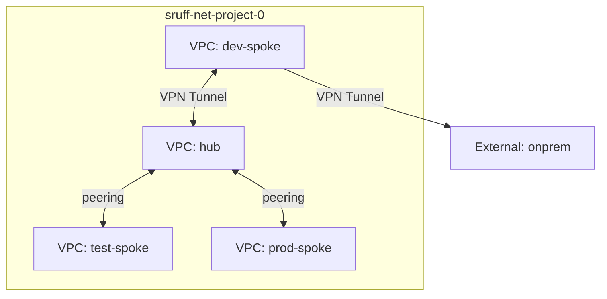

```mermaid
graph TD
    subgraph "sruff-net-project-0"
        dev-spoke["VPC: dev-spoke"]
        test-spoke["VPC: test-spoke"]
        hub["VPC: hub"]
        prod-spoke["VPC: prod-spoke"]
    end
    hub <-->|peering| test-spoke
    hub <-->|peering| prod-spoke
    dev-spoke -->|VPN Tunnel| onprem
    dev-spoke <-->|VPN Tunnel| hub
    onprem["External: onprem"]
```