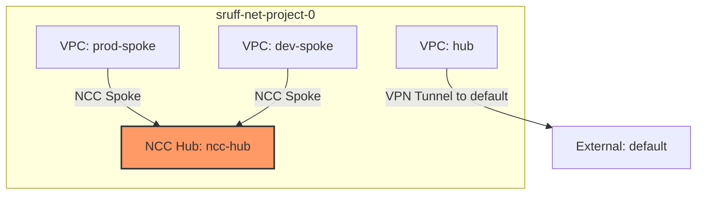

```mermaid
graph TD
    classDef nccHub fill:#f96,stroke:#333,stroke-width:2px;
    subgraph "sruff-net-project-0"
        dev-spoke["VPC: dev-spoke"]
        hub["VPC: hub"]
        prod-spoke["VPC: prod-spoke"]
        ncc-hub["NCC Hub: ncc-hub"]:::nccHub
    end
    hub -->|VPN Tunnel to default| default
    prod-spoke -->|NCC Spoke| ncc-hub
    dev-spoke -->|NCC Spoke| ncc-hub
    default["External: default"]
```