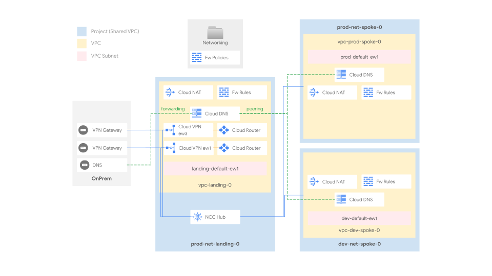

# NCC Hub and spoke

This stage sets up the shared network infrastructure environment, and leverages [NCC](https://cloud.google.com/network-connectivity/docs/network-connectivity-center) to implement a VPC full mesh between different spokes, including hybrid spokes (e.g. VPN tunnels or VLAN attachments).

- the NCC hub acts as a control-plane and single pane of glass for connectivity
- the spoke VPCs allow partitioning workloads (e.g. by environments), while still retaining controlled access to central connectivity and services
- Shared VPC in spokes splits management of network resources in specific (host) projects, while still allowing them to be consumed from workload (service) projects

NCC allows for transitive connections between spokes, PSC endpoints transitivity, and a much higher limit in terms of VPCs that can participate to the peering group.

The following diagram illustrates the high-level design, and should be used as a reference for the following sections.

<p align="center">
  
  </br>NCC diagram
</p>

### VPC design

The hub VPC hosts external connectivity (by default VPN tunnels), attached to the NCC Hub as a series of hybrid spokes.

The default recipe ships two different VPCs, mapping to hypotetical environments (dev and prod). Each VPC is created into its own project, and each project is configured as a Shared VPC host, so that network-related resources and access configurations via IAM are kept separate for each VPC.

The design easily lends itself to implementing additional environments, or adopting a different logical mapping for spokes (e.g. one spoke for each company entity, etc.).

### IP ranges, subnetting, routing

Minimizing the number of routes (and subnets) in use on the cloud environment is an important consideration, as it simplifies management and avoids hitting [Cloud Router](https://cloud.google.com/network-connectivity/docs/router/quotas) and [VPC](https://cloud.google.com/vpc/docs/quota) quotas and limits. For this reason, we recommend careful planning of the IP space used in your cloud environment, to be able to use large IP CIDR blocks in routes whenever possible.

This stage uses a dedicated /16 block (which should of course be sized to your needs) for each region in each VPC, and subnets created in each VPC should derive their ranges from the relevant block.

The Prod Spoke VPC also define and reserve - as an example - two "special" CIDR ranges dedicated to [PSA (Private Service Access)](https://cloud.google.com/vpc/docs/private-services-access) and [Internal Application Load Balancers (L7 LBs)](https://cloud.google.com/load-balancing/docs/l7-internal).

Routes in GCP are either automatically created for VPC subnets, manually created via static routes, programmed by the NCC hub or dynamically programmed by [Cloud Routers](https://cloud.google.com/network-connectivity/docs/router#docs) via BGP sessions, which can be configured to advertise VPC ranges, and/or custom ranges via custom advertisements.

Furthermore:

- routes between multiple subnets within the same VPC are automatically programmed by GCP
- each spoke exchanges routes with the NCC hub, and gets NCC routes belonging to other spoks from the hub
- on-premises is connected to the hub VPC and dynamically exchanges BGP routes with GCP using HA VPN. The HA VPN tunnels are configured as Hybrid spokes on the NCC hub, and as such all spokes receive those dynamic routes.

### NCC Configuration

There's two main configurations controlling inter-VPC connectivity:

The **NCC hub setup**, controlled by files in the [ncc-hubs](./ncc-hubs/) folder - each describing an hub and its configuration.

[prod-hub](./ncc-hubs/prod-hub.yaml)

```yaml
name: the-hub
project_id: $project_ids:net-core-0
groups:
  default:
    auto_accept:
      - $project_ids:net-prod-0
      - $project_ids:net-dev-0
```

The **NCC spokes attachment**, controlled by each VPC `.config` file

[vpcs/prod/.config.yaml](./vpcs/prod/.config.yaml)

```yaml
# [...]
ncc_config:
  hub: $ncc_hubs:the-hub
  group: $ncc_groups:the-hub/default
# [...]
```

For more informations about cross referencing resources, please check the [main README.md file](../../README.md)

### Internet egress

Cloud NAT provides the simplest path for internet egress. This setup uses Cloud NAT, which is enabled by default on the primary region.

e.g. in [vpcs/prod/.config.yaml](./vpcs/prod/.config.yaml)

```yaml
# [...]
nat_config:
  nat-primary:
    region: $locations:primary
# [...]
```

Several other scenarios are possible of course, with varying degrees of complexity:

- a forward proxy (including [SWP](https://cloud.google.com/secure-web-proxy/docs/overview)), with optional URL filters
- a default route to on-prem to leverage existing egress infrastructure
- a full-fledged perimeter firewall to control egress and implement additional security features like IPS

### VPC and Hierarchical Firewall

The GCP Firewall is a stateful, distributed feature that allows the creation of L4 policies, either via VPC-level rules or more recently via hierarchical policies applied on the resource hierarchy (organization, folders).

The current setup adopts both firewall types, and uses [hierarchical rules on the Networking folder](./firewall-policies/networking-policy.yaml) for common ingress rules, e.g. from health check or IAP forwarders ranges, and [VPC rules](./vpcs/prod/firewall-rules) for the environment or workload-level ingress.

### DNS

This dataset implements a centralized DNS architecture that handles resolution between GCP and on-premises environments.

- **Cloud to on-prem:** A [forwarding zone](./dns/zones/net-core-0/fwd-root.yaml) for the `onprem.` domain is configured in the hub VPC. It forwards DNS queries for on-premises resources to the on-premises DNS resolvers.
- **On-prem to cloud:** An [inbound DNS policy](https://cloud.google.com/dns/docs/server-policies-overview#dns-server-policy-in) allows on-premises systems to resolve resources in GCP.

DNS configuration is centralized in the hub project (`net-core-0`) and shared with the spokes using DNS peering:

- The **hub** hosts:
  - A top-level private zone for the cloud environment (e.g., `test.`).
  - The forwarding zone to on-premises.
- The **spokes** (`net-dev-0`, `net-prod-0`) host private zones for their specific subdomains (e.g., `dev.test.`, `prod.test.`). These zones are visible to the hub.
- A **peering zone** for the `.` (root) domain is configured in the spokes, pointing to the hub. This delegates all DNS resolution from the spokes to the hub, creating a centralized model.
- **Private Google Access** is enabled via [DNS Response Policies](https://cloud.google.com/dns/docs/zones/manage-response-policies#create-response-policy-rule) for most of the [supported domains](https://cloud.google.com/vpc/docs/configure-private-google-access#domain-options).

To complete the configuration, on-premises DNS servers should be configured to forward queries for your cloud domain (e.g., `test.`) to the GCP inbound policy's IP addresses. Additionally, the `35.199.192.0/19` range (used by the GCP DNS forwarder) should be routed over the VPN tunnels from on-premises.

### VPNs

Connectivity to on-prem is implemented with HA VPN ([`net-vpn-ha`](../../../../../modules/net-vpn-ha/)) and defined in [`onprem.yaml`](./vpcs/hub/vpns/onprem.yaml). The file provisionally implements a single logical connection between onprem and the hub on the primary region through 2 IPSec tunnels, which are connected to the NCC Hub as hybrid spokes.
